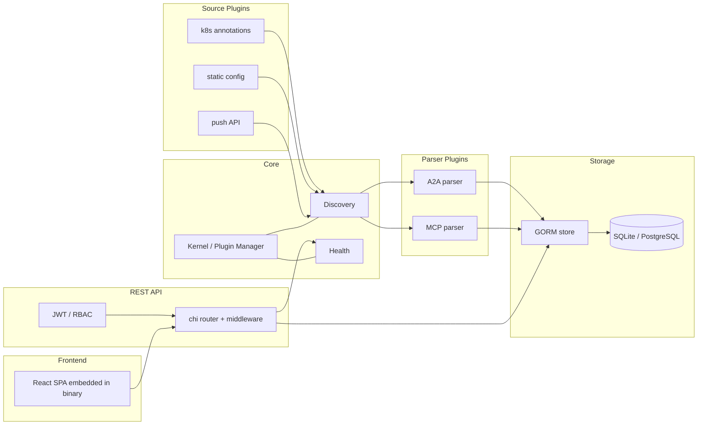

# System Architecture

## Overview

AgentLens is a **microkernel + plugins** Go service with an embedded React SPA. The kernel owns lifecycle and wiring only; everything protocol-specific or source-specific lives in a plugin. A strict layer model (enforced by `arch-go` at 100%) keeps the core small and replaceable.



---

## Architecture Pattern

**Pattern**: Microkernel + layered plugins with a Product Archetype domain model.

- **Microkernel** (`internal/kernel/`): owns plugin registration and lifecycle (`Register → InitAll → StartAll → [running] → StopAll`). Plugins returning `ErrLicenseRequired` during `Init` are silently skipped — this is how enterprise features stay invisible in OSS builds.
- **Product Archetype** (ADR-001, ADR-004): `AgentType` = what an agent *is* (protocol + endpoint + `AgentKey = SHA256(protocol+endpoint)` + `Capability[]`). `CatalogEntry` = how it is *offered* (display name, status, source, lifecycle, 1:1 FK to `AgentType`). The REST representation is a flattened JSON shape produced by `MarshalJSON()`.
- **Polymorphic capabilities**: `Capability` is discriminated by `kind` (`a2a.skill`, `mcp.tool`, `a2a.interface`, …). Parsers produce them; the core never guesses.

### Layer Boundaries (enforced)

```
Foundation     model, config, service                 — no internal deps
Infrastructure store, auth, db, telemetry             — foundation only
Core           kernel, discovery, health, server      — foundation + infrastructure
API            api                                    — core + infrastructure; NEVER plugins/cmd
Plugins        plugins/**                             — kernel + foundation; NEVER api/auth/server/cmd
Entrypoint     cmd/**                                 — composition root; may import anything
```

`arch-go.yml` enforces these rules at 100%. Violations fail CI.

Additional code-quality rules (also enforced):
- Max 5 params, 3 return values, 80 lines/function, 10 public functions/file.
- `config` package contains no interfaces.
- Plugin structs implementing the `Plugin` interface must end with `Plugin`.

---

## System Structure

### Core Kernel — `internal/kernel/`
- **Location**: `internal/kernel/`
- **Purpose**: Defines the `Kernel` and `Plugin` interfaces, runs the plugin lifecycle, wires shared services.
- **Key files**: `kernel.go`, `plugin_manager.go`.

### Discovery — `internal/discovery/`
- **Location**: `internal/discovery/`
- **Purpose**: Orchestrates source plugins, dispatches raw agent cards to the right parser, upserts by `endpoint` (UNIQUE constraint).
- **Key behavior**: Poll-based by design (ADR-008) — fits heterogeneous sources without requiring push from agents.

### Health — `internal/health/`
- **Location**: `internal/health/`
- **Purpose**: Runs periodic liveness probes against registered agents, maintains the `LifecycleState` state machine (`registered → active → degraded → offline → deprecated`).
- **Key files**: `checker.go`, per-agent probe handlers.

### REST API — `internal/api/`
- **Location**: `internal/api/`
- **Purpose**: chi router + middleware stack. Exposes catalog, capabilities, stats, auth, users, roles, settings, telemetry config, health endpoints.
- **Key files**: `router.go`, `handlers.go`, `auth_handlers.go`.
- **Middleware**: JWT verification, `RequirePermission(resource:action)`, request logging (slog with trace context), OTel propagation.
- **Base URL**: `/api/v1`.

### Storage — `internal/store/` & `internal/db/`
- **Location**: `internal/store/`, `internal/db/`
- **Purpose**: GORM-backed CRUD with dual-dialect awareness. Forward-only, idempotent migrations.
- **Key files**: `store/sql_store.go`, `store/user_store.go`, `db/db.go`, `db/migrations.go`.
- **Dialect handling**: `db.Dialect()` determines JSON/timestamp column types. Never inline SQLite-only SQL.

### Auth — `internal/auth/`
- **Location**: `internal/auth/`
- **Purpose**: Password hashing (bcrypt cost 12), JWT signing/verification, permission checks, bootstrap admin.
- **Security posture**: HttpOnly/Secure/SameSite=Strict cookies, 10-char password floor with all four character classes, 5-fail / 15-minute lockout, system roles are undeletable.

### Plugins — `plugins/`
- **Location**: `plugins/**`
- **Parsers**: `plugins/parsers/a2a`, `plugins/parsers/mcp`.
- **Sources**: `plugins/sources/k8s` (annotation-based), `plugins/sources/static`.
- **Cardstore**: `plugins/cardstore/` caches raw agent cards.
- **Enterprise (license-gated)**: `plugins/enterprise/audit`, `postgres`, `rbac`, `sso`.

### Frontend — `web/`
- **Location**: `web/`
- **Build**: Vite + Bun. Output (`web/dist/`) is embedded into the Go binary by `web/embed.go` via `embed.FS`.
- **Key files**: `web/src/App.tsx`, `web/src/routes/*`, `web/src/components/*`, `web/src/contexts/{AuthContext,ThemeContext}`.

### Entrypoint — `cmd/agentlens/`
- **Location**: `cmd/agentlens/main.go`
- **Role**: Composition root. Reads config, wires services, registers plugins, starts the HTTP server and kernel.

---

## Data Flow

**Discovery (poll-based, ADR-008):**
1. Source plugin (k8s / static / push) produces raw agent card payloads.
2. Discovery orchestrator dispatches the payload to the matching parser plugin (A2A or MCP) based on protocol.
3. Parser produces a typed `AgentType` with `Capability[]`.
4. Store upserts the entry by `endpoint` (UNIQUE), computing `AgentKey = SHA256(protocol+endpoint)`.
5. A `CatalogEntry` is created or updated (1:1 FK to `AgentType`).
6. Health plugin begins probing.

**Request (UI / external client):**
1. SPA calls `/api/v1/...` with JWT cookie.
2. chi middleware validates JWT, loads user + roles, checks permission via `RequirePermission`.
3. Handler queries the store via GORM (parameterized — no raw string interpolation).
4. JSON response shaped by `CatalogEntry.MarshalJSON()` (flattened form).
5. OTel spans + slog logs emitted with trace context.

---

## External Integrations

- **Kubernetes** — `k8s.io/client-go` informers/listers; annotation-driven discovery.
- **PostgreSQL** — via GORM `postgres` driver (enterprise).
- **OpenTelemetry** — OTLP exporter compatible; traces/metrics/logs.
- **Prometheus** — `/metrics` endpoint.
- **Browsers** — React SPA served from the binary with browser-side OTel instrumentation (trace propagation across UI → API).

---

## Database Schema

- **Definition**: GORM models in `internal/model/` (`agent_type.go`, `capability.go`, `capability_instance.go`, `provider.go`, `catalog_entry.go`, `user.go`, `role.go`, `settings.go`).
- **Migrations**: `internal/db/migrations.go`. Forward-only, idempotent, appended via `AllMigrations()`.
- **Dialect differences**:
  - SQLite: `TEXT` for JSON, `DATETIME` for timestamps.
  - PostgreSQL: `JSONB` for JSON, `TIMESTAMPTZ` for timestamps.
- **Core relationships**:
  - `providers 1..* agent_types`
  - `agent_types 1..* capabilities` (polymorphic by `kind`)
  - `agent_types 1..1 catalog_entries`

See `docs/architecture.md` for the canonical ER diagram (Mermaid).

---

## Configuration

- **Sources**: `agentlens.yaml` file and environment variables (envs prefixed `AGENTLENS_`).
- **Key knobs**: `database.dialect` / `AGENTLENS_DB_DIALECT`, JWT secret, CORS origin allowlist, OTel endpoints, discovery polling intervals.
- **Config package rule**: no interfaces — config is plain value types.
- **Reference**: `docs/settings.md`.

---

## Deployment Architecture

- **Container**: Single Docker image built with `CGO_ENABLED=1` (SQLite driver requirement).
- **Helm chart**: `deploy/helm/agentlens/` (`0.2.0`). Installs a single Deployment, Service, and optional ConfigMap/Secret; Bitnami `postgresql ~16.x` as an optional subchart.
- **Probes**: `/healthz` (liveness), `/readyz` (readiness).
- **Metrics**: `/metrics` (Prometheus).
- **Observability**: OTel traces/metrics/logs via OTel Collector; reference `docker-compose.otel.yml` for local bring-up.
- **Typical topology**: a single Deployment behind a Service, optionally fronted by Ingress or an API gateway; enterprise deployments add an external PostgreSQL.

---

*Based on codebase analysis performed 2026-04-17*
