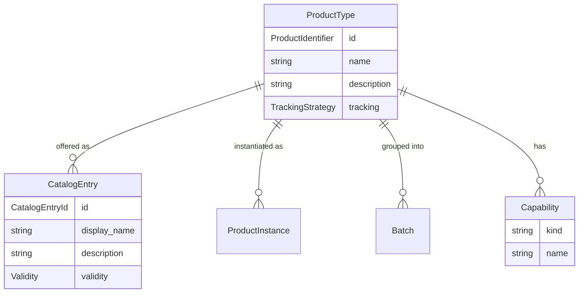

# ADR-001: Product Archetype Principles in Go

**Status:** Accepted
**Date:** 2026-04-10
**Context:** AgentLens models agent discovery using the Product Archetype pattern from [softwarearchetypes/product](https://github.com/softwarearchetypes). This ADR documents the archetype's core principles, their Go translation, and how AgentLens applies them — with specific attention to where the current codebase conforms and where it drifts.

---

## Part 1: Product Archetype Principles (Generic Go)

### 1.1 Core Entities

The Product Archetype defines four fundamental entities:



| Archetype Entity | What it IS | Go Translation |
|---|---|---|
| **ProductType** | The definition — what a product IS (identity, protocol, schema). Owns capabilities. | Struct with polymorphic identity, `gorm:"-"` capability slice |
| **CatalogEntry** | The offering — a commercial/presentational wrapper around a ProductType. 1:N with ProductType. | Struct with FK to ProductType, display fields, validity, metadata |
| **Capability** | A feature/ability the product has. Polymorphic, discriminated by `kind`. Belongs to ProductType. | Interface with `Kind() string` + `Validate() error` |
| **ProductInstance** | A specific exemplar. Has concrete capability values validated against the type's schema. | (Not yet used in AgentLens — relevant for agent runtime instances) |
| **Batch** | A production group for quality tracking. | (Not applicable to AgentLens) |

### 1.2 Principle: Capabilities Belong to the Product Type, Not the Catalog Entry

This is the archetype's most important structural rule. A `ProductType` defines WHAT something IS and WHAT IT CAN DO. A `CatalogEntry` is a view/offering of that type — it adds display name, validity window, categories, and metadata but **never owns capabilities**.

**Why:** Multiple catalog entries can reference the same product type (e.g., different regions, audiences, time windows). Capabilities are intrinsic to the product, not to how it is offered.

```go
// ProductType owns capabilities
type ProductType struct {
    ID           string
    Capabilities []Capability `gorm:"-"` // loaded separately
}

// CatalogEntry references ProductType, never holds capabilities directly
type CatalogEntry struct {
    ProductTypeID string
    ProductType   *ProductType `json:"-"` // flattened in MarshalJSON
    DisplayName   string
}
```

### 1.3 Principle: Polymorphic Capability via Interface + Kind Discriminator

Every capability implements a common interface. The `Kind()` string is the discriminator for storage, serialization, and deserialization. Concrete types carry kind-specific fields.

```go
// The capability interface — minimal, polymorphic
type Capability interface {
    Kind() string     // discriminator: "a2a.skill", "mcp.tool", etc.
    Validate() error  // self-validation
}

// Concrete implementations carry type-specific state
type Skill struct {
    Name        string   `json:"name"`
    Description string   `json:"description,omitempty"`
    Tags        []string `json:"tags,omitempty"`
}
func (s *Skill) Kind() string     { return "a2a.skill" }
func (s *Skill) Validate() error  { /* name required */ }
```

**Registry pattern for deserialization:**

```go
var registry = map[string]CapabilityMeta{}

type CapabilityMeta struct {
    Factory      func() Capability
    Discoverable bool
}

func RegisterCapability(kind string, factory func() Capability, discoverable bool) {
    registry[kind] = CapabilityMeta{Factory: factory, Discoverable: discoverable}
}

// Called from init() in each capabilities file
func init() {
    RegisterCapability("a2a.skill", func() Capability { return &Skill{} }, true)
}
```

### 1.4 Principle: Type-Level Schema vs Instance-Level Values

The archetype separates **what capabilities a product CAN have** (schema/type-level) from **what values a specific instance HAS** (instance-level).

In the Java archetype:
- `ProductFeatureType` + `FeatureValueConstraint` = the schema (what's allowed)
- `ProductFeatureInstance` = the concrete value (validated against schema)

In Go terms:

```go
// Schema level: what kinds of capabilities exist and what they look like
type CapabilityMeta struct {
    Factory      func() Capability  // creates zero-value for deserialization
    Discoverable bool               // whether shown in UI
}

// Instance level: concrete capability data on a specific agent
type A2ASkill struct {
    Name        string
    Description string
    Tags        []string
}
```

The registry IS the schema. Each registered kind defines what a capability of that type looks like. Instances are the concrete structs stored on AgentType.

### 1.5 Principle: Polymorphic Constraint System

In the Java archetype, `FeatureValueConstraint` is a polymorphic interface with a `type()` discriminator and 6 implementations (AllowedValues, NumericRange, Regex, etc.). Each knows how to validate, serialize, and describe itself.

**This maps to Go as nested polymorphism within a capability.** A capability kind can itself contain polymorphic sub-structures discriminated by their own type field:

```go
// Top-level polymorphism: Capability.Kind() discriminates the capability type
// Nested polymorphism: fields within a capability discriminate sub-variants

type SecurityScheme struct {
    SchemeName string `json:"scheme_name"`
    Type       string `json:"type"` // "oauth2" | "apiKey" | "http" | ...
    // Type-specific fields (union pattern):
    // - apiKey: APIKeyLocation, APIKeyName
    // - http: HTTPScheme, BearerFormat
    // - oauth2: OAuthFlows
}
```

The `Type` field within `SecurityScheme` is analogous to `FeatureValueConstraint.type()` — it's a second level of discrimination within an already-discriminated capability.

### 1.6 Principle: Polymorphic Identity

ProductType identity is itself polymorphic — UUID, ISBN, GTIN are all valid identifier types, each with their own validation rules (ISBN mod-11, GTIN mod-10, etc.).

```go
type ProductIdentifier interface {
    Type() string    // "UUID" | "ISBN" | "GTIN"
    String() string  // the value
}
```

In Go, this maps to `AgentKey = SHA256(protocol + endpoint)` — a single identity strategy that works across protocols. The polymorphism is simpler because agent identity doesn't need domain-specific validation like retail barcodes.

### 1.7 Principle: CatalogEntry Flattens ProductType in API Responses

The CatalogEntry's JSON representation flattens the referenced ProductType's fields into the top-level object. This is a presentation concern — the API consumer sees a single flat object, not a nested ProductType.

```go
type catalogEntryJSON struct {
    // CatalogEntry's own fields
    ID          string `json:"id"`
    DisplayName string `json:"display_name"`
    // Flattened from ProductType
    Protocol    string          `json:"protocol,omitempty"`
    Endpoint    string          `json:"endpoint,omitempty"`
    Capabilities json.RawMessage `json:"capabilities,omitempty"`
}

func (e CatalogEntry) MarshalJSON() ([]byte, error) {
    return json.Marshal(e.toCatalogEntryJSON())
}
```

### 1.8 Principle: Capability Storage is Normalized, Not Embedded

Capabilities are NOT stored as a JSON blob on the ProductType row. They are in a separate `capabilities` table with columns for `kind`, `name`, `description`, and a `properties` JSON column for extra fields. This enables:

- **Indexing by kind** — query "all agents with mcp.tool capabilities"
- **Text search across name/description** — join capabilities table in search queries
- **Unique constraint** — `(agent_type_id, kind, name)` prevents duplicates
- **Independent evolution** — new capability kinds don't change the agent_types table

```sql
CREATE TABLE capabilities (
    id          TEXT PRIMARY KEY,
    agent_type_id TEXT NOT NULL REFERENCES agent_types(id),
    kind        TEXT NOT NULL,       -- discriminator
    name        TEXT NOT NULL,       -- promoted for indexing
    description TEXT DEFAULT '',     -- promoted for search
    properties  TEXT DEFAULT '{}'    -- remaining fields as JSON
);

CREATE UNIQUE INDEX idx_capabilities_type_kind_name
    ON capabilities(agent_type_id, kind, name);
```

### 1.9 Principle: CQRS Separation at the API Boundary

Commands, Queries, and Views are separate concerns:

| Concern | Java Archetype | Go Translation |
|---|---|---|
| **Commands** | Sealed `record` hierarchy in `ProductCommands` | Handler methods accepting request structs |
| **Queries** | Criteria records in `ProductQueries` | Filter structs (e.g., `ListFilter`, `CapabilityFilter`) |
| **Views** | Flat DTOs in `ProductViews` using only simple types | `catalogEntryJSON` and similar unexported structs |

The facade converts between API-boundary types and domain types. Domain objects never leak through the API.

### 1.10 Principle: Sealed/Exhaustive Pattern Matching for Variants

In Java, sealed interfaces + pattern matching ensures every variant is handled:

```java
return switch (constraint) {
    case AllowedValuesConstraint c -> ...
    case NumericRangeConstraint c -> ...
    // compiler error if a case is missing
};
```

In Go, this translates to exhaustive `switch` on the `Kind()` string, typically with a `default` case that handles unknown kinds gracefully (skip or error):

```go
switch cap.Kind() {
case "a2a.skill":
    skill := cap.(*A2ASkill)
    // ...
case "a2a.security_scheme":
    scheme := cap.(*A2ASecurityScheme)
    // ...
default:
    // unknown kind — skip or log warning
}
```

Go lacks compile-time exhaustiveness checking for interface types, so the registry + `default` case pattern is the idiomatic substitute.

---

## Part 2: AgentLens Mapping

### 2.1 Entity Mapping

| Product Archetype | AgentLens | Package |
|---|---|---|
| `ProductType` | `AgentType` | `internal/model` |
| `ProductIdentifier` | `AgentKey` (SHA256 of protocol+endpoint) | `internal/model` |
| `CatalogEntry` | `CatalogEntry` | `internal/model` |
| `Capability` (interface) | `Capability` (interface) | `internal/model` |
| `FeatureValueConstraint` | Nested `Type` field within capability structs | `internal/model` |
| `ProductFeatureType` | `CapabilityMeta` in registry | `internal/model` |
| `ProductFeatureTypeDefinition.mandatory` | `CapabilityMeta.Discoverable` | `internal/model` |
| `ProductInstance` | (Not yet modeled — future: runtime agent instances) | — |
| `ProductTypeRepository` | `Store` interface | `internal/store` |
| `CatalogEntryRepository` | `Store` interface (same, shared) | `internal/store` |
| `ProductFacade` | API `Handler` struct | `internal/api` |

### 2.2 Current Capability Kinds

| Kind | Struct | Discoverable | Protocol |
|---|---|---|---|
| `a2a.skill` | `A2ASkill` | true | A2A |
| `a2a.interface` | `A2AInterface` | false | A2A |
| `a2a.security_scheme` | `A2ASecurityScheme` | false | A2A |
| `a2a.extension` | `A2AExtension` | false | A2A |
| `a2a.signature` | `A2ASignature` | false | A2A |
| `mcp.tool` | `MCPTool` | true | MCP |
| `mcp.resource` | `MCPResource` | true | MCP |
| `mcp.prompt` | `MCPPrompt` | true | MCP |

### 2.3 How AgentLens Conforms

1. **Capabilities belong to AgentType, not CatalogEntry** — `AgentType.Capabilities []Capability` with `gorm:"-"`. CatalogEntry flattens via `MarshalJSON()`.
2. **Polymorphic interface + kind discriminator** — `Capability` interface with `Kind()` string, global registry, factory-based deserialization.
3. **Normalized storage** — Separate `capabilities` table with `kind`, `name`, `description`, `properties` columns. Unique index on `(agent_type_id, kind, name)`.
4. **Full replacement on update** — Delete old + insert new (not merge), matching archetype's immutable aggregate pattern.
5. **CatalogEntry flattens AgentType** — `toCatalogEntryJSON()` promotes protocol, endpoint, version, capabilities into the flat JSON response.

### 2.4 Where AgentLens Drifts — Security Schemes

The current plan for security schemes introduces drift from the archetype:

| Archetype Principle | Current Plan | Violation |
|---|---|---|
| Capabilities are the single polymorphic extension point | Creates `SecurityDetail`, `SecuritySchemeDetail`, `OAuthFlowDetail` as separate transport models | Parallel type system outside the capability model |
| Storage through the existing `capabilities` table | Creates `SecurityStorePlugin` with its own `security_details` table | Parallel storage outside the existing normalized capability store |
| ProductType owns capabilities via `[]Capability` | Adds `SecurityDetail *SecurityDetail` as a transient field on AgentType alongside `Capabilities` | Two different fields for what should be the same thing |
| Registry-based polymorphism | SecurityDetail uses raw Go structs, no registry, no Kind() | Bypasses the established serialization/deserialization infrastructure |

**The archetype-conformant approach:** Security scheme types (oauth2, apiKey, http, openIdConnect, mutualTls) are different `Type` values within the existing `a2a.security_scheme` capability kind. OAuth flows, scopes, URLs — these are fields on the capability struct itself, stored in the `properties` JSON column of the `capabilities` table. Security requirements are a separate capability kind (`a2a.security_requirement`). No new tables, no new plugin type, no parallel storage.

---

## Part 3: How Security Schemes Should Look (Archetype-Conformant)

### 3.1 Enriched `A2ASecurityScheme` Capability

The existing `a2a.security_scheme` kind already exists in the registry. The struct needs enrichment to carry the full scheme detail — but it stays a `Capability`:

```go
// kind: "a2a.security_scheme"
// Stored in: capabilities table (kind + name + properties)
type A2ASecurityScheme struct {
    SchemeName  string `json:"scheme_name"`           // key from agent card
    Type        string `json:"type"`                   // "apiKey"|"http"|"oauth2"|"openIdConnect"|"mutualTls"
    Description string `json:"description,omitempty"`

    // apiKey fields
    APIKeyLocation string `json:"api_key_location,omitempty"`
    APIKeyName     string `json:"api_key_name,omitempty"`

    // http fields
    HTTPScheme   string `json:"http_scheme,omitempty"`
    BearerFormat string `json:"bearer_format,omitempty"`

    // oauth2 fields
    OAuthFlows        []A2AOAuthFlow `json:"oauth_flows,omitempty"`
    OAuth2MetadataURL string         `json:"oauth2_metadata_url,omitempty"`

    // openIdConnect fields
    OpenIDConnectURL string `json:"openid_connect_url,omitempty"`

    // v0.3 backward compat
    Method string `json:"method,omitempty"`
    Name   string `json:"name,omitempty"`
}

func (a *A2ASecurityScheme) Kind() string { return "a2a.security_scheme" }
```

`A2AOAuthFlow` is a nested value object (like `FeatureValueConstraint` parameters), not a separate capability:

```go
type A2AOAuthFlow struct {
    FlowType         string            `json:"flow_type"`
    AuthorizationURL string            `json:"authorization_url,omitempty"`
    TokenURL         string            `json:"token_url,omitempty"`
    RefreshURL       string            `json:"refresh_url,omitempty"`
    DeviceAuthURL    string            `json:"device_auth_url,omitempty"`
    Scopes           map[string]string `json:"scopes,omitempty"`
    Deprecated       bool              `json:"deprecated,omitempty"`
}
```

### 3.2 New `A2ASecurityRequirement` Capability

```go
// kind: "a2a.security_requirement"
// Stored in: capabilities table
type A2ASecurityRequirement struct {
    Schemes  map[string][]string `json:"schemes"`
    SkillRef string              `json:"skill_ref,omitempty"`
}

func (a *A2ASecurityRequirement) Kind() string { return "a2a.security_requirement" }
```

### 3.3 Storage

Both live in the existing `capabilities` table:

```
capabilities table:
| agent_type_id | kind                      | name        | description   | properties (JSON)                    |
|---------------|---------------------------|-------------|---------------|--------------------------------------|
| agent-123     | a2a.security_scheme       | oauth2Auth  | OAuth 2.0     | {"type":"oauth2","oauth_flows":[...]}|
| agent-123     | a2a.security_scheme       | apiKeyAuth  | API Key       | {"type":"apiKey","api_key_location":"header",...}|
| agent-123     | a2a.security_requirement  | oauth2Auth  |               | {"schemes":{"oauth2Auth":["read"]}}  |
| agent-123     | a2a.skill                 | translate   | Translate text| {"tags":["nlp"],...}                 |
```

**No new table. No SecurityStorePlugin. No security_details table.**

### 3.4 API Response

Security scheme capabilities flow through the same path as all capabilities:

1. `AgentType.Capabilities` is loaded from the `capabilities` table
2. `MarshalCapabilitiesJSON()` serializes them with the `kind` field injected
3. They appear in the `capabilities` array of the CatalogEntry JSON response

For convenience, the `catalogEntryJSON` can add a computed `auth_summary` field (derived from the capabilities slice at serialization time) without creating a parallel storage system:

```go
func buildAuthSummary(caps []Capability) *authSummaryJSON {
    var schemes []string
    for _, cap := range caps {
        if s, ok := cap.(*A2ASecurityScheme); ok {
            schemes = append(schemes, s.Type)
        }
    }
    if len(schemes) == 0 {
        return nil
    }
    return &authSummaryJSON{Types: schemes, Required: hasRequirements(caps)}
}
```

### 3.5 MCP Security (Future)

When MCP adds security schemes, they follow the same pattern:

```go
// kind: "mcp.security_scheme"
type MCPSecurityScheme struct {
    SchemeName string `json:"scheme_name"`
    Type       string `json:"type"`
    // MCP-specific fields...
}

func init() {
    RegisterCapability("mcp.security_scheme", func() Capability { return &MCPSecurityScheme{} }, false)
}
```

Same `capabilities` table, same serialization pipeline, same API response format. Protocol-specific fields are in the `properties` JSON column.

### 3.6 What the Plan Should Remove

| Plan Element | Why Remove | Replacement |
|---|---|---|
| `SecurityDetail` transport model | Parallel type system | Read security from `AgentType.Capabilities` filtered by kind |
| `SecuritySchemeDetail`, `OAuthFlowDetail`, `SecurityRequirementDetail` | Duplicates capability structs | Use `A2ASecurityScheme`, `A2AOAuthFlow`, `A2ASecurityRequirement` directly |
| `SecurityStorePlugin` interface | Parallel storage | Existing `capabilities` table via `Store` |
| `security_details` table | Parallel table | Existing `capabilities` table |
| `PluginTypeSecurityStore` | Parallel plugin type | Not needed |
| `Core.securityStore` field | Parallel kernel accessor | Not needed |
| `AgentType.SecurityDetail` transient field | Parallel data path | Filter `AgentType.Capabilities` by kind in handlers |

---

## Part 4: Archetype Pattern Catalog (Go Idioms)

### Pattern 1: Interface + String Discriminator + Registry

```go
// Interface
type Capability interface {
    Kind() string
    Validate() error
}

// Registry (package-level, init()-populated)
var registry = map[string]CapabilityMeta{}

// Concrete types
type Foo struct { ... }
func (f *Foo) Kind() string { return "namespace.foo" }

// Registration
func init() {
    RegisterCapability("namespace.foo", func() Capability { return &Foo{} }, true)
}
```

**When to use:** Any polymorphic collection that needs persistence and deserialization.

### Pattern 2: Union Struct with Type Discriminator

When a capability has multiple sub-variants (like security scheme types), use a union struct with a `Type` field rather than separate Go types:

```go
type SecurityScheme struct {
    Type string `json:"type"` // discriminates which fields are populated
    // All possible fields — only the relevant ones are non-zero
    APIKeyLocation string `json:"api_key_location,omitempty"`
    HTTPScheme     string `json:"http_scheme,omitempty"`
    OAuthFlows     []Flow `json:"oauth_flows,omitempty"`
}
```

**Why union struct instead of separate types:** In Go, each `Kind()` maps to one registered type. Sub-variants within a kind use the union/discriminated-fields pattern because they share the same registry entry and storage row.

**When to use:** A capability kind has multiple variants (oauth2 vs apiKey vs http) but they all share the same `Kind()` and storage slot.

### Pattern 3: Normalized Storage with Promoted Fields

```go
type capabilityRow struct {
    ID          string // PK
    AgentTypeID string // FK to product type
    Kind        string // discriminator (indexed)
    Name        string // promoted for indexing/search
    Description string // promoted for search
    Properties  string // JSON blob for remaining fields
}
```

`name` and `description` are promoted because they're universally present and need indexing. Everything else goes in `Properties`.

### Pattern 4: CatalogEntry Flattens ProductType

```go
func (e CatalogEntry) MarshalJSON() ([]byte, error) {
    flat := catalogEntryJSON{
        // CatalogEntry fields
        ID:          e.ID,
        DisplayName: e.DisplayName,
    }
    if e.AgentType != nil {
        flat.Protocol = e.AgentType.Protocol
        flat.Capabilities = marshalCaps(e.AgentType.Capabilities)
    }
    return json.Marshal(flat)
}
```

### Pattern 5: Computed View Fields (Not Stored)

Derived/summary data for API responses is computed at serialization time, not stored:

```go
type catalogEntryJSON struct {
    // ... real fields ...
    AuthSummary *authSummaryJSON `json:"auth_summary,omitempty"` // computed from capabilities
}
```

This avoids data duplication and keeps the source of truth in the capability rows.

### Pattern 6: Full Replacement on Update

When capabilities change, delete all + insert all (not merge):

```go
// In a transaction:
tx.Where("agent_type_id = ?", id).Delete(&capabilityRow{})
tx.Create(&newRows)
```

This matches the archetype's immutable aggregate pattern and avoids complex diffing logic.

---

## Decision

AgentLens MUST follow the Product Archetype for all capability modeling:

1. **All protocol-specific features are capabilities** — skills, tools, security schemes, extensions, signatures, resources, prompts.
2. **Capabilities live in the `capabilities` table** — no parallel storage tables.
3. **New capability kinds are added by**: defining a struct, implementing `Capability`, registering in `init()`.
4. **Sub-variants within a kind use the union struct pattern** — discriminated by a `Type` field, not separate Go types or separate tables.
5. **Computed view data is derived at serialization time** — not stored in parallel.

## Consequences

- Security scheme enrichment becomes a struct-level change to `A2ASecurityScheme` + a new `A2ASecurityRequirement` kind, with NO new tables or plugins.
- The plan for `SecurityStorePlugin`, `security_details` table, and `SecurityDetail` transport models must be revised.
- Future MCP security follows the same pattern (`mcp.security_scheme` kind).
- The `capabilities` table's `properties` JSON column naturally accommodates rich nested structures (OAuth flows, scopes, etc.) without schema changes.
