# Architecture

This document describes the internal architecture of AgentLens — a self-hosted service discovery platform for AI agents.

---

## High-Level Overview

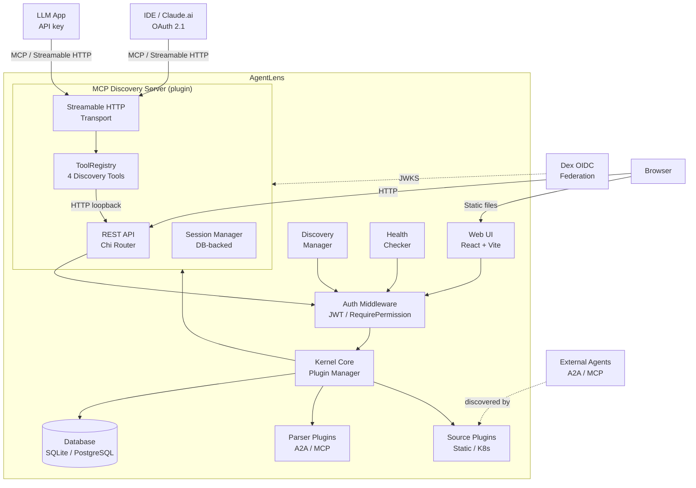

---

## Domain Model: Product Archetype Pattern

AgentLens models each discovered agent or server using the **Product Archetype** pattern. `AgentType` represents *what the agent IS* (its protocol, endpoint, capabilities, and raw definition), while `CatalogEntry` represents *how it is cataloged* (display name, status, source, validity, metadata). The two are linked 1:1 via a foreign key.

### Core Types

| Type | Description |
| ---- | ----------- |
| `AgentType` | The protocol-level identity of an agent: endpoint, protocol, version, `AgentKey` (SHA256 of protocol+endpoint), capabilities, raw definition, and provider. Maps to the `agent_types` table. |
| `CatalogEntry` | The catalog wrapper around an `AgentType`: display name, description, status, source, validity, categories, and metadata. Maps to the `catalog_entries` table. |
| `Capability` | Polymorphic agent feature (replaces `Skill`). Discriminated by `kind`: `a2a.skill`, `a2a.interface`, `a2a.security_scheme`, `a2a.security_requirement`, `a2a.extension`, `a2a.signature`, `mcp.tool`, `mcp.resource`, `mcp.prompt`. Stored in the `capabilities` table. |
| `Provider` | Organization and team that owns the agent. Reusable across agents; stored in the `providers` table. |
| `Protocol` | The agent communication protocol: `a2a` (Agent-to-Agent), `mcp` (Model Context Protocol), `a2ui` (Agent-to-UI). |
| `Validity` | Time-bounded availability with `from`, `to`, and `last_seen` timestamps. |
| `Status` | Health status: `healthy`, `degraded`, `down`, `unknown`. |
| `SourceType` | How the entry was discovered: `k8s`, `config`, `push`, `upstream`. |

### Auth & Identity Types

| Type | Description |
| ---- | ----------- |
| `User` | An authenticated user with username, display name, email, password hash, role, and active/locked state. |
| `Role` | A named set of permissions. Three built-in system roles: `admin`, `editor`, `viewer`. |
| `Setting` | A key-value configuration entry scoped to a category (e.g., `ui.theme`, `app.name`). |

### Party Archetype Types

| Type | Description |
| ---- | ----------- |
| `Party` | Unified actor: `person` (1:1 with User), `group` (hierarchical), or `project` (catalog namespace). |
| `PartyRelationship` | Directed named edge in the party graph: `group_member` (containment) or `project_member` (scoped RBAC). |
| `PartyGroupClosure` | Pre-computed transitive closure of containment edges. Rebuilt synchronously on every membership change. Enables O(1) permission checks. |
| `GlobalPartyRole` | Assigns a global system `Role` to a group party. Group members inherit the role's permissions. |
| `CatalogProjectMembership` | Many-to-many link between catalog entries and projects. New entries auto-assigned to the `default` project. |

### Entity Relationships

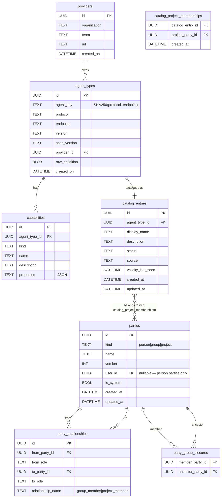

### Party Archetype: Groups, Projects, and Scoped RBAC

AgentLens uses a **party archetype** to manage actors (users, groups, projects) and their relationships in a single unified model.

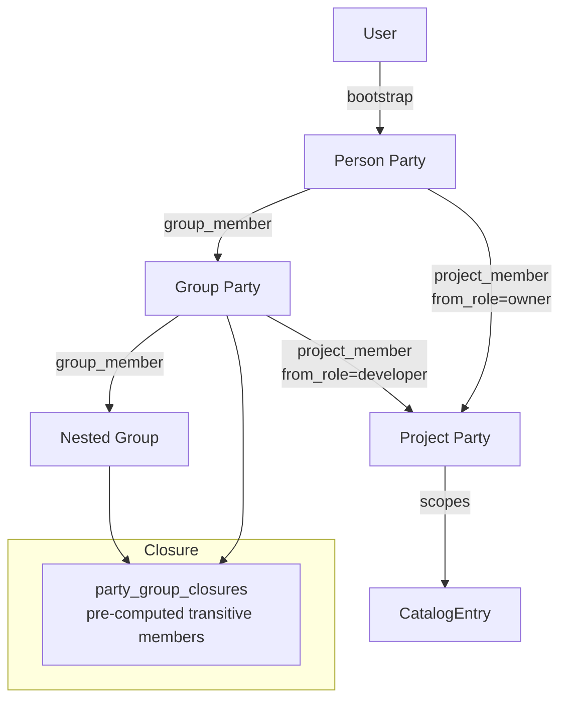

**How permission resolution works:**

1. On every request to a project-scoped endpoint, `RequireProjectPermission` middleware loads the current user's `Person` party.
2. It fetches all transitive ancestor group IDs from `party_group_closures` (O(1) lookup).
3. It checks `party_relationships` for `project_member` edges from the user's party or any ancestor group to the target project.
4. The highest `from_role` found (`owner` > `developer` > `viewer`) determines effective access.
5. The permission is checked against the `ProjectRolePermissions` static map in `internal/auth/party_permissions.go`.

**Project roles:**

| Role | `catalog:read` | `catalog:write` | `catalog:delete` |
| :---: | :---: | :---: | :---: |
| `project:owner` | ✓ | ✓ | ✓ |
| `project:developer` | ✓ | ✓ | — |
| `project:viewer` | ✓ | — | — |

Global system roles (`admin`, `editor`, `viewer`) are orthogonal — admins always pass `RequireProjectPermission` regardless of party membership.

### Capability Kinds

| Kind | Protocol | Properties (JSON) |
|------|----------|-------------------|
| `a2a.skill` | A2A | `tags`, `input_modes`, `output_modes` |
| `a2a.interface` | A2A | `url`, `binding` |
| `a2a.security_scheme` | A2A | `scheme_name`, `type`, `http_scheme`, `bearer_format`, `api_key_location`, `api_key_name`, `oauth_flows`, `openid_connect_url` |
| `a2a.security_requirement` | A2A | `schemes` (map of scheme name → scope list), `skill_ref` (optional — scopes requirement to a skill) |
| `a2a.extension` | A2A | `uri`, `required` |
| `a2a.signature` | A2A | `algorithm`, `key_id` |
| `mcp.tool` | MCP | `input_schema` |
| `mcp.resource` | MCP | `uri` |
| `mcp.prompt` | MCP | `arguments` |

### Security Capabilities and Computed Views

Security information is stored exclusively in the `capabilities` table — no separate security tables exist. Two computed fields (`auth_summary` and `security_detail`) are derived at serialization time from capabilities.

**Storage model:**

- Each `a2a.security_scheme` capability row stores one scheme. The `name` column holds the `scheme_name` value (used as the UNIQUE key alongside `agent_type_id` and `kind`).
- Each `a2a.security_requirement` capability row stores one requirement. The `name` column is derived from sorted scheme keys, each paired with their sorted scopes (e.g., `"apiKeyAuth:+httpAuth:read,write"`), plus an optional `skill:<skillRef>:` prefix for per-skill requirements. This format ensures uniqueness even when two requirements share the same scheme set but differ in required scopes.

**Computed views:**

- `auth_summary` — computed by `buildAuthSummary()` from all `a2a.security_scheme` capabilities. Returns `nil` for agents with no security schemes (open agents). Contains `label` (human-readable string), `types` (sorted, deduplicated list of scheme type strings), and `required` (boolean — true when at least one top-level `a2a.security_requirement` exists).
- `security_detail` — computed by `buildSecurityDetail()` from all `a2a.security_scheme` and `a2a.security_requirement` capabilities. Groups them into `security_schemes[]` and `security_requirements[]`. Present in both list (`GET /catalog`) and detail (`GET /catalog/{id}`) responses.

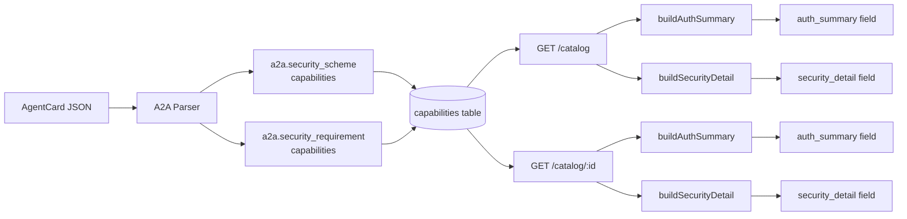

---

## Microkernel Plugin Architecture

AgentLens uses a **microkernel** design. The core kernel manages shared resources (store, config, logger, license), and all extensible behavior is implemented through plugins.

### Plugin Interface

Every plugin implements the base `Plugin` interface:

```go
type Plugin interface {
    Name() string
    Version() string
    Type() PluginType
    Init(k Kernel) error
    Start(ctx context.Context) error
    Stop(ctx context.Context) error
}
```

Specialized interfaces extend `Plugin`:

- **`ParserPlugin`** — parses and validates protocol-specific cards into `AgentType`. Registered per-protocol. Methods: `Protocol()`, `Parse(raw)`, `Validate(raw)`, `CardPath()`.
- **`SourcePlugin`** — discovers catalog entries from a specific source. Method: `Discover(ctx)`.

The `Validate` method returns a `kernel.ValidationResult`:

```go
type ValidationResult struct {
    Valid       bool              `json:"valid"`
    SpecVersion string            `json:"spec_version"`
    Errors      []ValidationError `json:"errors"`
    Warnings    []string          `json:"warnings"`
    Preview     map[string]any    `json:"preview,omitempty"`
}

type ValidationError struct {
    Field   string `json:"field"`
    Message string `json:"message"`
}
```

### Plugin Types

| Type | Description | Examples |
| ---- | ----------- | ------- |
| `parser` | Parses protocol-specific card JSON | A2A parser, MCP parser |
| `source` | Discovers catalog entries | Static config, Kubernetes |
| `middleware` | HTTP middleware hooks | SSO, RBAC (enterprise) |
| `store` | Alternative store backends | PostgreSQL (enterprise) |
| `cardstore` | `CardStorePlugin` | Persists verbatim raw card bytes keyed by `agent_type_id`. Owns the `raw_cards` table. Enforces 256 KiB cap. |

### Plugin Lifecycle

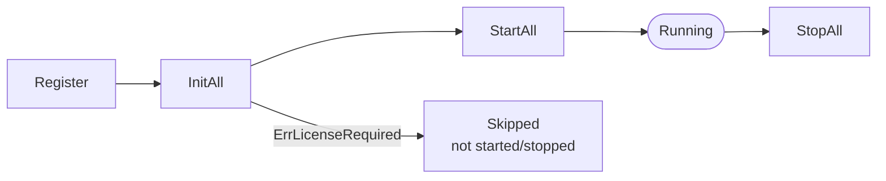

The `PluginManager` tracks which plugins were successfully initialized in a separate `initialized` slice. Only those are started and stopped — plugins that were skipped during init (e.g., enterprise plugins without a license) are never started.

### Kernel Interface

The kernel exposes these services to plugins:

| Method | Returns |
| ------ | ------- |
| `Store()` | Data store (SQLite or PostgreSQL) |
| `Config()` | Application configuration |
| `Logger()` | Structured logger (`slog`) |
| `License()` | License information |
| `Parser(protocol)` | Protocol-specific parser plugin |
| `RegisterRoutes(prefix, handler)` | Register HTTP route handlers |
| `RegisterMiddleware(mw)` | Register HTTP middleware |

---

## Component Details

### REST API

Built with [Chi router](https://github.com/go-chi/chi). All routes under `/api/v1/` are protected by the `RequireAuth` JWT middleware. The `RequirePermission` middleware enforces per-route permission checks.

**Handler wiring:**

`RouterDeps` requires a `kernel.Kernel` instance. The `Handler` struct holds the kernel (via a `parsers` field) and derives `store.Store` from `kernel.Store()`. API handlers that need to parse or validate a protocol card look up the appropriate `ParserPlugin` dynamically via `kernel.Parser(protocol)` — no parser is directly instantiated in handler code. `import_handler.go` performs auto-detection (tries each registered parser), while `register_handler.go` and `validate_handler.go` look up the A2A parser by protocol name.

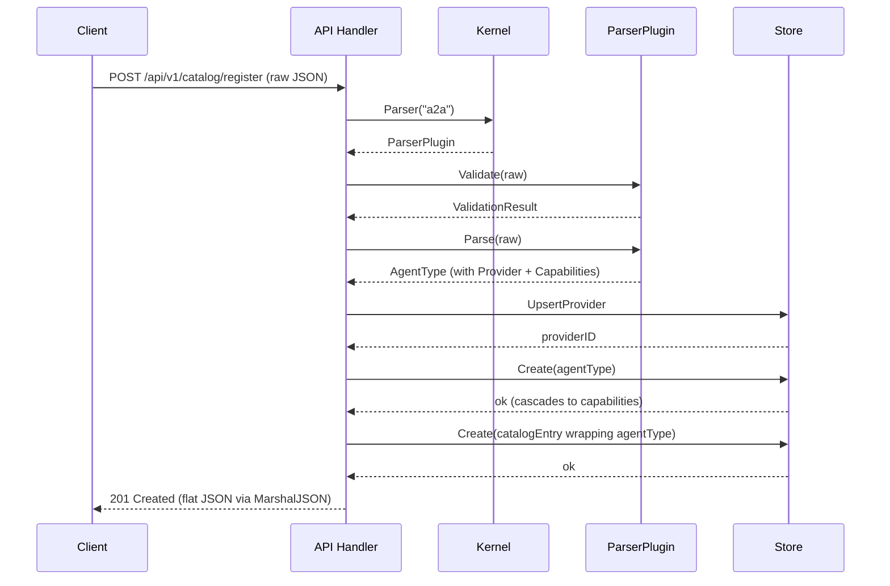

The `POST /api/v1/catalog/import` endpoint follows a similar pattern but fetches the card from a URL first and auto-detects the protocol:

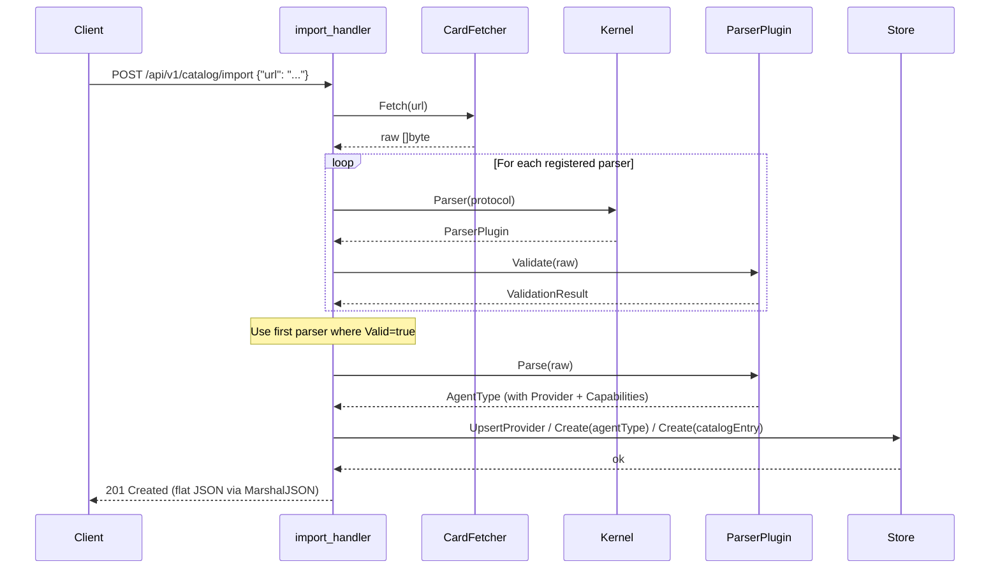

**Auth routes (public):**

| Endpoint | Method | Description |
| -------- | ------ | ----------- |
| `/api/v1/auth/login` | POST | Authenticate and obtain a JWT token |
| `/api/v1/auth/logout` | POST | Clear the session cookie |

**Auth routes (protected):**

| Endpoint | Method | Permission | Description |
| -------- | ------ | ---------- | ----------- |
| `/api/v1/auth/refresh` | POST | Any | Refresh JWT token |
| `/api/v1/auth/me` | GET | Any | Current user info |
| `/api/v1/auth/password` | PUT | Any | Change password |

**Catalog routes (protected):**

| Endpoint | Method | Permission | Description |
| -------- | ------ | ---------- | ----------- |
| `/api/v1/catalog` | GET | `catalog:read` | List entries (with filters) |
| `/api/v1/catalog` | POST | `catalog:write` | Push-register an entry |
| `/api/v1/catalog/validate` | POST | `catalog:write` | Validate an A2A agent card (dry-run) |
| `/api/v1/catalog/register` | POST | `catalog:write` | Register an A2A agent from a raw card JSON |
| `/api/v1/catalog/import` | POST | `catalog:write` | Fetch and import an agent card from a URL |
| `/api/v1/catalog/{id}` | GET | `catalog:read` | Get entry by ID |
| `/api/v1/catalog/{id}` | DELETE | `catalog:delete` | Delete entry |
| `/api/v1/catalog/{id}/card` | GET | `catalog:read` | Get raw protocol card JSON |
| `/api/v1/skills` | GET | `catalog:read` | Search entries by skill name |
| `/api/v1/stats` | GET | `catalog:read` | Aggregate statistics |

**User/Role/Settings routes (protected):**

| Endpoint | Method | Permission |
| -------- | ------ | ---------- |
| `/api/v1/users` | GET / POST | `users:read` / `users:write` |
| `/api/v1/users/{id}` | GET / PUT / DELETE | `users:read` / `users:write` / `users:delete` |
| `/api/v1/roles` | GET / POST | `roles:read` / `roles:write` |
| `/api/v1/roles/{id}` | PUT / DELETE | `roles:write` |
| `/api/v1/settings` | GET / PUT | `settings:read` / `settings:write` |
| `/api/v1/settings/{category}` | GET | `settings:read` |

See [api.md](api.md) for full API documentation.

### Auth Layer

Authentication uses **JWT tokens** signed with HS256:

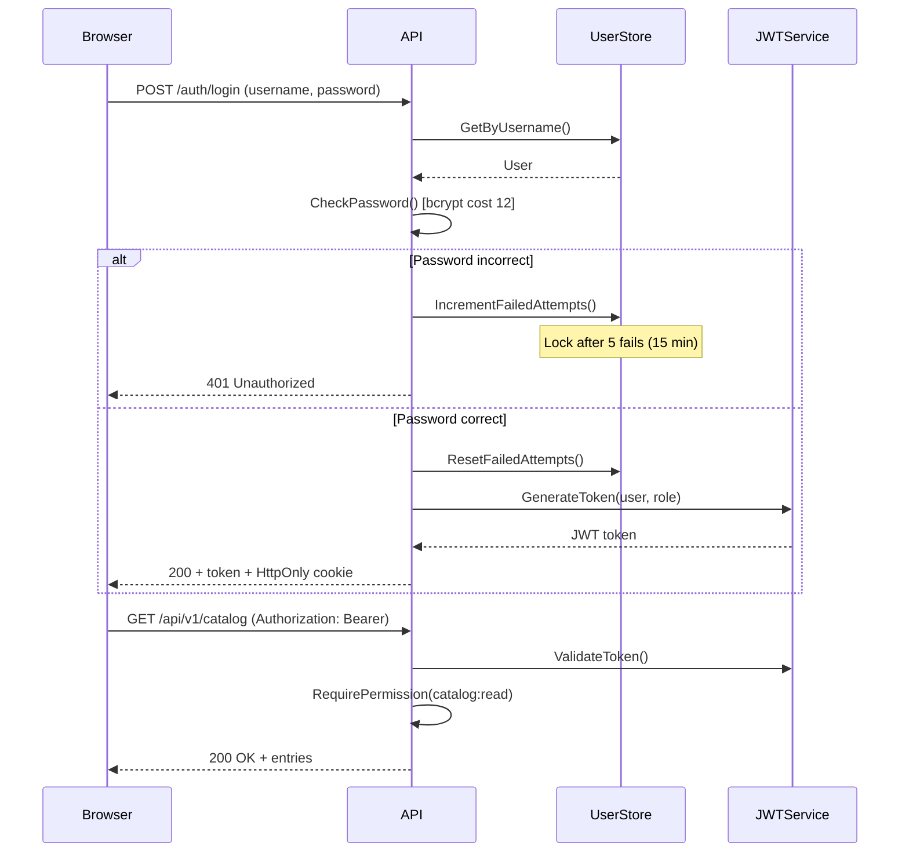

**JWT Claims:**

```json
{
  "user_id": "...",
  "username": "admin",
  "role_id": "role-admin",
  "permissions": ["catalog:read", "catalog:write", "..."],
  "exp": "...",
  "iss": "agentlens"
}
```

The JWT secret is loaded from `AGENTLENS_JWT_SECRET`. If not set, a random secret is generated at startup (tokens will not survive restarts).

**Admin Bootstrap:**

On first startup, if no users exist, the `BootstrapAdmin` function creates an `admin` user with a cryptographically random 20-character password (upper + lower + digit + special) and prints it to stdout.

### Database Layer

AgentLens uses [GORM](https://gorm.io/) as its ORM with support for two backends:

| Backend | Use case |
| ------- | -------- |
| **SQLite** (default) | Single-instance, zero-config, file-based |
| **PostgreSQL** | Production, multi-instance, high-availability |

The active dialect is selected by `database.dialect` in the config (or `AGENTLENS_DB_DIALECT`).

**Schema Migrations:**

Migrations are versioned and tracked in the `schema_migrations` table. They run automatically at startup. Current migrations:

| Version | Description |
| ------- | ----------- |
| 1 | Create `providers`, `agent_types`, `capabilities`, and `catalog_entries` tables with FK constraints and unique indexes |
| 2 | Create `roles` and `users` tables |
| 3 | Seed default roles (admin, editor, viewer) |
| 4 | Create `settings` table with defaults |

**Store Interface:**

```go
type Store interface {
    Create(ctx, entry) error
    Get(ctx, id) (*CatalogEntry, error)
    List(ctx, filter) ([]*CatalogEntry, error)
    Update(ctx, entry) error
    Delete(ctx, id) error
    FindByEndpoint(ctx, endpoint) (*CatalogEntry, error)
    SearchCapabilities(ctx, query) ([]*CatalogEntry, error)
    Stats(ctx) (*Stats, error)
    UpsertProvider(ctx, provider) (string, error)
    CreateAgentType(ctx, agentType) error
}
```

Alongside `Store`, the data layer includes:

- **`UserStore`** — CRUD for users, failed-attempt tracking, lockout management
- **`RoleStore`** — CRUD for roles (system roles protected from deletion)
- **`SettingsStore`** — key-value settings with category scoping

### Discovery Manager

The discovery manager polls sources at a configurable interval (`poll_interval`). For each discovered entry, it upserts into the store keyed by `endpoint` (which has a UNIQUE constraint).

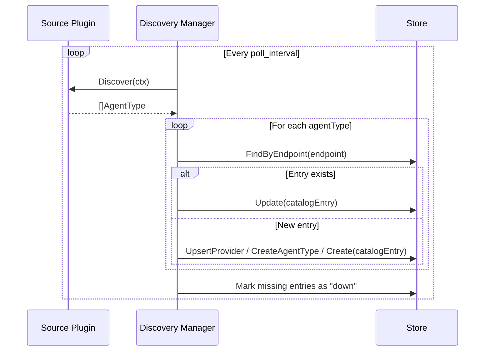

**Sources:**

1. **Static source** — reads from `sources:` in the config file, fetches card JSON from each URL, and passes it through the appropriate parser plugin.
2. **Kubernetes source** — watches Kubernetes Services annotated with `agentlens.io/type`, constructs card URLs from service endpoints + card paths, and discovers agents.

### Web Dashboard

React + Vite + TypeScript frontend using [shadcn/ui](https://ui.shadcn.com/) components. Embedded into the Go binary at build time via `embed.FS`. Components:

- **AuthContext** — JWT token management, 401-redirect, permission checking
- **ThemeContext** — light/dark/system theme with CSS class switching
- **LoginPage** — authentication form
- **Layout** — sticky navbar with user avatar dropdown, mobile hamburger
- **CatalogList** — paginated table with protocol/status badges and filters
- **EntryDetail** — full entry view with capabilities, metadata, categories, and raw protocol definition
- **RegisterAgentDialog** — multi-tab registration modal: Paste JSON, Upload File, Import from URL
- **CardPreview** — renders a validated agent card preview before registration
- **SettingsPage** — 4-tab management UI (General, Users, Roles, My Account)
- **ProtectedRoute** — auth guard that redirects unauthenticated users to `/login`

**Data fetching:** migrated from plain `fetch`+`useState` to `@tanstack/react-query`. Catalog list page uses `useCatalogQuery` hook for URL-synced filter state. Detail page uses tabbed layout (Overview + Raw Card).

### Health Checker

A plugin that periodically pings each catalog entry's endpoint and updates its status (`healthy`, `degraded`, `down`). Configurable interval, timeout, and concurrency.

---

## Health Check & Lifecycle State Machine

AgentLens periodically probes each catalog entry's endpoint and tracks its runtime state.

### Lifecycle states

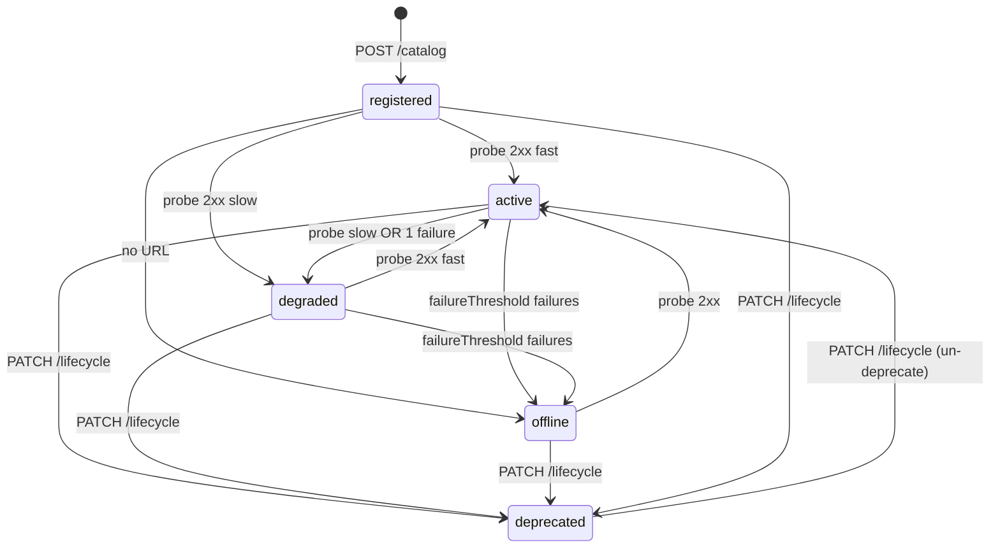

### Probe worker

The `plugins/health.Plugin` runs as a microkernel plugin (`Register → Init → Start → Stop`). On each tick it:

1. Calls `store.ListForProbing` to fetch entries due for a probe (not deprecated, not recently probed)
2. Probes each entry's endpoint via HTTP GET with a configurable timeout
3. Applies the state machine (latency threshold → degraded; consecutive failures → offline)
4. Persists results via `store.UpdateHealth`

For A2A entries, the probe URL is resolved from `supportedInterfaces[0].url` if present, otherwise falls back to the entry's primary endpoint.

### Enterprise Plugins (License-Gated)

These plugins are registered but gracefully skipped when no enterprise license is present:

| Plugin | Type | Description |
| ------ | ---- | ----------- |
| SSO | middleware | Single Sign-On integration |
| RBAC | middleware | Role-Based Access Control |
| Audit | middleware | Audit logging |
| PostgreSQL | store | PostgreSQL store backend |

---

## Data Flow

### Request Flow

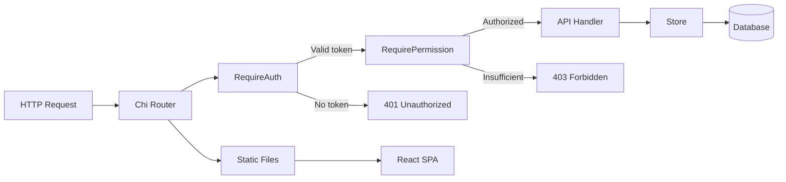

---

## Directory Structure

```
agentlens/
├── cmd/agentlens/          # Application entrypoint
│   └── main.go
├── internal/
│   ├── api/                # REST API handlers, router, auth middleware
│   ├── auth/               # JWT service, password hashing, bootstrap
│   ├── config/             # Configuration loading (YAML + env vars)
│   ├── db/                 # GORM DB wrapper, migration framework
│   ├── discovery/          # Discovery manager + sources
│   ├── health/             # Health checker
│   ├── kernel/             # Microkernel core + plugin manager
│   ├── model/              # Domain model (CatalogEntry, User, Role, Setting)
│   ├── server/             # HTTP server lifecycle
│   ├── service/            # Shared services (CardFetcher for URL import)
│   └── store/              # GORM-backed stores (catalog, user, role, settings)
├── plugins/
│   ├── enterprise/         # License-gated enterprise plugins
│   │   ├── audit/
│   │   ├── postgres/
│   │   ├── rbac/
│   │   └── sso/
│   ├── health/             # Health checker plugin
│   ├── parsers/            # Protocol parser plugins
│   │   ├── a2a/
│   │   └── mcp/
│   └── sources/            # Discovery source plugins
│       ├── k8s/
│       └── static/
├── web/                    # React frontend (embedded)
│   └── src/
│       ├── contexts/       # AuthContext, ThemeContext
│       ├── pages/          # LoginPage, SettingsPage
│       └── components/     # Layout, CatalogList, EntryDetail, RegisterAgentDialog, etc.
├── deploy/
│   └── helm/agentlens/     # Helm chart
├── examples/
│   ├── docker-compose.yaml          # SQLite setup
│   ├── docker-compose.postgres.yaml # PostgreSQL setup
│   └── mock-agents/                 # Mock A2A and MCP agents
├── scripts/                # Release and CI scripts
├── docs/                   # Documentation
├── Dockerfile              # Multi-stage Docker build (distroless)
├── Makefile                # Build automation
└── .github/workflows/      # CI, code scanning, E2E, release
```

---

## Observability

AgentLens ships OpenTelemetry instrumentation as an infrastructure-layer concern. The telemetry subsystem is built on `internal/telemetry` and provides traces, metrics, and logs to external observability backends (Jaeger, Prometheus, Loki).

**Key components:**
- **Span instrumentation**: HTTP handlers, database queries, and plugin operations emit traces
- **Prometheus metrics**: Go runtime metrics, HTTP request counters, and custom business metrics
- **OTLP export**: Configurable OTLP gRPC/HTTP endpoint for trace and log export
- **Liveness/readiness probes**: `/healthz` (process alive), `/readyz` (DB reachable), `/metrics` (Prometheus scrape)

**Observability data flows:**

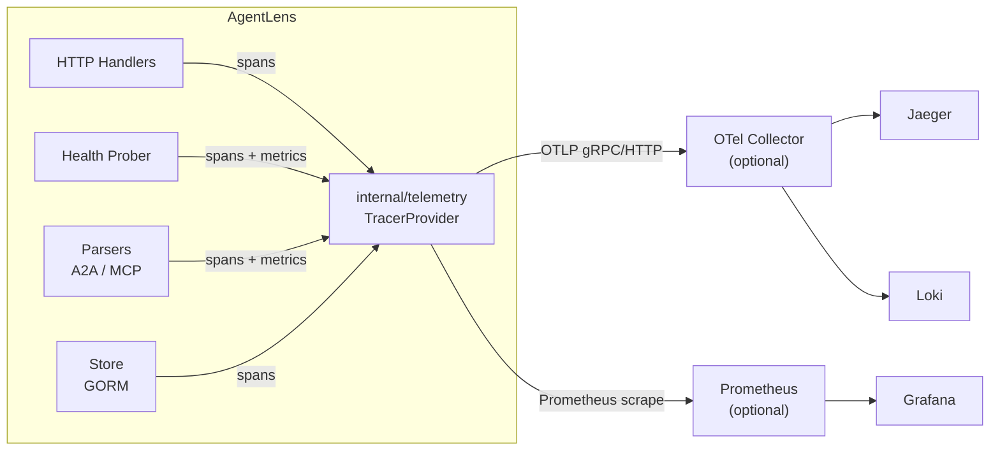

**Configuration** (see [Settings](settings.md) for full details):
- `telemetry.enabled` — Enable/disable OTLP export
- `telemetry.endpoint` — OTLP collector address (e.g., `localhost:4317`)
- `telemetry.protocol` — Export protocol: `grpc` (default) or `http`
- `telemetry.prometheus.enabled` — Expose `/metrics` endpoint
- `telemetry.traces_sample_rate` — Sample rate (0.0–1.0; default 1.0)

**Related documentation:**
- [ADR-009: OpenTelemetry as Infrastructure](adr/009-opentelemetry-as-infrastructure.md) — Design decision for tracing/metrics
- [ADR-010: Dual-Output Structured Logging](adr/010-dual-output-structured-logging.md) — Logging design with OTel bridge
- [ADR-015: MCP API-Key Credential Cache](adr/015-mcp-bcrypt-credcache.md) — bcrypt credcache design for MCP service-account authentication (10s TTL, LRU 1024, invalidation chain)
- [DevOps Guide](devops-guide.md#observability) — Deployment and monitoring setup

---

## Configuration

AgentLens is configured via YAML file and/or environment variables (prefixed with `AGENTLENS_`):

| Setting | Env Var | Default | Description |
| ------- | ------- | ------- | ----------- |
| `port` | `AGENTLENS_PORT` | 8080 | HTTP port |
| `data_dir` | `AGENTLENS_DATA_DIR` | `./data` | Data directory |
| `log_level` | `AGENTLENS_LOG_LEVEL` | `info` | Log level (debug/info/warn/error) |
| `license_key` | `AGENTLENS_LICENSE_KEY` | — | Enterprise license key |
| `poll_interval` | `AGENTLENS_POLL_INTERVAL` | `5m` | Discovery poll interval |
| `database.dialect` | `AGENTLENS_DB_DIALECT` | `sqlite` | Database backend (sqlite/postgres) |
| `database.sqlite.path` | `AGENTLENS_DB_SQLITE_PATH` | `./data/agentlens.db` | SQLite file path |
| `database.postgres.host` | `AGENTLENS_DB_POSTGRES_HOST` | `localhost` | PostgreSQL host |
| `database.postgres.port` | `AGENTLENS_DB_POSTGRES_PORT` | `5432` | PostgreSQL port |
| `auth.jwt_secret` | `AGENTLENS_JWT_SECRET` | (auto) | JWT signing secret |
| `auth.session_duration` | `AGENTLENS_SESSION_DURATION` | `24h` | Token expiry |
| `kubernetes.enabled` | `AGENTLENS_KUBERNETES_ENABLED` | `false` | Enable K8s discovery |
| `health_check.enabled` | `AGENTLENS_HEALTH_CHECK_ENABLED` | `true` | Enable health checks |
| `health_check.interval` | `AGENTLENS_HEALTH_CHECK_INTERVAL` | `30s` | Health check interval |
| `health_check.timeout` | `AGENTLENS_HEALTH_CHECK_TIMEOUT` | `5s` | Per-endpoint timeout |
| `health_check.concurrency` | `AGENTLENS_HEALTH_CHECK_CONCURRENCY` | `10` | Max concurrent checks |

---

## Deployment

See [DevOps Guide](devops-guide.md) for full deployment documentation including Docker, Helm, CI/CD, and release pipeline details.

### Docker

Multi-stage build: Bun (frontend) → Go (backend) → Distroless (runtime).

```bash
docker build -t agentlens .
docker run -p 8080:8080 \
  -e AGENTLENS_JWT_SECRET=your-secret \
  agentlens
```

### Docker Compose (SQLite)

```bash
cd examples && docker compose up
```

### Docker Compose (PostgreSQL)

```bash
cd examples && docker compose -f docker-compose.postgres.yaml up
```

### Kubernetes (Helm)

```bash
helm install agentlens deploy/helm/agentlens \
  -n agentlens --create-namespace \
  --set auth.jwtSecret=your-secret
```

The Helm chart creates: Deployment, Service, ServiceAccount, ClusterRole (for K8s discovery), ClusterRoleBinding, ConfigMap, and optionally a PersistentVolumeClaim for SQLite storage.
