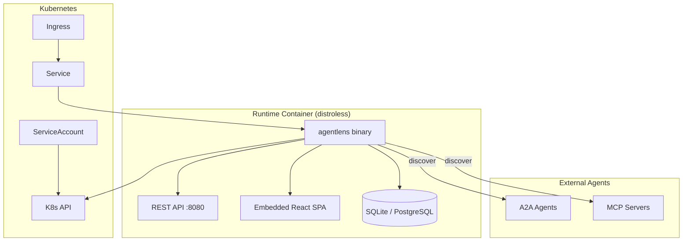
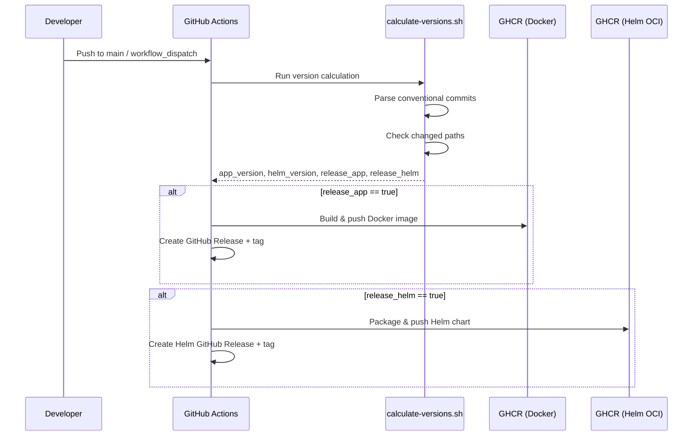
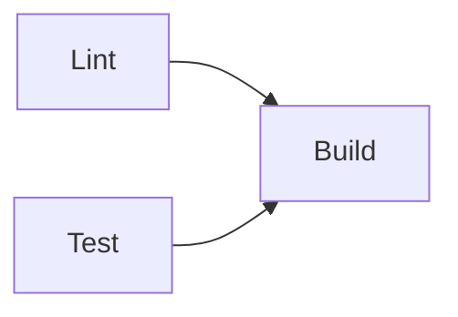

# DevOps Guide

This guide covers deployment, release pipeline, CI/CD, monitoring, and operational procedures for AgentLens.

---

## Table of Contents

- [Architecture Overview](#architecture-overview)
- [Docker Image](#docker-image)
- [Release Pipeline](#release-pipeline)
- [Versioning Strategy](#versioning-strategy)
- [CI/CD Workflows](#cicd-workflows)
- [Helm Chart Deployment](#helm-chart-deployment)
- [Docker Compose (Local / Dev)](#docker-compose-local--dev)
- [Configuration Reference](#configuration-reference)
- [Database Operations](#database-operations)
- [Security Considerations](#security-considerations)
- [Troubleshooting](#troubleshooting)

---

## Architecture Overview

AgentLens is a single Go binary that serves both the REST API and the embedded React frontend. It uses SQLite by default (zero external dependencies) or PostgreSQL for production deployments.



---

## Docker Image

### Base Image

The production image uses `gcr.io/distroless/base-debian12` — no shell, no package manager, minimal attack surface.

### Multi-Stage Build

| Stage | Base Image | Purpose |
|-------|-----------|---------|
| 1 — Frontend | `oven/bun:1.3.11-alpine` | Build React SPA with Vite |
| 2 — Backend | `golang:1.26.1` | Compile Go binary (CGO for SQLite) |
| 3 — Runtime | `gcr.io/distroless/base-debian12` | Minimal production image |

### Build Locally

```bash
make docker-build       # Builds agentlens:local
```

### Scan for Vulnerabilities

```bash
make docker-scan        # Requires Trivy installed locally
```

### Image Tags

| Tag | Description |
|-----|-------------|
| `0.2.0` | Stable release (from `main` branch) |
| `0.2.0-aeba8e9` | Pre-release (from feature branch, includes commit SHA) |
| `latest` | Points to most recent stable release |

### Registry

Images are published to GitHub Container Registry:

```
ghcr.io/pawelharacz/agentlens:<version>
```

---

## Release Pipeline

The release workflow (`.github/workflows/release.yml`) runs on every push to `main` or via manual dispatch.

### Flow



### Manual Release (workflow_dispatch)

You can trigger a release manually from the GitHub Actions UI with optional version overrides:

| Input | Description |
|-------|-------------|
| `app_version` | Override app version (e.g. `1.0.0`). Leave empty for auto-bump. |
| `helm_version` | Override Helm chart version (e.g. `1.0.0`). Leave empty for auto-bump. |

### Pre-Releases from Feature Branches

When the script runs on a non-`main` branch, versions get a SHA suffix automatically:

```
0.2.0-aeba8e9   # Feature branch pre-release
0.2.0           # Stable release from main
```

This enables testing Docker images from feature branches before merging.

### Local Testing

Run the version calculation locally to see what would be released:

```bash
./scripts/calculate-versions.sh

# Output:
# app_version=0.2.0
# helm_version=0.1.1
# release_app=true
# release_helm=false
```

Test with overrides:

```bash
./scripts/calculate-versions.sh --app-override 1.0.0 --helm-override 2.0.0
```

---

## Versioning Strategy

### Two Independent Version Tracks

| Track | Tag Format | Triggered By | Artifacts |
|-------|-----------|-------------|-----------|
| **App** | `v1.2.3` | Changes in `cmd/`, `internal/`, `plugins/`, `web/`, `Dockerfile`, `go.mod`, `go.sum` | Docker image, GitHub Release |
| **Helm** | `helm/v1.2.3` | Changes in `deploy/helm/` | Helm OCI package, GitHub Release |

### Semantic Versioning from Conventional Commits

The `scripts/calculate-versions.sh` script scans commits since the last relevant tag and determines the bump level:

| Commit Type | Bump | Example |
|------------|------|---------|
| `fix:`, `fix(api):`, `chore:`, `refactor:`, `docs:` | **patch** | `0.1.1` → `0.1.2` |
| `feat:`, `feat(web):` | **minor** | `0.1.1` → `0.2.0` |
| `feat!:`, `fix!:`, or `BREAKING CHANGE` in body | **major** | `0.1.1` → `1.0.0` |

The highest bump level across all commits wins. For example, if there are 3 `fix:` commits and 1 `feat:` commit, the result is a minor bump.

### When Does Helm Version Bump?

Helm chart version bumps **only** when files in `deploy/helm/` change. Changing the Docker image tag for a deployment does not require a new chart version — use `--set image.tag=X` instead:

```bash
helm upgrade agentlens oci://ghcr.io/pawelharacz/charts/agentlens \
  --set image.tag=0.3.0
```

---

## CI/CD Workflows

### Overview

| Workflow | Trigger | Purpose |
|----------|---------|---------|
| `ci.yml` | PRs to `main` | Lint, test, build |
| `code-scanning.yml` | PRs, push to `main`, weekly | CodeQL, govulncheck, Trivy, Helm lint |
| `e2e.yml` | PRs to `main` | Playwright E2E tests |
| `release.yml` | Push to `main`, manual dispatch | Version calculation, Docker + Helm release |

### CI Pipeline (`ci.yml`)



| Job | Steps |
|-----|-------|
| **Lint** | `go vet` → `golangci-lint` → TypeScript type check |
| **Test** | Go tests with coverage report |
| **Build** | Frontend build (Bun/Vite) → Go binary build (CGO) |

### Code Scanning (`code-scanning.yml`)

| Job | Tool | Scope |
|-----|------|-------|
| **CodeQL** | GitHub CodeQL | Go + JavaScript/TypeScript static analysis |
| **govulncheck** | `golang.org/x/vuln` | Go dependency vulnerabilities |
| **Docker Scan** | Trivy | Container image vulnerabilities (CRITICAL, HIGH) |
| **Helm Lint** | Helm CLI | Chart validation |

### E2E Tests (`e2e.yml`)

Runs Playwright against a real AgentLens instance with mock A2A/MCP agents. Covers authentication, catalog browsing, settings management, and user administration.

---

## Helm Chart Deployment

### Install from OCI Registry

```bash
helm install agentlens oci://ghcr.io/pawelharacz/charts/agentlens \
  --version 0.1.1 \
  --namespace agentlens \
  --create-namespace
```

### Key Values

| Value | Default | Description |
|-------|---------|-------------|
| `replicaCount` | `1` | Number of pods |
| `image.repository` | `ghcr.io/pawelharacz/agentlens` | Container image |
| `image.tag` | `""` (appVersion) | Image tag override |
| `service.port` | `80` | Service port |
| `service.targetPort` | `8080` | Container port |
| `database.dialect` | `sqlite` | `sqlite` or `postgres` |
| `database.postgres.*` | — | PostgreSQL connection settings |
| `auth.jwtSecret` | `""` | JWT signing secret (auto-generated if empty) |
| `auth.existingSecret` | `""` | Reference to existing K8s Secret for JWT |
| `persistence.enabled` | `true` | Enable PVC for SQLite data |
| `persistence.size` | `1Gi` | PVC size |
| `env.AGENTLENS_KUBERNETES_ENABLED` | `"true"` | Enable K8s service discovery |
| `env.AGENTLENS_LOG_LEVEL` | `"info"` | Log level (`debug`, `info`, `warn`, `error`) |

### Production Deployment with PostgreSQL

```bash
helm install agentlens oci://ghcr.io/pawelharacz/charts/agentlens \
  --namespace agentlens \
  --create-namespace \
  --set database.dialect=postgres \
  --set database.postgres.host=postgres.db.svc.cluster.local \
  --set database.postgres.port=5432 \
  --set database.postgres.user=agentlens \
  --set database.postgres.password=<secret> \
  --set database.postgres.dbname=agentlens \
  --set database.postgres.sslmode=require \
  --set auth.jwtSecret=<strong-random-secret> \
  --set persistence.enabled=false
```

### Upgrade Image Only (No Chart Change)

```bash
helm upgrade agentlens oci://ghcr.io/pawelharacz/charts/agentlens \
  --reuse-values \
  --set image.tag=0.3.0
```

### RBAC

The chart creates a `ClusterRole` and `ClusterRoleBinding` that grants the pod read access to Kubernetes Services — required for K8s agent discovery. To disable:

```bash
--set clusterRole.create=false \
--set env.AGENTLENS_KUBERNETES_ENABLED=false
```

---

## Docker Compose (Local / Dev)

### SQLite (Default)

```bash
cd examples
docker compose up
```

Starts AgentLens on `http://localhost:8080` with mock A2A and MCP agents.

### PostgreSQL

```bash
cd examples
docker compose -f docker-compose.postgres.yaml up
```

Includes PostgreSQL 16 with health checks. Data persisted in `pgdata` volume.

### Reset Database

```bash
docker compose -f docker-compose.postgres.yaml down -v
docker compose -f docker-compose.postgres.yaml up
```

---

## Configuration Reference

AgentLens is configured via YAML file (`agentlens.yaml`) or environment variables. Environment variables take precedence.

### Environment Variables

| Variable | Default | Description |
|----------|---------|-------------|
| `AGENTLENS_PORT` | `8080` | HTTP server port |
| `AGENTLENS_DATA_DIR` | `data` | Directory for SQLite database |
| `AGENTLENS_LOG_LEVEL` | `info` | Log level |
| `AGENTLENS_DB_DIALECT` | `sqlite` | Database dialect (`sqlite`, `postgres`) |
| `AGENTLENS_DB_POSTGRES_HOST` | — | PostgreSQL host |
| `AGENTLENS_DB_POSTGRES_PORT` | `5432` | PostgreSQL port |
| `AGENTLENS_DB_POSTGRES_USER` | — | PostgreSQL user |
| `AGENTLENS_DB_POSTGRES_PASSWORD` | — | PostgreSQL password |
| `AGENTLENS_DB_POSTGRES_DBNAME` | — | PostgreSQL database name |
| `AGENTLENS_DB_POSTGRES_SSLMODE` | `prefer` | PostgreSQL SSL mode |
| `AGENTLENS_KUBERNETES_ENABLED` | `false` | Enable K8s service discovery |
| `AGENTLENS_KUBERNETES_NAMESPACE` | `""` | Limit discovery to namespace (empty = all) |
| `AGENTLENS_HEALTH_CHECK_ENABLED` | `true` | Enable periodic health checks |
| `AGENTLENS_HEALTH_CHECK_INTERVAL` | `30s` | Health check interval |
| `AGENTLENS_DISCOVERY_INTERVAL` | `60s` | Discovery poll interval |
| `AGENTLENS_JWT_SECRET` | (auto-generated) | JWT signing secret |
| `AGENTLENS_SESSION_DURATION` | `24h` | JWT token lifetime |

### Health Endpoint

```
GET /healthz → 200 OK
```

Use for Kubernetes liveness/readiness probes (already configured in the Helm chart).

---

## Database Operations

### Migrations

Migrations run automatically on startup. They are idempotent and versioned in `internal/db/migrations.go`.

### Backup SQLite

```bash
# From host (Docker Compose)
docker compose exec agentlens cp /data/agentlens.db /data/agentlens.db.bak

# From K8s
kubectl exec -n agentlens deploy/agentlens -- cp /data/agentlens.db /data/agentlens.db.bak
kubectl cp agentlens/agentlens-<pod>:/data/agentlens.db.bak ./agentlens-backup.db
```

### Switch from SQLite to PostgreSQL

1. Deploy PostgreSQL (or use a managed service)
2. Update configuration: `AGENTLENS_DB_DIALECT=postgres` + connection settings
3. Restart AgentLens — migrations run automatically on the new database
4. Note: data is **not** migrated automatically between dialects

---

## Security Considerations

### Container Security

- **Distroless base image** — no shell, no package manager, no unnecessary binaries
- **Non-root execution** — distroless runs as non-root by default
- **Trivy scanning** — automated in CI on every PR and push to `main`
- **CodeQL analysis** — static analysis for Go and TypeScript

### Application Security

- **JWT authentication** — HS256, HttpOnly/Secure/SameSite=Strict cookies
- **bcrypt password hashing** — cost factor 12, minimum 10 characters
- **Account lockout** — 5 failed attempts → 15-minute lockout
- **RBAC** — permission-based access control (`catalog:read`, `users:write`, etc.)
- **Parameterized queries** — all database access through GORM, no raw SQL interpolation

### Secrets Management

| Secret | How to Provide |
|--------|---------------|
| JWT signing key | `AGENTLENS_JWT_SECRET` env var or `auth.jwtSecret` Helm value |
| PostgreSQL password | `AGENTLENS_DB_POSTGRES_PASSWORD` env var or Helm value |
| K8s Secret reference | `auth.existingSecret` Helm value (mounts as env) |

If no JWT secret is configured, one is auto-generated at startup (tokens won't survive restarts).

---

## Troubleshooting

### Container Won't Start

```bash
# Check logs
kubectl logs -n agentlens deploy/agentlens

# Common issues:
# - "database is locked" → SQLite PVC not writable, check persistence settings
# - "connection refused" on PostgreSQL → check host/port/credentials
# - "no such host" → DNS issue, verify service name
```

### K8s Discovery Not Finding Agents

Agents must have the annotation `agentlens.io/protocol: a2a|mcp` on their Service:

```yaml
apiVersion: v1
kind: Service
metadata:
  name: my-agent
  annotations:
    agentlens.io/protocol: a2a
    agentlens.io/port: "9001"          # optional, defaults to first port
    agentlens.io/card-path: "/.well-known/agent-card.json"  # optional
```

Verify the ServiceAccount has list/watch permissions on Services:

```bash
kubectl auth can-i list services --as system:serviceaccount:agentlens:agentlens -A
```

### Health Check Failures

```bash
# Check health endpoint directly
kubectl exec -n agentlens deploy/agentlens -- wget -qO- http://localhost:8080/healthz

# If using distroless (no wget), port-forward instead:
kubectl port-forward -n agentlens deploy/agentlens 8080:8080
curl http://localhost:8080/healthz
```

### Release Pipeline Issues

```bash
# Check what version would be released
./scripts/calculate-versions.sh

# Check which tags exist
git tag --list | sort -V

# Check commits since last release
git log --oneline v0.1.1..HEAD
```
