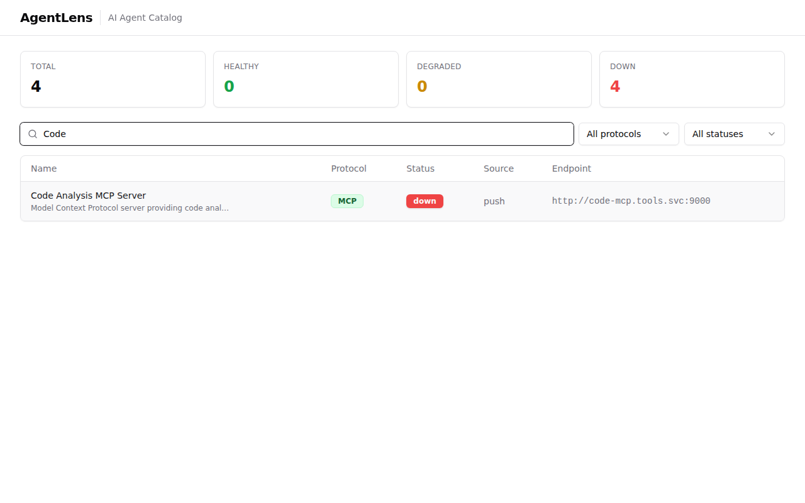
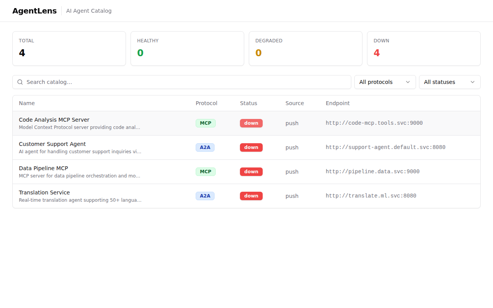

# AgentLens End-User Documentation

Welcome to AgentLens — a real-time AI agent catalog for discovering, tracking, and inspecting A2A, MCP, and A2UI agents across your infrastructure.

---

## Table of Contents

- [Getting Started](#getting-started)
- [Dashboard Overview](#dashboard-overview)
- [Browsing the Catalog](#browsing-the-catalog)
- [Searching and Filtering](#searching-and-filtering)
- [Viewing Agent Details](#viewing-agent-details)
- [Registering an Agent](#registering-an-agent)
- [Understanding Status Indicators](#understanding-status-indicators)
- [Protocol Types](#protocol-types)
- [Using the REST API](#using-the-rest-api)
- [FAQ](#faq)

---

## Getting Started

Open your browser and navigate to the AgentLens URL (default: `http://localhost:8080`). No login is required — the dashboard loads immediately with the current catalog view.

---

## Dashboard Overview

The AgentLens dashboard provides a single-pane view of all discovered AI agents and MCP servers.


The dashboard consists of three main sections:

### Stats Bar

At the top, four summary cards show aggregate counts:

| Card | Description |
|------|-------------|
| **TOTAL** | Total number of catalog entries |
| **HEALTHY** | Agents responding successfully (green) |
| **DEGRADED** | Agents returning errors (yellow) |
| **DOWN** | Agents unreachable (red) |

These counters update automatically as health checks run.

### Search and Filters

Below the stats bar, a search input and dropdown filters let you narrow down the catalog:

- **Search** — type any keyword to filter by agent name or description
- **Protocol filter** — select `A2A`, `MCP`, or `A2UI` to show only agents of that protocol
- **Status filter** — select `healthy`, `degraded`, `down`, or `unknown` to show only agents with that health status

### Catalog Table

The main table lists all catalog entries with these columns:

| Column | Description |
|--------|-------------|
| **Name** | Display name and truncated description |
| **Protocol** | Color-coded badge — blue for A2A, purple for MCP |
| **Status** | Health status badge — green (healthy), yellow (degraded), red (down), gray (unknown) |
| **Source** | How the entry was discovered — `k8s`, `config`, or `push` |
| **Endpoint** | The agent's service URL |

Click any row to see the full agent details.

---

## Browsing the Catalog

The catalog table shows all discovered agents sorted alphabetically. Each entry displays:

- **Display name** — the human-readable name of the agent or server
- **Description** — a brief description (truncated in the table, full text in the detail view)
- **Protocol badge** — color-coded to distinguish A2A agents from MCP servers
- **Status badge** — reflects the most recent health check result
- **Source** — indicates whether the agent was discovered via Kubernetes annotations (`k8s`), static config file (`config`), or push registration (`push`)
- **Endpoint** — the URL where the agent is reachable

---

## Searching and Filtering

### Text Search

Use the search bar at the top to find agents by name or description. The search is case-insensitive and filters results in real-time as you type.



### Protocol Filter

Use the "All protocols" dropdown to show only agents of a specific protocol type:

- **A2A** — Agent-to-Agent protocol agents
- **MCP** — Model Context Protocol servers
- **A2UI** — Agent-to-UI protocol agents

### Status Filter

Use the "All statuses" dropdown to show only agents with a specific health status:

- **healthy** — responding normally
- **degraded** — responding with errors (HTTP 5xx)
- **down** — not reachable
- **unknown** — not yet checked

Filters can be combined with the search bar for precise results.

---

## Viewing Agent Details

Click any row in the catalog table to open the detail view for that agent.



The detail view shows the complete information for a catalog entry:

### Agent Information

- **Display Name** — full agent name
- **Description** — complete description text
- **Protocol** — A2A, MCP, or A2UI
- **Endpoint** — the service URL
- **Version** — the agent's reported version
- **Status** — current health status with color indicator
- **Source** — how this agent was discovered

### Provider

- **Organization** — the organization that maintains the agent
- **Team** — the team responsible for the agent

### Categories

Tags that categorize the agent (e.g., "nlp", "support", "code", "data"). These help with discovery and navigation.

### Skills

Each agent exposes one or more skills — named capabilities with descriptions and supported input/output modes:

| Field | Description |
|-------|-------------|
| **Name** | Skill identifier (e.g., `answer_question`, `translate`) |
| **Description** | What the skill does |
| **Input Modes** | Supported input formats (e.g., `text`, `json`) |
| **Output Modes** | Supported output formats (e.g., `text`, `json`) |

### Raw Card

For discovered agents (not push-registered), the raw protocol card JSON is available, showing the original A2A Agent Card or MCP Server Card as fetched from the agent.

Use the back button or breadcrumb to return to the catalog list.

---

## Registering an Agent

You can register agents in three ways:

### 1. Push Registration (API)

Send a POST request to the catalog endpoint:

```bash
curl -X POST http://localhost:8080/api/v1/catalog \
  -H "Content-Type: application/json" \
  -d '{
    "display_name": "My Agent",
    "description": "Does amazing things",
    "protocol": "a2a",
    "endpoint": "http://my-agent.internal:8080",
    "version": "1.0.0",
    "provider": {
      "organization": "My Org",
      "team": "engineering"
    },
    "categories": ["nlp"],
    "skills": [
      {
        "name": "chat",
        "description": "Chat with the agent",
        "input_modes": ["text"],
        "output_modes": ["text"]
      }
    ]
  }'
```

**Required fields:** `display_name`, `endpoint`, `protocol` (must be `a2a`, `mcp`, or `a2ui`).

The API returns `201 Created` with the full entry including the generated `id`.

If an entry with the same endpoint already exists, the API returns `409 Conflict`.

### 2. Static Configuration

Add entries to your `agentlens.yaml` config file:

```yaml
sources:
  - name: my-agent
    type: a2a
    url: http://my-agent.internal:8080
  - name: my-mcp-server
    type: mcp
    url: http://mcp-server.internal:9000
```

AgentLens automatically fetches the agent card from the well-known path and adds it to the catalog.

### 3. Kubernetes Annotations

Annotate your Kubernetes Services:

```yaml
apiVersion: v1
kind: Service
metadata:
  name: my-agent
  annotations:
    agentlens.io/type: "a2a"
    agentlens.io/team: "platform"
    agentlens.io/tags: "nlp,support"
spec:
  selector:
    app: my-agent
  ports:
    - port: 8080
```

AgentLens discovers annotated Services automatically when Kubernetes discovery is enabled.

---

## Understanding Status Indicators

AgentLens periodically checks the health of all catalog entries by sending HTTP GET requests to their endpoints.

| Status | Badge Color | Meaning |
|--------|-------------|---------|
| **healthy** | 🟢 Green | Agent responded with HTTP 2xx |
| **degraded** | 🟡 Yellow | Agent responded with HTTP 5xx |
| **down** | 🔴 Red | Agent is unreachable or timed out |
| **unknown** | ⚪ Gray | Agent has not been checked yet |

Health checks run at a configurable interval (default: 30 seconds) with configurable timeout and concurrency.

---

## Protocol Types

AgentLens supports three agent communication protocols:

### A2A (Agent-to-Agent)

The Agent-to-Agent protocol enables direct communication between AI agents. A2A agents expose their capabilities via an **Agent Card** at `/.well-known/agent-card.json`.

Agent Cards include:
- Agent name, description, and version
- Service URL
- Skills with input/output mode definitions
- Provider information

### MCP (Model Context Protocol)

The Model Context Protocol provides a standardized way for language models to access external tools and data sources. MCP servers expose their capabilities via a **Server Card** at `/.well-known/mcp/server.json`.

Server Cards include:
- Server name, description, and version
- Remote connection URLs
- Available tools with parameter definitions
- Provider information

### A2UI (Agent-to-UI)

The Agent-to-UI protocol defines how agents present interactive interfaces to users. A2UI support is planned for future releases.

---

## Using the REST API

AgentLens exposes a REST API for programmatic access. All responses use JSON.

### Quick Reference

| Method | Endpoint | Description |
|--------|----------|-------------|
| `GET` | `/healthz` | Server health check |
| `GET` | `/api/v1/catalog` | List all entries (supports filters) |
| `POST` | `/api/v1/catalog` | Register a new entry |
| `GET` | `/api/v1/catalog/{id}` | Get entry by ID |
| `DELETE` | `/api/v1/catalog/{id}` | Delete an entry |
| `GET` | `/api/v1/catalog/{id}/card` | Get raw protocol card |
| `GET` | `/api/v1/skills?q=...` | Search by skill name |
| `GET` | `/api/v1/stats` | Aggregate statistics |

### Filtering the Catalog

```bash
# Filter by protocol
curl "http://localhost:8080/api/v1/catalog?protocol=a2a"

# Filter by status
curl "http://localhost:8080/api/v1/catalog?status=healthy"

# Search by text
curl "http://localhost:8080/api/v1/catalog?q=support"

# Combine filters
curl "http://localhost:8080/api/v1/catalog?protocol=mcp&status=healthy&q=code"

# Paginate results
curl "http://localhost:8080/api/v1/catalog?limit=10&offset=20"
```

### Getting Statistics

```bash
curl http://localhost:8080/api/v1/stats
```

Returns:
```json
{
  "total": 4,
  "by_status": {
    "healthy": 2,
    "down": 2
  },
  "by_source": {
    "push": 3,
    "k8s": 1
  }
}
```

For the complete API reference, see [api.md](api.md).

---

## FAQ

### How often does AgentLens check agent health?

By default, every 30 seconds. Configure this via `health_check.interval` in the config file or `AGENTLENS_HEALTH_CHECK_INTERVAL` environment variable.

### Can I remove an agent from the catalog?

Yes — use `DELETE /api/v1/catalog/{id}` or wait for the next discovery cycle, which will mark missing agents as "down".

### Does AgentLens require authentication?

Not by default. Enterprise features including SSO and RBAC are available with an enterprise license.

### What happens if I register the same endpoint twice?

The API returns `409 Conflict`. Endpoints are unique identifiers in the catalog. Discovery sources automatically update existing entries rather than creating duplicates.

### Can AgentLens discover agents outside Kubernetes?

Yes — use the static configuration (`sources:` in `agentlens.yaml`) or push registration (`POST /api/v1/catalog`) for agents running anywhere.

### How do I enable Kubernetes discovery?

Set `kubernetes.enabled: true` in the config file or `AGENTLENS_KUBERNETES_ENABLED=true` as an environment variable. The Helm chart enables this by default.
