# AgentLens End-User Documentation

Welcome to AgentLens — a real-time AI agent catalog for discovering, tracking, and inspecting A2A, MCP, and A2UI agents across your infrastructure.

---

## Table of Contents

- [Getting Started](#getting-started)
- [Signing In](#signing-in)
- [Dashboard Overview](#dashboard-overview)
- [Browsing the Catalog](#browsing-the-catalog)
- [Searching and Filtering](#searching-and-filtering)
- [Viewing Agent Details](#viewing-agent-details)
- [Registering an Agent](#registering-an-agent)
  - [Importing from a URL](#importing-from-a-url)
  - [Pasting or Uploading a JSON Card](#pasting-or-uploading-a-json-card)
- [Understanding Status Indicators](#understanding-status-indicators)
- [Protocol Types](#protocol-types)
- [Settings](#settings)
- [User Management](#user-management)
- [Role Management](#role-management)
- [My Account](#my-account)
- [Using the REST API](#using-the-rest-api)
- [FAQ](#faq)

---

## Getting Started

Open your browser and navigate to the AgentLens URL (default: `http://localhost:8080`). You will be redirected to the login page.

### First Run — Admin Credentials

On the very first startup, AgentLens generates an initial admin account and prints the credentials to the server console:

```
============================================
  INITIAL ADMIN CREDENTIALS
  Username: admin
  Password: <generated>
  CHANGE THIS PASSWORD IMMEDIATELY
============================================
```

Use these credentials to sign in. After logging in, change your password immediately via **Settings → My Account → Change password**.

---

## Signing In


Enter your **username** and **password**, then click **Sign in**. After successful authentication you are redirected to the catalog dashboard.

If your account has been locked due to too many failed attempts (5 failed logins trigger a 15-minute lockout), contact your administrator.

### Navigation Bar

After signing in, the top navigation bar shows:

- **AgentLens** — click to return to the catalog from anywhere
- **Catalog** — direct link to the agent catalog
- **Settings** — link to the settings page (visible only to users with `settings:read` permission)
- **User avatar (initials)** — opens a dropdown with My Account, Settings, and Logout


---

## Dashboard Overview

The AgentLens dashboard provides a single-pane view of all discovered AI agents and MCP servers.


The dashboard consists of three main sections, all accessible after signing in:

### Stats Bar

At the top, four summary cards show aggregate counts:

| Card | Description |
|------|-------------|
| **TOTAL** | Total number of catalog entries |
| **HEALTHY** | Agents responding successfully (green) |
| **DEGRADED** | Agents returning errors (yellow) |
| **DOWN** | Agents unreachable (red) |

These counters update automatically as health checks run.

### Search and Filters

Below the stats bar, a search input and dropdown filters let you narrow down the catalog:

- **Search** — type any keyword to filter by agent name or description
- **Protocol filter** — select `A2A`, `MCP`, or `A2UI` to show only agents of that protocol
- **Status filter** — select `healthy`, `degraded`, `down`, or `unknown` to show only agents with that health status

### Catalog Table

The main table lists all catalog entries with these columns:

| Column | Description |
|--------|-------------|
| **Name** | Display name and truncated description |
| **Protocol** | Color-coded badge — blue for A2A, purple for MCP |
| **Status** | Health status badge — green (healthy), yellow (degraded), red (down), gray (unknown) |
| **Source** | How the entry was discovered — `k8s`, `config`, or `push` |
| **Endpoint** | The agent's service URL |

Click any row to see the full agent details.

---

## Browsing the Catalog

The catalog table shows all discovered agents sorted alphabetically. Each entry displays:

- **Display name** — the human-readable name of the agent or server
- **Description** — a brief description (truncated in the table, full text in the detail view)
- **Protocol badge** — color-coded to distinguish A2A agents from MCP servers
- **Status badge** — reflects the most recent health check result
- **Source** — indicates whether the agent was discovered via Kubernetes annotations (`k8s`), static config file (`config`), or push registration (`push`)
- **Endpoint** — the URL where the agent is reachable

---

## Searching and Filtering

### Text Search

Use the search bar at the top to find agents by name or description. The search is case-insensitive and filters results in real-time as you type.


### Protocol Filter

Use the "All protocols" dropdown to show only agents of a specific protocol type:

- **A2A** — Agent-to-Agent protocol agents
- **MCP** — Model Context Protocol servers
- **A2UI** — Agent-to-UI protocol agents

### Status Filter

Use the "All statuses" dropdown to show only agents with a specific health status:

- **healthy** — responding normally
- **degraded** — responding with errors (HTTP 5xx)
- **down** — not reachable
- **unknown** — not yet checked

Filters can be combined with the search bar for precise results.

---

## Viewing Agent Details

Click any row in the catalog table to open the detail view for that agent.


The detail view shows the complete information for a catalog entry:

### Agent Information

- **Display Name** — full agent name
- **Description** — complete description text
- **Protocol** — A2A, MCP, or A2UI
- **Endpoint** — the service URL
- **Version** — the agent's reported version
- **Status** — current health status with color indicator
- **Source** — how this agent was discovered

Users with `catalog:delete` permission will also see a **Delete** button in the top-right corner of the detail view.

### Provider

- **Organization** — the organization that maintains the agent
- **Team** — the team responsible for the agent

### Categories

Tags that categorize the agent (e.g., "nlp", "support", "code", "data"). These help with discovery and navigation.

### Skills

Each agent exposes one or more skills — named capabilities with descriptions and supported input/output modes:

| Field | Description |
|-------|-------------|
| **Name** | Skill identifier (e.g., `answer_question`, `translate`) |
| **Description** | What the skill does |
| **Input Modes** | Supported input formats (e.g., `text`, `json`) |
| **Output Modes** | Supported output formats (e.g., `text`, `json`) |

### Raw Card

For discovered agents (not push-registered), the raw protocol card JSON is available, showing the original A2A Agent Card or MCP Server Card as fetched from the agent.

Use the back button or breadcrumb to return to the catalog list.

---

## Registering an Agent

You can register agents in several ways. Click the **+ Register Agent** button in the catalog toolbar to open the registration modal.

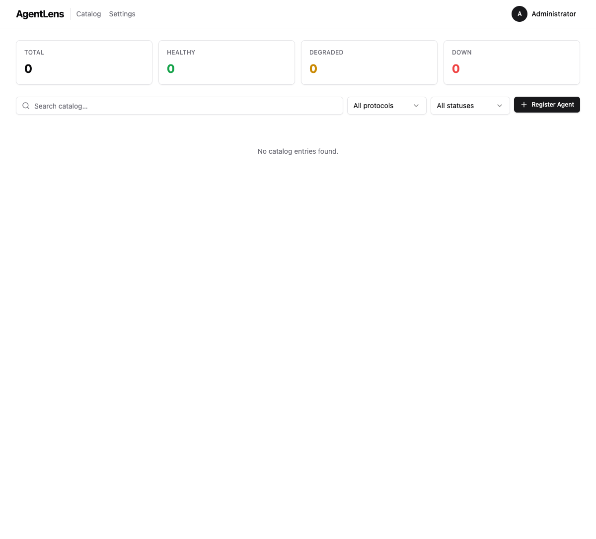

The modal has **three tabs** at the top:

| Tab | Description |
|-----|-------------|
| **Paste JSON** | Type or paste an A2A/MCP card directly |
| **Upload File** | Drag-and-drop or browse for a `.json` file |
| **Import from URL** | Provide a URL — the server fetches and imports the card automatically |

---

### Importing from a URL

The **Import from URL** tab is the fastest way to register an agent whose card is already publicly accessible (e.g., at `/.well-known/agent.json`).

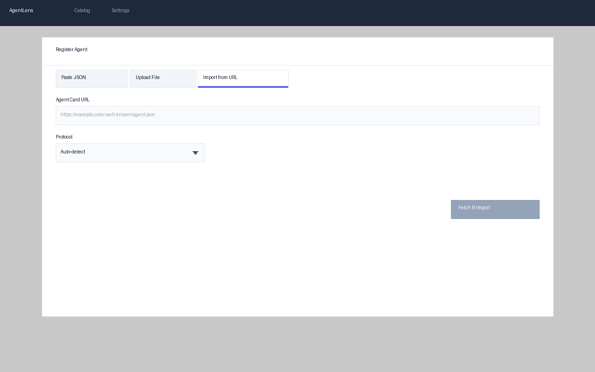

**Step 1 — Open the Import from URL tab.** Click the **+ Register Agent** button, then select the **Import from URL** tab.

**Step 2 — Enter the URL.** Paste the full URL of the agent card into the **Agent Card URL** field. For A2A agents the card is typically served at:
```
https://your-agent.example.com/.well-known/agent.json
```
For MCP servers, the card is typically at:
```
https://your-server.example.com/.well-known/mcp/server.json
```

**Step 3 — (Optional) Select a protocol.** The **Protocol** dropdown defaults to **Auto-detect**. AgentLens will determine the protocol from the URL path and the card content:

| Signal | Detected protocol |
|--------|-------------------|
| URL contains `/.well-known/agent` | A2A |
| URL contains `/mcp` | MCP |
| Card JSON contains a `"skills"` array | A2A |
| Card JSON contains a `"tools"` array | MCP |

If detection fails, select the correct protocol manually from the dropdown: **A2A** or **MCP**.

**Step 4 — Click "Fetch & Import".** The button shows **Importing...** while the server fetches and parses the card. The URL field and protocol selector are disabled during this time.

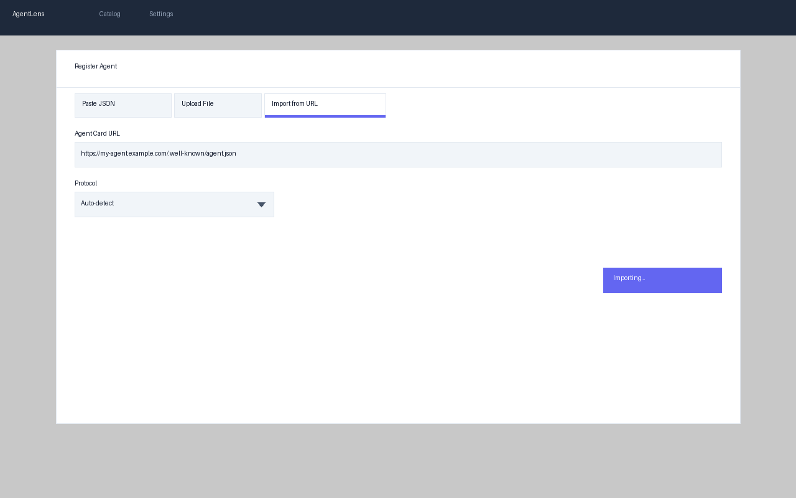

**Step 5 — Result:**

- **Success** — the modal closes automatically and the new agent appears in the catalog table.
- **Error** — an inline error message appears below the URL field. Common errors:

| Error message | Cause |
|---------------|-------|
| *Could not reach the URL. Check that it is accessible.* | The URL is unreachable, timed out, or returned a non-2xx HTTP status. |
| *The URL did not return a valid agent card.* | The URL returned non-JSON, or the JSON does not meet the card schema requirements. |
| *An agent with this endpoint already exists.* | An entry with the same declared endpoint is already in the catalog. |
| *url resolves to a private or reserved address* | Private/internal network addresses are blocked for security reasons. |

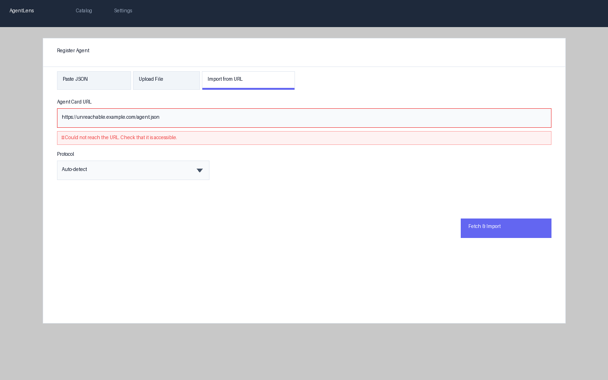

**Security note:** The import feature only allows `http://` and `https://` URLs. Requests to private IP ranges (`10.x`, `192.168.x`, `172.16–31.x`), loopback (`127.x`, `localhost`), and link-local addresses (`169.254.x`) are rejected to prevent server-side request forgery (SSRF). Response bodies larger than 1 MB are also rejected.

---

### Pasting or Uploading a JSON Card

Before registering an A2A agent card by pasting JSON, validate it to ensure the format is correct.

#### Validating A2A Agent Cards

Use the validation endpoint to check your A2A agent card before registering it:

```bash
curl -X POST http://localhost:8080/api/v1/catalog/validate \
  -H "Content-Type: application/json" \
  -d @agent-card.json
```

**Important:** The validation endpoint requires authentication with `catalog:write` permission and returns detailed error messages to help you fix any issues.

The response includes:
- **valid** — boolean indicating whether the card passed validation
- **spec_version** — detected A2A version (0.3 or 1.0)
- **errors** — array of validation errors (if any)
- **warnings** — array of non-critical warnings
- **preview** — summary of agent details (if valid)

Example error response:

```json
{
  "valid": false,
  "spec_version": "",
  "errors": [
    {
      "field": "url",
      "message": "url or supportedInterfaces is required"
    }
  ],
  "warnings": [],
  "preview": null
}
```

Common validation errors:
- **Missing `name` field** — Required: agent display name
- **Missing `url` or `supportedInterfaces`** — Required: at least one endpoint URL
- **Invalid JSON syntax** — Check for trailing commas, missing quotes
- **Invalid `version` format** — Must follow semantic versioning (e.g., 1.0.0)

**Web UI Registration Flow:**

The web dashboard provides a 4-step registration modal for A2A agent cards:

**Step 1 — Open the dialog.** Click the **+ Register Agent** button in the catalog toolbar.

**Step 2 — Paste or upload your card.** Select the **Paste JSON** or **Upload File** tab. Type or paste the card directly, or drag-and-drop a `.json` file. Click **Validate** when ready.

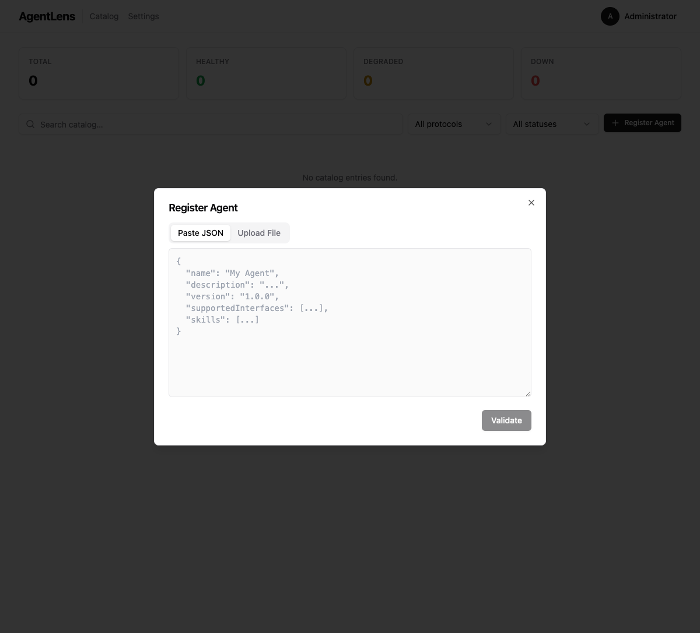

**Step 3a — Fix validation errors (if any).** If the card has missing or invalid fields, the dialog shows each error with the field name and message in red. Click **Back to Edit** to correct the card and re-validate.

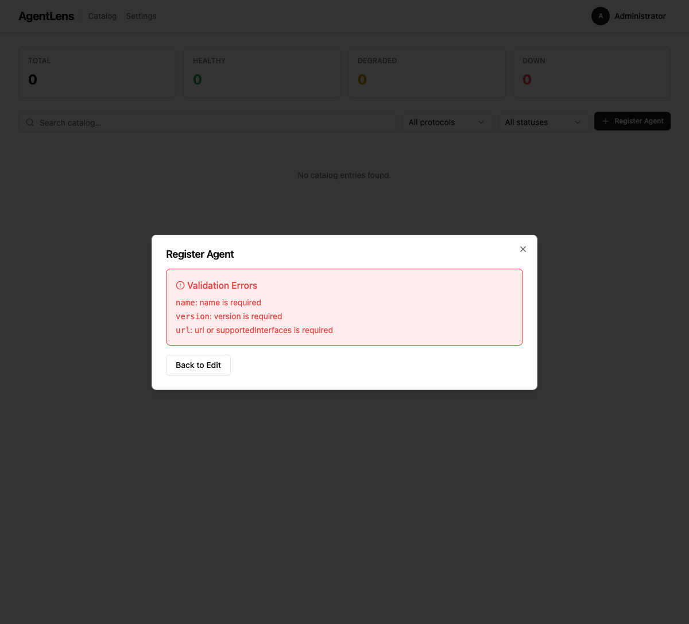

**Step 3b — Review the preview.** If validation passes, the dialog shows a green "Card validated successfully" banner followed by a preview of the agent: name, description, protocol badge (A2A), detected spec version (v0.3 or v1.0), skill count, and security schemes.

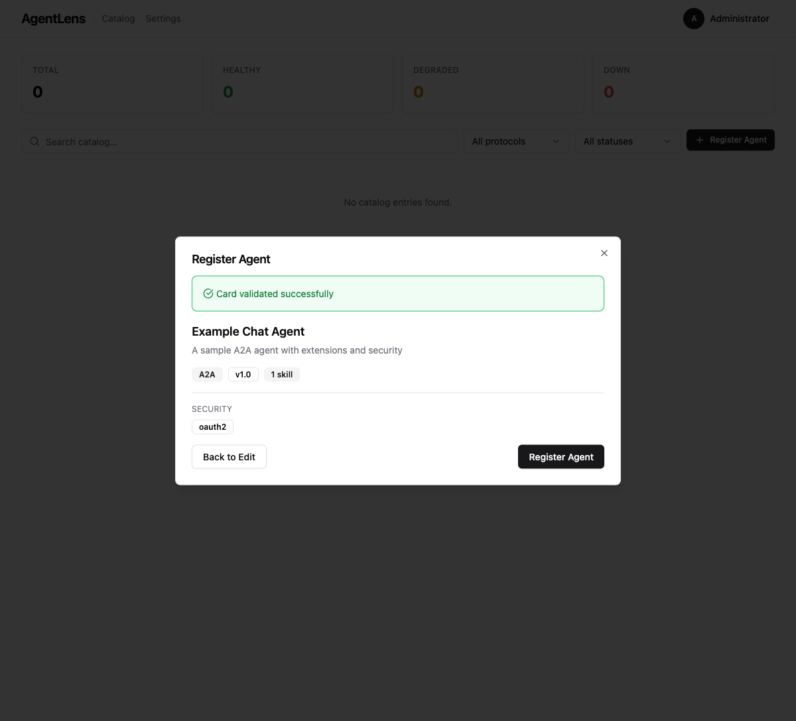

**Step 4 — Register.** Click **Register Agent** to persist the entry. The modal closes and the new agent appears immediately in the catalog table.

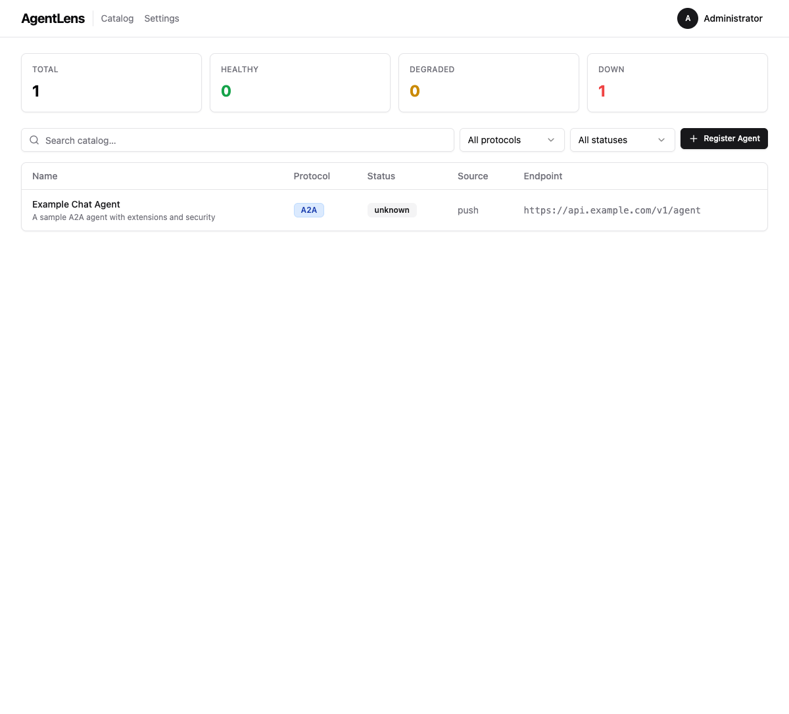

Click the agent name to open the detail view, which includes the full agent information, skills, spec version badge, and the raw card JSON.

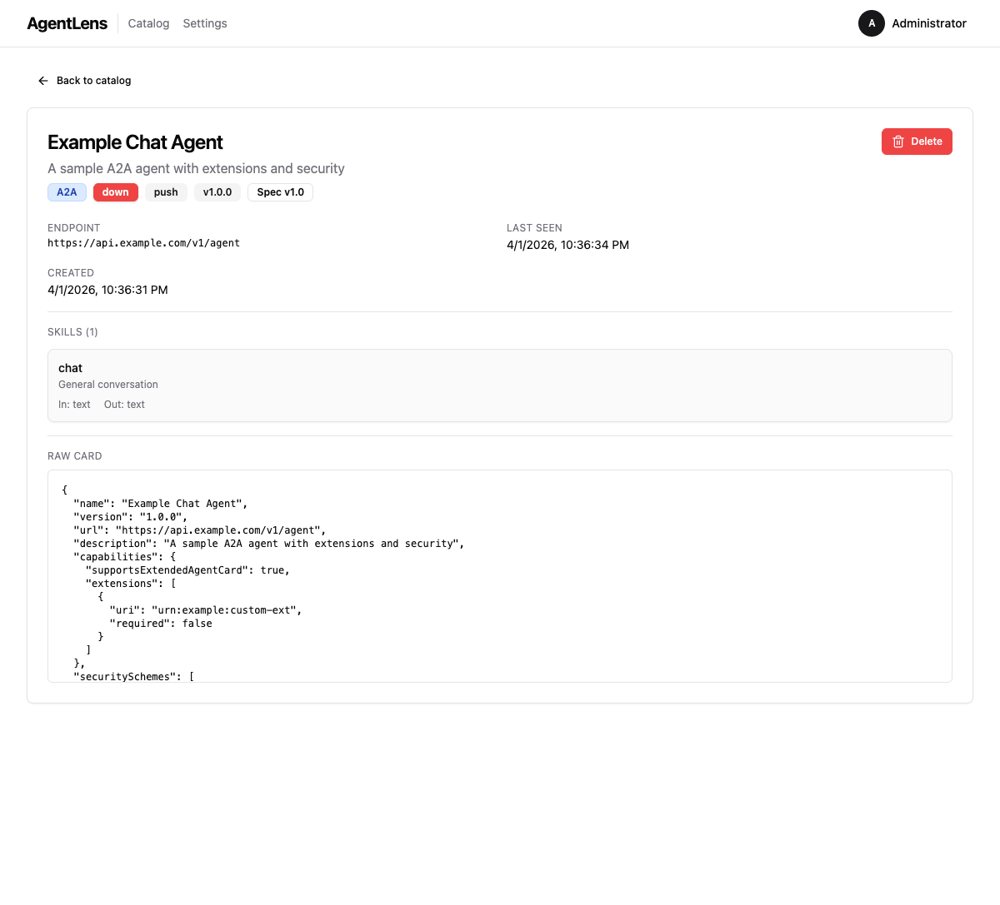

After successful validation, clicking **Register Agent** in the modal sends the card to `POST /api/v1/catalog/register`, which parses the raw agent card via the A2A parser (converting it into a CatalogEntry following the Product Archetype pattern) and stores it in the catalog.

### 1. Push Registration (API)

Send a POST request to the catalog endpoint:

```bash
curl -X POST http://localhost:8080/api/v1/catalog \
  -H "Content-Type: application/json" \
  -d '{
    "display_name": "My Agent",
    "description": "Does amazing things",
    "protocol": "a2a",
    "endpoint": "http://my-agent.internal:8080",
    "version": "1.0.0",
    "provider": {
      "organization": "My Org",
      "team": "engineering"
    },
    "categories": ["nlp"],
    "skills": [
      {
        "name": "chat",
        "description": "Chat with the agent",
        "input_modes": ["text"],
        "output_modes": ["text"]
      }
    ]
  }'
```

**Required fields:** `display_name`, `endpoint`, `protocol` (must be `a2a`, `mcp`, or `a2ui`).

The API returns `201 Created` with the full entry including the generated `id`.

If an entry with the same endpoint already exists, the API returns `409 Conflict`.

### 2. Static Configuration

Add entries to your `agentlens.yaml` config file:

```yaml
sources:
  - name: my-agent
    type: a2a
    url: http://my-agent.internal:8080
  - name: my-mcp-server
    type: mcp
    url: http://mcp-server.internal:9000
```

AgentLens automatically fetches the agent card from the well-known path and adds it to the catalog.

### 3. Kubernetes Annotations

Annotate your Kubernetes Services:

```yaml
apiVersion: v1
kind: Service
metadata:
  name: my-agent
  annotations:
    agentlens.io/type: "a2a"
    agentlens.io/team: "platform"
    agentlens.io/tags: "nlp,support"
spec:
  selector:
    app: my-agent
  ports:
    - port: 8080
```

AgentLens discovers annotated Services automatically when Kubernetes discovery is enabled.

---

## Understanding Status Indicators

AgentLens periodically checks the health of all catalog entries by sending HTTP GET requests to their endpoints.

| Status | Badge Color | Meaning |
|--------|-------------|---------|
| **healthy** | 🟢 Green | Agent responded with HTTP 2xx |
| **degraded** | 🟡 Yellow | Agent responded with HTTP 5xx |
| **down** | 🔴 Red | Agent is unreachable or timed out |
| **unknown** | ⚪ Gray | Agent has not been checked yet |

Health checks run at a configurable interval (default: 30 seconds) with configurable timeout and concurrency.

---

## Protocol Types

AgentLens supports three agent communication protocols:

### A2A (Agent-to-Agent)

The Agent-to-Agent protocol enables direct communication between AI agents. A2A agents expose their capabilities via an **Agent Card** at `/.well-known/agent-card.json`.

Agent Cards include:
- Agent name, description, and version
- Service URL
- Skills with input/output mode definitions
- Provider information

### MCP (Model Context Protocol)

The Model Context Protocol provides a standardized way for language models to access external tools and data sources. MCP servers expose their capabilities via a **Server Card** at `/.well-known/mcp/server.json`.

Server Cards include:
- Server name, description, and version
- Remote connection URLs
- Available tools with parameter definitions
- Provider information

### A2UI (Agent-to-UI)

The Agent-to-UI protocol defines how agents present interactive interfaces to users. A2UI support is planned for future releases.

---

## Settings

The **Settings** page is accessible from the top navigation bar (or from the user dropdown → **Settings**). It requires the `settings:read` permission.


The Settings page has four tabs:

| Tab | Description |
|-----|-------------|
| **General** | Appearance (theme) and display preferences |
| **Users** | User account management — requires `users:read` |
| **Roles** | Role and permission management — requires `roles:read` |
| **My Account** | Edit your own profile and change your password |

### General Tab

The **General** tab has two sections:

**Appearance** — choose between Light, Dark, and System themes. The selected theme is saved to your settings and applied immediately.

**Display** — configure:
- *Items per page* — how many catalog entries to show per page
- *Poll interval* — how often (in seconds) the UI refreshes data
- *Health check interval* — background health check frequency

Click **Save settings** to persist changes.

---

## User Management

The **Users** tab (requires `users:read`) shows all user accounts:

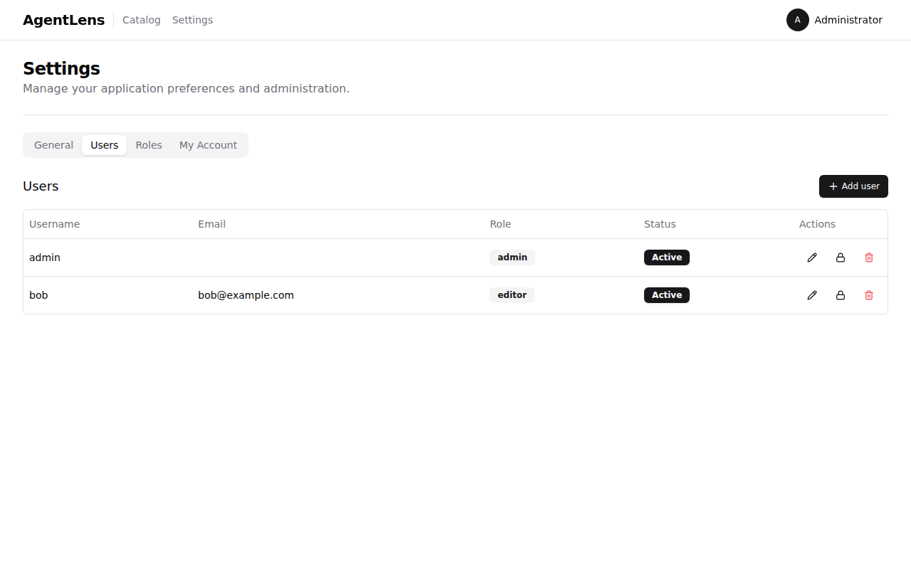

| Column | Description |
|--------|-------------|
| **Username** | The user's login name |
| **Email** | Contact email (optional) |
| **Role** | The assigned role badge |
| **Status** | Active or Locked |
| **Actions** | Edit, Lock/Unlock, Delete buttons |

### Actions (require `users:write` / `users:delete`)

- **Edit** (pencil icon) — opens a dialog to update display name, email, and role
- **Lock / Unlock** (padlock icon) — toggles account lock state, preventing or restoring login
- **Delete** (trash icon) — permanently removes the user (cannot delete your own account or the last admin)

### Adding a New User

Click **Add user** to open the creation dialog. Fill in:
- **Username** (required) — must be unique
- **Display name** — shown in the UI
- **Email** — optional
- **Password** — must meet strength requirements (10+ characters, uppercase, lowercase, digit, special character)
- **Role** — select from available roles

---

## Role Management

The **Roles** tab (requires `roles:read`) lists all roles and their permissions:

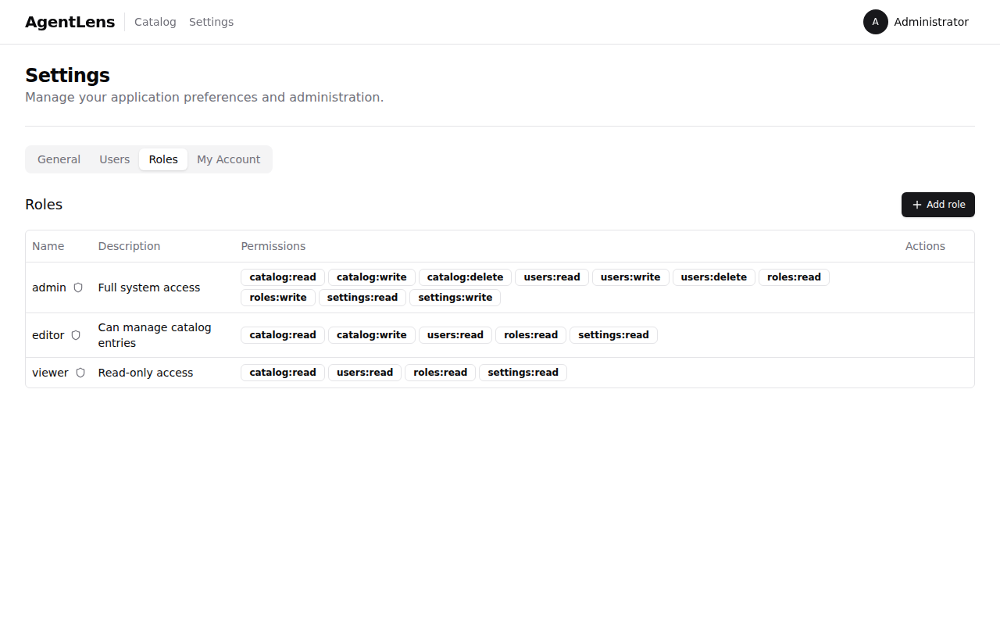

Three **system roles** are created by default and cannot be deleted:

| Role | Permissions |
|------|-------------|
| **admin** | Full access: catalog, users, roles, settings (read/write/delete) |
| **editor** | catalog:read/write, users:read, roles:read, settings:read |
| **viewer** | catalog:read, users:read, roles:read, settings:read |

System roles are marked with a shield icon and cannot be modified or deleted.

### Custom Roles (requires `roles:write`)

Click **Add role** to create a custom role. Select a name, description, and any combination of the available permissions:

- `catalog:read` / `catalog:write` / `catalog:delete`
- `users:read` / `users:write` / `users:delete`
- `roles:read` / `roles:write`
- `settings:read` / `settings:write`

---

## My Account

The **My Account** tab allows you to manage your own profile and credentials:


### Profile

Update your **Display name** and **Email**. Your **Username** is read-only and cannot be changed after creation. Click **Update profile** to save.

### Change Password

Enter your **Current password**, then your **New password** (twice to confirm). Password requirements:
- At least 10 characters
- At least one uppercase letter
- At least one lowercase letter
- At least one digit
- At least one special character (`!@#$%^&*()`)

Click **Change password** to apply. You will remain logged in with the new password.

---

AgentLens exposes a REST API for programmatic access. All responses use JSON. Most endpoints require a JWT token obtained from the login endpoint.

### Authenticating

```bash
# Login and get a token
TOKEN=$(curl -s -X POST http://localhost:8080/api/v1/auth/login \
  -H "Content-Type: application/json" \
  -d '{"username": "admin", "password": "your-password"}' \
  | python3 -c "import sys,json; print(json.load(sys.stdin)['token'])")

# Use the token in subsequent requests
curl http://localhost:8080/api/v1/catalog \
  -H "Authorization: Bearer $TOKEN"
```

### Quick Reference

| Method | Endpoint | Permission | Description |
|--------|----------|------------|-------------|
| `GET` | `/healthz` | None | Server health check |
| `POST` | `/api/v1/auth/login` | None | Get JWT token |
| `POST` | `/api/v1/auth/logout` | None | Invalidate session cookie |
| `GET` | `/api/v1/auth/me` | Any | Current user info |
| `PUT` | `/api/v1/auth/password` | Any | Change password |
| `GET` | `/api/v1/catalog` | `catalog:read` | List all entries (supports filters) |
| `POST` | `/api/v1/catalog` | `catalog:write` | Register a new entry |
| `POST` | `/api/v1/catalog/register` | `catalog:write` | Register from raw A2A agent card |
| `POST` | `/api/v1/catalog/import` | `catalog:write` | Import agent card from a URL |
| `GET` | `/api/v1/catalog/{id}` | `catalog:read` | Get entry by ID |
| `DELETE` | `/api/v1/catalog/{id}` | `catalog:delete` | Delete an entry |
| `GET` | `/api/v1/catalog/{id}/card` | `catalog:read` | Get raw protocol card |
| `GET` | `/api/v1/skills?q=...` | `catalog:read` | Search by skill name |
| `GET` | `/api/v1/stats` | `catalog:read` | Aggregate statistics |
| `GET` | `/api/v1/users` | `users:read` | List users |
| `POST` | `/api/v1/users` | `users:write` | Create user |
| `GET` | `/api/v1/roles` | `roles:read` | List roles |
| `GET` | `/api/v1/settings` | `settings:read` | Get all settings |
| `PUT` | `/api/v1/settings` | `settings:write` | Update settings |

### Filtering the Catalog

```bash
# Filter by protocol
curl "http://localhost:8080/api/v1/catalog?protocol=a2a" \
  -H "Authorization: Bearer $TOKEN"

# Filter by status
curl "http://localhost:8080/api/v1/catalog?status=healthy" \
  -H "Authorization: Bearer $TOKEN"

# Search by text
curl "http://localhost:8080/api/v1/catalog?q=support" \
  -H "Authorization: Bearer $TOKEN"

# Combine filters
curl "http://localhost:8080/api/v1/catalog?protocol=mcp&status=healthy&q=code" \
  -H "Authorization: Bearer $TOKEN"

# Paginate results
curl "http://localhost:8080/api/v1/catalog?limit=10&offset=20" \
  -H "Authorization: Bearer $TOKEN"
```

### Getting Statistics

```bash
curl http://localhost:8080/api/v1/stats \
  -H "Authorization: Bearer $TOKEN"
```

Returns:
```json
{
  "total": 4,
  "by_status": {
    "healthy": 2,
    "down": 2
  },
  "by_source": {
    "push": 3,
    "k8s": 1
  }
}
```

For the complete API reference, see [api.md](api.md).

---

## FAQ

### How often does AgentLens check agent health?

By default, every 30 seconds. Configure this via `health_check.interval` in the config file or `AGENTLENS_HEALTH_CHECK_INTERVAL` environment variable.

### Can I remove an agent from the catalog?

Yes — use `DELETE /api/v1/catalog/{id}` (requires `catalog:delete` permission) or wait for the next discovery cycle, which will mark missing agents as "down".

### Does AgentLens require authentication?

Yes. All catalog and management endpoints require a valid JWT token. Obtain one via `POST /api/v1/auth/login`. See [docs/auth.md](auth.md) for full details.

### What happens if I register the same endpoint twice?

The API returns `409 Conflict`. Endpoints are unique identifiers in the catalog. Discovery sources automatically update existing entries rather than creating duplicates.

### Can AgentLens discover agents outside Kubernetes?

Yes — use the static configuration (`sources:` in `agentlens.yaml`) or push registration (`POST /api/v1/catalog`) for agents running anywhere. You can also use the **Import from URL** feature in the dashboard to register a single agent card by URL.

### How do I enable Kubernetes discovery?

Set `kubernetes.enabled: true` in the config file or `AGENTLENS_KUBERNETES_ENABLED=true` as an environment variable. The Helm chart enables this by default.

### I forgot the admin password — how do I reset it?

Connect directly to the SQLite database and update the password hash, or delete the database file and restart AgentLens to regenerate the admin credentials. For PostgreSQL, update the `password_hash` column in the `users` table with a new bcrypt hash.

### How do I create additional users?

Administrators can create users via the **Settings → Users** page or via the API:

```bash
curl -X POST http://localhost:8080/api/v1/users \
  -H "Authorization: Bearer $TOKEN" \
  -H "Content-Type: application/json" \
  -d '{"username":"alice","password":"SecurePass1!","role_id":"role-editor"}'
```

### Why can't I import from a private/internal URL?

AgentLens blocks requests to private IP ranges (`10.x`, `192.168.x`, `172.16–31.x`), loopback (`127.x`, `localhost`), and link-local addresses (`169.254.x`) to prevent server-side request forgery (SSRF) attacks. If you need to register an agent running on a private network, use **Paste JSON** / **Upload File** or the `POST /api/v1/catalog/register` API instead.
