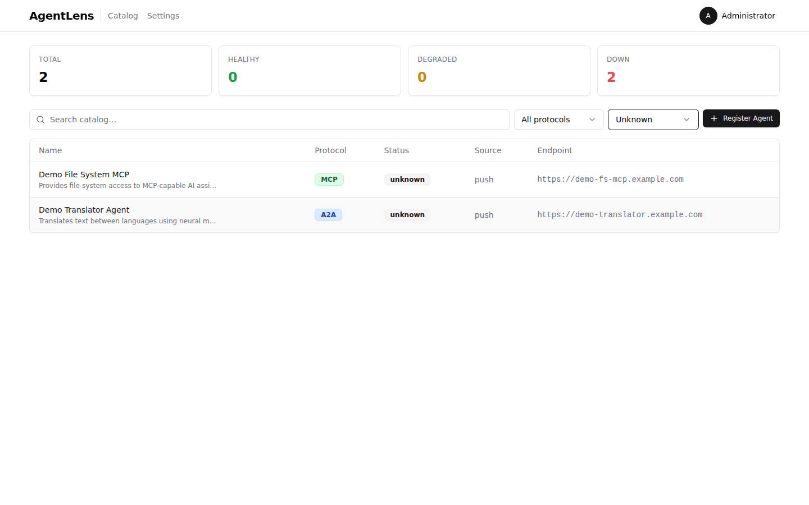
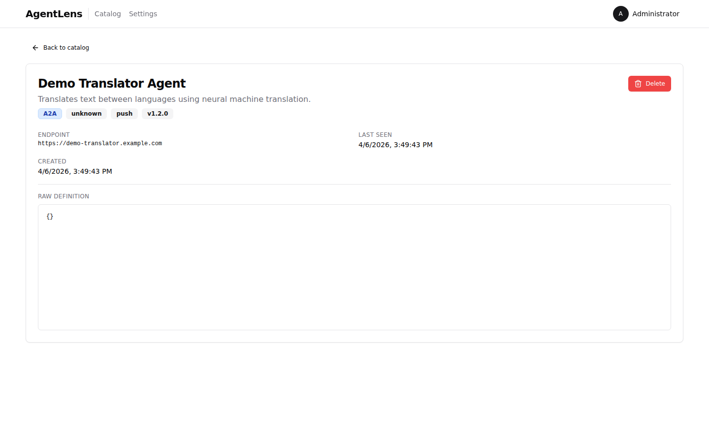
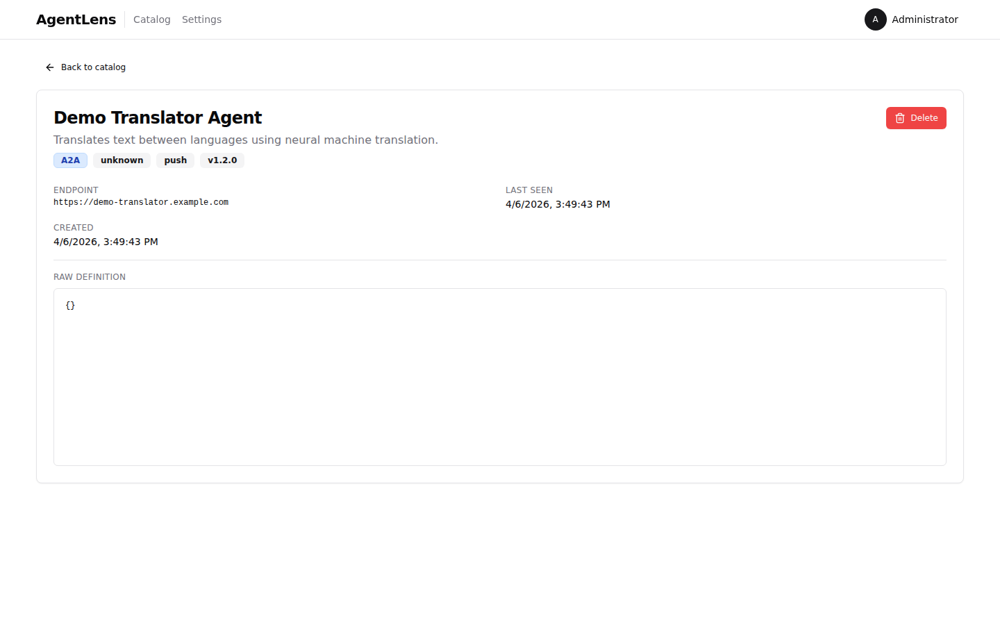

# AgentLens End-User Guide

AgentLens is a self-hosted service-discovery platform for AI agents. It discovers, tracks, and
presents a real-time catalog of **A2A**, **MCP**, and **A2UI** agents running across your
infrastructure — Kubernetes workloads, static configuration, push registrations, and remote
upstream sources.

This guide covers everyday use of the AgentLens web UI. For REST API reference see
[docs/api.md](api.md). For deployment and configuration see [docs/user-guide.md](user-guide.md).
For architectural details see [docs/architecture.md](architecture.md).

---

## Table of Contents

- [Signing In](#signing-in)
  - [First-Run Admin Bootstrap](#first-run-admin-bootstrap)
  - [Password Requirements](#password-requirements)
  - [Account Lockout](#account-lockout)
- [Navigation Bar](#navigation-bar)
- [Dashboard / Catalog Overview](#dashboard--catalog-overview)
  - [Stats Bar](#stats-bar)
  - [Catalog Table Columns](#catalog-table-columns)
- [Searching and Filtering](#searching-and-filtering)
- [Viewing Agent Details](#viewing-agent-details)
  - [Header Fields](#header-fields)
  - [Capabilities](#capabilities)
  - [Raw Definition](#raw-definition)
  - [Deleting an Entry](#deleting-an-entry)
- [Registering an Agent](#registering-an-agent)
  - [Paste JSON](#paste-json)
  - [Upload a JSON File](#upload-a-json-file)
  - [Import from URL](#import-from-url)
- [Status Indicators](#status-indicators)
- [Protocol Types](#protocol-types)
- [Settings](#settings)
  - [General](#general)
  - [Users](#users)
  - [Roles](#roles)
  - [My Account](#my-account)
- [User Management](#user-management)
- [Role Management](#role-management)
- [Using the REST API](#using-the-rest-api)
- [FAQ / Troubleshooting](#faq--troubleshooting)

---

## Signing In


*Login page — enter your username and password, then click **Sign in**.*

Navigate to the AgentLens URL in your browser (default: `http://localhost:8080`). You are
redirected automatically to `/login` when not authenticated.

Enter your **Username** and **Password**, then click **Sign in**. On success you land on the
catalog dashboard.


*The login form shows an error if credentials are wrong or the account is locked.*

### First-Run Admin Bootstrap

On the very first startup AgentLens generates a random admin account and prints the credentials to
the server's standard output:

```
============================================
  INITIAL ADMIN CREDENTIALS
  Username: admin
  Password: <generated>
  CHANGE THIS PASSWORD IMMEDIATELY
============================================
```

Use these credentials to sign in for the first time. Change the password immediately via
**Settings → My Account → Change password** (see [My Account](#my-account)).

If the server is running as a container or behind a process manager, check the container/service
logs to retrieve the bootstrap password.

### Password Requirements

All passwords — including the one you set after first login — must satisfy:

| Requirement | Rule |
|-------------|------|
| Minimum length | 10 characters |
| Uppercase | At least one uppercase letter (A–Z) |
| Lowercase | At least one lowercase letter (a–z) |
| Digit | At least one digit (0–9) |
| Special character | At least one punctuation or symbol character |

Example of a valid password: `Catalog$2025`.

### Account Lockout

After **5 consecutive failed login attempts** an account is automatically locked for **15 minutes**.
During this window every login attempt returns an error regardless of the password. An administrator
can unlock the account early via **Settings → Users** (see [Users](#users)).

---

## Navigation Bar


*Top navigation bar with the user dropdown open.*

After signing in the top navigation bar is always visible:

| Element | Description |
|---------|-------------|
| **AgentLens** (logo) | Click to return to the catalog from anywhere |
| **Catalog** | Direct link to the agent catalog |
| **Settings** | Link to the settings page; only visible to users with `settings:read` |
| **User avatar** | Initials badge — click to open the user dropdown |

The user dropdown contains:

- **My Account** — jump to the My Account settings tab
- **Settings** — jump to the Settings page (if you have `settings:read`)
- **Logout** — invalidate the session and return to the login page

On narrow screens the nav links collapse behind a hamburger menu.

---

## Dashboard / Catalog Overview


*The catalog dashboard showing the stats bar, filter controls, and the agent table.*

The catalog is the default view at `/`. It shows every registered agent entry visible to your
account.

### Stats Bar

Four summary cards appear at the top:

| Card | Description |
|------|-------------|
| **Total** | Total number of catalog entries |
| **Healthy** | Entries whose last health check succeeded |
| **Degraded** | Entries returning partial or error responses |
| **Down** | Entries that are unreachable |

Counts update automatically as health checks run in the background.

### Catalog Table Columns

| Column | Description |
|--------|-------------|
| **Name** | Display name (clickable link to the detail page); optional description underneath |
| **Protocol** | Protocol badge: `A2A`, `MCP`, or `A2UI` |
| **Status** | Health status badge: `Healthy`, `Degraded`, `Down`, or `Unknown` |
| **Source** | Discovery source: `k8s`, `config`, `push`, or `upstream` (hidden on small screens) |
| **Endpoint** | Base URL of the agent (hidden on medium and smaller screens) |

Rows are ordered by the API default (registration time, most recent first).

**Empty state:** when no entries match the current filters a "No catalog entries found." message is
displayed.

---

## Searching and Filtering


*Free-text search narrows the catalog to matching entries.*

Three controls sit above the catalog table:

1. **Search box** — type any keyword to filter entries by display name or description. Results
   update as you type.

2. **Protocol filter** — dropdown with: *All protocols*, `A2A`, `MCP`, `A2UI`.

3. **Status filter** — dropdown with: *All statuses*, `Healthy`, `Degraded`, `Down`, `Unknown`.


*Protocol filter set to A2A — only A2A entries are shown.*


*Status filter applied — only entries with the selected health status are shown.*

Filters are combined (AND logic). Selecting `A2A` and `Healthy` shows only A2A entries that are
currently healthy.

---

## Viewing Agent Details

Click any agent name in the catalog table to open its detail page at `/catalog/:id`.


*Agent detail page — header badges, metadata fields, and capabilities.*

### Header Fields

| Badge / Field | Description |
|---------------|-------------|
| Protocol badge | Protocol of the agent (`A2A`, `MCP`, `A2UI`) |
| Status badge | Current health status |
| Source badge | Discovery source |
| Version badge | Agent version declared in its card |
| Spec version badge | Agent Card spec version (e.g. `1.0`) |
| **Endpoint** | Full URL of the agent |
| **Namespace** | Kubernetes namespace (shown when source is `k8s`) |
| **Team** / **Organization** | Provider fields from the agent card |
| **Last Seen** | Timestamp of the most recent health check |
| **Created** | Timestamp when the entry was first registered |

Below the header, **categories** are shown as outline badges when present.

### Capabilities


*Capabilities section — each capability shows its name, kind badge, and description.*

Each capability has a `kind` tag:

| Kind | Protocol | Description |
|------|----------|-------------|
| `a2a.skill` | A2A | A discrete task the agent can perform |
| `a2a.interface` | A2A | Supported interface (e.g. `push`, `request`) |
| `a2a.security_scheme` | A2A | Authentication scheme advertised by the card |
| `a2a.extension` | A2A | Custom extension declared in the card |
| `a2a.signature` | A2A | Cryptographic signature entry |
| `mcp.tool` | MCP | A callable tool exposed by the MCP server |
| `mcp.resource` | MCP | A resource URI provided by the MCP server |
| `mcp.prompt` | MCP | A prompt template offered by the MCP server |


*MCP server detail — tools, resources, and prompts appear as capabilities.*

### Raw Definition


*Raw Definition section — the original agent card JSON as received during registration.*

At the bottom of the detail page the **Raw Definition** section shows the full JSON document as
stored in the catalog. Use the scroll area to navigate large cards.

### Deleting an Entry

Click the red **Delete** button in the top-right of the detail card to remove the entry. A browser
confirm dialog asks for confirmation. After deletion you are returned to the catalog.

> **Note:** Deletion requires `catalog:delete` permission.

---

## Registering an Agent


*The **Register Agent** button — located in the top-right of the filter bar.*

Click **Register Agent** to open the registration dialog. Three methods are available as tabs.

### Paste JSON


*Paste JSON tab — type or paste an A2A or MCP agent card JSON document.*

1. Select the **Paste JSON** tab (default).
2. Paste a valid A2A or MCP agent card JSON into the text area.
3. Click **Validate** — the server parses the card and returns errors or warnings.


*Validation errors are listed with the failing field and message.*

4. If validation passes, the dialog advances to the **Preview** step.


*Preview step — review the parsed card before saving.*

5. Review the preview and click **Register Agent** to save. The dialog closes and the catalog
   refreshes with the new entry.


*After registration the dialog closes and the catalog table shows the new entry.*

### Upload a JSON File

1. Select the **Upload File** tab.
2. Click **Browse** or drag a `.json` file onto the drop zone.
3. The file contents are loaded into the validator — the flow then continues exactly as in
   [Paste JSON](#paste-json) above (Validate → Preview → Register).

### Import from URL


*Import from URL tab — enter a publicly reachable agent card URL.*

1. Select the **Import from URL** tab.
2. Enter the full URL of the agent card (e.g. `https://example.com/.well-known/agent.json`).
3. Optionally choose the **Protocol**: `Auto-detect` (default), `A2A`, or `MCP`.
4. Click **Fetch & Import**.


*Import from URL — URL entered, ready to fetch.*

AgentLens fetches the document server-side, parses it, and registers it directly. You land back on
the catalog showing the new entry.


*Private/loopback URLs are rejected by the SSRF guard — the error message is shown inline.*

> **SSRF protection:** URLs that resolve to private RFC-1918 ranges (`10.x`, `172.16.x`,
> `192.168.x`), loopback (`127.0.0.0/8`, `::1`), or link-local addresses are rejected by the
> server before any outbound connection is made. `localhost` is similarly blocked. This is a
> security measure and cannot be bypassed from the UI.


*After a successful registration the catalog refreshes to show the new entry.*

---

## Status Indicators

Each catalog entry carries a **status** that reflects its last health check result:

| Status | Badge colour | Meaning |
|--------|-------------|---------|
| `healthy` | Green | The agent responded successfully to the last health probe |
| `degraded` | Yellow/amber | The agent responded but returned an error or partial data |
| `down` | Red | The agent did not respond (connection refused, timeout, etc.) |
| `unknown` | Grey | No health check has run yet, or health checking is disabled |

Health checks run on a configurable interval (`health.check_interval`, default 60 s). Newly
registered agents start with status `unknown` until the first check completes.

---

## Protocol Types

AgentLens recognises three agent protocols:

| Protocol | Value | Description |
|----------|-------|-------------|
| **A2A** | `a2a` | Agent-to-Agent protocol. Agents expose a card at `/.well-known/agent.json` describing their skills and supported interfaces. |
| **MCP** | `mcp` | Model Context Protocol. Servers expose tools, resources, and prompt templates to AI assistants. |
| **A2UI** | `a2ui` | Agent-to-UI protocol variant for browser-facing agents. |

The protocol is auto-detected when importing from a URL (unless you override it in the Protocol
dropdown).

---

## Settings

Navigate to **Settings** via the top navigation bar or the user dropdown. The settings page is
organised into tabs.

> **Permission required:** `settings:read` to view the Settings page.

### General


*General settings — appearance and display options.*

The **General** tab has two sections:

**Appearance**

| Setting | Description |
|---------|-------------|
| Theme | `Light`, `Dark`, or `System` (follows OS preference) |

**Display**

| Setting | Key | Default |
|---------|-----|---------|
| Items per page | `ui.items_per_page` | 25 |
| Poll interval (seconds) | `ui.poll_interval` | 30 |
| Health check interval (seconds) | `health.check_interval` | 60 |

Click **Save settings** to persist changes. A brief "Settings saved." confirmation appears.

> **Permission required:** `settings:write` to save changes.

### Users


*Users tab — list of all user accounts with role and status columns.*

Manage user accounts. See [User Management](#user-management) for full details.

### Roles


*Roles tab — system-defined and custom roles with their permission sets.*

Manage roles and their permissions. See [Role Management](#role-management) for full details.

### My Account


*My Account tab — change your display name, email, and password.*

The **My Account** tab lets you update your own profile:

- **Display name** and **Email** — informational fields shown in the UI.
- **Change password** — enter your current password, then a new password that meets the
  [password requirements](#password-requirements). Click **Save**.

> You do not need any special permission to update your own account.

---

## User Management

> **Permissions required:** `users:read` to view users; `users:write` to create/edit/lock;
> `users:delete` to delete.

Navigate to **Settings → Users**.


*Add user dialog — fill in username, optional email and display name, password, and role.*

### Creating a User

1. Click **Add user**.
2. Fill in:
   - **Username** (required, unique)
   - **Email** (optional)
   - **Display name** (optional)
   - **Password** (required for new users; must meet [password requirements](#password-requirements))
   - **Role** (select from the dropdown)
3. Click **Save**.

### Editing a User

Click the **pencil** icon on a user row to open the edit dialog. You can update the username,
email, display name, and role. Leave the password field blank to keep the current password.

### Locking and Unlocking

Click the **lock** icon to toggle a user's active state:

- A locked (inactive) user cannot log in regardless of their password.
- An administrator can unlock a user locked by the automatic lockout policy this way.


*A locked user shown with the "Locked" badge; the unlock icon is visible in the Actions column.*

### Deleting a User

Click the **trash** icon to delete a user. A browser confirm dialog is shown. The last active admin
user cannot be deleted (the API returns an error).

---

## Role Management

> **Permissions required:** `roles:read` to view roles; `roles:write` to create/edit custom roles.

Navigate to **Settings → Roles**.

Roles bundle a set of permissions that are assigned to users. Every role is either a **system role**
or a **custom role**.

**System roles** (`IsSystem = true`) are seeded by AgentLens and cannot be edited or deleted:

| Role | Typical permissions |
|------|---------------------|
| `admin` | All permissions |
| `editor` | `catalog:read`, `catalog:write`, `catalog:delete`, `users:read`, `roles:read`, `settings:read` |
| `viewer` | `catalog:read` |

**Custom roles** can be created, edited, and deleted freely.

### Creating a Role

1. Click **Add role**.
2. Enter a **Name** and optional **Description**.
3. Check the permissions this role should grant.
4. Click **Save**.

Available permissions:

| Permission | What it grants |
|------------|----------------|
| `catalog:read` | View catalog entries and stats |
| `catalog:write` | Register new entries, import from URL |
| `catalog:delete` | Delete catalog entries |
| `users:read` | View user list |
| `users:write` | Create and edit users |
| `users:delete` | Delete users |
| `roles:read` | View roles |
| `roles:write` | Create, edit, and delete custom roles |
| `settings:read` | View Settings page and read settings |
| `settings:write` | Update settings |

### Editing a Role

Click the **pencil** icon on a custom role row. System roles show the icon as disabled.


*Role edit dialog — toggle individual permissions for the selected role.*

### Deleting a Role

Click the **trash** icon on a custom role row. System roles cannot be deleted.

---

## Using the REST API

AgentLens exposes a REST API at `/api/v1/`. Full reference: [docs/api.md](api.md).

### Authentication

Obtain a token:

```http
POST /api/v1/auth/login
Content-Type: application/json

{"username": "admin", "password": "YourPassword1!"}
```

Response:

```json
{"token": "<jwt>"}
```

Use the token in subsequent requests:

```http
GET /api/v1/catalog
Authorization: Bearer <jwt>
```

### Quick Reference

| Method | Path | Permission | Description |
|--------|------|------------|-------------|
| `GET` | `/api/v1/catalog` | `catalog:read` | List entries (filter via query params) |
| `POST` | `/api/v1/catalog` | `catalog:write` | Create an entry |
| `GET` | `/api/v1/catalog/:id` | `catalog:read` | Get a single entry |
| `DELETE` | `/api/v1/catalog/:id` | `catalog:delete` | Delete an entry |
| `POST` | `/api/v1/catalog/validate` | `catalog:write` | Validate a card JSON |
| `POST` | `/api/v1/catalog/import` | `catalog:write` | Import from URL |
| `GET` | `/api/v1/stats` | `catalog:read` | Aggregate statistics |
| `GET` | `/api/v1/users` | `users:read` | List users |
| `POST` | `/api/v1/users` | `users:write` | Create user |
| `PUT` | `/api/v1/users/:id` | `users:write` | Update user |
| `DELETE` | `/api/v1/users/:id` | `users:delete` | Delete user |
| `GET` | `/api/v1/roles` | `roles:read` | List roles |
| `POST` | `/api/v1/roles` | `roles:write` | Create role |
| `PUT` | `/api/v1/roles/:id` | `roles:write` | Update role |
| `DELETE` | `/api/v1/roles/:id` | `roles:write` | Delete role |

See [docs/api.md](api.md) for the full request/response schemas.

---

## FAQ / Troubleshooting

### My account is locked — how do I regain access?

Ask an administrator to navigate to **Settings → Users**, find your account, and click the
**unlock** (padlock) icon.

If you are the only admin and your account is locked, see below.

### I forgot the admin password / I am locked out of the only admin account

If you still have server access:

1. Stop the AgentLens server.
2. Delete (or rename) the SQLite database file specified by `AGENTLENS_DB_SQLITE_PATH` (default
   `agentlens.db` in the data directory).
3. Restart the server. With no existing users the bootstrap procedure runs again and prints fresh
   admin credentials to stdout.

> **Warning:** deleting the database removes all catalog entries, users, and roles. Export any data
> you need first via the REST API.

### I imported from a URL and got "url points to a private or reserved address"

AgentLens's SSRF guard blocks outbound connections to private/loopback addresses. This is
intentional. The agent card must be hosted on a publicly reachable HTTPS URL. The following ranges
are blocked: `10.x`, `172.16–31.x`, `192.168.x`, `127.x`, `::1`, `169.254.x`, and the `localhost`
hostname.

### The catalog shows an agent as "Unknown" — why?

`Unknown` means no health check has been recorded yet. Possible reasons:

- The agent was just registered and the health checker has not run its first cycle.
- Health checking is disabled (`AGENTLENS_HEALTH_CHECK_ENABLED=false` or
  `health.check_interval` is very large).
- The agent's endpoint is unreachable so the checker recorded an error — but in that case the
  status would be `Down`, not `Unknown`.

### An agent shows "Down" — how do I investigate?

1. Check that the agent process is running at the registered endpoint.
2. Verify network connectivity between the AgentLens server and the agent endpoint.
3. The Raw Definition section of the detail page shows the card URL and protocol — confirm the
   agent is serving that path.

### How do I push an agent card without using the UI?

Use the REST API directly:

```bash
curl -s -X POST https://agentlens.example.com/api/v1/catalog/import \
  -H "Authorization: Bearer $TOKEN" \
  -H "Content-Type: application/json" \
  -d '{"url": "https://my-agent.example.com/.well-known/agent.json"}'
```

Or register a card directly:

```bash
curl -s -X POST https://agentlens.example.com/api/v1/catalog \
  -H "Authorization: Bearer $TOKEN" \
  -H "Content-Type: application/json" \
  -d '{"display_name":"My Agent","endpoint":"https://my-agent.example.com","protocol":"a2a","version":"1.0.0"}'
```

### Kubernetes-discovered agents have a `k8s` source — what controls that?

Agents running in Kubernetes are discovered when their `Pod` or `Service` carries the annotation
`agentlens.io/enabled: "true"`. See [docs/user-guide.md](user-guide.md) and
[docs/architecture.md](architecture.md) for the full annotation schema.
