# AgentLens End-User Guide

AgentLens is a self-hosted service-discovery platform for AI agents. It discovers, tracks, and
presents a real-time catalog of **A2A**, **MCP**, and **A2UI** agents running across your
infrastructure — Kubernetes workloads, static configuration, push registrations, and remote
upstream sources.

This guide covers everyday use of the AgentLens web UI. For REST API reference see
[docs/api.md](api.md). For deployment and configuration see [docs/user-guide.md](user-guide.md).
For architectural details see [docs/architecture.md](architecture.md).

---

## Table of Contents

- [AgentLens End-User Guide](#agentlens-end-user-guide)
  - [Table of Contents](#table-of-contents)
  - [Signing In](#signing-in)
    - [First-Run Admin Bootstrap](#first-run-admin-bootstrap)
    - [Password Requirements](#password-requirements)
    - [Account Lockout](#account-lockout)
  - [Navigation Bar](#navigation-bar)
  - [Dashboard / Catalog Overview](#dashboard--catalog-overview)
    - [Stats Bar](#stats-bar)
    - [Catalog Table Columns](#catalog-table-columns)
  - [Searching and Filtering](#searching-and-filtering)
  - [Viewing Agent Details](#viewing-agent-details)
    - [Header Fields](#header-fields)
    - [Capabilities](#capabilities)
    - [Raw Card Tab](#raw-card-tab)
    - [Deleting an Entry](#deleting-an-entry)
  - [Registering an Agent](#registering-an-agent)
    - [Paste JSON](#paste-json)
    - [Upload a JSON File](#upload-a-json-file)
    - [Import from URL](#import-from-url)
  - [Health Monitoring](#health-monitoring)
    - [Status badges](#status-badges)
    - [Filtering by status](#filtering-by-status)
    - [Health detail](#health-detail)
    - [Actions (editor and admin only)](#actions-editor-and-admin-only)
  - [Status Indicators](#status-indicators)
  - [Protocol Types](#protocol-types)
  - [Settings](#settings)
    - [General](#general)
    - [Users](#users)
    - [Roles](#roles)
    - [My Account](#my-account)
  - [User Management](#user-management)
    - [Creating a User](#creating-a-user)
    - [Editing a User](#editing-a-user)
    - [Locking and Unlocking](#locking-and-unlocking)
    - [Deleting a User](#deleting-a-user)
  - [Role Management](#role-management)
    - [Creating a Role](#creating-a-role)
    - [Editing a Role](#editing-a-role)
    - [Deleting a Role](#deleting-a-role)
  - [Groups and Projects](#groups-and-projects)
    - [Concepts](#concepts)
    - [Managing Groups](#managing-groups)
    - [Managing Projects](#managing-projects)
    - [Assigning Catalog Entries to a Project](#assigning-catalog-entries-to-a-project)
    - [Filtering the Catalog by Project](#filtering-the-catalog-by-project)
  - [Using the REST API](#using-the-rest-api)
    - [Authentication](#authentication)
    - [Quick Reference](#quick-reference)
  - [FAQ / Troubleshooting](#faq--troubleshooting)
    - [My account is locked — how do I regain access?](#my-account-is-locked--how-do-i-regain-access)
    - [I forgot the admin password / I am locked out of the only admin account](#i-forgot-the-admin-password--i-am-locked-out-of-the-only-admin-account)
    - [I imported from a URL and got "url points to a private or reserved address"](#i-imported-from-a-url-and-got-url-points-to-a-private-or-reserved-address)
    - [The catalog shows an agent as "Pending" — why?](#the-catalog-shows-an-agent-as-pending--why)
    - [An agent shows "Offline" — how do I investigate?](#an-agent-shows-offline--how-do-i-investigate)
    - [How do I push an agent card without using the UI?](#how-do-i-push-an-agent-card-without-using-the-ui)
    - [Kubernetes-discovered agents have a `k8s` source — what controls that?](#kubernetes-discovered-agents-have-a-k8s-source--what-controls-that)

---

## Signing In

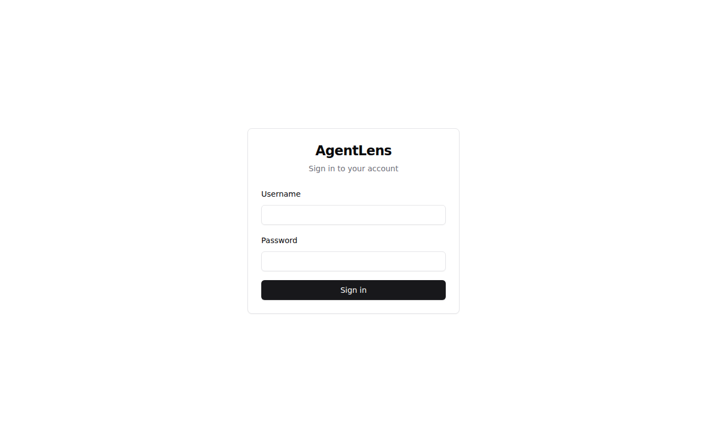
*Login page — enter your username and password, then click **Sign in**.*

Navigate to the AgentLens URL in your browser (default: `http://localhost:8080`). You are
redirected automatically to `/login` when not authenticated.

Enter your **Username** and **Password**, then click **Sign in**. On success you land on the
catalog dashboard.

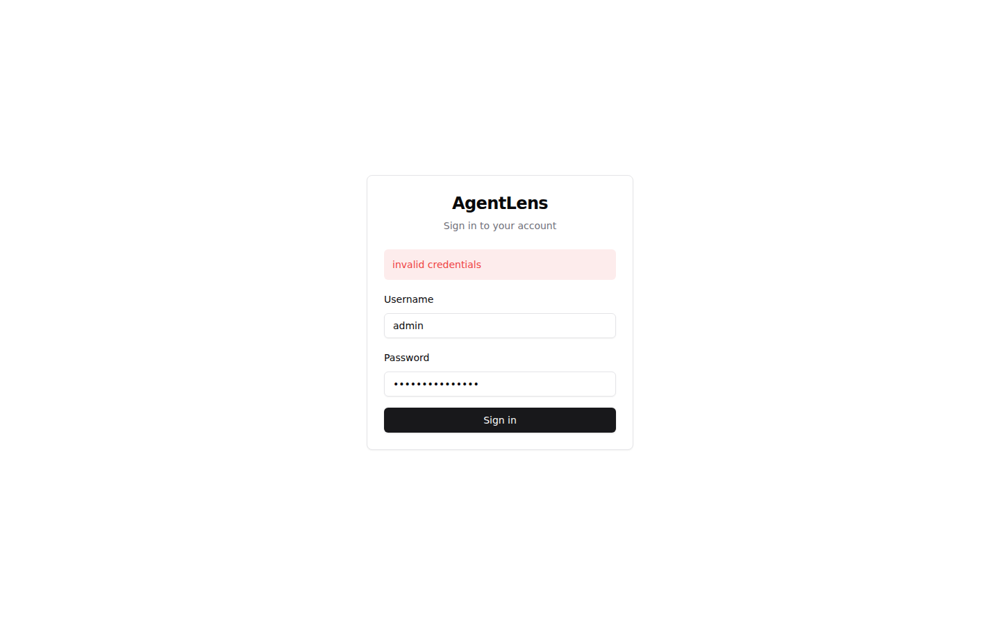
*The login form shows an error if credentials are wrong or the account is locked.*

### First-Run Admin Bootstrap

On the very first startup AgentLens generates a random admin account and prints the credentials to
the server's standard output:

```
============================================
  INITIAL ADMIN CREDENTIALS
  Username: admin
  Password: <generated>
  CHANGE THIS PASSWORD IMMEDIATELY
============================================
```

Use these credentials to sign in for the first time. Change the password immediately via
**Settings → My Account → Change password** (see [My Account](#my-account)).

If the server is running as a container or behind a process manager, check the container/service
logs to retrieve the bootstrap password.

### Password Requirements

All passwords — including the one you set after first login — must satisfy:

| Requirement | Rule |
|-------------|------|
| Minimum length | 10 characters |
| Uppercase | At least one uppercase letter (A–Z) |
| Lowercase | At least one lowercase letter (a–z) |
| Digit | At least one digit (0–9) |
| Special character | At least one punctuation or symbol character |

Example of a valid password: `Catalog$2025`.

### Account Lockout

After **5 consecutive failed login attempts** an account is automatically locked for **15 minutes**.
During this window every login attempt returns an error regardless of the password. An administrator
can unlock the account early via **Settings → Users** (see [Users](#users)).

---

## Navigation Bar

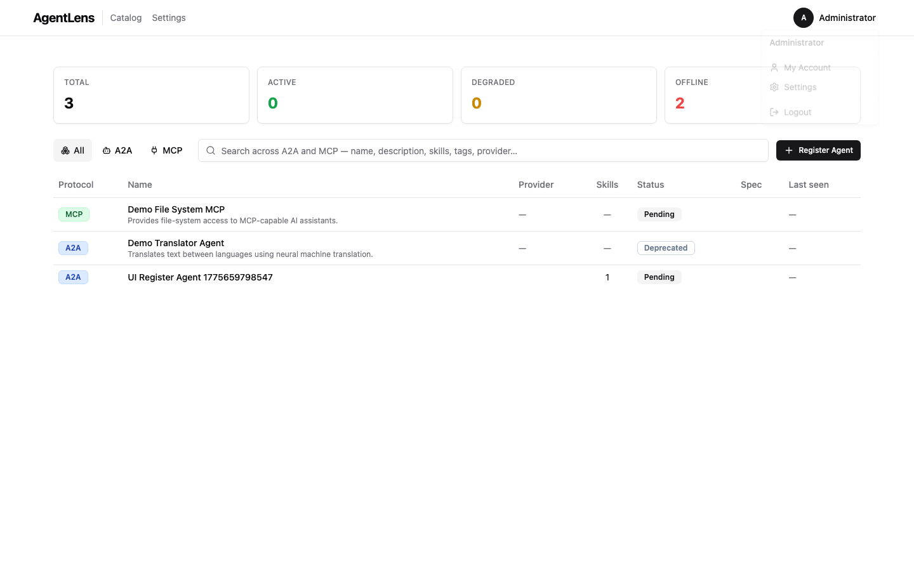
*Top navigation bar with the user dropdown open.*

After signing in the top navigation bar is always visible:

| Element | Description |
|---------|-------------|
| **AgentLens** (logo) | Click to return to the catalog from anywhere |
| **Catalog** | Direct link to the agent catalog |
| **Capabilities** | Link to the capability discovery view at `/catalog/capabilities` |
| **Settings** | Link to the settings page; only visible to users with `settings:read` |
| **User avatar** | Initials badge — click to open the user dropdown |

The user dropdown contains:

- **My Account** — jump to the My Account settings tab
- **Settings** — jump to the Settings page (if you have `settings:read`)
- **Logout** — invalidate the session and return to the login page

On narrow screens the nav links collapse behind a hamburger menu.

---

## Dashboard / Catalog Overview


*The catalog dashboard showing the stats bar, protocol filter, unified search, and the agent table.*

The catalog is the default view at `/`. It shows every registered agent entry visible to your
account.

### Stats Bar

Four summary cards appear at the top:

| Card | Description |
|------|-------------|
| **Total** | Total number of catalog entries |
| **Active** | Entries whose last health check succeeded within latency expectations |
| **Degraded** | Entries returning partial or error responses |
| **Offline** | Entries that are unreachable after consecutive probe failures |

Counts update automatically as health checks run in the background.

### Catalog Table Columns

| Column | Description |
|--------|-------------|
| **Protocol** | Protocol badge: `A2A`, `MCP`, or `A2UI` |
| **Name** | Display name (clickable link to the detail page); optional description underneath |
| **Provider** | Team or organization from the agent card (hidden when absent) |
| **Skills** | Number of capabilities (skills, tools, or resources) declared by the agent |
| **Status** | Health status badge: `Active`, `Degraded`, `Offline`, `Pending`, or `Deprecated`; includes latency and last-seen timestamp |
| **Spec** | Agent Card spec version (e.g. `A2A 1.0`) |
| **Auth** | Authentication badge for A2A agents (e.g. `Bearer JWT`, `API Key`, `OAuth 2.0`). Empty for open agents and MCP servers. |
| **Last seen** | Relative timestamp of the most recent successful health probe |

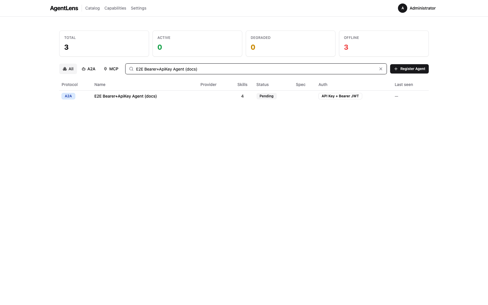
*Catalog list — the Auth column shows a badge for authenticated agents; open agents have an empty cell.*

Rows are sorted by registration time (most recent first) by default. Click any column header to re-sort.

**Empty state:** when no entries are registered, "No agents registered yet." is displayed. When
filters are active but return no results, "No results match your filters." is shown with a
**Clear filters** button.

---

## Searching and Filtering

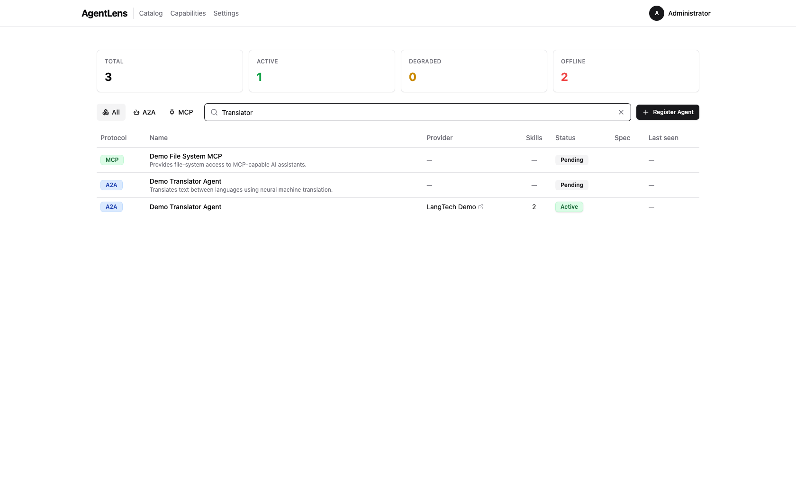
*Unified search box — searches across name, description, skills, tags, and provider fields.*

Two controls sit above the catalog table:

1. **Unified search box** — a wide text input (press `/` to focus from anywhere on the page).
   Searches across display name, description, skills, tags, provider name, and organization.
   Results update as you type (debounced 300 ms). Placeholder:
   *"Search across A2A and MCP — name, description, skills, tags, provider…"*

2. **Protocol filter** — a toggle group with three buttons: **All** (default), **A2A**, **MCP**.
   Selecting a protocol immediately filters the table and syncs the URL (`?protocol=a2a`).

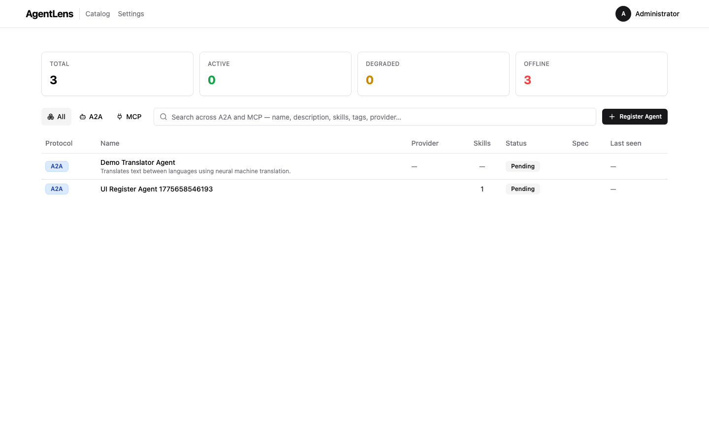
*Protocol toggle set to A2A — only A2A entries are shown.*

Search and protocol filter are combined (AND logic): selecting `A2A` and typing `translate` shows
only A2A entries whose metadata matches "translate". Clear the search box or click **All** in the
toggle group to reset the respective filter.

---

## Viewing Agent Details

Click any agent name in the catalog table to open its detail page at `/catalog/:id`. The detail
page uses a tabbed layout with an **Overview** tab and a **Raw Card** tab.

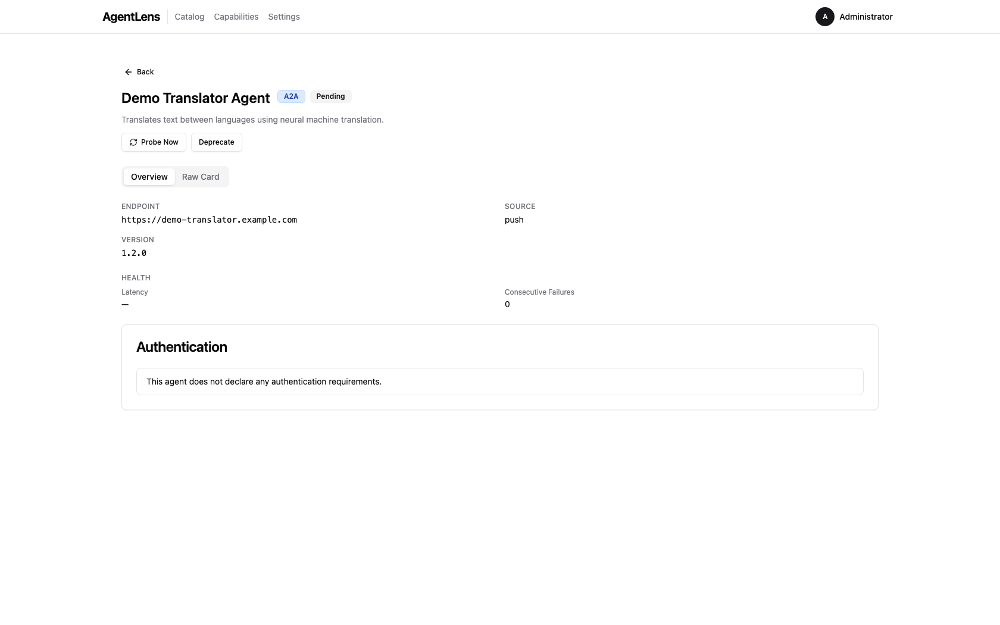
*Agent detail page — header badges, metadata fields, and capabilities on the Overview tab.*

### Header Fields

| Badge / Field | Description |
|---------------|-------------|
| Protocol badge | Protocol of the agent (`A2A`, `MCP`, `A2UI`) |
| Status badge | Current health status with latency and last-seen time |
| Spec version badge | Agent Card spec version (e.g. `A2A 1.0`) |
| **Endpoint** | Full URL of the agent |
| **Provider** | Team and organization from the agent card |
| **Version** | Agent version declared in its card |
| **Source** | Discovery source (`k8s`, `config`, `push`, `upstream`) |
| **Last Seen** | Timestamp of the most recent health probe |
| **Created** | Timestamp when the entry was first registered |

Below the header, **categories** are shown as outline badges when present.

Action buttons — **Probe Now** and **Deprecate / Un-deprecate** — appear in the header area for
users with `catalog:write` permission. Lifecycle action errors are shown inline below the buttons.

### Capabilities


*Capabilities section — each capability shows its name, kind badge, and description.*

Each capability has a `kind` tag:

| Kind | Protocol | Description |
|------|----------|-------------|
| `a2a.skill` | A2A | A discrete task the agent can perform |
| `a2a.interface` | A2A | Supported interface (e.g. `push`, `request`) |
| `a2a.security_scheme` | A2A | Authentication scheme advertised by the card |
| `a2a.security_requirement` | A2A | Which scheme(s) a client must use to connect |
| `a2a.extension` | A2A | Custom extension declared in the card |
| `a2a.signature` | A2A | Cryptographic signature entry |
| `mcp.tool` | MCP | A callable tool exposed by the MCP server |
| `mcp.resource` | MCP | A resource URI provided by the MCP server |
| `mcp.prompt` | MCP | A prompt template offered by the MCP server |

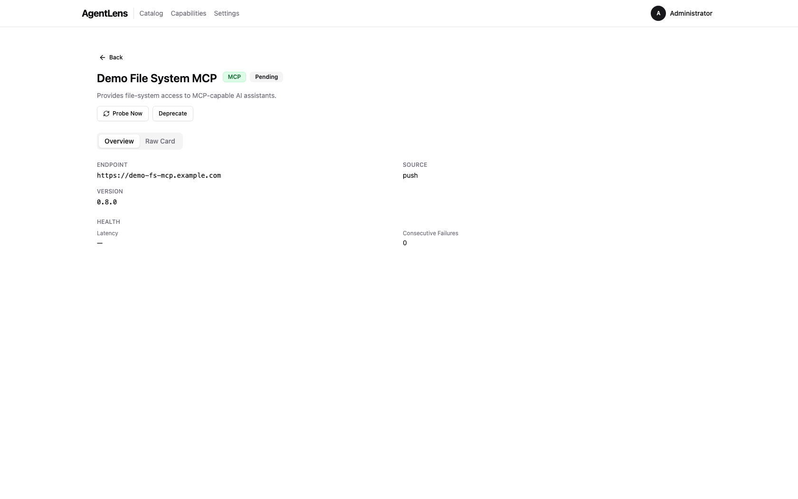
*MCP server detail — tools, resources, and prompts appear as capabilities.*

### Authentication

The **Authentication** card appears on the Overview tab for all agents.

**A2A agents with security schemes:**

The section shows:

1. **Requirements banner** — lists which scheme(s) a client must present. Multiple entries are OR'd (any one combination is sufficient).
2. **Scheme cards** — one card per declared security scheme with its type, format, and relevant URLs.
3. **Connection Example** — a generated `curl` snippet showing the required headers for the first requirement.

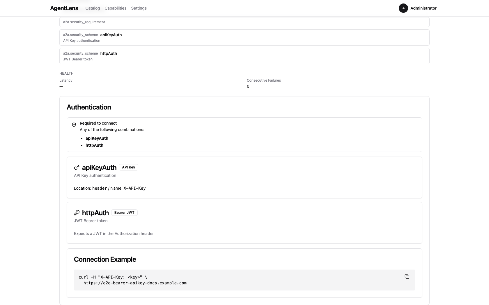
*Agent detail — Authentication section with requirements banner, scheme cards, and connection example.*

**Scheme card fields by type:**

| Type | Fields shown |
|------|-------------|
| `http` (Bearer) | Badge `Bearer JWT`; note about Authorization header |
| `apiKey` | Location (`header`/`query`/`cookie`) and header/param name |
| `oauth2` | Flow type badge(s), Authorization URL, Token URL, Scopes table |
| `openIdConnect` | Link to OIDC discovery document |
| `mutualTls` | Note about client certificate configuration |

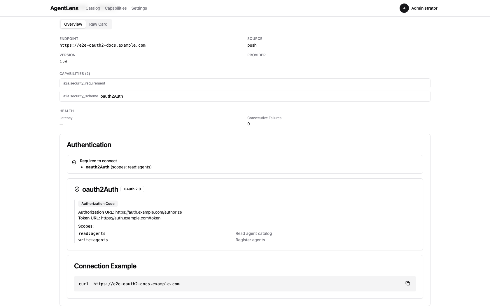
*OAuth2 scheme card — flow type, authorization and token URLs, and required scopes.*

The **Requirements banner** summarises which scheme combinations a client must present:

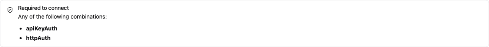
*Requirements banner — each row is one valid authentication combination.*

The **Connection Example** card generates a ready-to-use `curl` command:

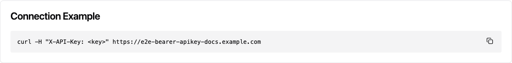
*Connection recipe — copy-paste curl snippet with the required authentication headers.*

**A2A agents with no security (open agents):**

The Authentication card shows: *"This agent does not declare any authentication requirements."*

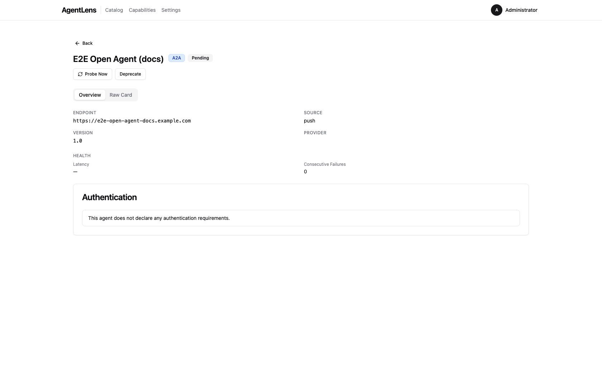
*Open agent — Authentication section with no-auth message.*

**MCP servers:**

The Authentication card shows: *"MCP servers declare authentication at the transport level, not in the server card."*


*MCP server detail — tools, resources, and prompts appear as capabilities.*

### Raw Card Tab


*Raw Card tab — the original agent card JSON with syntax highlighting, a Copy button, and a Download button.*

Click the **Raw Card** tab on the detail page to view the full JSON document as received from the
agent or stored at registration time. Features:

- **Syntax highlighting** — Prism.js colour-coded JSON for readability.
- **Copy** — copies the full JSON to the clipboard.
- **Download** — saves the card as a `.json` file named after the agent.
- **Fetched at** — shows the ISO timestamp of when the card was last fetched.
- **Truncation warning** — if the raw card exceeds 256 KiB a warning banner is shown; the full
  card is still available via the API at `GET /api/v1/catalog/:id/card`.

### Deleting an Entry

Click the red **Delete** button in the top-right of the detail card to remove the entry. A browser
confirm dialog asks for confirmation. After deletion you are returned to the catalog.

> **Note:** Deletion requires `catalog:delete` permission.

---

## Capabilities

The Capabilities tab provides a capability-first view of your agent catalog. Instead of browsing individual agents, you can search for capabilities (skills, tools, resources, prompts) and see all agents that offer each one.

### Discovering Capabilities

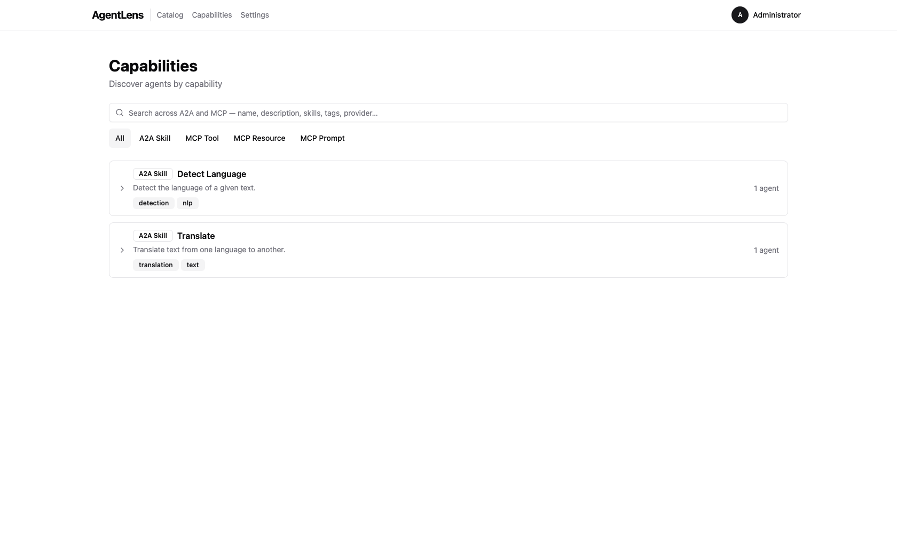
*The Capabilities page — each accordion group represents one unique capability shared across agents.*

1. Click **Capabilities** in the main navigation
2. Browse the accordion groups showing capability names and agent counts
3. Use the search box to filter by name, description, or tags (for A2A skills)
4. Use the kind filter to narrow results: All / A2A Skill / MCP Tool / MCP Resource / MCP Prompt

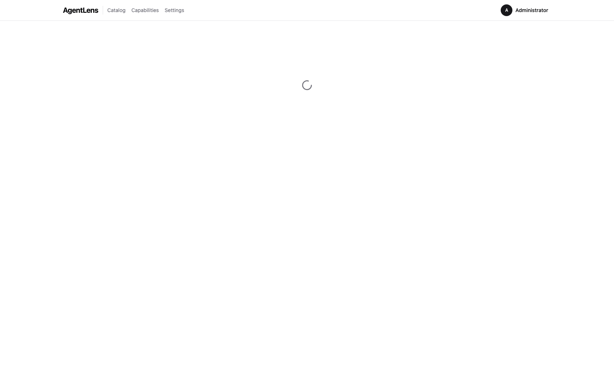
*The kind filter narrows the list to a specific capability type.*

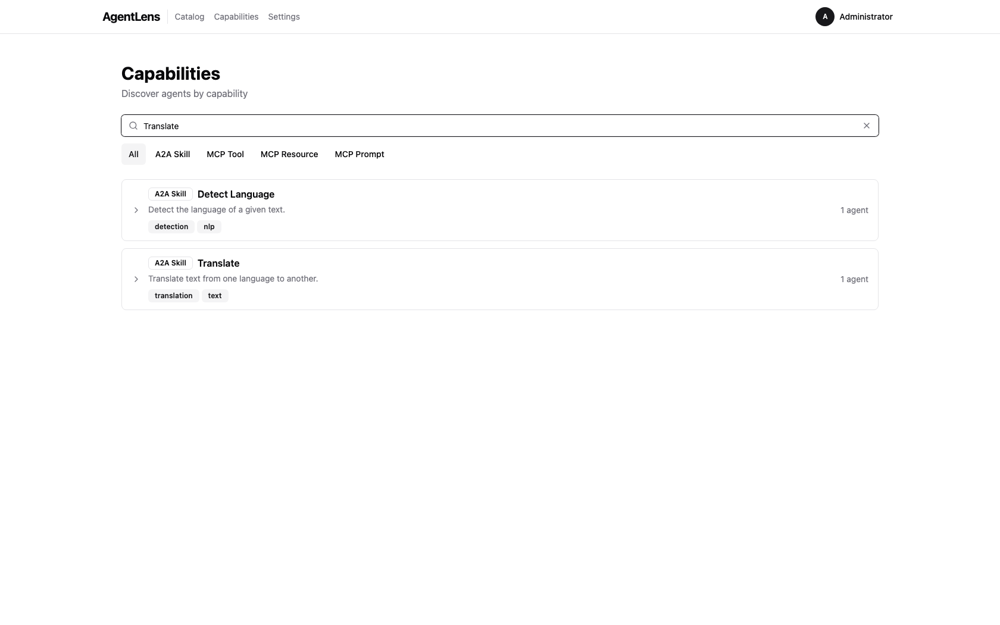
*Typing in the search box filters capabilities by name, description, or tags.*

### Viewing Agents by Capability

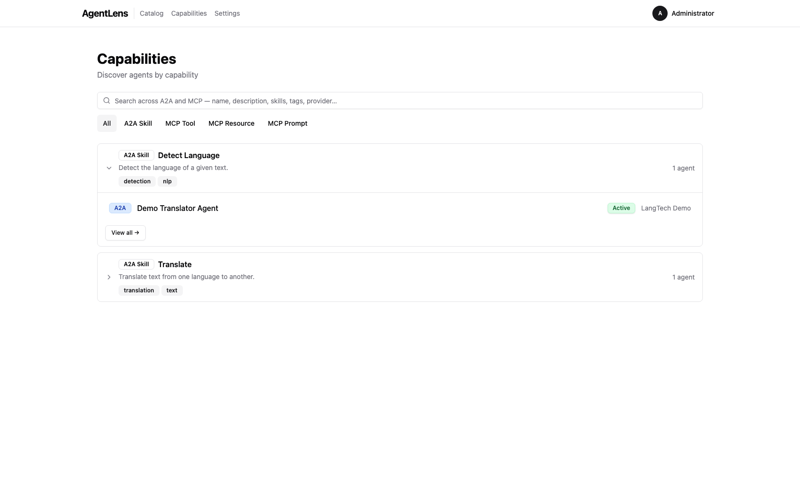
*An expanded group shows every agent offering that capability, with protocol, status, and provider.*

1. Click an accordion group to expand and see the list of agents offering that capability
2. Each agent shows: protocol, name, status, provider, and latency
3. Click **View all** to open the full capability detail page with a table of all agents

### Capability Detail Page

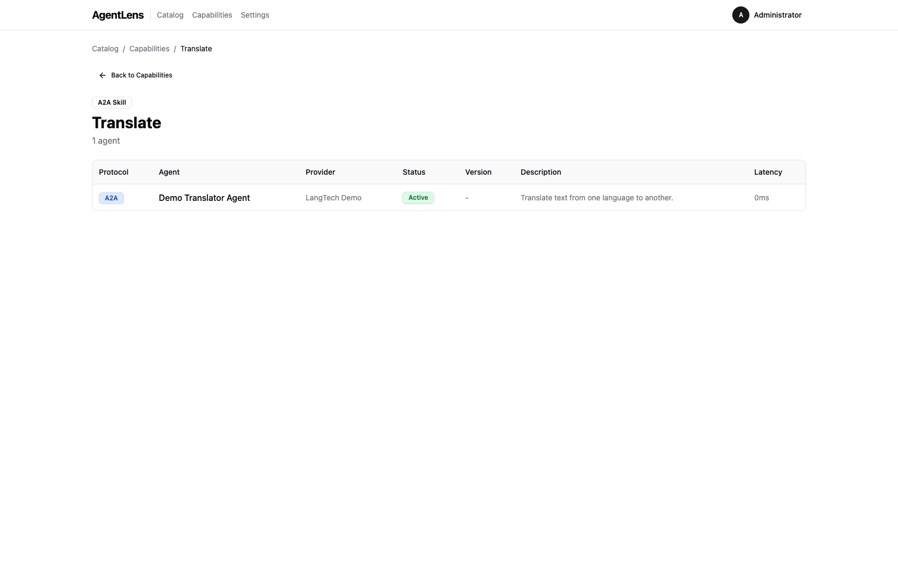
*The detail page lists every agent offering the capability with full metadata columns.*

The detail page shows:
- Capability kind badge and name
- Total agent count (including offline/deprecated agents)
- Table with columns: Protocol, Agent, Provider, Status, Version, Description (agent-specific snippet), Latency
- Click any agent name to navigate to the agent detail page

### Cross-linking from Agent Detail

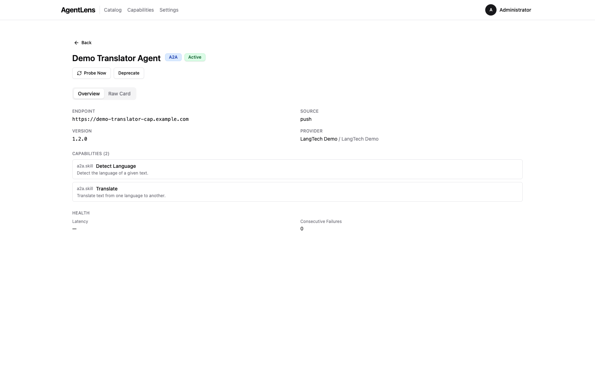
*Capability names in the agent detail view are clickable links — click one to see all agents offering that capability.*

On the agent detail page, discoverable capability names (A2A skills, MCP tools/resources/prompts) are now clickable links. Click a capability name to see all other agents offering the same capability.

Technical capability kinds (extensions, security schemes, interfaces, signatures) are not linked — they are configuration details, not user-facing capabilities.

### URL Sharing

Capability views support shareable URLs:
- `/catalog/capabilities?q=translate&kind=a2a.skill` — filtered list view
- `/catalog/capabilities/a2a.skill::Translate%20EN-DE` — specific capability detail

Copy and share these URLs to point teammates directly to specific capabilities or search results.

---

## Registering an Agent


*The **Register Agent** button — located in the top-right of the filter bar.*

Click **Register Agent** to open the registration dialog. Three methods are available as tabs.

### Paste JSON

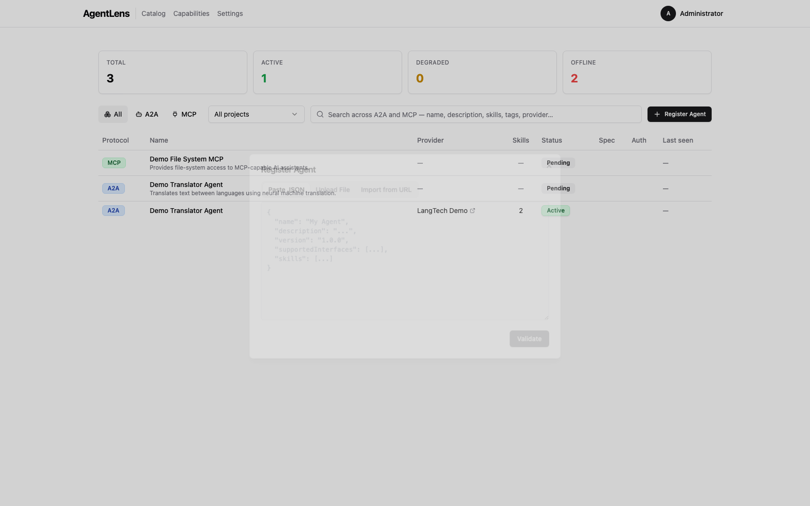
*Paste JSON tab — type or paste an A2A or MCP agent card JSON document.*

1. Select the **Paste JSON** tab (default).
2. Paste a valid A2A or MCP agent card JSON into the text area.
3. Click **Validate** — the server parses the card and returns errors or warnings.

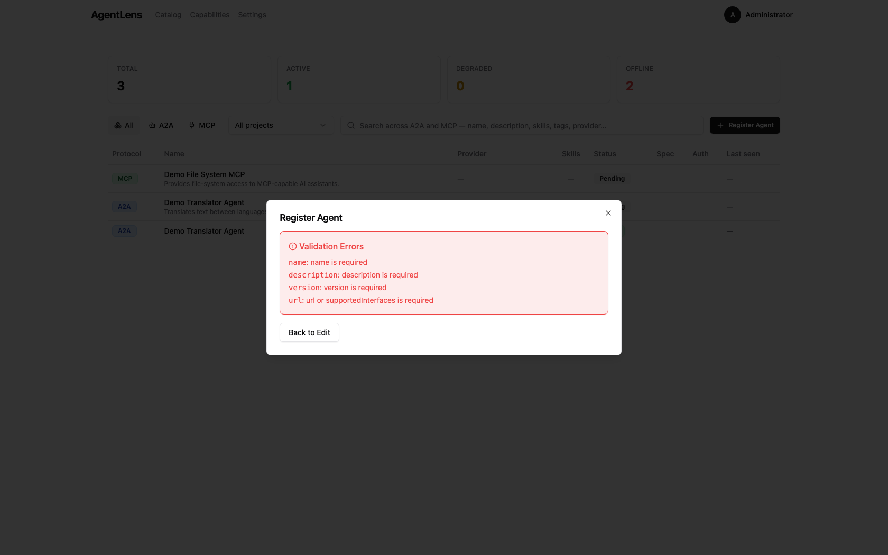
*Validation errors are listed with the failing field and message.*

4. If validation passes, the dialog advances to the **Preview** step.

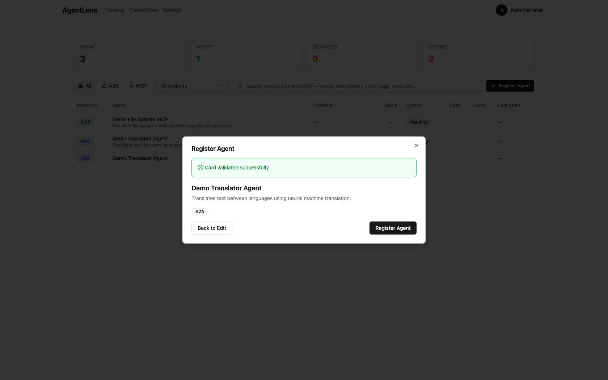
*Preview step — review the parsed card before saving.*

5. Review the preview and click **Register Agent** to save. The dialog closes and the catalog
   refreshes with the new entry.


*After registration the dialog closes and the catalog table shows the new entry.*

### Upload a JSON File

1. Select the **Upload File** tab.
2. Click **Browse** or drag a `.json` file onto the drop zone.
3. The file contents are loaded into the validator — the flow then continues exactly as in
   [Paste JSON](#paste-json) above (Validate → Preview → Register).

### Import from URL

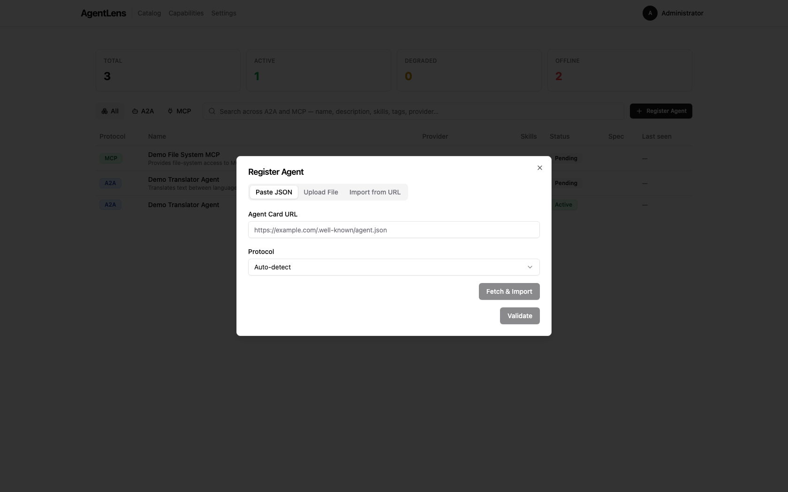
*Import from URL tab — enter a publicly reachable agent card URL.*

1. Select the **Import from URL** tab.
2. Enter the full URL of the agent card (e.g. `https://example.com/.well-known/agent.json`).
3. Optionally choose the **Protocol**: `Auto-detect` (default), `A2A`, or `MCP`.
4. Click **Fetch & Import**.

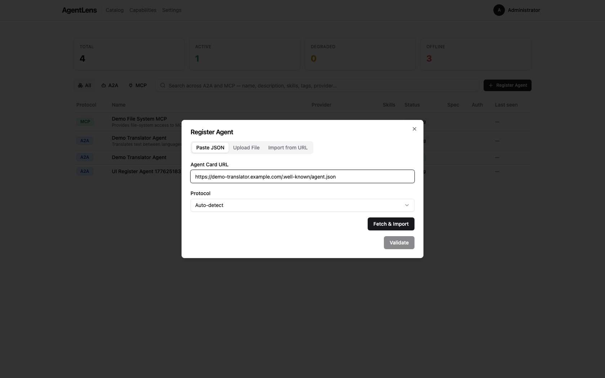
*Import from URL — URL entered, ready to fetch.*

AgentLens fetches the document server-side, parses it, and registers it directly. You land back on
the catalog showing the new entry.

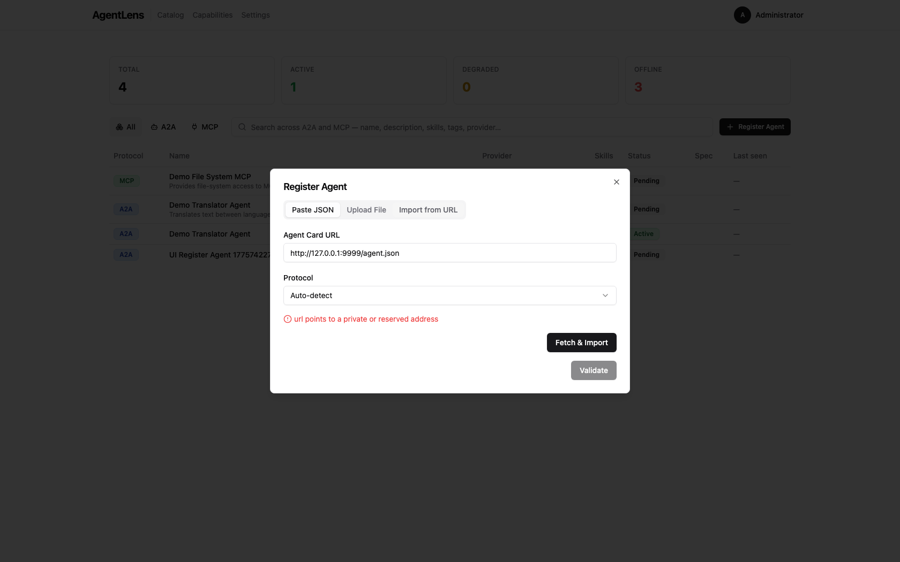
*Private/loopback URLs are rejected by the SSRF guard — the error message is shown inline.*

> **SSRF protection:** URLs that resolve to private RFC-1918 ranges (`10.x`, `172.16.x`,
> `192.168.x`), loopback (`127.0.0.0/8`, `::1`), or link-local addresses are rejected by the
> server before any outbound connection is made. `localhost` is similarly blocked. This is a
> security measure and cannot be bypassed from the UI.

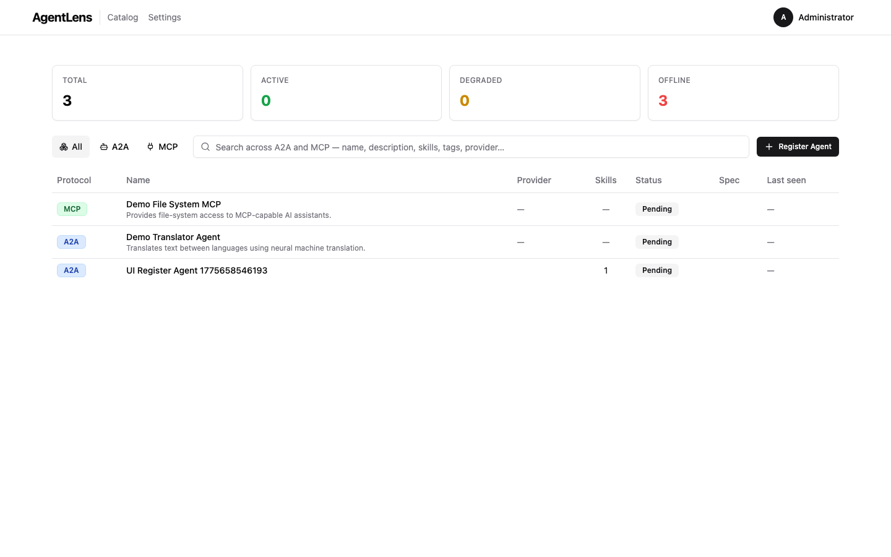
*After a successful registration the catalog refreshes to show the new entry.*

---

## Health Monitoring

AgentLens continuously probes registered catalog entries and shows their runtime state on the dashboard.


*Health badges in the catalog list show the current lifecycle state for each entry.*

### Status badges

Each entry displays a colored status badge:

| Badge | Meaning |
| --- | --- |
| **Active** (green) | Last probe succeeded within the latency threshold |
| **Degraded** (amber) | Last probe was slow, or a single failure occurred |
| **Offline** (red) | Multiple consecutive probe failures |
| **Pending** (gray) | Entry created but not yet probed |
| **Deprecated** (slate) | Manually deprecated; no longer probed |

The badge also shows response latency (e.g., `142 ms`) for Active and Degraded entries, and a relative timestamp (e.g., `5s ago`) for when the entry was last seen.

### Filtering by status

Status is visible as a badge in the **Status** column of the catalog table. Use the **Unified
search box** or the **Protocol filter** toggle to narrow entries; the status badge on each row lets
you see health at a glance without a separate filter control.

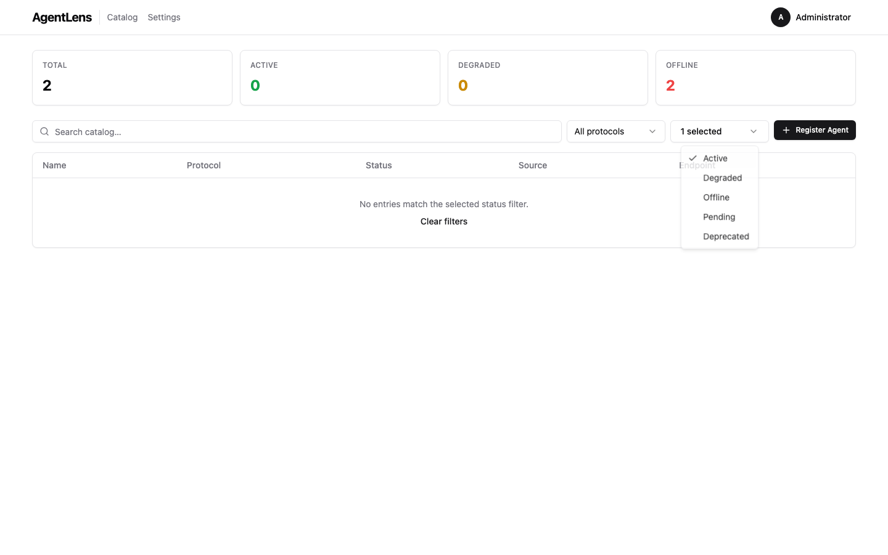
*Each row displays a status badge — Active, Degraded, Offline, Pending, or Deprecated.*

For deeper filtering by health state, use the REST API `?status=active` query parameter (see
[docs/api.md](api.md)).

### Health detail

Click any entry to open its detail view. The **Health** section shows:

- Current state
- Last probed / last successful timestamps
- Response latency
- Consecutive failure count
- Last error message (if any)

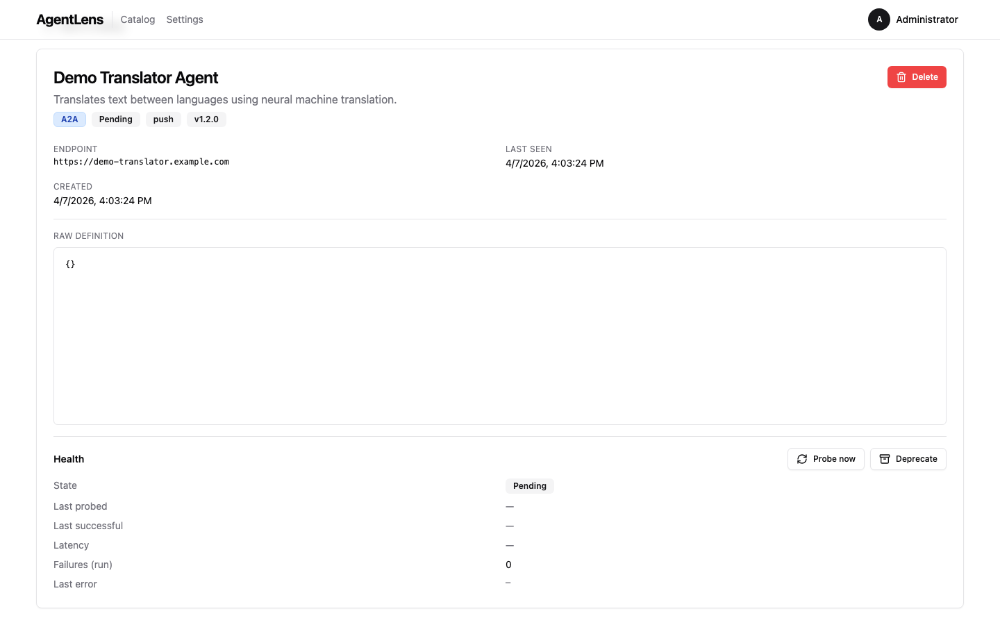
*The Health detail section exposes probe timing, latency, and failure diagnostics for troubleshooting.*

### Actions (editor and admin only)

- **Probe now** — trigger an immediate probe without waiting for the next scheduled interval
- **Deprecate** — stop monitoring an entry (with confirmation dialog)
- **Un-deprecate** — resume monitoring a deprecated entry

Use **Probe now** when you have just fixed an endpoint and want immediate status refresh.

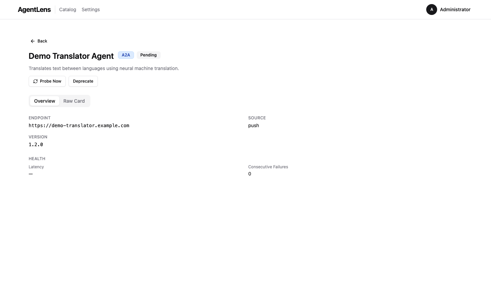
*Probe now executes an on-demand health check and updates the badge after the probe completes.*

When you click **Deprecate**, AgentLens asks for confirmation before removing the entry from active monitoring.

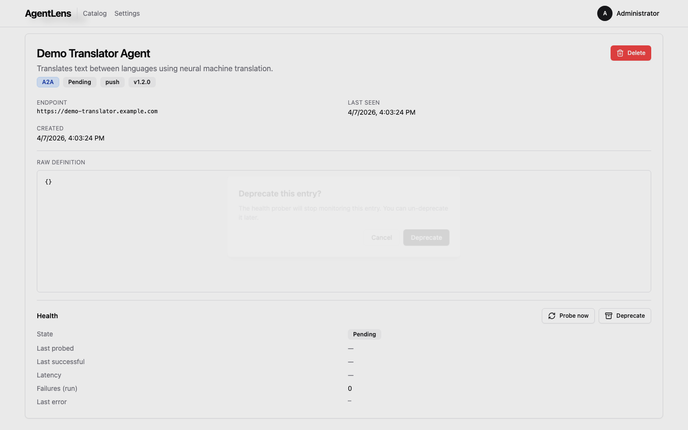
*Deprecation requires confirmation to avoid accidental monitoring disablement.*

After deprecation, the entry shows the **Deprecated** state badge in the catalog/detail views. Use **Un-deprecate** to return it to normal probe scheduling.

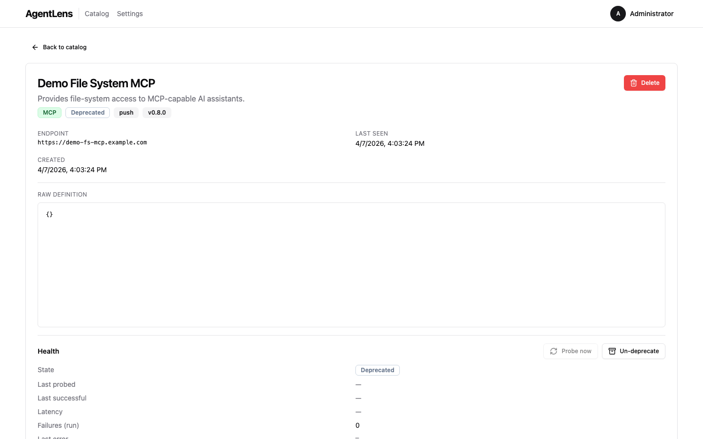
*Deprecated entries remain in the catalog but are excluded from active probe cycles until restored.*

---

## Status Indicators

Each catalog entry carries a **status** that reflects its health lifecycle state:

| Status | Badge colour | Meaning |
|--------|-------------|---------|
| `active` | Green | Last probe succeeded within latency expectations |
| `degraded` | Yellow/amber | Last probe was slow or had a partial issue |
| `offline` | Red | Entry failed multiple consecutive probes |
| `pending` | Grey | Entry is registered but has not been probed yet |
| `deprecated` | Slate | Monitoring is manually disabled for this entry |

Health checks run on a configurable interval (`health.check_interval`, default 60 s). Newly
registered agents start with status `pending` until the first check completes.

---

## Protocol Types

AgentLens recognises three agent protocols:

| Protocol | Value | Description |
|----------|-------|-------------|
| **A2A** | `a2a` | Agent-to-Agent protocol. Agents expose a card at `/.well-known/agent.json` describing their skills and supported interfaces. |
| **MCP** | `mcp` | Model Context Protocol. Servers expose tools, resources, and prompt templates to AI assistants. |
| **A2UI** | `a2ui` | Agent-to-UI protocol variant for browser-facing agents. |

The protocol is auto-detected when importing from a URL (unless you override it in the Protocol
dropdown).

---

## Settings

Navigate to **Settings** via the top navigation bar or the user dropdown. The settings page is
organised into tabs.

> **Permission required:** `settings:read` to view the Settings page.

### General

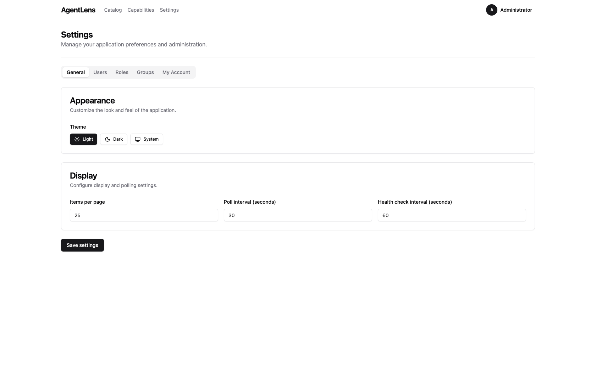
*General settings — appearance and display options.*

The **General** tab has two sections:

**Appearance**

| Setting | Description |
|---------|-------------|
| Theme | `Light`, `Dark`, or `System` (follows OS preference) |

**Display**

| Setting | Key | Default |
|---------|-----|---------|
| Items per page | `ui.items_per_page` | 25 |
| Poll interval (seconds) | `ui.poll_interval` | 30 |
| Health check interval (seconds) | `health.check_interval` | 60 |

Click **Save settings** to persist changes. A brief "Settings saved." confirmation appears.

> **Permission required:** `settings:write` to save changes.

### Users

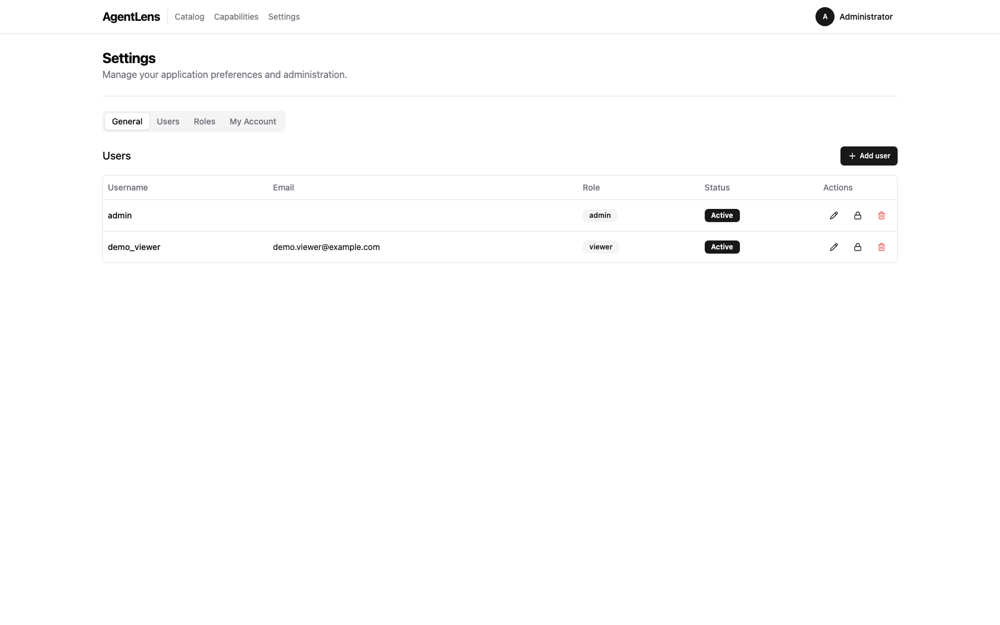
*Users tab — list of all user accounts with role and status columns.*

Manage user accounts. See [User Management](#user-management) for full details.

### Roles

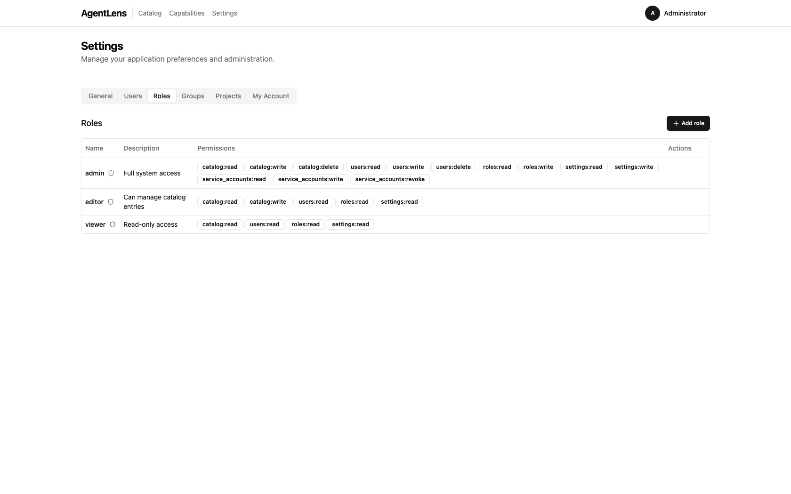
*Roles tab — system-defined and custom roles with their permission sets.*

Manage roles and their permissions. See [Role Management](#role-management) for full details.

### My Account

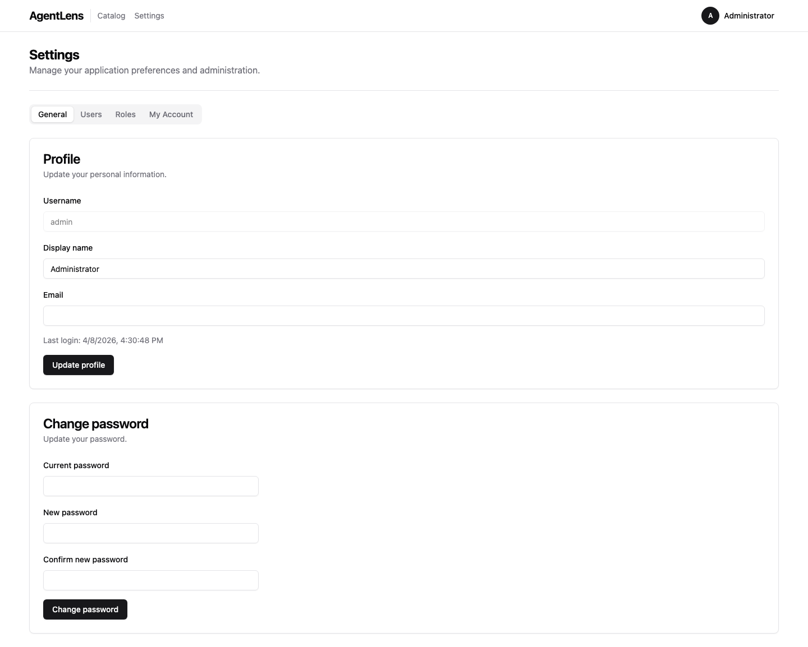
*My Account tab — change your display name, email, and password.*

The **My Account** tab lets you update your own profile:

- **Display name** and **Email** — informational fields shown in the UI.
- **Change password** — enter your current password, then a new password that meets the
  [password requirements](#password-requirements). Click **Save**.

> You do not need any special permission to update your own account.

---

## User Management

> **Permissions required:** `users:read` to view users; `users:write` to create/edit/lock;
> `users:delete` to delete.

Navigate to **Settings → Users**.

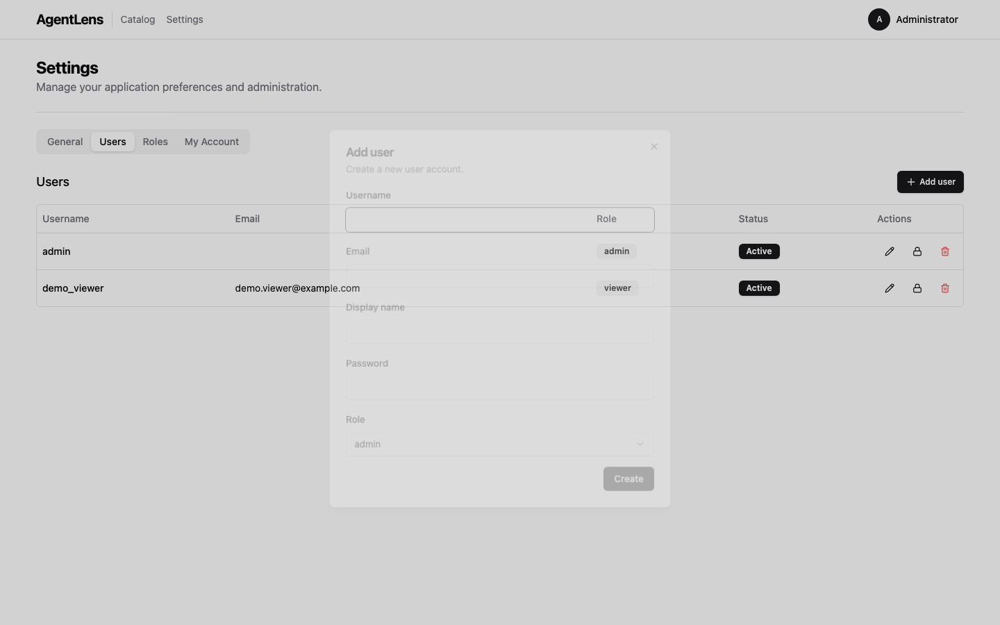
*Add user dialog — fill in username, optional email and display name, password, and role.*

### Creating a User

1. Click **Add user**.
2. Fill in:
   - **Username** (required, unique)
   - **Email** (optional)
   - **Display name** (optional)
   - **Password** (required for new users; must meet [password requirements](#password-requirements))
   - **Role** (select from the dropdown)
3. Click **Save**.

### Editing a User

Click the **pencil** icon on a user row to open the edit dialog. You can update the username,
email, display name, and role. Leave the password field blank to keep the current password.

### Locking and Unlocking

Click the **lock** icon to toggle a user's active state:

- A locked (inactive) user cannot log in regardless of their password.
- An administrator can unlock a user locked by the automatic lockout policy this way.

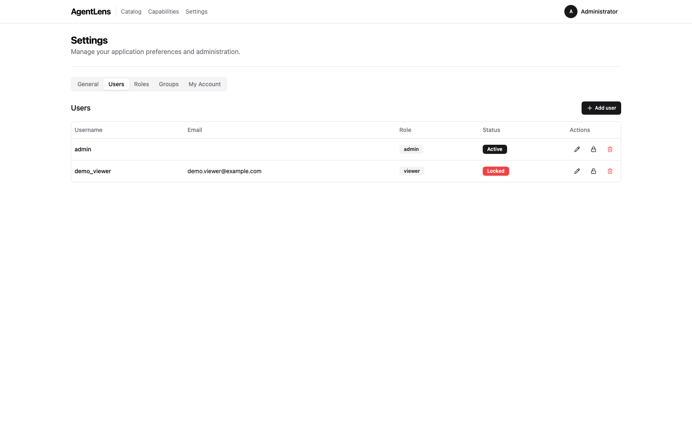
*A locked user shown with the "Locked" badge; the unlock icon is visible in the Actions column.*

### Deleting a User

Click the **trash** icon to delete a user. A browser confirm dialog is shown. The last active admin
user cannot be deleted (the API returns an error).

---

## Role Management

> **Permissions required:** `roles:read` to view roles; `roles:write` to create/edit custom roles.

Navigate to **Settings → Roles**.

Roles bundle a set of permissions that are assigned to users. Every role is either a **system role**
or a **custom role**.

**System roles** (`IsSystem = true`) are seeded by AgentLens and cannot be edited or deleted:

| Role | Typical permissions |
|------|---------------------|
| `admin` | All permissions |
| `editor` | `catalog:read`, `catalog:write`, `catalog:delete`, `users:read`, `roles:read`, `settings:read` |
| `viewer` | `catalog:read` |

**Custom roles** can be created, edited, and deleted freely.

### Creating a Role

1. Click **Add role**.
2. Enter a **Name** and optional **Description**.
3. Check the permissions this role should grant.
4. Click **Save**.

Available permissions:

| Permission | What it grants |
|------------|----------------|
| `catalog:read` | View catalog entries and stats |
| `catalog:write` | Register new entries, import from URL |
| `catalog:delete` | Delete catalog entries |
| `users:read` | View user list |
| `users:write` | Create and edit users |
| `users:delete` | Delete users |
| `roles:read` | View roles |
| `roles:write` | Create, edit, and delete custom roles |
| `settings:read` | View Settings page and read settings |
| `settings:write` | Update settings |

### Editing a Role

Click the **pencil** icon on a custom role row. System roles show the icon as disabled.

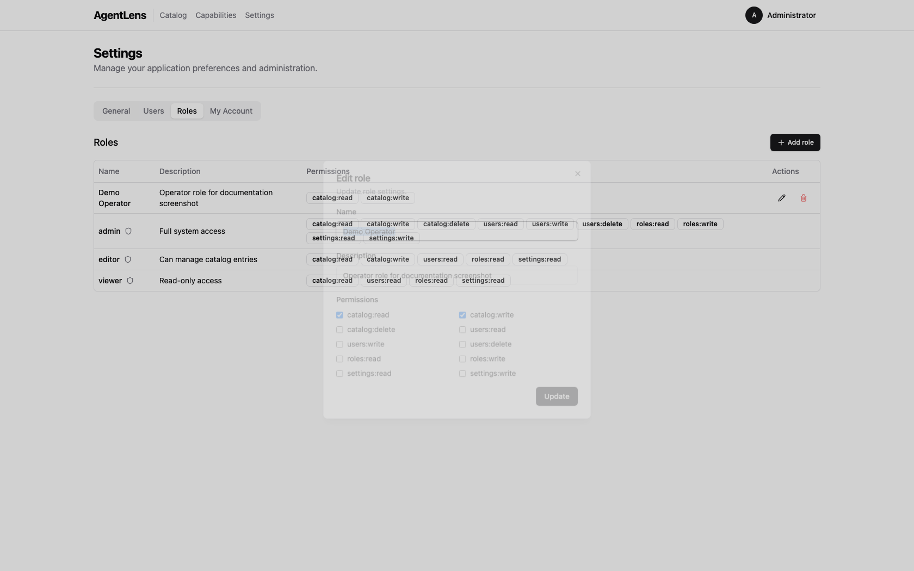
*Role edit dialog — toggle individual permissions for the selected role.*

### Deleting a Role

Click the **trash** icon on a custom role row. System roles cannot be deleted.

---

## Using the REST API

AgentLens exposes a REST API at `/api/v1/`. Full reference: [docs/api.md](api.md).

### Authentication

Obtain a token:

```http
POST /api/v1/auth/login
Content-Type: application/json

{"username": "admin", "password": "YourPassword1!"}
```

Response:

```json
{"token": "<jwt>"}
```

Use the token in subsequent requests:

```http
GET /api/v1/catalog
Authorization: Bearer <jwt>
```

### Quick Reference

| Method | Path | Permission | Description |
|--------|------|------------|-------------|
| `GET` | `/api/v1/catalog` | `catalog:read` | List entries (filter via query params) |
| `POST` | `/api/v1/catalog` | `catalog:write` | Create an entry |
| `GET` | `/api/v1/catalog/:id` | `catalog:read` | Get a single entry |
| `DELETE` | `/api/v1/catalog/:id` | `catalog:delete` | Delete an entry |
| `POST` | `/api/v1/catalog/validate` | `catalog:write` | Validate a card JSON |
| `POST` | `/api/v1/catalog/import` | `catalog:write` | Import from URL |
| `GET` | `/api/v1/stats` | `catalog:read` | Aggregate statistics |
| `GET` | `/api/v1/users` | `users:read` | List users |
| `POST` | `/api/v1/users` | `users:write` | Create user |
| `PUT` | `/api/v1/users/:id` | `users:write` | Update user |
| `DELETE` | `/api/v1/users/:id` | `users:delete` | Delete user |
| `GET` | `/api/v1/roles` | `roles:read` | List roles |
| `POST` | `/api/v1/roles` | `roles:write` | Create role |
| `PUT` | `/api/v1/roles/:id` | `roles:write` | Update role |
| `DELETE` | `/api/v1/roles/:id` | `roles:write` | Delete role |

See [docs/api.md](api.md) for the full request/response schemas.

---

## FAQ / Troubleshooting

### My account is locked — how do I regain access?

Ask an administrator to navigate to **Settings → Users**, find your account, and click the
**unlock** (padlock) icon.

If you are the only admin and your account is locked, see below.

### I forgot the admin password / I am locked out of the only admin account

If you still have server access:

1. Stop the AgentLens server.
2. Delete (or rename) the SQLite database file specified by `AGENTLENS_DB_SQLITE_PATH` (default
   `agentlens.db` in the data directory).
3. Restart the server. With no existing users the bootstrap procedure runs again and prints fresh
   admin credentials to stdout.

> **Warning:** deleting the database removes all catalog entries, users, and roles. Export any data
> you need first via the REST API.

### I imported from a URL and got "url points to a private or reserved address"

AgentLens's SSRF guard blocks outbound connections to private/loopback addresses. This is
intentional. The agent card must be hosted on a publicly reachable HTTPS URL. The following ranges
are blocked: `10.x`, `172.16–31.x`, `192.168.x`, `127.x`, `::1`, `169.254.x`, and the `localhost`
hostname.

### The catalog shows an agent as "Pending" — why?

`Pending` means no completed health check has been recorded yet. Possible reasons:

- The agent was just registered and the health checker has not run its first cycle.
- Health checking is disabled (`AGENTLENS_HEALTH_CHECK_ENABLED=false` or
  `health.check_interval` is very large).
- The agent's endpoint is unreachable so the checker recorded an error — but in that case the
  status would transition to `Offline`, not remain `Pending`.

### An agent shows "Offline" — how do I investigate?

1. Check that the agent process is running at the registered endpoint.
2. Verify network connectivity between the AgentLens server and the agent endpoint.
   3. The **Raw Card** tab on the detail page shows the card URL and protocol — confirm the
      agent is serving that path.

### How do I push an agent card without using the UI?

Use the REST API directly:

```bash
curl -s -X POST https://agentlens.example.com/api/v1/catalog/import \
  -H "Authorization: Bearer $TOKEN" \
  -H "Content-Type: application/json" \
  -d '{"url": "https://my-agent.example.com/.well-known/agent.json"}'
```

Or register a card directly:

```bash
curl -s -X POST https://agentlens.example.com/api/v1/catalog \
  -H "Authorization: Bearer $TOKEN" \
  -H "Content-Type: application/json" \
  -d '{"display_name":"My Agent","endpoint":"https://my-agent.example.com","protocol":"a2a","version":"1.0.0"}'
```

### Kubernetes-discovered agents have a `k8s` source — what controls that?

Agents running in Kubernetes are discovered when their `Pod` or `Service` carries the annotation
`agentlens.io/enabled: "true"`. See [docs/user-guide.md](user-guide.md) and
[docs/architecture.md](architecture.md) for the full annotation schema.

---

## Groups and Projects

### Concepts

AgentLens uses a **party archetype** to model actors and their relationships:

- **Person** — one per user account, created automatically at bootstrap.
- **Group** — a named collection of persons or other groups (hierarchical). Members inherit group permissions transitively.
- **Project** — a namespace that scopes catalog entries. Each entry belongs to one or more projects.

A `default` system project is seeded on first run. All new catalog entries are automatically assigned to it.

**Project roles** control what members can do inside a project:

| Role | View entries | Register / update | Delete | Manage members |
| --- | --- | --- | --- | --- |
| `project:owner` | ✓ | ✓ | ✓ | ✓ |
| `project:developer` | ✓ | ✓ | — | — |
| `project:viewer` | ✓ | — | — | — |

Global `admin` users bypass all project permission checks.

### Managing Groups

Groups can be managed from the **Settings → Groups** tab in the web UI, or via the REST API.

Create a group via the REST API (editor or admin required):

```bash
curl -X POST http://localhost:8080/api/v1/groups \
  -H "Authorization: Bearer $TOKEN" \
  -H "Content-Type: application/json" \
  -d '{"name": "platform-team"}'
```

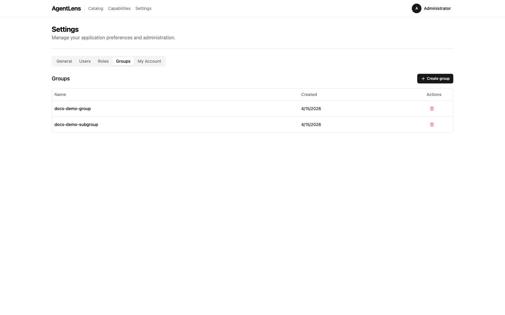
*The Groups tab inside Settings — admins can create and delete groups here.*

Add a person to a group (use the person party ID, obtainable from `GET /api/v1/groups`):

```bash
curl -X POST http://localhost:8080/api/v1/groups/{groupID}/members \
  -H "Authorization: Bearer $TOKEN" \
  -H "Content-Type: application/json" \
  -d '{"party_id": "<personPartyID>", "role": "member"}'
```

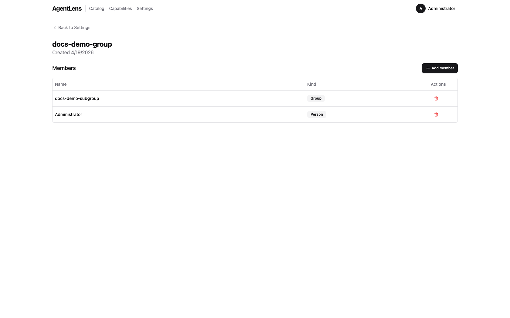
*Group detail page — manage direct members (persons and nested groups).*

Groups can be nested: add a group as a member of another group. Transitive membership is resolved automatically.

### Managing Projects

Create a project:

```bash
curl -X POST http://localhost:8080/api/v1/projects \
  -H "Authorization: Bearer $TOKEN" \
  -H "Content-Type: application/json" \
  -d '{"name": "my-project"}'
```

Assign a person or group to the project with a role:

```bash
curl -X POST http://localhost:8080/api/v1/projects/{projectID}/members \
  -H "Authorization: Bearer $TOKEN" \
  -H "Content-Type: application/json" \
  -d '{"party_id": "<partyID>", "role": "project:developer"}'
```

List all projects:

```bash
curl http://localhost:8080/api/v1/projects \
  -H "Authorization: Bearer $TOKEN"
```

### Assigning Catalog Entries to a Project

```bash
curl -X POST http://localhost:8080/api/v1/catalog/{entryID}/projects \
  -H "Authorization: Bearer $TOKEN" \
  -H "Content-Type: application/json" \
  -d '{"project_party_id": "<projectID>"}'
```

Remove from a project:

```bash
curl -X DELETE http://localhost:8080/api/v1/catalog/{entryID}/projects/{projectID} \
  -H "Authorization: Bearer $TOKEN"
```

### Filtering the Catalog by Project

Pass the `project` query parameter to `GET /api/v1/catalog` to return only entries in a specific project:

```bash
curl "http://localhost:8080/api/v1/catalog?project=<projectID>" \
  -H "Authorization: Bearer $TOKEN"
```

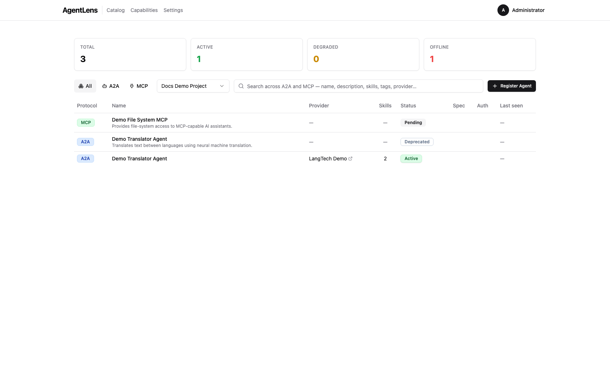
*Catalog list with `?project=<id>` — only entries assigned to that project appear.*

Omitting the parameter returns all entries regardless of project membership.

To see which projects a specific catalog entry belongs to:

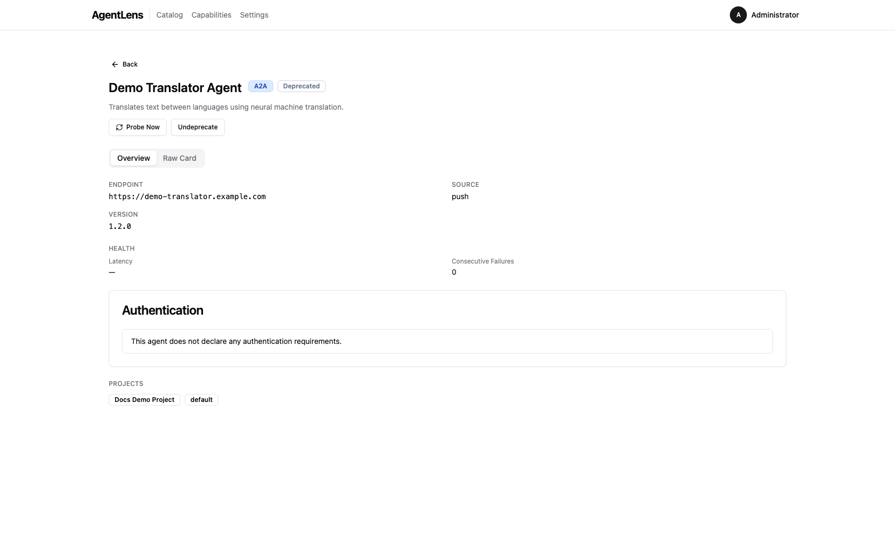
*The entry detail page lists all projects the entry is assigned to.*
