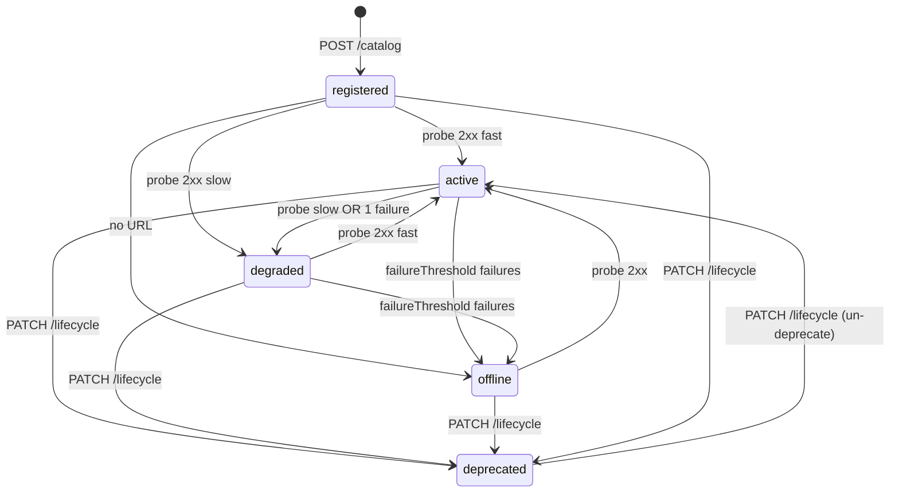

# Health Check & Lifecycle State on Dashboard — Implementation Plan

> **For agentic workers:** REQUIRED SUB-SKILL: Use superpowers:subagent-driven-development (recommended) or superpowers:executing-plans to implement this plan task-by-task. Steps use checkbox (`- [ ]`) syntax for tracking.

**Goal:** Add a full lifecycle state machine (`registered → active → degraded → offline → deprecated`) with periodic HTTP probing, REST API exposure, and dashboard visualization so operators can see live health status of every catalog entry.

**Architecture:** Extend the existing `CatalogEntry` model with `LifecycleState` + `Health` fields, enhance the existing `plugins/health` plugin to implement the state machine (consecutive failures, latency thresholds), expose new endpoints (`PATCH /lifecycle`, `POST /probe`), and surface everything in the React dashboard.

**Tech Stack:** Go 1.26 · GORM (SQLite + PostgreSQL) · chi router · React 18 · Tailwind CSS · shadcn/ui · Playwright (E2E) · `httptest` (unit tests)

---

## Design Decisions (divergences from spec)

1. **`status` column reuse instead of new `health_state` column.** The spec adds a separate `health_state` column alongside the existing `status` column. This plan repurposes the existing `status` column to hold `LifecycleState` values (`registered`, `active`, `degraded`, `offline`, `deprecated`) and migrates old values (`healthy`→`active`, `down`→`offline`, `unknown`→`registered`). Rationale: avoids two columns that must be kept in sync; the JSON API response is identical either way (`"status"` + `"health.state"` both emit the lifecycle value); all database access goes through GORM so no external integration reads `status` column values directly.

2. **Audit log hook is a TODO.** The spec says "audit log entry written via existing audit hook" for `PATCH /lifecycle`, but the audit plugin (`plugins/enterprise/audit/`) is currently a stub with no event emission implemented. The plan adds `slog.Info` audit logging inline and marks the audit plugin integration as a TODO for when the audit system is wired up.

3. **PostgreSQL tests are conditional.** The codebase has no PostgreSQL test infrastructure today (no `newTestPostgresDB` helper, no CI container). The plan adds conditional PostgreSQL store tests gated behind `AGENTLENS_TEST_POSTGRES_DSN` env var — skipped in local dev, required in CI.

---

## File Map

### Created
| File | Responsibility |
|------|---------------|
| `internal/api/health_handlers.go` | `HealthHandler`, `HealthProber` interface, rate limiter, `PatchLifecycle`, `ProbeEntry` handlers |
| `internal/store/health_store_pg_test.go` | Conditional PostgreSQL store tests (skipped without `AGENTLENS_TEST_POSTGRES_DSN`) |

### Modified
| File | What changes |
|------|-------------|
| `internal/model/agent.go` | Add `LifecycleState` type + constants, `Health` struct, health backing columns on `CatalogEntry`, update `SyncToDB`/`SyncFromDB`/`MarshalJSON` |
| `internal/db/migrations.go` | Add `migration005HealthColumns()` — adds health timing columns, updates old status values |
| `internal/store/store.go` | Add `UpdateHealth`, `ListForProbing`, `SetLifecycle` to `Store` interface; add `States []LifecycleState` to `ListFilter` |
| `internal/store/sql_store.go` | Implement `UpdateHealth`, `SetLifecycle` |
| `internal/store/sql_store_query.go` | Implement `ListForProbing`; update `List` to handle `filter.States` (IN clause) |
| `internal/config/config.go` | Add `DegradedLatency`, `FailureThreshold` to `HealthCheckConfig`; update defaults + env parsing |
| `plugins/health/health.go` | Full rewrite: state machine, latency measurement, `probeOne`, `failureHealth`, `ProbeEntry`, updated `checkAll` using `ListForProbing` + `UpdateHealth` |
| `internal/api/handlers.go` | `ListCatalog` — add `?state=` multi-value filter; keep `?status=` as backward-compat alias |
| `internal/api/router.go` | Register `PATCH /catalog/{id}/lifecycle` and `POST /catalog/{id}/probe`; add `HealthHandler` wiring |
| `cmd/agentlens/main.go` | Pass `healthPlugin` to `RouterDeps.HealthProber`; update `healthplugin.New(cfg.HealthCheck)` call |
| `web/src/types.ts` | Add `LifecycleState`, `Health` interface; update `CatalogEntry.status` type and add `health` field; update `ListFilter` |
| `web/src/api.ts` | Add `patchLifecycle`, `postProbe`; update `listCatalog` to pass `state` filter |
| `web/src/components/StatusBadge.tsx` | Remap to lifecycle states with labels + latency display |
| `web/src/components/CatalogList.tsx` | Replace status dropdown with lifecycle state multi-select; add latency column |
| `web/src/components/EntryDetail.tsx` | Add Health section card with Probe Now + Deprecate actions |
| `e2e/tests/health.spec.ts` | Extend with lifecycle state flow tests |

---

## Task 1 — Domain Model: LifecycleState + Health

**Files:**
- Modify: `internal/model/agent.go`

### Why this order
Model changes compile without any behavior. Every later task depends on these types.

- [ ] **Step 1: Write the failing test**

Create `internal/model/agent_health_test.go`:

```go
package model_test

import (
	"encoding/json"
	"testing"
	"time"

	"github.com/PawelHaracz/agentlens/internal/model"
)

func TestCatalogEntryHealthSyncRoundTrip(t *testing.T) {
	now := time.Now().UTC().Truncate(time.Second)
	entry := model.CatalogEntry{
		Status:                  model.LifecycleActive,
		HealthLastProbedAt:      &now,
		HealthLastSuccessAt:     &now,
		HealthLastError:         "",
		HealthLatencyMs:         142,
		HealthConsecutiveFailures: 0,
	}
	entry.SyncFromDB()

	if entry.Health.State != model.LifecycleActive {
		t.Errorf("Health.State = %v, want %v", entry.Health.State, model.LifecycleActive)
	}
	if entry.Health.LatencyMs != 142 {
		t.Errorf("Health.LatencyMs = %v, want 142", entry.Health.LatencyMs)
	}
}

func TestCatalogEntryMarshalJSONIncludesHealth(t *testing.T) {
	now := time.Now().UTC()
	entry := model.CatalogEntry{
		ID:          "test-id",
		DisplayName: "Test",
		Status:      model.LifecycleActive,
		Source:      model.SourcePush,
		HealthLatencyMs: 99,
	}
	entry.SyncFromDB()

	b, err := json.Marshal(entry)
	if err != nil {
		t.Fatal(err)
	}
	var out map[string]any
	if err := json.Unmarshal(b, &out); err != nil {
		t.Fatal(err)
	}
	if out["status"] != "active" {
		t.Errorf("status = %v, want active", out["status"])
	}
	health, ok := out["health"].(map[string]any)
	if !ok {
		t.Fatal("health field missing or wrong type")
	}
	if health["state"] != "active" {
		t.Errorf("health.state = %v, want active", health["state"])
	}
}
```

- [ ] **Step 2: Run test to verify it fails**

```bash
rtk go test ./internal/model/... -run TestCatalogEntryHealth -v
```
Expected: compile error (`LifecycleActive undefined`, `HealthLatencyMs undefined`)

- [ ] **Step 3: Add LifecycleState type and Health struct to `internal/model/agent.go`**

After the existing `Status` type block (line 19–26), add:

```go
// LifecycleState is the source of truth for the runtime state of a catalog entry.
// It replaces the old Status type for new code. The status DB column stores these values.
type LifecycleState string

const (
	LifecycleRegistered LifecycleState = "registered"
	LifecycleActive     LifecycleState = "active"
	LifecycleDegraded   LifecycleState = "degraded"
	LifecycleOffline    LifecycleState = "offline"
	LifecycleDeprecated LifecycleState = "deprecated"
)

// Health holds the runtime health state populated by the health prober.
// It is built from DB columns in SyncFromDB and is not stored directly.
type Health struct {
	State               LifecycleState
	LastProbedAt        *time.Time
	LastSuccessAt       *time.Time
	LastError           string
	LatencyMs           int64
	ConsecutiveFailures int
}
```

- [ ] **Step 4: Update `CatalogEntry` struct to use `LifecycleState` and add health backing columns**

Change the `Status` field declaration from:
```go
Status      Status            `json:"status"        gorm:"not null;type:text;default:'unknown';index"`
```
to:
```go
// Status stores the LifecycleState value. Updated by the health prober and lifecycle API.
Status LifecycleState `json:"-" gorm:"not null;type:text;default:'registered';index"`
```

Add health backing columns after `UpdatedAt` (before the JSON fields block):
```go
// Health check backing columns — managed by the health prober, hidden from direct JSON.
HealthLastProbedAt        *time.Time `json:"-" gorm:"column:health_last_probed_at"`
HealthLastSuccessAt       *time.Time `json:"-" gorm:"column:health_last_success_at"`
HealthLastError           string     `json:"-" gorm:"column:health_last_error;type:text;not null;default:''"`
HealthLatencyMs           int64      `json:"-" gorm:"column:health_latency_ms;not null;default:0"`
HealthConsecutiveFailures int        `json:"-" gorm:"column:health_consecutive_failures;not null;default:0"`

// Health is built by SyncFromDB. Not persisted directly.
Health Health `json:"-" gorm:"-"`
```

- [ ] **Step 5: Update `SyncFromDB` to populate `Health`**

At the end of `SyncFromDB` (after the `AgentType` block), add:
```go
e.Health = Health{
    State:               e.Status,
    LastProbedAt:        e.HealthLastProbedAt,
    LastSuccessAt:       e.HealthLastSuccessAt,
    LastError:           e.HealthLastError,
    LatencyMs:           e.HealthLatencyMs,
    ConsecutiveFailures: e.HealthConsecutiveFailures,
}
```

- [ ] **Step 6: Update `MarshalJSON` to emit `status` + `health` object**

In `MarshalJSON`, replace the anonymous struct's `Status Status` field with:
```go
Status  LifecycleState `json:"status"`
Health  struct {
    State               string     `json:"state"`
    LastProbedAt        *time.Time `json:"lastProbedAt"`
    LastSuccessAt       *time.Time `json:"lastSuccessAt"`
    LatencyMs           int64      `json:"latencyMs"`
    ConsecutiveFailures int        `json:"consecutiveFailures"`
    LastError           string     `json:"lastError"`
} `json:"health"`
```

And in the struct literal, populate:
```go
Status: e.Status,
Health: struct {
    State               string     `json:"state"`
    LastProbedAt        *time.Time `json:"lastProbedAt"`
    LastSuccessAt       *time.Time `json:"lastSuccessAt"`
    LatencyMs           int64      `json:"latencyMs"`
    ConsecutiveFailures int        `json:"consecutiveFailures"`
    LastError           string     `json:"lastError"`
}{
    State:               string(e.Health.State),
    LastProbedAt:        e.Health.LastProbedAt,
    LastSuccessAt:       e.Health.LastSuccessAt,
    LatencyMs:           e.Health.LatencyMs,
    ConsecutiveFailures: e.Health.ConsecutiveFailures,
    LastError:           e.Health.LastError,
},
```

- [ ] **Step 7: Fix compile errors from `Status` type change**

The existing health plugin uses `model.StatusDown`, `model.StatusHealthy`, `model.StatusDegraded`, `model.StatusUnknown`. Update `plugins/health/health.go` (temporarily) to compile — replace old constants with lifecycle equivalents:
```go
// Temporary: replace old calls
// model.StatusDown    → model.LifecycleOffline
// model.StatusHealthy → model.LifecycleActive
// model.StatusDegraded → model.LifecycleDegraded
// model.StatusUnknown  → model.LifecycleRegistered
```

Also update `internal/api/handlers.go` line where `Status: model.StatusUnknown` is used in `CreateEntry`:
```go
Status: model.LifecycleRegistered,
```

And update any test files or other places that reference `model.Status` type or old constants. Search:
```bash
rtk grep "model\.Status[A-Z]" --type go
rtk grep "model\.StatusUnknown\|model\.StatusHealthy\|model\.StatusDown\|model\.StatusDegraded" --type go
```

- [ ] **Step 8: Run tests to verify they pass**

```bash
rtk go test ./internal/model/... -run TestCatalogEntryHealth -v
```
Expected: PASS

- [ ] **Step 9: Verify the project still compiles**

```bash
rtk go build ./...
```
Expected: success (no errors)

- [ ] **Step 10: Commit**

```bash
rtk git add internal/model/ plugins/health/ internal/api/handlers.go
rtk git commit -m "feat(model): add LifecycleState + Health struct to CatalogEntry"
```

---

## Task 2 — DB Migration: Health Columns

**Files:**
- Modify: `internal/db/migrations.go`

- [ ] **Step 1: Write the failing store test**

Create `internal/store/health_migration_test.go`:

```go
package store_test

import (
	"context"
	"testing"
	"time"

	"github.com/PawelHaracz/agentlens/internal/model"
	"github.com/PawelHaracz/agentlens/internal/store"
)

func TestMigration005HealthColumns(t *testing.T) {
	s, err := store.NewSQLiteStore(":memory:")
	if err != nil {
		t.Fatalf("NewSQLiteStore: %v", err)
	}
	defer s.Close()

	// Create a test entry
	now := time.Now().UTC()
	entry := makeTestEntry("migration-test-1")
	if err := s.Create(context.Background(), entry); err != nil {
		t.Fatalf("Create: %v", err)
	}

	// After migration, the entry should have health_last_probed_at = NULL
	got, err := s.Get(context.Background(), entry.ID)
	if err != nil {
		t.Fatalf("Get: %v", err)
	}
	if got.HealthLastProbedAt != nil {
		t.Errorf("HealthLastProbedAt should be nil for new entry, got %v", got.HealthLastProbedAt)
	}
	if got.Status != model.LifecycleRegistered {
		t.Errorf("Status = %v, want registered", got.Status)
	}
	_ = now
}
```

Add the `makeTestEntry` helper in a test helper file if one doesn't exist, or inline it:

```go
func makeTestEntry(id string) *model.CatalogEntry {
	now := time.Now().UTC()
	agentType := &model.AgentType{
		ID:            id + "-type",
		Protocol:      model.ProtocolA2A,
		Endpoint:      "http://test-" + id + ".example.com",
		Version:       "1.0.0",
		RawDefinition: []byte("{}"),
		CreatedOn:     now,
	}
	agentType.AgentKey = model.ComputeAgentKey(agentType.Protocol, agentType.Endpoint)
	return &model.CatalogEntry{
		ID:          id,
		AgentTypeID: agentType.ID,
		AgentType:   agentType,
		DisplayName: "Test Entry " + id,
		Source:      model.SourcePush,
		Status:      model.LifecycleRegistered,
		Validity:    model.Validity{LastSeen: now},
		CreatedAt:   now,
		UpdatedAt:   now,
	}
}
```

- [ ] **Step 2: Run test to verify it fails**

```bash
rtk go test ./internal/store/... -run TestMigration005HealthColumns -v
```
Expected: FAIL — columns don't exist yet (if existing test entries had old status values, `Get` would fail to scan into `HealthLastProbedAt`)

*Note: the test may actually PASS if GORM's AutoMigrate in `NewSQLiteStore` already picked up the new struct fields from Task 1. Check the output — if it passes, that means AutoMigrate handled it automatically. Proceed to the next step to add the explicit migration.*

- [ ] **Step 3: Add migration005 to `internal/db/migrations.go`**

Add to `AllMigrations()`:
```go
func AllMigrations() []Migration {
    return []Migration{
        migration001CreateTables(),
        migration002UsersAndRoles(),
        migration003DefaultRoles(),
        migration004Settings(),
        migration005HealthColumns(),  // ← add this
    }
}
```

Add the function:
```go
func migration005HealthColumns() Migration {
    return Migration{
        Version:     5,
        Description: "add health check columns to catalog_entries",
        Up: func(tx *gorm.DB) error {
            // AutoMigrate adds new columns declared on CatalogEntry (idempotent).
            if err := tx.AutoMigrate(&model.CatalogEntry{}); err != nil {
                return fmt.Errorf("automigrate catalog_entries: %w", err)
            }

            // Map existing old status values to the new lifecycle vocabulary.
            // 'healthy' → 'active', 'down' → 'offline', 'unknown' → 'registered'.
            // 'degraded' is the same string in both old and new; no update needed.
            mappings := [][2]string{
                {"healthy", "active"},
                {"down", "offline"},
                {"unknown", "registered"},
            }
            for _, m := range mappings {
                if err := tx.Exec(
                    "UPDATE catalog_entries SET status = ? WHERE status = ?",
                    m[1], m[0],
                ).Error; err != nil {
                    return fmt.Errorf("migrating status value %q: %w", m[0], err)
                }
            }

            // Create index on health_last_probed_at for efficient ListForProbing queries.
            if err := tx.Exec(
                "CREATE INDEX IF NOT EXISTS idx_catalog_entries_health_probed_at " +
                    "ON catalog_entries(health_last_probed_at)",
            ).Error; err != nil {
                return fmt.Errorf("creating health_probed_at index: %w", err)
            }

            return nil
        },
    }
}
```

Also add the `"fmt"` import if not already present in `migrations.go`.

- [ ] **Step 4: Run migration test**

```bash
rtk go test ./internal/store/... -run TestMigration005HealthColumns -v
rtk go test ./internal/db/... -v
```
Expected: PASS

- [ ] **Step 5: Commit**

```bash
rtk git add internal/db/migrations.go internal/store/health_migration_test.go
rtk git commit -m "feat(db): migration005 — add health columns to catalog_entries"
```

---

## Task 3 — Store Interface + Implementation

**Files:**
- Modify: `internal/store/store.go`
- Modify: `internal/store/sql_store.go`
- Modify: `internal/store/sql_store_query.go`

- [ ] **Step 1: Write failing tests**

Create `internal/store/health_store_test.go`:

```go
package store_test

import (
	"context"
	"testing"
	"time"

	"github.com/PawelHaracz/agentlens/internal/model"
	"github.com/PawelHaracz/agentlens/internal/store"
)

func TestUpdateHealth(t *testing.T) {
	s, err := store.NewSQLiteStore(":memory:")
	if err != nil {
		t.Fatalf("NewSQLiteStore: %v", err)
	}
	defer s.Close()
	ctx := context.Background()

	entry := makeTestEntry("health-update-1")
	if err := s.Create(ctx, entry); err != nil {
		t.Fatalf("Create: %v", err)
	}

	now := time.Now().UTC().Truncate(time.Second)
	h := model.Health{
		State:               model.LifecycleActive,
		LastProbedAt:        &now,
		LastSuccessAt:       &now,
		LastError:           "",
		LatencyMs:           88,
		ConsecutiveFailures: 0,
	}

	if err := s.UpdateHealth(ctx, entry.ID, h); err != nil {
		t.Fatalf("UpdateHealth: %v", err)
	}

	got, err := s.Get(ctx, entry.ID)
	if err != nil {
		t.Fatalf("Get after UpdateHealth: %v", err)
	}
	if got.Status != model.LifecycleActive {
		t.Errorf("Status = %v, want active", got.Status)
	}
	if got.Health.LatencyMs != 88 {
		t.Errorf("LatencyMs = %v, want 88", got.Health.LatencyMs)
	}
	if got.HealthLastSuccessAt == nil {
		t.Error("HealthLastSuccessAt should not be nil after successful probe")
	}
	// Verify validity_last_seen was also updated (mirrors LastSuccessAt).
	if got.Validity.LastSeen.IsZero() {
		t.Error("Validity.LastSeen should be set after successful probe")
	}
}

func TestUpdateHealthFailure(t *testing.T) {
	s, err := store.NewSQLiteStore(":memory:")
	if err != nil {
		t.Fatalf("NewSQLiteStore: %v", err)
	}
	defer s.Close()
	ctx := context.Background()

	entry := makeTestEntry("health-update-fail-1")
	if err := s.Create(ctx, entry); err != nil {
		t.Fatalf("Create: %v", err)
	}

	now := time.Now().UTC()
	h := model.Health{
		State:               model.LifecycleDegraded,
		LastProbedAt:        &now,
		LastSuccessAt:       nil,
		LastError:           "connection refused",
		LatencyMs:           0,
		ConsecutiveFailures: 1,
	}

	if err := s.UpdateHealth(ctx, entry.ID, h); err != nil {
		t.Fatalf("UpdateHealth: %v", err)
	}

	got, err := s.Get(ctx, entry.ID)
	if err != nil {
		t.Fatalf("Get: %v", err)
	}
	if got.Status != model.LifecycleDegraded {
		t.Errorf("Status = %v, want degraded", got.Status)
	}
	if got.Health.ConsecutiveFailures != 1 {
		t.Errorf("ConsecutiveFailures = %v, want 1", got.Health.ConsecutiveFailures)
	}
}

func TestListForProbing(t *testing.T) {
	s, err := store.NewSQLiteStore(":memory:")
	if err != nil {
		t.Fatalf("NewSQLiteStore: %v", err)
	}
	defer s.Close()
	ctx := context.Background()

	// Entry 1: never probed → should be included
	e1 := makeTestEntry("probe-list-1")
	if err := s.Create(ctx, e1); err != nil {
		t.Fatalf("Create e1: %v", err)
	}

	// Entry 2: deprecated → should be EXCLUDED
	e2 := makeTestEntry("probe-list-2")
	e2.Status = model.LifecycleDeprecated
	if err := s.Create(ctx, e2); err != nil {
		t.Fatalf("Create e2: %v", err)
	}

	// Entry 3: probed recently → should be excluded
	e3 := makeTestEntry("probe-list-3")
	if err := s.Create(ctx, e3); err != nil {
		t.Fatalf("Create e3: %v", err)
	}
	recentProbe := time.Now().UTC()
	if err := s.UpdateHealth(ctx, e3.ID, model.Health{
		State:        model.LifecycleActive,
		LastProbedAt: &recentProbe,
	}); err != nil {
		t.Fatalf("UpdateHealth e3: %v", err)
	}

	// ListForProbing with olderThan = 30s ago → e1 (null), not e2 (deprecated), not e3 (recent)
	olderThan := time.Now().UTC().Add(-30 * time.Second)
	entries, err := s.ListForProbing(ctx, olderThan, 10)
	if err != nil {
		t.Fatalf("ListForProbing: %v", err)
	}

	ids := make(map[string]bool)
	for _, e := range entries {
		ids[e.ID] = true
	}

	if !ids["probe-list-1"] {
		t.Error("e1 (never probed) should be in ListForProbing result")
	}
	if ids["probe-list-2"] {
		t.Error("e2 (deprecated) should NOT be in ListForProbing result")
	}
	if ids["probe-list-3"] {
		t.Error("e3 (recently probed) should NOT be in ListForProbing result")
	}
}

func TestSetLifecycle(t *testing.T) {
	s, err := store.NewSQLiteStore(":memory:")
	if err != nil {
		t.Fatalf("NewSQLiteStore: %v", err)
	}
	defer s.Close()
	ctx := context.Background()

	entry := makeTestEntry("lifecycle-set-1")
	if err := s.Create(ctx, entry); err != nil {
		t.Fatalf("Create: %v", err)
	}

	if err := s.SetLifecycle(ctx, entry.ID, model.LifecycleDeprecated); err != nil {
		t.Fatalf("SetLifecycle: %v", err)
	}

	got, err := s.Get(ctx, entry.ID)
	if err != nil {
		t.Fatalf("Get: %v", err)
	}
	if got.Status != model.LifecycleDeprecated {
		t.Errorf("Status = %v, want deprecated", got.Status)
	}
}

func TestListFilterByStates(t *testing.T) {
	s, err := store.NewSQLiteStore(":memory:")
	if err != nil {
		t.Fatalf("NewSQLiteStore: %v", err)
	}
	defer s.Close()
	ctx := context.Background()

	active := makeTestEntry("filter-active")
	active.Status = model.LifecycleActive
	offline := makeTestEntry("filter-offline")
	offline.Status = model.LifecycleOffline
	deprecated := makeTestEntry("filter-deprecated")
	deprecated.Status = model.LifecycleDeprecated

	for _, e := range []*model.CatalogEntry{active, offline, deprecated} {
		if err := s.Create(ctx, e); err != nil {
			t.Fatalf("Create %s: %v", e.ID, err)
		}
		// Set status directly since Create always sets registered
		if err := s.SetLifecycle(ctx, e.ID, e.Status); err != nil {
			t.Fatalf("SetLifecycle %s: %v", e.ID, err)
		}
	}

	entries, err := s.List(ctx, store.ListFilter{
		States: []model.LifecycleState{model.LifecycleActive, model.LifecycleOffline},
	})
	if err != nil {
		t.Fatalf("List: %v", err)
	}

	ids := make(map[string]bool)
	for _, e := range entries {
		ids[e.ID] = true
	}
	if !ids["filter-active"] {
		t.Error("active entry should be in filtered result")
	}
	if !ids["filter-offline"] {
		t.Error("offline entry should be in filtered result")
	}
	if ids["filter-deprecated"] {
		t.Error("deprecated entry should NOT be in filtered result")
	}
}
```

- [ ] **Step 2: Run tests to confirm they fail**

```bash
rtk go test ./internal/store/... -run "TestUpdateHealth|TestListForProbing|TestSetLifecycle|TestListFilter" -v
```
Expected: FAIL — `UpdateHealth`, `ListForProbing`, `SetLifecycle` undefined; `ListFilter.States` undefined

- [ ] **Step 3: Update `internal/store/store.go`**

Replace `Status *model.Status` in `ListFilter` with `States []model.LifecycleState`:

```go
// ListFilter holds filtering parameters for listing catalog entries.
type ListFilter struct {
	Protocol   *model.Protocol
	States     []model.LifecycleState // filter by one or more lifecycle states (IN clause)
	Source     *model.SourceType
	Team       string
	Query      string
	Categories []string
	Limit      int
	Offset     int
}
```

Add to the `Store` interface (after `Stats`):

```go
// UpdateHealth persists health check results for a single entry.
// It also updates validity_last_seen when LastSuccessAt is non-nil.
UpdateHealth(ctx context.Context, entryID string, h model.Health) error

// ListForProbing returns entries due for a probe: not deprecated, and either
// never probed or last probed before olderThan. Ordered NULLS FIRST, capped by limit.
ListForProbing(ctx context.Context, olderThan time.Time, limit int) ([]model.CatalogEntry, error)

// SetLifecycle sets the lifecycle state of an entry (admin/editor action).
SetLifecycle(ctx context.Context, entryID string, state model.LifecycleState) error
```

Add the `"time"` import if missing.

- [ ] **Step 4: Implement `UpdateHealth` and `SetLifecycle` in `internal/store/sql_store.go`**

Add after the existing `FindByEndpoint` function:

```go
// UpdateHealth persists a health probe result. Updates status, all health_* columns,
// and validity_last_seen when the probe succeeded.
func (s *SQLStore) UpdateHealth(ctx context.Context, entryID string, h model.Health) error {
	now := time.Now().UTC()
	updates := map[string]interface{}{
		"status":                      string(h.State),
		"health_last_probed_at":       h.LastProbedAt,
		"health_last_success_at":      h.LastSuccessAt,
		"health_last_error":           h.LastError,
		"health_latency_ms":           h.LatencyMs,
		"health_consecutive_failures": h.ConsecutiveFailures,
		"updated_at":                  now,
	}
	if h.LastSuccessAt != nil {
		updates["validity_last_seen"] = *h.LastSuccessAt
	}
	result := s.gdb.WithContext(ctx).
		Model(&model.CatalogEntry{}).
		Where("id = ?", entryID).
		Updates(updates)
	if result.Error != nil {
		return fmt.Errorf("updating health for %s: %w", entryID, result.Error)
	}
	return nil
}

// SetLifecycle updates only the lifecycle state of an entry (used by admin lifecycle API).
func (s *SQLStore) SetLifecycle(ctx context.Context, entryID string, state model.LifecycleState) error {
	result := s.gdb.WithContext(ctx).
		Model(&model.CatalogEntry{}).
		Where("id = ?", entryID).
		Updates(map[string]interface{}{
			"status":     string(state),
			"updated_at": time.Now().UTC(),
		})
	if result.Error != nil {
		return fmt.Errorf("setting lifecycle for %s: %w", entryID, result.Error)
	}
	if result.RowsAffected == 0 {
		return fmt.Errorf("entry %s not found", entryID)
	}
	return nil
}
```

Add `"time"` to the imports in `sql_store.go`.

- [ ] **Step 5: Implement `ListForProbing` and update `List` in `internal/store/sql_store_query.go`**

Replace the `filter.Status` block in `List`:
```go
// Old (remove):
if filter.Status != nil {
    query = query.Where("catalog_entries.status = ?", string(*filter.Status))
}

// New (replace with):
if len(filter.States) > 0 {
    states := make([]string, len(filter.States))
    for i, s := range filter.States {
        states[i] = string(s)
    }
    query = query.Where("catalog_entries.status IN ?", states)
}
```

Add `ListForProbing` after `SearchCapabilities`:

```go
// ListForProbing returns entries due for a health probe. Entries are excluded
// if deprecated or if last probed after olderThan. Results are ordered with
// never-probed entries first, capped by limit.
func (s *SQLStore) ListForProbing(ctx context.Context, olderThan time.Time, limit int) ([]model.CatalogEntry, error) {
	var entries []model.CatalogEntry
	err := s.gdb.WithContext(ctx).
		Model(&model.CatalogEntry{}).
		Preload("AgentType").
		Joins("JOIN agent_types ON agent_types.id = catalog_entries.agent_type_id").
		Where(
			"catalog_entries.status != ? AND (catalog_entries.health_last_probed_at IS NULL OR catalog_entries.health_last_probed_at < ?)",
			string(model.LifecycleDeprecated),
			olderThan,
		).
		Order("catalog_entries.health_last_probed_at NULLS FIRST").
		Limit(limit).
		Find(&entries).Error
	if err != nil {
		return nil, fmt.Errorf("listing for probing: %w", err)
	}
	for i := range entries {
		entries[i].SyncFromDB()
	}
	return entries, nil
}
```

Add `"time"` to imports in `sql_store_query.go`.

- [ ] **Step 6: Run all store tests**

```bash
rtk go test ./internal/store/... -v
```
Expected: all tests PASS

- [ ] **Step 7: Commit**

```bash
rtk git add internal/store/
rtk git commit -m "feat(store): add UpdateHealth, ListForProbing, SetLifecycle; States filter"
```

---

## Task 4 — Config Extensions

**Files:**
- Modify: `internal/config/config.go`

- [ ] **Step 1: Write the failing test**

Create `internal/config/config_health_test.go`:

```go
package config_test

import (
	"testing"
	"time"

	"github.com/PawelHaracz/agentlens/internal/config"
)

func TestHealthCheckConfigDefaults(t *testing.T) {
	cfg, err := config.Load("")
	if err != nil {
		t.Fatalf("Load: %v", err)
	}
	if cfg.HealthCheck.DegradedLatency != 1500*time.Millisecond {
		t.Errorf("DegradedLatency = %v, want 1500ms", cfg.HealthCheck.DegradedLatency)
	}
	if cfg.HealthCheck.FailureThreshold != 3 {
		t.Errorf("FailureThreshold = %v, want 3", cfg.HealthCheck.FailureThreshold)
	}
}

func TestHealthCheckConfigEnvOverride(t *testing.T) {
	t.Setenv("AGENTLENS_HEALTH_CHECK_DEGRADED_LATENCY", "2s")
	t.Setenv("AGENTLENS_HEALTH_CHECK_FAILURE_THRESHOLD", "5")

	cfg, err := config.Load("")
	if err != nil {
		t.Fatalf("Load: %v", err)
	}
	if cfg.HealthCheck.DegradedLatency != 2*time.Second {
		t.Errorf("DegradedLatency = %v, want 2s", cfg.HealthCheck.DegradedLatency)
	}
	if cfg.HealthCheck.FailureThreshold != 5 {
		t.Errorf("FailureThreshold = %v, want 5", cfg.HealthCheck.FailureThreshold)
	}
}
```

- [ ] **Step 2: Run test to confirm it fails**

```bash
rtk go test ./internal/config/... -run TestHealthCheckConfig -v
```
Expected: FAIL — `DegradedLatency` and `FailureThreshold` undefined

- [ ] **Step 3: Add fields to `HealthCheckConfig` in `internal/config/config.go`**

Update `HealthCheckConfig`:
```go
type HealthCheckConfig struct {
	Enabled          bool          `yaml:"enabled"`
	Interval         time.Duration `yaml:"interval"`
	Timeout          time.Duration `yaml:"timeout"`
	Concurrency      int           `yaml:"concurrency"`
	DegradedLatency  time.Duration `yaml:"degraded_latency"`  // latency above which 2xx → degraded
	FailureThreshold int           `yaml:"failure_threshold"` // consecutive failures before → offline
}
```

Update `defaults()` to set new fields:
```go
HealthCheck: HealthCheckConfig{
    Enabled:          true,
    Interval:         30 * time.Second,
    Timeout:          5 * time.Second,
    Concurrency:      8,
    DegradedLatency:  1500 * time.Millisecond,
    FailureThreshold: 3,
},
```

Add env parsing in `applyEnv()` after the existing health check block:
```go
if v := env("HEALTH_CHECK_DEGRADED_LATENCY"); v != "" {
    if d, err := time.ParseDuration(v); err == nil {
        cfg.HealthCheck.DegradedLatency = d
    }
}
if v := env("HEALTH_CHECK_FAILURE_THRESHOLD"); v != "" {
    if n, err := strconv.Atoi(v); err == nil {
        cfg.HealthCheck.FailureThreshold = n
    }
}
```

- [ ] **Step 4: Run test**

```bash
rtk go test ./internal/config/... -v
```
Expected: PASS

- [ ] **Step 5: Commit**

```bash
rtk git add internal/config/
rtk git commit -m "feat(config): add DegradedLatency and FailureThreshold to HealthCheckConfig"
```

---

## Task 5 — Enhanced Health Prober

**Files:**
- Modify: `plugins/health/health.go`

- [ ] **Step 1: Write the failing prober unit tests**

Create `plugins/health/health_test.go`:

```go
package health_test

import (
	"context"
	"net/http"
	"net/http/httptest"
	"testing"
	"time"

	"github.com/PawelHaracz/agentlens/internal/model"
	"github.com/PawelHaracz/agentlens/plugins/health"
)

// buildPlugin creates a Plugin wired to a mock store with sensible test defaults.
func buildPlugin(t *testing.T, store healthstore) *health.Plugin {
	t.Helper()
	p := health.NewForTest(store, 1500*time.Millisecond, 3)
	return p
}

// healthstore is a minimal store interface for testing the prober in isolation.
type healthstore interface {
	Get(ctx context.Context, id string) (*model.CatalogEntry, error)
	UpdateHealth(ctx context.Context, id string, h model.Health) error
	ListForProbing(ctx context.Context, olderThan time.Time, limit int) ([]model.CatalogEntry, error)
}

func entryWithEndpoint(endpoint string) *model.CatalogEntry {
	return &model.CatalogEntry{
		ID:     "test-entry",
		Status: model.LifecycleRegistered,
		AgentType: &model.AgentType{
			Protocol: model.ProtocolA2A,
			Endpoint: endpoint,
		},
	}
}

// Test: 200 fast → active
func TestProbeOneFreshActive(t *testing.T) {
	srv := httptest.NewServer(http.HandlerFunc(func(w http.ResponseWriter, r *http.Request) {
		w.WriteHeader(http.StatusOK)
	}))
	defer srv.Close()

	p := buildPlugin(t, nil)
	entry := entryWithEndpoint(srv.URL)

	h, err := p.ProbeOneForTest(context.Background(), entry)
	if err != nil {
		t.Fatalf("ProbeOne: %v", err)
	}
	if h.State != model.LifecycleActive {
		t.Errorf("State = %v, want active", h.State)
	}
	if h.ConsecutiveFailures != 0 {
		t.Errorf("ConsecutiveFailures = %v, want 0", h.ConsecutiveFailures)
	}
}

// Test: 200 slow → degraded
func TestProbeOneSlow(t *testing.T) {
	srv := httptest.NewServer(http.HandlerFunc(func(w http.ResponseWriter, r *http.Request) {
		time.Sleep(20 * time.Millisecond)
		w.WriteHeader(http.StatusOK)
	}))
	defer srv.Close()

	// Set degradedLatency to 10ms so 20ms response triggers degraded.
	p := health.NewForTest(nil, 10*time.Millisecond, 3)
	entry := entryWithEndpoint(srv.URL)

	h, err := p.ProbeOneForTest(context.Background(), entry)
	if err != nil {
		t.Fatalf("ProbeOne: %v", err)
	}
	if h.State != model.LifecycleDegraded {
		t.Errorf("State = %v, want degraded (slow response)", h.State)
	}
}

// Test: 500 once → degraded, failures=1
func TestProbeOneServerError(t *testing.T) {
	srv := httptest.NewServer(http.HandlerFunc(func(w http.ResponseWriter, r *http.Request) {
		w.WriteHeader(http.StatusInternalServerError)
	}))
	defer srv.Close()

	p := buildPlugin(t, nil)
	entry := entryWithEndpoint(srv.URL)

	h, err := p.ProbeOneForTest(context.Background(), entry)
	if err != nil {
		t.Fatalf("ProbeOne: %v", err)
	}
	if h.State != model.LifecycleDegraded {
		t.Errorf("State = %v, want degraded (single 500)", h.State)
	}
	if h.ConsecutiveFailures != 1 {
		t.Errorf("ConsecutiveFailures = %v, want 1", h.ConsecutiveFailures)
	}
}

// Test: 3 consecutive failures → offline
func TestProbeOneReachesOffline(t *testing.T) {
	srv := httptest.NewServer(http.HandlerFunc(func(w http.ResponseWriter, r *http.Request) {
		w.WriteHeader(http.StatusInternalServerError)
	}))
	defer srv.Close()

	p := health.NewForTest(nil, 1500*time.Millisecond, 3)
	entry := entryWithEndpoint(srv.URL)
	// Simulate 2 prior failures already tracked.
	entry.Health = model.Health{
		State:               model.LifecycleDegraded,
		ConsecutiveFailures: 2,
	}

	h, err := p.ProbeOneForTest(context.Background(), entry)
	if err != nil {
		t.Fatalf("ProbeOne: %v", err)
	}
	if h.State != model.LifecycleOffline {
		t.Errorf("State = %v, want offline (3 consecutive failures)", h.State)
	}
}

// Test: offline → 200 fast → active, failures reset
func TestProbeOneRecovery(t *testing.T) {
	srv := httptest.NewServer(http.HandlerFunc(func(w http.ResponseWriter, r *http.Request) {
		w.WriteHeader(http.StatusOK)
	}))
	defer srv.Close()

	p := buildPlugin(t, nil)
	entry := entryWithEndpoint(srv.URL)
	entry.Health = model.Health{
		State:               model.LifecycleOffline,
		ConsecutiveFailures: 5,
	}
	entry.Status = model.LifecycleOffline

	h, err := p.ProbeOneForTest(context.Background(), entry)
	if err != nil {
		t.Fatalf("ProbeOne: %v", err)
	}
	if h.State != model.LifecycleActive {
		t.Errorf("State = %v, want active (recovery)", h.State)
	}
	if h.ConsecutiveFailures != 0 {
		t.Errorf("ConsecutiveFailures = %v, want 0 after recovery", h.ConsecutiveFailures)
	}
}

// Test: deprecated entry → no HTTP call, returns current health unchanged
func TestProbeOneSkipsDeprecated(t *testing.T) {
	// A transport that fails the test if invoked — verifies no HTTP call happens.
	called := false
	srv := httptest.NewServer(http.HandlerFunc(func(w http.ResponseWriter, r *http.Request) {
		called = true
		w.WriteHeader(http.StatusOK)
	}))
	defer srv.Close()

	p := buildPlugin(t, nil)
	entry := entryWithEndpoint(srv.URL)
	entry.Status = model.LifecycleDeprecated
	entry.Health = model.Health{State: model.LifecycleDeprecated}

	h, err := p.ProbeOneForTest(context.Background(), entry)
	if err != nil {
		t.Fatalf("ProbeOne: %v", err)
	}
	if called {
		t.Error("HTTP call was made for a deprecated entry — should have been skipped")
	}
	if h.State != model.LifecycleDeprecated {
		t.Errorf("State = %v, want deprecated (passthrough)", h.State)
	}
}

// Test: no URL → offline, no HTTP call
func TestProbeOneNoURL(t *testing.T) {
	called := false
	srv := httptest.NewServer(http.HandlerFunc(func(w http.ResponseWriter, r *http.Request) {
		called = true
	}))
	defer srv.Close()

	p := buildPlugin(t, nil)
	entry := &model.CatalogEntry{
		ID:        "no-url",
		Status:    model.LifecycleRegistered,
		AgentType: &model.AgentType{Protocol: model.ProtocolMCP, Endpoint: ""},
	}

	h, err := p.ProbeOneForTest(context.Background(), entry)
	if err != nil {
		t.Fatalf("ProbeOne: %v", err)
	}
	if called {
		t.Error("HTTP call should not happen when there is no URL")
	}
	if h.State != model.LifecycleOffline {
		t.Errorf("State = %v, want offline (no URL)", h.State)
	}
	if h.LastError == "" {
		t.Error("LastError should be set when there is no URL")
	}
}

// Test: probe timeout → counted as failure
func TestProbeOneTimeout(t *testing.T) {
	srv := httptest.NewServer(http.HandlerFunc(func(w http.ResponseWriter, r *http.Request) {
		time.Sleep(200 * time.Millisecond) // longer than the 50ms timeout we'll set
		w.WriteHeader(http.StatusOK)
	}))
	defer srv.Close()

	p := health.NewForTestWithTimeout(nil, 1500*time.Millisecond, 3, 50*time.Millisecond)
	entry := entryWithEndpoint(srv.URL)

	h, err := p.ProbeOneForTest(context.Background(), entry)
	if err != nil {
		t.Fatalf("ProbeOne: %v", err)
	}
	if h.State == model.LifecycleActive {
		t.Error("timed out probe should not result in active state")
	}
	if h.ConsecutiveFailures != 1 {
		t.Errorf("ConsecutiveFailures = %v, want 1 after timeout", h.ConsecutiveFailures)
	}
}
```

- [ ] **Step 2: Run tests to confirm they fail**

```bash
rtk go test ./plugins/health/... -v
```
Expected: FAIL — `NewForTest`, `ProbeOneForTest`, `NewForTestWithTimeout` undefined

- [ ] **Step 3: Rewrite `plugins/health/health.go`**

```go
// Package health provides the health check plugin.
package health

import (
	"context"
	"encoding/json"
	"fmt"
	"log/slog"
	"net/http"
	"sync"
	"time"

	"github.com/PawelHaracz/agentlens/internal/config"
	"github.com/PawelHaracz/agentlens/internal/kernel"
	"github.com/PawelHaracz/agentlens/internal/model"
)

// proberStore is the minimal store surface the prober needs.
type proberStore interface {
	Get(ctx context.Context, id string) (*model.CatalogEntry, error)
	UpdateHealth(ctx context.Context, id string, h model.Health) error
	ListForProbing(ctx context.Context, olderThan time.Time, limit int) ([]model.CatalogEntry, error)
}

// Plugin implements the health checker plugin.
type Plugin struct {
	store            proberStore
	interval         time.Duration
	timeout          time.Duration
	concurrency      int
	degradedLatency  time.Duration
	failureThreshold int
	httpClient       *http.Client
	log              *slog.Logger
}

// New creates a Plugin from HealthCheckConfig.
func New(cfg config.HealthCheckConfig) *Plugin {
	concurrency := cfg.Concurrency
	if concurrency < 1 {
		concurrency = 1
	}
	return &Plugin{
		interval:         cfg.Interval,
		timeout:          cfg.Timeout,
		concurrency:      concurrency,
		degradedLatency:  cfg.DegradedLatency,
		failureThreshold: cfg.FailureThreshold,
		httpClient:       &http.Client{},
	}
}

// NewForTest creates a Plugin for unit tests (no kernel, store provided directly).
func NewForTest(s proberStore, degradedLatency time.Duration, failureThreshold int) *Plugin {
	return NewForTestWithTimeout(s, degradedLatency, failureThreshold, 5*time.Second)
}

// NewForTestWithTimeout creates a Plugin for unit tests with a custom probe timeout.
func NewForTestWithTimeout(s proberStore, degradedLatency time.Duration, failureThreshold int, timeout time.Duration) *Plugin {
	return &Plugin{
		store:            s,
		interval:         30 * time.Second,
		timeout:          timeout,
		concurrency:      1,
		degradedLatency:  degradedLatency,
		failureThreshold: failureThreshold,
		httpClient:       &http.Client{Timeout: timeout},
		log:              slog.Default(),
	}
}

// Name returns the plugin name.
func (p *Plugin) Name() string { return "health-checker" }

// Version returns the plugin version.
func (p *Plugin) Version() string { return "2.0.0" }

// Type returns the plugin type.
func (p *Plugin) Type() kernel.PluginType { return kernel.PluginTypeMiddleware }

// Init initializes the plugin with kernel dependencies.
func (p *Plugin) Init(k kernel.Kernel) error {
	p.store = k.Store()
	p.log = k.Logger().With("component", "health-checker")
	p.httpClient = &http.Client{Timeout: p.timeout}
	return nil
}

// Start starts the health check loop.
func (p *Plugin) Start(ctx context.Context) error {
	go p.run(ctx)
	return nil
}

// Stop stops the plugin (context cancellation is sufficient).
func (p *Plugin) Stop(_ context.Context) error { return nil }

// ProbeEntry probes an entry by ID and persists the result.
// It implements the api.HealthProber interface (satisfied structurally — no import of api pkg).
func (p *Plugin) ProbeEntry(ctx context.Context, id string) (model.Health, error) {
	entry, err := p.store.Get(ctx, id)
	if err != nil {
		return model.Health{}, fmt.Errorf("getting entry for probe: %w", err)
	}
	if entry == nil {
		return model.Health{}, fmt.Errorf("entry not found")
	}
	h := p.probeOne(ctx, entry)
	if err := p.store.UpdateHealth(ctx, id, h); err != nil {
		p.log.Warn("failed to persist on-demand probe", "id", id, "err", err)
	}
	return h, nil
}

// ProbeOneForTest exposes probeOne for white-box unit tests.
func (p *Plugin) ProbeOneForTest(ctx context.Context, entry *model.CatalogEntry) (model.Health, error) {
	return p.probeOne(ctx, entry), nil
}

func (p *Plugin) run(ctx context.Context) {
	p.log.Info("starting health checker",
		"interval", p.interval,
		"concurrency", p.concurrency,
		"degradedLatency", p.degradedLatency,
		"failureThreshold", p.failureThreshold,
	)
	ticker := time.NewTicker(p.interval)
	defer ticker.Stop()
	for {
		select {
		case <-ctx.Done():
			return
		case <-ticker.C:
			p.checkAll(ctx)
		}
	}
}

func (p *Plugin) checkAll(ctx context.Context) {
	olderThan := time.Now().UTC().Add(-p.interval)
	batchSize := p.concurrency * 4
	entries, err := p.store.ListForProbing(ctx, olderThan, batchSize)
	if err != nil {
		p.log.Warn("failed to list entries for probing", "err", err)
		return
	}

	sem := make(chan struct{}, p.concurrency)
	var wg sync.WaitGroup
	for _, e := range entries {
		e := e
		wg.Add(1)
		sem <- struct{}{}
		go func() {
			defer wg.Done()
			defer func() { <-sem }()
			h := p.probeOne(ctx, &e)
			if err := p.store.UpdateHealth(ctx, e.ID, h); err != nil {
				p.log.Warn("failed to persist probe result", "id", e.ID, "err", err)
			}
		}()
	}
	wg.Wait()
}

// probeOne executes a single HTTP probe and returns the resulting Health value.
// It does NOT write to the store. Deprecated entries are returned unchanged.
func (p *Plugin) probeOne(ctx context.Context, entry *model.CatalogEntry) model.Health {
	// Skip deprecated entries — the prober must not touch them.
	if entry.Status == model.LifecycleDeprecated {
		return entry.Health
	}

	url := resolveProbURL(entry)
	if url == "" {
		return p.noURLHealth(entry.Health)
	}

	probeCtx, cancel := context.WithTimeout(ctx, p.timeout)
	defer cancel()

	req, err := http.NewRequestWithContext(probeCtx, http.MethodGet, url, nil)
	if err != nil {
		return p.failureHealth(entry.Health, truncateStr("invalid URL: "+err.Error(), 512))
	}

	start := time.Now()
	resp, err := p.httpClient.Do(req)
	latency := time.Since(start)

	if err != nil {
		return p.failureHealth(entry.Health, truncateStr(err.Error(), 512))
	}
	_ = resp.Body.Close()

	is2xx := resp.StatusCode >= 200 && resp.StatusCode < 300
	if !is2xx {
		return p.failureHealth(entry.Health, fmt.Sprintf("HTTP %d", resp.StatusCode))
	}

	return p.successHealth(latency)
}

func (p *Plugin) successHealth(latency time.Duration) model.Health {
	now := time.Now().UTC()
	state := model.LifecycleActive
	if latency > p.degradedLatency {
		state = model.LifecycleDegraded
	}
	return model.Health{
		State:               state,
		LastProbedAt:        &now,
		LastSuccessAt:       &now,
		LastError:           "",
		LatencyMs:           latency.Milliseconds(),
		ConsecutiveFailures: 0,
	}
}

func (p *Plugin) failureHealth(current model.Health, errMsg string) model.Health {
	now := time.Now().UTC()
	failures := current.ConsecutiveFailures + 1
	state := model.LifecycleDegraded
	if failures >= p.failureThreshold {
		state = model.LifecycleOffline
	}
	return model.Health{
		State:               state,
		LastProbedAt:        &now,
		LastSuccessAt:       current.LastSuccessAt,
		LastError:           errMsg,
		LatencyMs:           0,
		ConsecutiveFailures: failures,
	}
}

func (p *Plugin) noURLHealth(current model.Health) model.Health {
	now := time.Now().UTC()
	failures := current.ConsecutiveFailures + 1
	state := model.LifecycleOffline
	return model.Health{
		State:               state,
		LastProbedAt:        &now,
		LastSuccessAt:       current.LastSuccessAt,
		LastError:           "no probeable endpoint",
		LatencyMs:           0,
		ConsecutiveFailures: failures,
	}
}

// resolveProbURL returns the URL to probe for a catalog entry.
// For A2A: uses supportedInterfaces[0].url if present, falls back to Endpoint.
// For all others: uses Endpoint directly.
func resolveProbURL(entry *model.CatalogEntry) string {
	if entry.AgentType == nil {
		return ""
	}
	if entry.AgentType.Protocol == model.ProtocolA2A && len(entry.AgentType.RawDefinition) > 0 {
		var card struct {
			SupportedInterfaces []struct {
				URL string `json:"url"`
			} `json:"supportedInterfaces"`
		}
		if err := json.Unmarshal(entry.AgentType.RawDefinition, &card); err == nil {
			if len(card.SupportedInterfaces) > 0 && card.SupportedInterfaces[0].URL != "" {
				return card.SupportedInterfaces[0].URL
			}
		}
	}
	return entry.AgentType.Endpoint
}

func truncateStr(s string, maxLen int) string {
	if len(s) <= maxLen {
		return s
	}
	return s[:maxLen]
}
```

- [ ] **Step 4: Run tests**

```bash
rtk go test ./plugins/health/... -v
```
Expected: all 7 test cases PASS

- [ ] **Step 5: Verify the project compiles (main.go needs updating)**

Update `cmd/agentlens/main.go` — change the health plugin instantiation:

Replace:
```go
pm.Register(healthplugin.New(
    cfg.HealthCheck.Interval,
    cfg.HealthCheck.Timeout,
    cfg.HealthCheck.Concurrency,
))
```
With:
```go
healthPlugin := healthplugin.New(cfg.HealthCheck)
pm.Register(healthPlugin)
```

Then:
```bash
rtk go build ./...
```
Expected: success

- [ ] **Step 6: Commit**

```bash
rtk git add plugins/health/ cmd/agentlens/main.go
rtk git commit -m "feat(health): full lifecycle state machine with latency + consecutive failure tracking"
```

---

## Task 6 — REST API: DTO Extension + State Filter

**Files:**
- Modify: `internal/api/handlers.go`

- [ ] **Step 1: Write the failing API test**

Create `internal/api/handlers_health_test.go`:

```go
package api_test

import (
	"encoding/json"
	"net/http"
	"net/http/httptest"
	"testing"

	"github.com/PawelHaracz/agentlens/internal/api"
	"github.com/PawelHaracz/agentlens/internal/model"
)

func TestListCatalogStateFilter(t *testing.T) {
	store := newTestStore(t)
	active := makeTestCatalogEntry("active-entry", model.LifecycleActive)
	offline := makeTestCatalogEntry("offline-entry", model.LifecycleOffline)
	deprecated := makeTestCatalogEntry("deprecated-entry", model.LifecycleDeprecated)
	_ = store.Create(ctxBg, active)
	_ = store.Create(ctxBg, offline)
	_ = store.Create(ctxBg, deprecated)

	router := api.NewRouter(api.RouterDeps{Kernel: newTestKernelWithStore(store)})
	tests := []struct {
		query      string
		wantIDs    []string
		notWantIDs []string
	}{
		{
			query:      "?state=active,offline",
			wantIDs:    []string{"active-entry", "offline-entry"},
			notWantIDs: []string{"deprecated-entry"},
		},
		{
			query:      "?state=deprecated",
			wantIDs:    []string{"deprecated-entry"},
			notWantIDs: []string{"active-entry", "offline-entry"},
		},
	}

	for _, tt := range tests {
		t.Run(tt.query, func(t *testing.T) {
			req := httptest.NewRequest(http.MethodGet, "/api/v1/catalog"+tt.query, nil)
			w := httptest.NewRecorder()
			router.ServeHTTP(w, req)

			if w.Code != http.StatusOK {
				t.Fatalf("status = %d, want 200", w.Code)
			}
			var entries []map[string]any
			if err := json.NewDecoder(w.Body).Decode(&entries); err != nil {
				t.Fatalf("decode: %v", err)
			}
			ids := make(map[string]bool)
			for _, e := range entries {
				ids[e["id"].(string)] = true
			}
			for _, id := range tt.wantIDs {
				if !ids[id] {
					t.Errorf("%s should be in result for %s", id, tt.query)
				}
			}
			for _, id := range tt.notWantIDs {
				if ids[id] {
					t.Errorf("%s should NOT be in result for %s", id, tt.query)
				}
			}
		})
	}
}

func TestListCatalogInvalidState(t *testing.T) {
	router := api.NewRouter(api.RouterDeps{Kernel: newTestKernelWithStore(newTestStore(t))})
	req := httptest.NewRequest(http.MethodGet, "/api/v1/catalog?state=bogus", nil)
	w := httptest.NewRecorder()
	router.ServeHTTP(w, req)
	if w.Code != http.StatusBadRequest {
		t.Errorf("status = %d, want 400 for invalid state", w.Code)
	}
}

func TestCatalogEntryResponseIncludesHealth(t *testing.T) {
	store := newTestStore(t)
	entry := makeTestCatalogEntry("health-resp", model.LifecycleActive)
	_ = store.Create(ctxBg, entry)

	router := api.NewRouter(api.RouterDeps{Kernel: newTestKernelWithStore(store)})
	req := httptest.NewRequest(http.MethodGet, "/api/v1/catalog/health-resp", nil)
	w := httptest.NewRecorder()
	router.ServeHTTP(w, req)

	if w.Code != http.StatusOK {
		t.Fatalf("status = %d, want 200", w.Code)
	}
	var body map[string]any
	_ = json.NewDecoder(w.Body).Decode(&body)
	if body["status"] != "active" {
		t.Errorf("status = %v, want active", body["status"])
	}
	health, ok := body["health"].(map[string]any)
	if !ok {
		t.Fatal("health field missing from response")
	}
	if health["state"] != "active" {
		t.Errorf("health.state = %v, want active", health["state"])
	}
}
```

*Note: `newTestStore`, `newTestKernelWithStore`, `makeTestCatalogEntry`, `ctxBg` are helpers — add them to the existing test helper file in `internal/api/` or create `internal/api/test_helpers_test.go` if it doesn't exist. Check with `rtk grep "func newTestStore" --type go internal/api/`.*

- [ ] **Step 2: Run tests to confirm they fail**

```bash
rtk go test ./internal/api/... -run "TestListCatalogStateFilter|TestListCatalogInvalidState|TestCatalogEntryResponseIncludesHealth" -v
```
Expected: FAIL (state filter and health field not yet implemented)

- [ ] **Step 3: Update `ListCatalog` in `internal/api/handlers.go`**

Replace the existing status filter block:
```go
// Old:
if v := q.Get("status"); v != "" {
    s := model.Status(v)
    filter.Status = &s
}
```

With:
```go
validLifecycleStates := map[string]bool{
    "registered": true, "active": true, "degraded": true,
    "offline": true, "deprecated": true,
}
if v := q.Get("state"); v != "" {
    parts := strings.Split(v, ",")
    states := make([]model.LifecycleState, 0, len(parts))
    for _, p := range parts {
        p = strings.TrimSpace(p)
        if !validLifecycleStates[p] {
            ErrorResponse(w, http.StatusBadRequest, "invalid state value: "+p)
            return
        }
        states = append(states, model.LifecycleState(p))
    }
    filter.States = states
} else if v := q.Get("status"); v != "" {
    // backward-compat: single status value
    if !validLifecycleStates[v] {
        ErrorResponse(w, http.StatusBadRequest, "invalid status value: "+v)
        return
    }
    filter.States = []model.LifecycleState{model.LifecycleState(v)}
}
```

- [ ] **Step 4: Run tests**

```bash
rtk go test ./internal/api/... -v
```
Expected: PASS

- [ ] **Step 5: Commit**

```bash
rtk git add internal/api/handlers.go internal/api/handlers_health_test.go
rtk git commit -m "feat(api): add ?state= filter and health object in catalog responses"
```

---

## Task 7 — REST API: Lifecycle + Probe Endpoints

**Files:**
- Create: `internal/api/health_handlers.go`
- Modify: `internal/api/router.go`
- Modify: `cmd/agentlens/main.go`

- [ ] **Step 1: Write failing tests**

Create `internal/api/health_handlers_test.go`:

```go
package api_test

import (
	"bytes"
	"encoding/json"
	"net/http"
	"net/http/httptest"
	"testing"

	"github.com/PawelHaracz/agentlens/internal/api"
	"github.com/PawelHaracz/agentlens/internal/model"
)

func TestPatchLifecycleDeprecate(t *testing.T) {
	store := newTestStore(t)
	entry := makeTestCatalogEntry("lifecycle-patch-1", model.LifecycleActive)
	_ = store.Create(ctxBg, entry)

	body, _ := json.Marshal(map[string]string{"state": "deprecated"})
	req := httptest.NewRequest(http.MethodPatch, "/api/v1/catalog/lifecycle-patch-1/lifecycle", bytes.NewReader(body))
	w := httptest.NewRecorder()
	api.NewRouter(api.RouterDeps{Kernel: newTestKernelWithStore(store)}).ServeHTTP(w, req)

	if w.Code != http.StatusOK {
		t.Fatalf("status = %d, want 200; body: %s", w.Code, w.Body.String())
	}
	var resp map[string]any
	_ = json.NewDecoder(w.Body).Decode(&resp)
	if resp["status"] != "deprecated" {
		t.Errorf("status = %v, want deprecated", resp["status"])
	}
}

func TestPatchLifecycleInvalidState(t *testing.T) {
	store := newTestStore(t)
	entry := makeTestCatalogEntry("lifecycle-patch-2", model.LifecycleActive)
	_ = store.Create(ctxBg, entry)

	body, _ := json.Marshal(map[string]string{"state": "offline"}) // offline not allowed via PATCH
	req := httptest.NewRequest(http.MethodPatch, "/api/v1/catalog/lifecycle-patch-2/lifecycle", bytes.NewReader(body))
	w := httptest.NewRecorder()
	api.NewRouter(api.RouterDeps{Kernel: newTestKernelWithStore(store)}).ServeHTTP(w, req)

	if w.Code != http.StatusBadRequest {
		t.Errorf("status = %d, want 400 for offline state", w.Code)
	}
}

func TestPatchLifecycleNotFound(t *testing.T) {
	body, _ := json.Marshal(map[string]string{"state": "deprecated"})
	req := httptest.NewRequest(http.MethodPatch, "/api/v1/catalog/does-not-exist/lifecycle", bytes.NewReader(body))
	w := httptest.NewRecorder()
	api.NewRouter(api.RouterDeps{Kernel: newTestKernelWithStore(newTestStore(t))}).ServeHTTP(w, req)

	if w.Code != http.StatusNotFound {
		t.Errorf("status = %d, want 404", w.Code)
	}
}

func TestPostProbeNoProber(t *testing.T) {
	store := newTestStore(t)
	entry := makeTestCatalogEntry("probe-no-prober", model.LifecycleRegistered)
	_ = store.Create(ctxBg, entry)

	req := httptest.NewRequest(http.MethodPost, "/api/v1/catalog/probe-no-prober/probe", nil)
	w := httptest.NewRecorder()
	// No HealthProber in deps → 503
	api.NewRouter(api.RouterDeps{Kernel: newTestKernelWithStore(store)}).ServeHTTP(w, req)

	if w.Code != http.StatusServiceUnavailable {
		t.Errorf("status = %d, want 503 when no prober configured", w.Code)
	}
}

func TestPostProbeRateLimit(t *testing.T) {
	store := newTestStore(t)
	entry := makeTestCatalogEntry("probe-rate", model.LifecycleRegistered)
	_ = store.Create(ctxBg, entry)

	prober := &mockProber{health: model.Health{State: model.LifecycleActive}}
	router := api.NewRouter(api.RouterDeps{
		Kernel:       newTestKernelWithStore(store),
		HealthProber: prober,
	})

	// First call should succeed
	req1 := httptest.NewRequest(http.MethodPost, "/api/v1/catalog/probe-rate/probe", nil)
	w1 := httptest.NewRecorder()
	router.ServeHTTP(w1, req1)
	if w1.Code != http.StatusOK {
		t.Fatalf("first probe status = %d, want 200", w1.Code)
	}

	// Immediate second call should be rate-limited
	req2 := httptest.NewRequest(http.MethodPost, "/api/v1/catalog/probe-rate/probe", nil)
	w2 := httptest.NewRecorder()
	router.ServeHTTP(w2, req2)
	if w2.Code != http.StatusTooManyRequests {
		t.Errorf("second probe status = %d, want 429 (rate limited)", w2.Code)
	}
}

// mockProber is a test double for api.HealthProber.
type mockProber struct {
	health model.Health
	err    error
}

func (m *mockProber) ProbeEntry(_ context.Context, _ string) (model.Health, error) {
	return m.health, m.err
}
```

- [ ] **Step 2: Run tests to confirm they fail**

```bash
rtk go test ./internal/api/... -run "TestPatchLifecycle|TestPostProbe" -v
```
Expected: FAIL — routes and handlers don't exist yet

- [ ] **Step 3: Create `internal/api/health_handlers.go`**

```go
package api

import (
	"context"
	"encoding/json"
	"log/slog"
	"net/http"
	"sync"
	"time"

	"github.com/go-chi/chi/v5"

	"github.com/PawelHaracz/agentlens/internal/model"
	"github.com/PawelHaracz/agentlens/internal/store"
)

// HealthProber is implemented by plugins/health.Plugin.
// Defined here to avoid the api package importing the plugins package.
type HealthProber interface {
	ProbeEntry(ctx context.Context, id string) (model.Health, error)
}

// HealthHandler handles lifecycle and on-demand probe endpoints.
type HealthHandler struct {
	store       store.Store
	prober      HealthProber // may be nil if health check is disabled
	rateLimiter *probeRateLimiter
}

// NewHealthHandler creates a HealthHandler.
func NewHealthHandler(s store.Store, prober HealthProber) *HealthHandler {
	return &HealthHandler{
		store:       s,
		prober:      prober,
		rateLimiter: &probeRateLimiter{lastCall: make(map[string]time.Time)},
	}
}

// PatchLifecycle handles PATCH /api/v1/catalog/{id}/lifecycle.
// Allowed states: "deprecated", "active".
func (h *HealthHandler) PatchLifecycle(w http.ResponseWriter, r *http.Request) {
	id := chi.URLParam(r, "id")

	var body struct {
		State string `json:"state"`
	}
	if err := json.NewDecoder(r.Body).Decode(&body); err != nil {
		ErrorResponse(w, http.StatusBadRequest, "invalid request body")
		return
	}

	state := model.LifecycleState(body.State)
	switch state {
	case model.LifecycleDeprecated, model.LifecycleActive:
		// valid manual transitions
	default:
		ErrorResponse(w, http.StatusBadRequest, "state must be one of: deprecated, active")
		return
	}

	entry, err := h.store.Get(r.Context(), id)
	if err != nil {
		ErrorResponse(w, http.StatusInternalServerError, "failed to get entry")
		return
	}
	if entry == nil {
		ErrorResponse(w, http.StatusNotFound, "catalog entry not found")
		return
	}

	if err := h.store.SetLifecycle(r.Context(), id, state); err != nil {
		ErrorResponse(w, http.StatusInternalServerError, "failed to update lifecycle state")
		return
	}

	// Audit log — the enterprise audit plugin is currently a stub, so we log via slog.
	// TODO: integrate with enterprise audit plugin hooks when they are implemented.
	slog.Info("lifecycle state changed",
		"entry_id", id,
		"new_state", string(state),
		"previous_state", string(entry.Status),
	)

	// Return updated entry
	updated, err := h.store.Get(r.Context(), id)
	if err != nil || updated == nil {
		ErrorResponse(w, http.StatusInternalServerError, "failed to retrieve updated entry")
		return
	}
	JSONResponse(w, http.StatusOK, updated)
}

// ProbeEntry handles POST /api/v1/catalog/{id}/probe.
// Rate-limited to one call per entry per 5 seconds.
func (h *HealthHandler) ProbeEntry(w http.ResponseWriter, r *http.Request) {
	id := chi.URLParam(r, "id")

	if !h.rateLimiter.allow(id, 5*time.Second) {
		ErrorResponse(w, http.StatusTooManyRequests, "probe rate limit: max 1 request per entry per 5s")
		return
	}

	if h.prober == nil {
		ErrorResponse(w, http.StatusServiceUnavailable, "health prober not available")
		return
	}

	health, err := h.prober.ProbeEntry(r.Context(), id)
	if err != nil {
		if err.Error() == "entry not found" {
			ErrorResponse(w, http.StatusNotFound, "catalog entry not found")
			return
		}
		ErrorResponse(w, http.StatusInternalServerError, "probe failed: "+err.Error())
		return
	}

	JSONResponse(w, http.StatusOK, healthToDTO(health))
}

// healthToDTO converts a model.Health to the JSON response shape.
func healthToDTO(h model.Health) map[string]any {
	return map[string]any{
		"state":               string(h.State),
		"lastProbedAt":        h.LastProbedAt,
		"lastSuccessAt":       h.LastSuccessAt,
		"latencyMs":           h.LatencyMs,
		"consecutiveFailures": h.ConsecutiveFailures,
		"lastError":           h.LastError,
	}
}

// probeRateLimiter tracks last probe call time per entry ID.
type probeRateLimiter struct {
	mu       sync.Mutex
	lastCall map[string]time.Time
}

func (r *probeRateLimiter) allow(id string, window time.Duration) bool {
	r.mu.Lock()
	defer r.mu.Unlock()
	if last, ok := r.lastCall[id]; ok && time.Since(last) < window {
		return false
	}
	r.lastCall[id] = time.Now()
	return true
}
```

- [ ] **Step 4: Update `internal/api/router.go`**

Add `HealthProber HealthProber` to `RouterDeps`:
```go
type RouterDeps struct {
	Kernel        kernel.Kernel
	UserStore     *store.UserStore
	RoleStore     *store.RoleStore
	SettingsStore *store.SettingsStore
	JWTService    *auth.JWTService
	CardFetcher   service.Fetcher
	HealthProber  HealthProber // optional; enables POST /catalog/{id}/probe
}
```

Add a `registerHealthRoutes` helper and call it from both `registerCatalogRoutes` and `registerUnauthenticatedCatalogRoutes`.

In `registerCatalogRoutes`, inside the `r.Group` after existing catalog routes:
```go
// Health endpoints — editor/admin only
hh := NewHealthHandler(deps.Kernel.Store(), deps.HealthProber)
r.With(RequirePermission(auth.PermCatalogWrite)).Patch("/catalog/{id}/lifecycle", hh.PatchLifecycle)
r.With(RequirePermission(auth.PermCatalogWrite)).Post("/catalog/{id}/probe", hh.ProbeEntry)
```

Update `registerCatalogRoutes` signature to accept `deps RouterDeps` instead of just `jwtSvc` so it can access the `HealthProber`. Change:
```go
// Old:
func registerCatalogRoutes(r chi.Router, h *Handler, jwtSvc *auth.JWTService)

// New:
func registerCatalogRoutes(r chi.Router, h *Handler, deps RouterDeps)
```

And update the call site in `NewRouter`:
```go
// Old:
registerCatalogRoutes(r, h, deps.JWTService)

// New:
registerCatalogRoutes(r, h, deps)
```

Also update `registerUnauthenticatedCatalogRoutes`:
```go
func registerUnauthenticatedCatalogRoutes(r chi.Router, h *Handler, deps RouterDeps) {
    // ... existing routes ...
    hh := NewHealthHandler(deps.Kernel.Store(), deps.HealthProber)
    r.Patch("/catalog/{id}/lifecycle", hh.PatchLifecycle)
    r.Post("/catalog/{id}/probe", hh.ProbeEntry)
}
```

- [ ] **Step 5: Update `cmd/agentlens/main.go`**

Pass `healthPlugin` to `RouterDeps`:
```go
// After pm.Register(healthPlugin) and before pm.InitAll():
// Store a reference to healthPlugin for the router.

// Then in api.NewRouter call:
router := api.NewRouter(api.RouterDeps{
    Kernel:        core,
    UserStore:     userStore,
    RoleStore:     roleStore,
    SettingsStore: settingsStore,
    JWTService:    jwtService,
    HealthProber:  healthPlugin, // healthPlugin implements api.HealthProber structurally
})
```

Note: `healthPlugin` is now declared as `var healthPlugin *healthplugin.Plugin` before the `if cfg.HealthCheck.Enabled` block:
```go
var healthPlugin *healthplugin.Plugin
if cfg.HealthCheck.Enabled {
    healthPlugin = healthplugin.New(cfg.HealthCheck)
    pm.Register(healthPlugin)
}
```

- [ ] **Step 6: Run all API tests**

```bash
rtk go test ./internal/api/... -v
```
Expected: PASS

- [ ] **Step 7: Full build check**

```bash
rtk go build ./...
rtk make test
```
Expected: all pass

- [ ] **Step 8: Commit**

```bash
rtk git add internal/api/health_handlers.go internal/api/health_handlers_test.go internal/api/router.go cmd/agentlens/main.go
rtk git commit -m "feat(api): add PATCH /lifecycle and POST /probe endpoints with rate limiting"
```

---

## Task 8 — Frontend: Types + API Client

**Files:**
- Modify: `web/src/types.ts`
- Modify: `web/src/api.ts`

- [ ] **Step 1: Update `web/src/types.ts`**

Replace:
```typescript
export type Status = 'healthy' | 'degraded' | 'down' | 'unknown'
```
With:
```typescript
export type LifecycleState = 'registered' | 'active' | 'degraded' | 'offline' | 'deprecated'
// Status is now an alias for backward compatibility.
export type Status = LifecycleState
```

Add the `Health` interface before `CatalogEntry`:
```typescript
export interface Health {
  state: LifecycleState
  lastProbedAt?: string
  lastSuccessAt?: string
  latencyMs: number
  consecutiveFailures: number
  lastError: string
}
```

Update `CatalogEntry`:
```typescript
export interface CatalogEntry {
  id: string
  display_name: string
  description: string
  protocol: Protocol
  endpoint: string
  version: string
  status: LifecycleState   // now lifecycle state values
  health: Health           // ← add this field
  source: SourceType
  agent_type_id: string
  provider?: Provider
  categories?: string[]
  capabilities?: Capability[]
  validity: Validity
  raw_definition?: unknown
  spec_version?: string
  metadata?: Record<string, string>
  created_at: string
  updated_at: string
}
```

Update `ListFilter`:
```typescript
export interface ListFilter {
  state?: string        // comma-separated lifecycle states (new — preferred)
  protocol?: Protocol
  status?: LifecycleState  // single status backward compat
  source?: SourceType
  team?: string
  q?: string
  categories?: string
  limit?: number
  offset?: number
}
```

- [ ] **Step 2: Update `web/src/api.ts`**

Update `listCatalog` to pass `state` filter:
```typescript
export function listCatalog(filter: ListFilter = {}): Promise<CatalogEntry[]> {
  const params = new URLSearchParams()
  if (filter.state) params.set('state', filter.state)
  else if (filter.status) params.set('state', filter.status) // backward compat
  if (filter.protocol) params.set('protocol', filter.protocol)
  if (filter.source) params.set('source', filter.source)
  if (filter.team) params.set('team', filter.team)
  if (filter.q) params.set('q', filter.q)
  if (filter.categories) params.set('categories', filter.categories)
  if (filter.limit) params.set('limit', String(filter.limit))
  if (filter.offset) params.set('offset', String(filter.offset))
  const qs = params.toString()
  return request(`/catalog${qs ? '?' + qs : ''}`)
}
```

Add at the end of the catalog functions section:
```typescript
export function patchLifecycle(id: string, state: LifecycleState): Promise<CatalogEntry> {
  return request(`/catalog/${id}/lifecycle`, {
    method: 'PATCH',
    body: JSON.stringify({ state }),
  })
}

export function postProbe(id: string): Promise<Health> {
  return request(`/catalog/${id}/probe`, { method: 'POST' })
}
```

Import `LifecycleState` and `Health` from types at the top:
```typescript
import type { CatalogEntry, ListFilter, Stats, ValidationResult, LifecycleState, Health } from './types'
```

- [ ] **Step 3: Run TypeScript check**

```bash
cd web && bun run tsc --noEmit
```
Expected: no errors (or only pre-existing errors unrelated to this change)

- [ ] **Step 4: Commit**

```bash
rtk git add web/src/types.ts web/src/api.ts
rtk git commit -m "feat(web): add LifecycleState, Health types and API client methods"
```

---

## Task 9 — Frontend UI

**Files:**
- Modify: `web/src/components/StatusBadge.tsx`
- Modify: `web/src/components/CatalogList.tsx`
- Modify: `web/src/components/EntryDetail.tsx`

- [ ] **Step 1: Update `web/src/components/StatusBadge.tsx`**

```tsx
import type { LifecycleState } from '../types'
import { Badge } from '@/components/ui/badge'
import { cn } from '@/lib/utils'
import { Tooltip, TooltipContent, TooltipProvider, TooltipTrigger } from '@/components/ui/tooltip'

interface StatusBadgeProps {
  status: LifecycleState
  latencyMs?: number
  lastSeenAt?: string
}

const lifecycleConfig: Record<LifecycleState, {
  variant: 'default' | 'secondary' | 'destructive' | 'outline'
  className: string
  label: string
}> = {
  active:     { variant: 'default',     className: 'bg-green-100 text-green-800 hover:bg-green-100 border-green-200', label: 'Active' },
  degraded:   { variant: 'outline',     className: 'bg-yellow-50 text-yellow-800 border-yellow-300',                  label: 'Degraded' },
  offline:    { variant: 'destructive', className: '',                                                                  label: 'Offline' },
  registered: { variant: 'secondary',   className: '',                                                                  label: 'Pending' },
  deprecated: { variant: 'outline',     className: 'text-slate-500 border-slate-300',                                  label: 'Deprecated' },
}

function relativeTime(isoStr: string): string {
  const diff = Math.floor((Date.now() - new Date(isoStr).getTime()) / 1000)
  if (diff < 60) return `${diff}s ago`
  if (diff < 3600) return `${Math.floor(diff / 60)}m ago`
  return `${Math.floor(diff / 3600)}h ago`
}

export default function StatusBadge({ status, latencyMs, lastSeenAt }: StatusBadgeProps) {
  const config = lifecycleConfig[status] ?? lifecycleConfig.registered
  const showLatency = (status === 'active' || status === 'degraded') && latencyMs != null && latencyMs > 0

  return (
    <TooltipProvider>
      <div className="flex items-center gap-2">
        <Tooltip>
          <TooltipTrigger asChild>
            <Badge variant={config.variant} className={cn(config.className, 'cursor-default')}>
              {config.label}
            </Badge>
          </TooltipTrigger>
          {lastSeenAt && (
            <TooltipContent>
              <p>Last seen: {new Date(lastSeenAt).toUTCString()}</p>
            </TooltipContent>
          )}
        </Tooltip>
        {showLatency && (
          <span className="text-xs text-muted-foreground">{latencyMs} ms</span>
        )}
        {lastSeenAt && (
          <span className="text-xs text-muted-foreground">{relativeTime(lastSeenAt)}</span>
        )}
      </div>
    </TooltipProvider>
  )
}
```

Check if `Tooltip` is available in shadcn/ui:
```bash
rtk grep "tooltip" web/src/components/ui/ -l
```
If not installed: `cd web && bunx shadcn-ui add tooltip`

- [ ] **Step 2: Update `web/src/components/CatalogList.tsx`**

Replace the status filter `<Select>` block (currently filters by `healthy/degraded/down/unknown`) with a multi-value lifecycle state filter using `DropdownMenu`. Also update `StatusBadge` usage to pass `latencyMs` and `lastSeenAt`.

Key changes:

1. Change the `status` state to `selectedStates`:
```typescript
const [selectedStates, setSelectedStates] = useState<LifecycleState[]>([])
```

2. Replace the `<Select>` for status with:
```tsx
import { DropdownMenu, DropdownMenuCheckboxItem, DropdownMenuContent, DropdownMenuTrigger } from '@/components/ui/dropdown-menu'
import type { LifecycleState } from '../types'

const LIFECYCLE_OPTIONS: { value: LifecycleState; label: string }[] = [
  { value: 'active',     label: 'Active' },
  { value: 'degraded',   label: 'Degraded' },
  { value: 'offline',    label: 'Offline' },
  { value: 'registered', label: 'Pending' },
  { value: 'deprecated', label: 'Deprecated' },
]

// In JSX:
<DropdownMenu>
  <DropdownMenuTrigger asChild>
    <Button variant="outline" className="w-[160px] justify-between">
      {selectedStates.length === 0
        ? 'All statuses'
        : `${selectedStates.length} selected`}
      <ChevronDown className="ml-2 h-4 w-4 opacity-50" />
    </Button>
  </DropdownMenuTrigger>
  <DropdownMenuContent>
    {LIFECYCLE_OPTIONS.map(opt => (
      <DropdownMenuCheckboxItem
        key={opt.value}
        checked={selectedStates.includes(opt.value)}
        onCheckedChange={checked =>
          setSelectedStates(prev =>
            checked ? [...prev, opt.value] : prev.filter(s => s !== opt.value)
          )
        }
      >
        {opt.label}
      </DropdownMenuCheckboxItem>
    ))}
  </DropdownMenuContent>
</DropdownMenu>
```

3. Update `load` callback to pass `state` filter:
```typescript
const load = useCallback(async () => {
  setLoading(true)
  setError(null)
  try {
    const [a, s] = await Promise.all([
      listCatalog({
        q: search || undefined,
        protocol: protocol === 'all' ? undefined : protocol,
        state: selectedStates.length > 0 ? selectedStates.join(',') : undefined,
      }),
      getStats(),
    ])
    setEntries(a)
    setStats(s)
  } catch (e) {
    setError(e instanceof Error ? e.message : 'Unknown error')
  } finally {
    setLoading(false)
  }
}, [search, protocol, selectedStates])
```

4. Update the `<TableRow>` to pass health data to `StatusBadge`:
```tsx
<TableCell>
  <StatusBadge
    status={entry.status}
    latencyMs={entry.health?.latencyMs}
    lastSeenAt={entry.health?.lastSuccessAt ?? entry.validity?.last_seen}
  />
</TableCell>
```

5. Add empty-state message when all filters exclude everything:
```tsx
{!loading && entries.length === 0 && (
  <TableRow>
    <TableCell colSpan={5} className="text-center text-muted-foreground py-8">
      {selectedStates.length > 0
        ? (
          <div>
            No entries match the selected status filter.{' '}
            <Button variant="link" className="p-0 h-auto" onClick={() => setSelectedStates([])}>
              Clear filters
            </Button>
          </div>
        )
        : 'No catalog entries found.'}
    </TableCell>
  </TableRow>
)}
```

Add loading skeleton for the status column:
```tsx
// In the loading skeleton rows, add a skeleton for the status cell:
<TableCell><Skeleton className="h-6 w-20" /></TableCell>
```

- [ ] **Step 3: Update `web/src/components/EntryDetail.tsx`**

Add the Health section. After the existing metadata/validity section in the `<Card>`, add:

```tsx
import { patchLifecycle, postProbe } from '../api'
import { useContext } from 'react'
import { AuthContext } from '../contexts/AuthContext'
import { AlertCircle, RefreshCw, Archive } from 'lucide-react'
import { Alert, AlertDescription } from '@/components/ui/alert'
import {
  AlertDialog,
  AlertDialogAction,
  AlertDialogCancel,
  AlertDialogContent,
  AlertDialogDescription,
  AlertDialogFooter,
  AlertDialogHeader,
  AlertDialogTitle,
  AlertDialogTrigger,
} from '@/components/ui/alert-dialog'
```

Add state variables in the component:
```typescript
const { user } = useContext(AuthContext)
const canEdit = user?.role?.permissions?.includes('catalog:write') ?? false
const [probing, setProbing] = useState(false)
const [lifecycleLoading, setLifecycleLoading] = useState(false)
const [actionError, setActionError] = useState<string | null>(null)
```

Add handlers:
```typescript
const handleProbeNow = async () => {
  if (!entry) return
  setProbing(true)
  setActionError(null)
  try {
    const health = await postProbe(entry.id)
    setEntry(prev => prev ? { ...prev, health, status: health.state } : prev)
  } catch (e) {
    setActionError(e instanceof Error ? e.message : 'Probe failed')
  } finally {
    setProbing(false)
  }
}

const handleDeprecate = async () => {
  if (!entry) return
  setLifecycleLoading(true)
  setActionError(null)
  try {
    const updated = await patchLifecycle(entry.id, 'deprecated')
    setEntry(updated)
  } catch (e) {
    setActionError(e instanceof Error ? e.message : 'Failed to deprecate')
  } finally {
    setLifecycleLoading(false)
  }
}

const handleUndeprecate = async () => {
  if (!entry) return
  setLifecycleLoading(true)
  setActionError(null)
  try {
    const updated = await patchLifecycle(entry.id, 'active')
    setEntry(updated)
  } catch (e) {
    setActionError(e instanceof Error ? e.message : 'Failed to un-deprecate')
  } finally {
    setLifecycleLoading(false)
  }
}
```

Add health section JSX (inside the main `<Card>`, after the existing content sections):
```tsx
<Separator />
<div>
  <div className="flex items-center justify-between mb-3">
    <h3 className="font-semibold text-sm">Health</h3>
    {canEdit && (
      <div className="flex gap-2">
        <Button
          variant="outline"
          size="sm"
          disabled={probing || entry.status === 'deprecated'}
          onClick={handleProbeNow}
        >
          <RefreshCw className={cn('mr-2 h-4 w-4', probing && 'animate-spin')} />
          Probe now
        </Button>

        {entry.status === 'deprecated' ? (
          <Button
            variant="outline"
            size="sm"
            disabled={lifecycleLoading}
            onClick={handleUndeprecate}
          >
            <Archive className="mr-2 h-4 w-4" />
            Un-deprecate
          </Button>
        ) : (
          <AlertDialog>
            <AlertDialogTrigger asChild>
              <Button variant="outline" size="sm" disabled={lifecycleLoading}>
                <Archive className="mr-2 h-4 w-4" />
                Deprecate
              </Button>
            </AlertDialogTrigger>
            <AlertDialogContent>
              <AlertDialogHeader>
                <AlertDialogTitle>Deprecate this entry?</AlertDialogTitle>
                <AlertDialogDescription>
                  The health prober will stop monitoring this entry. You can un-deprecate it later.
                </AlertDialogDescription>
              </AlertDialogHeader>
              <AlertDialogFooter>
                <AlertDialogCancel>Cancel</AlertDialogCancel>
                <AlertDialogAction onClick={handleDeprecate}>Deprecate</AlertDialogAction>
              </AlertDialogFooter>
            </AlertDialogContent>
          </AlertDialog>
        )}
      </div>
    )}
  </div>

  {actionError && (
    <Alert variant="destructive" className="mb-3">
      <AlertCircle className="h-4 w-4" />
      <AlertDescription>{actionError}</AlertDescription>
    </Alert>
  )}

  <dl className="grid grid-cols-2 gap-x-4 gap-y-2 text-sm">
    <dt className="text-muted-foreground">State</dt>
    <dd><StatusBadge status={entry.status} /></dd>

    <dt className="text-muted-foreground">Last probed</dt>
    <dd>
      {entry.health?.lastProbedAt
        ? <span title={new Date(entry.health.lastProbedAt).toUTCString()}>
            {relativeTime(entry.health.lastProbedAt)}
          </span>
        : <span className="text-muted-foreground">—</span>}
    </dd>

    <dt className="text-muted-foreground">Last successful</dt>
    <dd>
      {entry.health?.lastSuccessAt
        ? <span title={new Date(entry.health.lastSuccessAt).toUTCString()}>
            {relativeTime(entry.health.lastSuccessAt)}
          </span>
        : <span className="text-muted-foreground">—</span>}
    </dd>

    <dt className="text-muted-foreground">Latency</dt>
    <dd>
      {(entry.health?.latencyMs ?? 0) > 0
        ? `${entry.health.latencyMs} ms`
        : <span className="text-muted-foreground">—</span>}
    </dd>

    <dt className="text-muted-foreground">Failures (run)</dt>
    <dd>{entry.health?.consecutiveFailures ?? 0}</dd>

    <dt className="text-muted-foreground">Last error</dt>
    <dd className="font-mono text-xs break-all">
      {entry.health?.lastError || <span className="text-muted-foreground">—</span>}
    </dd>
  </dl>
</div>
```

Add `relativeTime` utility (same as StatusBadge):
```typescript
function relativeTime(isoStr: string): string {
  const diff = Math.floor((Date.now() - new Date(isoStr).getTime()) / 1000)
  if (diff < 60) return `${diff}s ago`
  if (diff < 3600) return `${Math.floor(diff / 60)}m ago`
  return `${Math.floor(diff / 3600)}h ago`
}
```

Check if `AlertDialog` is available:
```bash
rtk grep "alert-dialog" web/src/components/ui/ -l
```
If not installed: `cd web && bunx shadcn-ui add alert-dialog`

- [ ] **Step 4: TypeScript check**

```bash
cd web && bun run tsc --noEmit
```
Expected: no new errors

- [ ] **Step 5: Build frontend**

```bash
make web-build
```
Expected: success

- [ ] **Step 6: Commit**

```bash
rtk git add web/src/components/ web/src/types.ts web/src/api.ts
rtk git commit -m "feat(web): lifecycle badge, health section, probe + deprecate actions"
```

---

## Task 10 — E2E Tests

**Files:**
- Modify: `e2e/tests/health.spec.ts`

- [ ] **Step 1: Read the existing helpers**

```bash
head -60 /Users/pawelharacz/src/private/agentlens/e2e/tests/helpers.ts
```

Identify: `loginViaUI`, `loginViaAPI`, `authHeader`, `BASE` exports.

- [ ] **Step 2: Replace `e2e/tests/health.spec.ts` with lifecycle-aware tests**

```typescript
import { test, expect } from '@playwright/test'
import { BASE, loginViaAPI, authHeader } from './helpers'

// Use a short interval for tests: AGENTLENS_HEALTH_INTERVAL=3s must be set in e2e env.
const PROBE_INTERVAL_MS = 3_500  // slightly above 3s to avoid flakiness

test.describe('Health Check — /healthz endpoint', () => {
  test('GET /healthz returns 200', async ({ request }) => {
    const res = await request.get(`${BASE}/healthz`)
    expect(res.ok()).toBeTruthy()
    const body = await res.json()
    expect(body.status).toBe('ok')
  })
})

test.describe('Lifecycle State Machine', () => {
  let entryID: string
  let stubServer: import('@playwright/test').APIRequestContext

  test.beforeAll(async ({ request }) => {
    const token = await loginViaAPI(request)

    // Create an entry pointing to the mock server.
    // The mock server URL is injected via E2E_STUB_URL env var,
    // defaulting to http://localhost:9876.
    const stubURL = process.env.E2E_STUB_URL ?? 'http://localhost:9876'
    const res = await request.post(`${BASE}/catalog`, {
      headers: authHeader(token),
      data: {
        display_name: 'E2E Health Test Agent',
        protocol: 'a2a',
        endpoint: stubURL,
        version: '1.0.0',
      },
    })
    expect(res.ok(), `create entry: ${await res.text()}`).toBeTruthy()
    const entry = await res.json()
    entryID = entry.id
  })

  test.afterAll(async ({ request }) => {
    if (!entryID) return
    const token = await loginViaAPI(request)
    await request.delete(`${BASE}/catalog/${entryID}`, {
      headers: authHeader(token),
    })
  })

  test('fresh entry starts as registered (pending)', async ({ request }) => {
    const token = await loginViaAPI(request)
    const res = await request.get(`${BASE}/catalog/${entryID}`, {
      headers: authHeader(token),
    })
    const entry = await res.json()
    // New entries start as registered, may have already been probed.
    expect(['registered', 'active']).toContain(entry.status)
  })

  test('entry flips to active after first successful probe', async ({ request }) => {
    const token = await loginViaAPI(request)

    // Wait up to 2 intervals for the badge to flip to active.
    await expect.poll(
      async () => {
        const res = await request.get(`${BASE}/catalog/${entryID}`, {
          headers: authHeader(token),
        })
        const entry = await res.json()
        return entry.health?.state
      },
      { timeout: PROBE_INTERVAL_MS * 2 }
    ).toBe('active')
  })

  test('POST /probe triggers immediate probe and returns health', async ({ request }) => {
    const token = await loginViaAPI(request)
    const res = await request.post(`${BASE}/catalog/${entryID}/probe`, {
      headers: authHeader(token),
    })
    expect(res.ok(), `probe response: ${await res.text()}`).toBeTruthy()
    const health = await res.json()
    expect(health).toHaveProperty('state')
    expect(['active', 'degraded', 'offline']).toContain(health.state)
  })

  test('POST /probe rate-limits second call within 5s', async ({ request }) => {
    const token = await loginViaAPI(request)
    // First call
    await request.post(`${BASE}/catalog/${entryID}/probe`, {
      headers: authHeader(token),
    })
    // Immediate second call
    const res2 = await request.post(`${BASE}/catalog/${entryID}/probe`, {
      headers: authHeader(token),
    })
    expect(res2.status()).toBe(429)
  })

  test('PATCH /lifecycle sets entry to deprecated', async ({ request }) => {
    const token = await loginViaAPI(request)
    const res = await request.patch(`${BASE}/catalog/${entryID}/lifecycle`, {
      headers: authHeader(token),
      data: { state: 'deprecated' },
    })
    expect(res.ok(), `deprecate: ${await res.text()}`).toBeTruthy()
    const updated = await res.json()
    expect(updated.status).toBe('deprecated')
  })

  test('deprecated entry is not re-probed (lastProbedAt does not advance)', async ({ request }) => {
    const token = await loginViaAPI(request)

    // Get the current lastProbedAt
    const before = await request.get(`${BASE}/catalog/${entryID}`, {
      headers: authHeader(token),
    })
    const beforeEntry = await before.json()
    const probedAtBefore = beforeEntry.health?.lastProbedAt

    // Wait longer than one probe interval
    await new Promise(r => setTimeout(r, PROBE_INTERVAL_MS))

    // Verify lastProbedAt has not changed
    const after = await request.get(`${BASE}/catalog/${entryID}`, {
      headers: authHeader(token),
    })
    const afterEntry = await after.json()
    expect(afterEntry.health?.lastProbedAt).toBe(probedAtBefore)
  })

  test('PATCH /lifecycle returns 403 for viewer', async ({ request }) => {
    // Requires a viewer account in the test env — create one in beforeAll or skip if not available.
    const viewerToken = await loginViaAPI(request, 'viewer', process.env.AGENTLENS_VIEWER_PASSWORD ?? '')
    // Note: this test requires a viewer account to exist in the test environment.
    const res = await request.patch(`${BASE}/catalog/${entryID}/lifecycle`, {
      headers: authHeader(viewerToken),
      data: { state: 'active' },
    })
    expect(res.status()).toBe(403)
  })
})
```

**Important:** The E2E script (`e2e/run-e2e.sh`) sets `AGENTLENS_HEALTH_CHECK_ENABLED=false` by default. For health lifecycle tests, update the script to set `AGENTLENS_HEALTH_CHECK_ENABLED=true` and `AGENTLENS_HEALTH_CHECK_INTERVAL=3s`. The admin password is extracted from server stdout and exported as `AGENTLENS_ADMIN_PASSWORD` automatically.

- [ ] **Step 3: Run E2E tests**

Ensure the server is running with `AGENTLENS_HEALTH_INTERVAL=3s` and an E2E stub HTTP server is running at `E2E_STUB_URL`. The e2e runner script should handle this:

```bash
make e2e-test
```
Expected: all tests PASS (the lifecycle-specific tests require the stub server to be managed by the E2E setup — review `e2e/run-e2e.sh` to add stub server lifecycle if not already there)

- [ ] **Step 4: Commit**

```bash
rtk git add e2e/tests/health.spec.ts
rtk git commit -m "test(e2e): add lifecycle state machine tests"
```

---

## Task 11 — Final Integration Check

- [ ] **Step 1: Run the full test suite**

```bash
make all
```
Expected: format → lint → test → arch-test → build all succeed

- [ ] **Step 2: Verify acceptance criteria manually**

```bash
# AC2: catalog response includes health.state
curl -s http://localhost:8080/api/v1/catalog | jq '.[0].health.state'
# Expected: one of "registered", "active", "degraded", "offline", "deprecated"

# AC5: PATCH lifecycle works for admin
curl -s -X PATCH http://localhost:8080/api/v1/catalog/<ID>/lifecycle \
  -H "Authorization: Bearer <ADMIN_TOKEN>" \
  -H "Content-Type: application/json" \
  -d '{"state":"deprecated"}' | jq .status
# Expected: "deprecated"

# AC7: state filter works
curl -s "http://localhost:8080/api/v1/catalog?state=active,degraded" | jq 'length'
# Expected: count of active + degraded entries only
```

- [ ] **Step 3: Check for goroutine leaks (if goleak is available)**

```bash
rtk grep "goleak" go.mod
```
If goleak is in go.mod, ensure the health plugin tests use `defer goleak.VerifyNone(t)`.

- [ ] **Step 4: Commit any final fixes**

```bash
rtk git add -A
rtk git commit -m "chore: final integration fixes for health lifecycle feature"
```

---

## Task 12 — Documentation

**Files:**
- Modify: `docs/api.md`
- Modify: `docs/settings.md`
- Modify: `docs/end-user-guide.md`
- Modify: `docs/architecture.md`
- Modify: `README.md`

- [ ] **Step 1: Update `docs/api.md`**

Document the new and changed endpoints:
- `GET /api/v1/catalog` — new `?state=` filter parameter (comma-separated lifecycle states), `health` object in response
- `GET /api/v1/catalog/{id}` — `health` object in response
- `PATCH /api/v1/catalog/{id}/lifecycle` — request body `{"state": "deprecated"|"active"}`, permissions: editor/admin, response: updated entry
- `POST /api/v1/catalog/{id}/probe` — permissions: editor/admin, rate limit: 1/5s/entry, response: health object

- [ ] **Step 2: Update `docs/settings.md`**

Document new config keys:
- `health_check.degraded_latency` (default: 1500ms, env: `AGENTLENS_HEALTH_CHECK_DEGRADED_LATENCY`) — latency threshold above which a 2xx response triggers `degraded` state
- `health_check.failure_threshold` (default: 3, env: `AGENTLENS_HEALTH_CHECK_FAILURE_THRESHOLD`) — consecutive failures before `offline` state

- [ ] **Step 3: Update `docs/end-user-guide.md`**

Document UI changes with screenshots:
- New lifecycle status badges (Active/green, Degraded/amber, Offline/red, Pending/gray, Deprecated/slate)
- Latency display next to active/degraded badges
- Multi-select status filter dropdown in catalog list
- Health section in entry detail view
- "Probe now" and "Deprecate"/"Un-deprecate" action buttons (editor/admin only)

- [ ] **Step 4: Update `docs/architecture.md`**

Add a Mermaid state diagram for the lifecycle state machine:


Document the prober's position in the microkernel architecture (plugin lifecycle, store interaction).

- [ ] **Step 5: Update `README.md`**

Add one paragraph under Features:
> **Health Monitoring** — AgentLens continuously probes registered endpoints and shows real-time status on the dashboard. Entries transition through lifecycle states (registered → active → degraded → offline) based on HTTP response codes and latency. Admins can manually deprecate entries and trigger on-demand probes from the UI.

- [ ] **Step 6: Commit**

```bash
rtk git add docs/ README.md
rtk git commit -m "docs: add health lifecycle to API, settings, user guide, architecture, README"
```

---

## Self-Review Notes

**Spec coverage check:**

| Spec requirement | Covered by |
|---|---|
| Lifecycle state machine (5 states) | Task 1 + Task 5 |
| Periodic health probe worker | Task 5 (enhanced `checkAll`) |
| State transitions persisted (SQLite + PG) | Task 2 + Task 3 |
| `status`, `lastSeen`, `latencyMs` in REST API | Task 1 (`MarshalJSON`) + Task 6 |
| Dashboard: colored badges | Task 9 (`StatusBadge`) |
| Dashboard: last-seen relative timestamp | Task 9 (`StatusBadge` + `EntryDetail`) |
| Dashboard: latency display | Task 9 |
| Manual "probe now" action (admin/editor) | Task 7 + Task 9 |
| `registered` on creation | Task 1 (`CreateEntry` sets `LifecycleRegistered`) |
| `deprecated` skipped by prober | Task 5 (`probeOne` early return) |
| A2A URL resolution via `supportedInterfaces` | Task 5 (`resolveProbURL`) |
| `PATCH /lifecycle` (deprecated ↔ active) | Task 7 |
| `POST /probe` with rate limit | Task 7 |
| `?state=active,degraded` filter | Task 6 + Task 8 |
| shadcn/ui components only (no raw div) | Task 9 |
| Both SQLite + PostgreSQL support | Task 3 (GORM queries + conditional PG tests) |
| Worker clean shutdown on SIGTERM | Task 5 (`ctx.Done()` in `run`) |
| `failureThreshold` default 3, `interval` default 30s | Task 4 |
| `degradedLatency` default 1500ms | Task 4 |
| LastError truncated to 512 chars | Task 5 (`truncateStr`) |
| `Validity.LastSeen` mirrors on success | Task 3 (`UpdateHealth` sets `validity_last_seen`) |
| Audit log on lifecycle change | Task 7 (`slog.Info` + TODO for enterprise audit) |
| API documentation (docs/api.md) | Task 12 |
| Settings documentation (docs/settings.md) | Task 12 |
| End-user guide (docs/end-user-guide.md) | Task 12 |
| Architecture docs (docs/architecture.md) | Task 12 |
| README snippet | Task 12 |

**Known gaps / risks:**

1. **PostgreSQL `NULLS FIRST` syntax**: SQLite 3.30+ and PostgreSQL both support `NULLS FIRST`. If running an older SQLite, this may fail silently. Test against both in CI.

2. **Audit plugin integration**: The enterprise audit plugin is a stub with no event hooks. The plan adds `slog.Info` audit logging inline. When the audit plugin is wired up, the `PatchLifecycle` handler should emit audit events through the plugin's hook API instead.

3. **Toast component not installed**: The codebase has no toast/sonner component. Task 9 should install it (`cd web && bunx shadcn-ui add sonner`) before using toast notifications for probe success. The current plan uses inline alerts for errors — implementer should add success toast in the `handleProbeNow` success path.

4. **URL param sync for filters**: The spec says "Selected states are pushed to the URL as `?state=...`". The plan uses React state. Implementer should add `useSearchParams()` from react-router-dom to sync filter state with URL query params for shareable filtered views.

5. **"Pending" tooltip text**: For entries with `status === 'registered'`, the `StatusBadge` tooltip should say "Will be probed within next interval" per the spec. Implementer should add a conditional tooltip message in `StatusBadge` for the `registered` state.

6. **E2E tests are API-focused**: The spec describes UI-driven E2E flows (clicking buttons, watching badges). The plan's E2E tests use Playwright's `request` context (API calls). For full spec compliance, add browser-based tests using `page.locator` to verify badge color changes and button interactions. This can be a follow-up enhancement.

7. **E2E stub server lifecycle**: The E2E tests assume a stub HTTP server at `E2E_STUB_URL`. The `e2e/run-e2e.sh` script needs updating to start a simple stub server before tests and stop it after. A minimal Node.js HTTP server (5 lines) controlled by the test would suffice.
