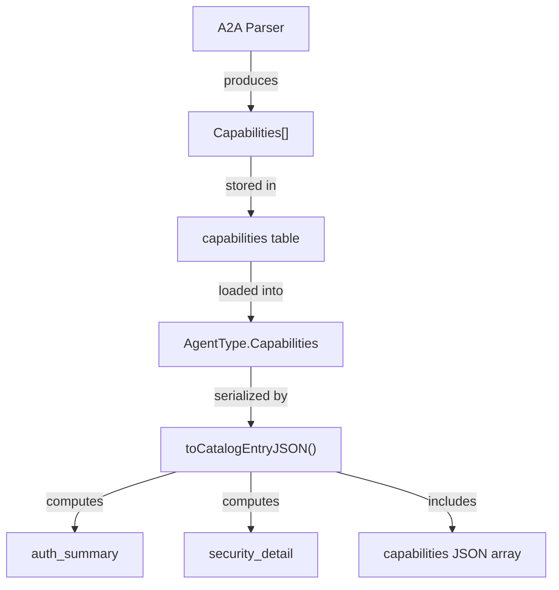

# A2A Security Schemes Implementation Plan

> **For agentic workers:** REQUIRED SUB-SKILL: Use superpowers:subagent-driven-development (recommended) or superpowers:executing-plans to implement this plan task-by-task. Steps use checkbox (`- [ ]`) syntax for tracking.

**Goal:** Parse, store, and display A2A security schemes and requirements from Agent Cards, providing platform engineers with clear authentication documentation directly in the AgentLens UI.

**Architecture:** Pure capability storage per ADR-001. Security schemes (`a2a.security_scheme`) and requirements (`a2a.security_requirement`) are stored in the existing `capabilities` table via `capabilityToRow`/`rowToCapability`. No new tables, no new plugins, no parallel storage. The enriched `A2ASecurityScheme` struct carries all OAuth flows, scopes, and URLs in the `properties` JSON column. `auth_summary` is computed at serialization time from the capabilities slice. Detail views read security data from `AgentType.Capabilities` filtered by kind.

**Tech Stack:** Go 1.26.1, GORM, chi router, React 18, shadcn/ui, Playwright

---

## File Structure

### Backend - Foundation Layer
- **Modify:** `internal/model/a2a_capabilities.go` — enrich `A2ASecurityScheme`, add `A2AOAuthFlow`, add `A2ASecurityRequirement`
- **Modify:** `internal/model/agent.go` — add `authSummaryJSON` to `catalogEntryJSON`, add `buildAuthSummary()`

### Backend - Parser Layer
- **Modify:** `plugins/parsers/a2a/validation.go` — update `fullCard` and `fullSkill` for dual-format parsing
- **Modify:** `plugins/parsers/a2a/a2a.go` — add `buildSecurityCaps()` and `buildSecurityRequirements()`, extend `Parse()`
- **Create:** `plugins/parsers/a2a/testdata/v10_bearer_only.json` — test fixture
- **Create:** `plugins/parsers/a2a/testdata/v10_apikey_header.json` — test fixture
- **Create:** `plugins/parsers/a2a/testdata/v10_oauth2_authcode.json` — test fixture
- **Create:** `plugins/parsers/a2a/testdata/v10_oauth2_deprecated_flows.json` — test fixture
- **Create:** `plugins/parsers/a2a/testdata/v10_oauth2_device_code.json` — test fixture
- **Create:** `plugins/parsers/a2a/testdata/v10_oidc.json` — test fixture
- **Create:** `plugins/parsers/a2a/testdata/v10_mtls.json` — test fixture
- **Create:** `plugins/parsers/a2a/testdata/v10_multiple_schemes.json` — test fixture
- **Create:** `plugins/parsers/a2a/testdata/v10_skill_security.json` — test fixture
- **Create:** `plugins/parsers/a2a/testdata/v10_no_security.json` — test fixture
- **Create:** `plugins/parsers/a2a/testdata/v10_unknown_scheme_type.json` — test fixture
- **Create:** `plugins/parsers/a2a/testdata/v03_security_array.json` — test fixture

### Backend - API Layer
- **Modify:** `internal/model/agent.go` — extend `catalogEntryJSON` with `AuthSummary` and `SecurityDetail` computed views

### Frontend
- **Create:** `web/src/routes/catalog/detail/AuthenticationSection.tsx` — main authentication section
- **Create:** `web/src/routes/catalog/detail/SchemeCard.tsx` — individual scheme card renderer
- **Create:** `web/src/routes/catalog/detail/SecurityRequirementsBanner.tsx` — "Required to connect" banner
- **Create:** `web/src/routes/catalog/detail/ConnectionRecipe.tsx` — curl example generator
- **Create:** `web/src/components/AuthBadge.tsx` — compact auth badge for list views
- **Create:** `web/src/lib/securityUtils.ts` — utility functions and TypeScript types
- **Modify:** `web/src/routes/catalog/detail/page.tsx` — integrate AuthenticationSection
- **Modify:** `web/src/routes/catalog/list/page.tsx` — add auth badge column

### Tests
- **Create:** `e2e/tests/a2a-security-display.spec.ts` — E2E tests for security display

### Documentation
- **Modify:** `docs/api.md` — document new response fields (`auth_summary`, security capabilities)
- **Modify:** `docs/end-user-guide.md` — document Authentication section with screenshots
- **Modify:** `docs/architecture.md` — document new capability kinds
- **Create:** `docs/images/security-detail-bearer.png` — screenshot from E2E
- **Create:** `docs/images/security-detail-oauth2.png` — screenshot from E2E
- **Create:** `docs/images/security-detail-no-auth.png` — screenshot from E2E
- **Create:** `docs/images/catalog-list-auth-badges.png` — screenshot from E2E
- **Create:** `docs/images/security-requirements-banner.png` — screenshot from E2E
- **Create:** `docs/images/connection-recipe.png` — screenshot from E2E

---

## Task 1: Foundation — Enrich A2ASecurityScheme Model

**Files:**
- Modify: `internal/model/a2a_capabilities.go`

- [ ] **Step 1: Write test for enriched A2ASecurityScheme with OAuth flows**

```go
// Add to internal/model/a2a_capabilities_test.go

func TestA2ASecurityScheme_OAuthFlows(t *testing.T) {
	scheme := &A2ASecurityScheme{
		SchemeName:  "oauth2Auth",
		Type:        "oauth2",
		Description: "OAuth 2.0 authentication",
		OAuthFlows: []A2AOAuthFlow{
			{
				FlowType:         "authorizationCode",
				AuthorizationURL: "https://auth.example.com/authorize",
				TokenURL:         "https://auth.example.com/token",
				Scopes: map[string]string{
					"read":  "Read access",
					"write": "Write access",
				},
				Deprecated: false,
			},
		},
	}

	// Test Kind
	if scheme.Kind() != "a2a.security_scheme" {
		t.Errorf("Expected kind 'a2a.security_scheme', got '%s'", scheme.Kind())
	}

	// Test Validate
	if err := scheme.Validate(); err != nil {
		t.Errorf("Expected no validation error, got: %v", err)
	}

	// Test JSON round-trip
	data, err := json.Marshal(scheme)
	if err != nil {
		t.Fatalf("Failed to marshal: %v", err)
	}

	var decoded A2ASecurityScheme
	if err := json.Unmarshal(data, &decoded); err != nil {
		t.Fatalf("Failed to unmarshal: %v", err)
	}

	if decoded.SchemeName != scheme.SchemeName {
		t.Errorf("Expected SchemeName '%s', got '%s'", scheme.SchemeName, decoded.SchemeName)
	}
	if len(decoded.OAuthFlows) != 1 {
		t.Errorf("Expected 1 OAuth flow, got %d", len(decoded.OAuthFlows))
	}
	if decoded.OAuthFlows[0].FlowType != "authorizationCode" {
		t.Errorf("Expected flowType 'authorizationCode', got '%s'", decoded.OAuthFlows[0].FlowType)
	}
}

func TestA2ASecurityScheme_APIKey(t *testing.T) {
	scheme := &A2ASecurityScheme{
		SchemeName:     "apiKeyAuth",
		Type:           "apiKey",
		APIKeyLocation: "header",
		APIKeyName:     "X-API-Key",
		Description:    "API Key in header",
	}

	if err := scheme.Validate(); err != nil {
		t.Errorf("Expected no validation error, got: %v", err)
	}

	data, err := json.Marshal(scheme)
	if err != nil {
		t.Fatalf("Failed to marshal: %v", err)
	}

	var decoded A2ASecurityScheme
	if err := json.Unmarshal(data, &decoded); err != nil {
		t.Fatalf("Failed to unmarshal: %v", err)
	}

	if decoded.APIKeyLocation != "header" {
		t.Errorf("Expected location 'header', got '%s'", decoded.APIKeyLocation)
	}
	if decoded.APIKeyName != "X-API-Key" {
		t.Errorf("Expected name 'X-API-Key', got '%s'", decoded.APIKeyName)
	}
}

func TestA2ASecurityScheme_HTTP(t *testing.T) {
	scheme := &A2ASecurityScheme{
		SchemeName:   "httpAuth",
		Type:         "http",
		HTTPScheme:   "Bearer",
		BearerFormat: "JWT",
		Description:  "Bearer JWT",
	}

	if err := scheme.Validate(); err != nil {
		t.Errorf("Expected no validation error, got: %v", err)
	}

	data, err := json.Marshal(scheme)
	if err != nil {
		t.Fatalf("Failed to marshal: %v", err)
	}

	var decoded A2ASecurityScheme
	if err := json.Unmarshal(data, &decoded); err != nil {
		t.Fatalf("Failed to unmarshal: %v", err)
	}

	if decoded.HTTPScheme != "Bearer" {
		t.Errorf("Expected scheme 'Bearer', got '%s'", decoded.HTTPScheme)
	}
	if decoded.BearerFormat != "JWT" {
		t.Errorf("Expected format 'JWT', got '%s'", decoded.BearerFormat)
	}
}

func TestA2ASecurityScheme_Validate_EmptyType(t *testing.T) {
	scheme := &A2ASecurityScheme{
		SchemeName: "test",
		Type:       "",
	}

	err := scheme.Validate()
	if err == nil {
		t.Error("Expected validation error for empty type")
	}
}
```

- [ ] **Step 2: Run test to verify it fails**

Run: `rtk go test ./internal/model/... -run TestA2ASecurityScheme -v`

Expected: FAIL with "undefined: A2AOAuthFlow" and missing fields

- [ ] **Step 3: Add A2AOAuthFlow type to a2a_capabilities.go**

```go
// Add after existing A2ASecurityScheme definition in internal/model/a2a_capabilities.go

// A2AOAuthFlow represents a single OAuth 2.0 flow variant.
type A2AOAuthFlow struct {
	FlowType         string            `json:"flow_type"`                    // "authorizationCode" | "clientCredentials" | "deviceCode" | "implicit" | "password"
	AuthorizationURL string            `json:"authorization_url,omitempty"`
	TokenURL         string            `json:"token_url,omitempty"`
	RefreshURL       string            `json:"refresh_url,omitempty"`
	DeviceAuthURL    string            `json:"device_auth_url,omitempty"`    // deviceCode flow only
	Scopes           map[string]string `json:"scopes,omitempty"`             // scope -> description
	Deprecated       bool              `json:"deprecated,omitempty"`         // true for implicit/password
}
```

- [ ] **Step 4: Enrich A2ASecurityScheme with full fields**

```go
// Replace existing A2ASecurityScheme in internal/model/a2a_capabilities.go

// A2ASecurityScheme represents a security scheme for A2A communication.
// kind: "a2a.security_scheme"
//
// This is a union type discriminated by Type. Only fields relevant to the
// scheme type are populated. Consumers switch on Type to determine which
// fields to read.
type A2ASecurityScheme struct {
	// Common
	SchemeName  string `json:"scheme_name"`           // key from Agent Card's securitySchemes map
	Type        string `json:"type"`                   // "apiKey" | "http" | "oauth2" | "openIdConnect" | "mutualTls"
	Description string `json:"description,omitempty"`

	// apiKey
	APIKeyLocation string `json:"api_key_location,omitempty"` // "header" | "query" | "cookie"
	APIKeyName     string `json:"api_key_name,omitempty"`     // e.g. "X-API-Key"

	// http
	HTTPScheme   string `json:"http_scheme,omitempty"`   // "Bearer" | "Basic" | "Digest"
	BearerFormat string `json:"bearer_format,omitempty"` // e.g. "JWT"

	// oauth2
	OAuthFlows        []A2AOAuthFlow `json:"oauth_flows,omitempty"`
	OAuth2MetadataURL string         `json:"oauth2_metadata_url,omitempty"`

	// openIdConnect
	OpenIDConnectURL string `json:"openid_connect_url,omitempty"`

	// Backward compat (v0.3 parser used these)
	Method string `json:"method,omitempty"`
	Name   string `json:"name,omitempty"`
}

func (a *A2ASecurityScheme) Kind() string { return "a2a.security_scheme" }

func (a *A2ASecurityScheme) Validate() error {
	if a.Type == "" {
		return errors.New("a2a.security_scheme: type must not be empty")
	}
	return nil
}
```

- [ ] **Step 5: Run test to verify it passes**

Run: `rtk go test ./internal/model/... -run TestA2ASecurityScheme -v`

Expected: PASS

- [ ] **Step 6: Commit**

```bash
rtk git add internal/model/a2a_capabilities.go internal/model/a2a_capabilities_test.go
rtk git commit -m "feat(model): enrich A2ASecurityScheme with OAuth flows and full scheme fields"
```

---

## Task 2: Foundation — Add A2ASecurityRequirement Capability

**Files:**
- Modify: `internal/model/a2a_capabilities.go`

- [ ] **Step 1: Write test for A2ASecurityRequirement**

```go
// Add to internal/model/a2a_capabilities_test.go

func TestA2ASecurityRequirement_Validate(t *testing.T) {
	tests := []struct {
		name    string
		req     *A2ASecurityRequirement
		wantErr bool
	}{
		{
			name: "valid requirement",
			req: &A2ASecurityRequirement{
				Schemes: map[string][]string{
					"oauth2Auth": {"read", "write"},
				},
			},
			wantErr: false,
		},
		{
			name: "valid requirement with empty scopes",
			req: &A2ASecurityRequirement{
				Schemes: map[string][]string{
					"apiKeyAuth": {},
				},
			},
			wantErr: false,
		},
		{
			name: "valid per-skill requirement",
			req: &A2ASecurityRequirement{
				Schemes: map[string][]string{
					"apiKeyAuth": {},
				},
				SkillRef: "createDocument",
			},
			wantErr: false,
		},
		{
			name: "invalid empty schemes",
			req: &A2ASecurityRequirement{
				Schemes: map[string][]string{},
			},
			wantErr: true,
		},
	}

	for _, tt := range tests {
		t.Run(tt.name, func(t *testing.T) {
			err := tt.req.Validate()
			if (err != nil) != tt.wantErr {
				t.Errorf("Validate() error = %v, wantErr %v", err, tt.wantErr)
			}
		})
	}
}

func TestA2ASecurityRequirement_Kind(t *testing.T) {
	req := &A2ASecurityRequirement{
		Schemes: map[string][]string{
			"oauth2Auth": {"read"},
		},
	}

	if req.Kind() != "a2a.security_requirement" {
		t.Errorf("Expected kind 'a2a.security_requirement', got '%s'", req.Kind())
	}
}

func TestA2ASecurityRequirement_JSONRoundTrip(t *testing.T) {
	req := &A2ASecurityRequirement{
		Schemes: map[string][]string{
			"oauth2Auth": {"read", "write"},
			"apiKeyAuth": {},
		},
		SkillRef: "createDocument",
	}

	data, err := json.Marshal(req)
	if err != nil {
		t.Fatalf("Failed to marshal: %v", err)
	}

	var decoded A2ASecurityRequirement
	if err := json.Unmarshal(data, &decoded); err != nil {
		t.Fatalf("Failed to unmarshal: %v", err)
	}

	if len(decoded.Schemes) != 2 {
		t.Errorf("Expected 2 schemes, got %d", len(decoded.Schemes))
	}
	if decoded.SkillRef != "createDocument" {
		t.Errorf("Expected SkillRef 'createDocument', got '%s'", decoded.SkillRef)
	}
}
```

- [ ] **Step 2: Run test to verify it fails**

Run: `rtk go test ./internal/model/... -run TestA2ASecurityRequirement -v`

Expected: FAIL with "undefined: A2ASecurityRequirement"

- [ ] **Step 3: Implement A2ASecurityRequirement**

```go
// Add to internal/model/a2a_capabilities.go

// A2ASecurityRequirement declares which scheme(s) a client MUST use.
// kind: "a2a.security_requirement"
//
// Map key = scheme name (matching a key in SecuritySchemes).
// Map value = list of required scopes (empty = no specific scopes).
// Multiple A2ASecurityRequirement entries on an AgentType are OR'd:
// the client must satisfy at least one complete entry.
type A2ASecurityRequirement struct {
	Schemes  map[string][]string `json:"schemes"`
	SkillRef string              `json:"skill_ref,omitempty"` // non-empty = per-skill override
}

func (a *A2ASecurityRequirement) Kind() string { return "a2a.security_requirement" }

func (a *A2ASecurityRequirement) Validate() error {
	if len(a.Schemes) == 0 {
		return errors.New("a2a.security_requirement: schemes must not be empty")
	}
	return nil
}
```

- [ ] **Step 4: Register capability in init()**

```go
// Add to init() in internal/model/a2a_capabilities.go

RegisterCapability("a2a.security_requirement", func() Capability { return &A2ASecurityRequirement{} }, false)
```

- [ ] **Step 5: Run test to verify it passes**

Run: `rtk go test ./internal/model/... -run TestA2ASecurityRequirement -v`

Expected: PASS

- [ ] **Step 6: Commit**

```bash
rtk git add internal/model/a2a_capabilities.go internal/model/a2a_capabilities_test.go
rtk git commit -m "feat(model): add A2ASecurityRequirement capability kind"
```

---

## Task 3: Parser — Test Fixtures for Security Schemes

> **Note:** Old Tasks 3-6 (SecurityDetail transport models, SecurityStorePlugin interface,
> plugin implementation, main.go wiring) have been REMOVED per ADR-001. Security data is
> stored entirely through the existing `capabilities` table. No new tables, plugins, or
> kernel interfaces are needed.

**Files:**
- Create: `plugins/parsers/a2a/testdata/v10_bearer_only.json`
- Create: `plugins/parsers/a2a/testdata/v10_apikey_header.json`
- Create: `plugins/parsers/a2a/testdata/v10_oauth2_authcode.json`
- Create: `plugins/parsers/a2a/testdata/v10_oauth2_deprecated_flows.json`
- Create: `plugins/parsers/a2a/testdata/v10_oauth2_device_code.json`
- Create: `plugins/parsers/a2a/testdata/v10_oidc.json`
- Create: `plugins/parsers/a2a/testdata/v10_mtls.json`
- Create: `plugins/parsers/a2a/testdata/v10_multiple_schemes.json`
- Create: `plugins/parsers/a2a/testdata/v10_skill_security.json`
- Create: `plugins/parsers/a2a/testdata/v10_no_security.json`
- Create: `plugins/parsers/a2a/testdata/v10_unknown_scheme_type.json`
- Create: `plugins/parsers/a2a/testdata/v03_security_array.json`

- [ ] **Step 1: Create v10_bearer_only.json**

```json
{
  "version": "1.0",
  "name": "Bearer Auth Agent",
  "description": "Agent with Bearer JWT authentication",
  "url": "https://agent.example.com",
  "securitySchemes": {
    "httpAuth": {
      "type": "http",
      "scheme": "Bearer",
      "bearerFormat": "JWT",
      "description": "JWT Bearer token"
    }
  },
  "securityRequirements": [
    {
      "httpAuth": []
    }
  ],
  "skills": []
}
```

- [ ] **Step 2: Create v10_apikey_header.json**

```json
{
  "version": "1.0",
  "name": "API Key Agent",
  "description": "Agent with API Key in header",
  "url": "https://agent.example.com",
  "securitySchemes": {
    "apiKeyAuth": {
      "type": "apiKey",
      "in": "header",
      "name": "X-API-Key",
      "description": "API Key authentication"
    }
  },
  "securityRequirements": [
    {
      "apiKeyAuth": []
    }
  ],
  "skills": []
}
```

- [ ] **Step 3: Create v10_oauth2_authcode.json**

```json
{
  "version": "1.0",
  "name": "OAuth2 Agent",
  "description": "Agent with OAuth 2.0",
  "url": "https://agent.example.com",
  "securitySchemes": {
    "oauth2Auth": {
      "type": "oauth2",
      "flows": {
        "authorizationCode": {
          "authorizationUrl": "https://auth.example.com/authorize",
          "tokenUrl": "https://auth.example.com/token",
          "refreshUrl": "https://auth.example.com/refresh",
          "scopes": {
            "read": "Read access",
            "write": "Write access",
            "admin": "Admin access"
          }
        }
      },
      "oauth2MetadataUrl": "https://auth.example.com/.well-known/oauth-authorization-server"
    }
  },
  "securityRequirements": [
    {
      "oauth2Auth": ["read", "write"]
    }
  ],
  "skills": []
}
```

- [ ] **Step 4: Create v10_oauth2_deprecated_flows.json**

```json
{
  "version": "1.0",
  "name": "OAuth2 Deprecated Flows",
  "description": "Agent with deprecated OAuth flows",
  "url": "https://agent.example.com",
  "securitySchemes": {
    "oauth2Auth": {
      "type": "oauth2",
      "flows": {
        "implicit": {
          "authorizationUrl": "https://auth.example.com/authorize",
          "scopes": {
            "read": "Read access"
          }
        },
        "password": {
          "tokenUrl": "https://auth.example.com/token",
          "scopes": {
            "read": "Read access"
          }
        },
        "clientCredentials": {
          "tokenUrl": "https://auth.example.com/token",
          "scopes": {
            "read": "Read access"
          }
        }
      }
    }
  },
  "skills": []
}
```

- [ ] **Step 5: Create v10_oauth2_device_code.json**

```json
{
  "version": "1.0",
  "name": "OAuth2 Device Code",
  "description": "Agent with device code flow",
  "url": "https://agent.example.com",
  "securitySchemes": {
    "oauth2Auth": {
      "type": "oauth2",
      "flows": {
        "deviceCode": {
          "deviceAuthorizationUrl": "https://auth.example.com/device",
          "tokenUrl": "https://auth.example.com/token",
          "scopes": {
            "read": "Read access"
          }
        }
      }
    }
  },
  "skills": []
}
```

- [ ] **Step 6: Create v10_oidc.json**

```json
{
  "version": "1.0",
  "name": "OIDC Agent",
  "description": "Agent with OpenID Connect",
  "url": "https://agent.example.com",
  "securitySchemes": {
    "oidcAuth": {
      "type": "openIdConnect",
      "openIdConnectUrl": "https://auth.example.com/.well-known/openid-configuration",
      "description": "OpenID Connect authentication"
    }
  },
  "securityRequirements": [
    {
      "oidcAuth": []
    }
  ],
  "skills": []
}
```

- [ ] **Step 7: Create v10_mtls.json**

```json
{
  "version": "1.0",
  "name": "mTLS Agent",
  "description": "Agent with mutual TLS",
  "url": "https://agent.example.com",
  "securitySchemes": {
    "mtlsAuth": {
      "type": "mutualTls",
      "description": "Mutual TLS authentication"
    }
  },
  "securityRequirements": [
    {
      "mtlsAuth": []
    }
  ],
  "skills": []
}
```

- [ ] **Step 8: Create v10_multiple_schemes.json**

```json
{
  "version": "1.0",
  "name": "Multiple Schemes Agent",
  "description": "Agent with multiple auth schemes",
  "url": "https://agent.example.com",
  "securitySchemes": {
    "httpAuth": {
      "type": "http",
      "scheme": "Bearer",
      "bearerFormat": "JWT"
    },
    "apiKeyAuth": {
      "type": "apiKey",
      "in": "header",
      "name": "X-API-Key"
    },
    "oauth2Auth": {
      "type": "oauth2",
      "flows": {
        "clientCredentials": {
          "tokenUrl": "https://auth.example.com/token",
          "scopes": {
            "read": "Read access"
          }
        }
      }
    }
  },
  "securityRequirements": [
    {
      "httpAuth": []
    },
    {
      "apiKeyAuth": []
    }
  ],
  "skills": []
}
```

- [ ] **Step 9: Create v10_skill_security.json**

```json
{
  "version": "1.0",
  "name": "Skill Security Agent",
  "description": "Agent with per-skill security",
  "url": "https://agent.example.com",
  "securitySchemes": {
    "httpAuth": {
      "type": "http",
      "scheme": "Bearer"
    },
    "apiKeyAuth": {
      "type": "apiKey",
      "in": "header",
      "name": "X-API-Key"
    }
  },
  "securityRequirements": [
    {
      "httpAuth": []
    }
  ],
  "skills": [
    {
      "id": "createDocument",
      "name": "createDocument",
      "description": "Create a new document",
      "securityRequirements": [
        {
          "apiKeyAuth": []
        }
      ]
    },
    {
      "id": "readDocument",
      "name": "readDocument",
      "description": "Read a document"
    }
  ]
}
```

- [ ] **Step 10: Create v10_no_security.json**

```json
{
  "version": "1.0",
  "name": "Open Agent",
  "description": "Agent with no security",
  "url": "https://agent.example.com",
  "skills": []
}
```

- [ ] **Step 11: Create v10_unknown_scheme_type.json**

```json
{
  "version": "1.0",
  "name": "Unknown Scheme Agent",
  "description": "Agent with unknown scheme type",
  "url": "https://agent.example.com",
  "securitySchemes": {
    "customAuth": {
      "type": "customAuth",
      "description": "Custom authentication scheme"
    }
  },
  "skills": []
}
```

- [ ] **Step 12: Create v03_security_array.json**

```json
{
  "version": "0.3",
  "name": "V0.3 Security Agent",
  "description": "Agent with v0.3 array format security",
  "url": "https://agent.example.com",
  "supportsExtendedAgentCard": true,
  "securitySchemes": [
    {
      "type": "http",
      "method": "Bearer",
      "name": "Authorization",
      "description": "Bearer token"
    },
    {
      "type": "apiKey",
      "method": "header",
      "name": "X-API-Key",
      "description": "API Key"
    }
  ],
  "skills": []
}
```

- [ ] **Step 13: Commit**

```bash
rtk git add plugins/parsers/a2a/testdata/
rtk git commit -m "test(parser): add security scheme test fixtures"
```

---

## Task 4: Parser — Dual-Format Security Schemes Parsing

**Files:**
- Modify: `plugins/parsers/a2a/validation.go`
- Modify: `plugins/parsers/a2a/a2a.go`
- Create: `plugins/parsers/a2a/a2a_test.go` (if doesn't exist, or extend existing)

- [ ] **Step 1: Write test for parsing v1.0 Bearer scheme**

```go
// Add to plugins/parsers/a2a/a2a_test.go

func TestParse_SecuritySchemes_V10_Bearer(t *testing.T) {
	data, err := os.ReadFile("testdata/v10_bearer_only.json")
	if err != nil {
		t.Fatalf("Failed to read fixture: %v", err)
	}

	plugin := &Plugin{}
	agentType, err := plugin.Parse(data)
	if err != nil {
		t.Fatalf("Parse failed: %v", err)
	}

	// Find security scheme capabilities
	var schemes []*model.A2ASecurityScheme
	for _, cap := range agentType.Capabilities {
		if cap.Kind() == "a2a.security_scheme" {
			schemes = append(schemes, cap.(*model.A2ASecurityScheme))
		}
	}

	if len(schemes) != 1 {
		t.Fatalf("Expected 1 security scheme, got %d", len(schemes))
	}

	scheme := schemes[0]
	if scheme.SchemeName != "httpAuth" {
		t.Errorf("Expected SchemeName 'httpAuth', got '%s'", scheme.SchemeName)
	}
	if scheme.Type != "http" {
		t.Errorf("Expected Type 'http', got '%s'", scheme.Type)
	}
	if scheme.HTTPScheme != "Bearer" {
		t.Errorf("Expected HTTPScheme 'Bearer', got '%s'", scheme.HTTPScheme)
	}
	if scheme.BearerFormat != "JWT" {
		t.Errorf("Expected BearerFormat 'JWT', got '%s'", scheme.BearerFormat)
	}
}

func TestParse_SecuritySchemes_V10_OAuth2(t *testing.T) {
	data, err := os.ReadFile("testdata/v10_oauth2_authcode.json")
	if err != nil {
		t.Fatalf("Failed to read fixture: %v", err)
	}

	plugin := &Plugin{}
	agentType, err := plugin.Parse(data)
	if err != nil {
		t.Fatalf("Parse failed: %v", err)
	}

	var schemes []*model.A2ASecurityScheme
	for _, cap := range agentType.Capabilities {
		if cap.Kind() == "a2a.security_scheme" {
			schemes = append(schemes, cap.(*model.A2ASecurityScheme))
		}
	}

	if len(schemes) != 1 {
		t.Fatalf("Expected 1 security scheme, got %d", len(schemes))
	}

	scheme := schemes[0]
	if scheme.Type != "oauth2" {
		t.Errorf("Expected Type 'oauth2', got '%s'", scheme.Type)
	}
	if len(scheme.OAuthFlows) != 1 {
		t.Errorf("Expected 1 OAuth flow, got %d", len(scheme.OAuthFlows))
	}
	if scheme.OAuthFlows[0].FlowType != "authorizationCode" {
		t.Errorf("Expected flowType 'authorizationCode', got '%s'", scheme.OAuthFlows[0].FlowType)
	}
	if len(scheme.OAuthFlows[0].Scopes) != 3 {
		t.Errorf("Expected 3 scopes, got %d", len(scheme.OAuthFlows[0].Scopes))
	}
}

func TestParse_SecuritySchemes_V03_Array(t *testing.T) {
	data, err := os.ReadFile("testdata/v03_security_array.json")
	if err != nil {
		t.Fatalf("Failed to read fixture: %v", err)
	}

	plugin := &Plugin{}
	agentType, err := plugin.Parse(data)
	if err != nil {
		t.Fatalf("Parse failed: %v", err)
	}

	var schemes []*model.A2ASecurityScheme
	for _, cap := range agentType.Capabilities {
		if cap.Kind() == "a2a.security_scheme" {
			schemes = append(schemes, cap.(*model.A2ASecurityScheme))
		}
	}

	if len(schemes) != 2 {
		t.Fatalf("Expected 2 security schemes (v0.3 array format), got %d", len(schemes))
	}

	// v0.3 auto-generates SchemeName from type
	foundHTTP := false
	for _, s := range schemes {
		if s.Type == "http" {
			foundHTTP = true
			if s.Method != "Bearer" {
				t.Errorf("Expected Method 'Bearer', got '%s'", s.Method)
			}
		}
	}
	if !foundHTTP {
		t.Error("Expected to find http scheme in v0.3 array")
	}
}
```

- [ ] **Step 2: Run test to verify it fails**

Run: `rtk go test ./plugins/parsers/a2a/... -run TestParse_SecuritySchemes -v`

Expected: FAIL with missing parsing logic

- [ ] **Step 3: Update fullCard to use json.RawMessage for SecuritySchemes**

```go
// In plugins/parsers/a2a/validation.go

type fullCard struct {
	// ...existing fields...
	SecuritySchemes      json.RawMessage     `json:"securitySchemes,omitempty"`    // array (v0.3) OR map (v1.0)
	SecurityRequirements []json.RawMessage   `json:"securityRequirements,omitempty"` // v1.0
}
```

> **IMPORTANT:** This changes `SecuritySchemes` from `[]fullSecurity` to `json.RawMessage`.
> You MUST also update `buildA2AMetaCaps()` in `a2a.go` to **remove** the existing
> `for _, sec := range card.SecuritySchemes { ... }` loop (lines ~139-145) that iterates
> over `card.SecuritySchemes` as `[]fullSecurity` — it will no longer compile.
> Security scheme capabilities are now built by the new `buildSecurityCaps()` function below.
> Similarly, update `buildPreview()` in `validation.go` to handle the new type — the loop
> `for _, s := range card.SecuritySchemes { schemeNames = append(..., s.Type) }` must be
> replaced. One approach: attempt JSON unmarshal into `map[string]json.RawMessage` first
> (v1.0 — use map keys), then `[]json.RawMessage` (v0.3 — extract `type` from each element).

- [ ] **Step 3b: Remove old security loop from buildA2AMetaCaps**

```go
// In plugins/parsers/a2a/a2a.go buildA2AMetaCaps()
// DELETE the following block (it no longer compiles with json.RawMessage):
//
//   for _, sec := range card.SecuritySchemes {
//       caps = append(caps, &model.A2ASecurityScheme{
//           Type:   sec.Type,
//           Method: sec.Method,
//           Name:   sec.Name,
//       })
//   }
//
// Security scheme capabilities are now produced by buildSecurityCaps() called from Parse().
```

- [ ] **Step 3c: Update buildPreview in validation.go**

```go
// In plugins/parsers/a2a/validation.go buildPreview()
// Replace the old SecuritySchemes loop with dual-format parsing:

func buildSecurityPreviewNames(raw json.RawMessage) []string {
	if len(raw) == 0 {
		return nil
	}

	// Try v1.0 map
	var v10 map[string]json.RawMessage
	if err := json.Unmarshal(raw, &v10); err == nil {
		names := make([]string, 0, len(v10))
		for name := range v10 {
			names = append(names, name)
		}
		return names
	}

	// Try v0.3 array
	var v03 []struct{ Type string `json:"type"` }
	if err := json.Unmarshal(raw, &v03); err == nil {
		names := make([]string, 0, len(v03))
		for _, s := range v03 {
			names = append(names, s.Type)
		}
		return names
	}

	return nil
}

// Then in buildPreview, replace:
//   schemeNames := make([]string, 0, len(card.SecuritySchemes))
//   for _, s := range card.SecuritySchemes { schemeNames = append(schemeNames, s.Type) }
// With:
//   schemeNames := buildSecurityPreviewNames(card.SecuritySchemes)
```

- [ ] **Step 4: Add buildSecurityCaps function**

```go
// Add to plugins/parsers/a2a/a2a.go

// buildSecurityCaps parses security schemes from the card into capabilities.
// Supports both v0.3 array format and v1.0 named map format.
// Returns only []model.Capability — no parallel SecurityDetail.
func buildSecurityCaps(card *fullCard) ([]model.Capability, error) {
	var caps []model.Capability

	if len(card.SecuritySchemes) == 0 {
		return caps, nil
	}

	// Try v1.0 map format first
	var v10Schemes map[string]json.RawMessage
	if err := json.Unmarshal(card.SecuritySchemes, &v10Schemes); err == nil {
		for schemeName, schemeData := range v10Schemes {
			scheme, err := parseSecurityScheme(schemeName, schemeData)
			if err != nil {
				slog.Warn("Failed to parse security scheme", "scheme", schemeName, "error", err)
				continue
			}
			caps = append(caps, scheme)
		}
		return caps, nil
	}

	// Try v0.3 array format
	var v03Schemes []json.RawMessage
	if err := json.Unmarshal(card.SecuritySchemes, &v03Schemes); err == nil {
		for i, schemeData := range v03Schemes {
			var typeHolder struct {
				Type string `json:"type"`
			}
			if err := json.Unmarshal(schemeData, &typeHolder); err != nil {
				slog.Warn("Failed to extract type from v0.3 scheme", "index", i, "error", err)
				continue
			}
			schemeName := typeHolder.Type + "Auth"
			scheme, err := parseSecuritySchemeV03(schemeName, schemeData)
			if err != nil {
				slog.Warn("Failed to parse v0.3 security scheme", "index", i, "error", err)
				continue
			}
			caps = append(caps, scheme)
		}
		return caps, nil
	}

	return caps, fmt.Errorf("securitySchemes is neither v1.0 map nor v0.3 array")
}

func parseSecurityScheme(schemeName string, data json.RawMessage) (*model.A2ASecurityScheme, error) {
	var raw map[string]interface{}
	if err := json.Unmarshal(data, &raw); err != nil {
		return nil, err
	}

	schemeType, ok := raw["type"].(string)
	if !ok || schemeType == "" {
		return nil, fmt.Errorf("missing or invalid type")
	}

	scheme := &model.A2ASecurityScheme{
		SchemeName: schemeName,
		Name:       schemeName, // backward compat — used by capabilityToRow for name column
		Type:       schemeType,
	}

	if desc, ok := raw["description"].(string); ok {
		scheme.Description = desc
	}

	switch schemeType {
	case "apiKey":
		if in, ok := raw["in"].(string); ok {
			scheme.APIKeyLocation = in
		}
		if name, ok := raw["name"].(string); ok {
			scheme.APIKeyName = name
		}

	case "http":
		if httpScheme, ok := raw["scheme"].(string); ok {
			scheme.HTTPScheme = httpScheme
		}
		if bearerFormat, ok := raw["bearerFormat"].(string); ok {
			scheme.BearerFormat = bearerFormat
		}

	case "oauth2":
		if flowsRaw, ok := raw["flows"].(map[string]interface{}); ok {
			for flowType, flowData := range flowsRaw {
				flowMap, ok := flowData.(map[string]interface{})
				if !ok {
					continue
				}

				flow := model.A2AOAuthFlow{
					FlowType: flowType,
				}

				// Mark deprecated flows
				if flowType == "implicit" || flowType == "password" {
					flow.Deprecated = true
					slog.Warn("Deprecated OAuth flow detected", "flow", flowType, "scheme", schemeName)
				}

				if authURL, ok := flowMap["authorizationUrl"].(string); ok {
					flow.AuthorizationURL = authURL
				}
				if tokenURL, ok := flowMap["tokenUrl"].(string); ok {
					flow.TokenURL = tokenURL
				}
				if refreshURL, ok := flowMap["refreshUrl"].(string); ok {
					flow.RefreshURL = refreshURL
				}
				if deviceAuthURL, ok := flowMap["deviceAuthorizationUrl"].(string); ok {
					flow.DeviceAuthURL = deviceAuthURL
				}
				if scopesRaw, ok := flowMap["scopes"].(map[string]interface{}); ok {
					scopes := make(map[string]string)
					for k, v := range scopesRaw {
						if vStr, ok := v.(string); ok {
							scopes[k] = vStr
						}
					}
					flow.Scopes = scopes
				}

				scheme.OAuthFlows = append(scheme.OAuthFlows, flow)
			}
		}
		if metadataURL, ok := raw["oauth2MetadataUrl"].(string); ok {
			scheme.OAuth2MetadataURL = metadataURL
		}

	case "openIdConnect":
		if oidcURL, ok := raw["openIdConnectUrl"].(string); ok {
			scheme.OpenIDConnectURL = oidcURL
		}

	case "mutualTls":
		// No additional fields

	default:
		slog.Warn("Unknown security scheme type", "type", schemeType, "scheme", schemeName)
	}

	return scheme, nil
}

func parseSecuritySchemeV03(schemeName string, data json.RawMessage) (*model.A2ASecurityScheme, error) {
	var raw map[string]interface{}
	if err := json.Unmarshal(data, &raw); err != nil {
		return nil, err
	}

	schemeType, ok := raw["type"].(string)
	if !ok {
		return nil, fmt.Errorf("missing type in v0.3 scheme")
	}

	scheme := &model.A2ASecurityScheme{
		SchemeName: schemeName,
		Name:       schemeName,
		Type:       schemeType,
	}

	if desc, ok := raw["description"].(string); ok {
		scheme.Description = desc
	}

	// v0.3 uses "method" instead of "scheme"
	if method, ok := raw["method"].(string); ok {
		scheme.Method = method
		if schemeType == "http" {
			scheme.HTTPScheme = method
		}
	}

	// v0.3 uses "name" for the header/query param name
	if name, ok := raw["name"].(string); ok {
		scheme.Name = name
		if schemeType == "apiKey" {
			scheme.APIKeyName = name
		}
	}

	return scheme, nil
}
```

- [ ] **Step 5: Call buildSecurityCaps in Parse**

```go
// In plugins/parsers/a2a/a2a.go Parse function, after buildA2AMetaCaps

securityCaps, err := buildSecurityCaps(&card)
if err != nil {
	slog.Warn("Failed to parse security schemes", "error", err)
} else {
	capabilities = append(capabilities, securityCaps...)
}
```

- [ ] **Step 6: Run test to verify it passes**

Run: `rtk go test ./plugins/parsers/a2a/... -run TestParse_SecuritySchemes -v`

Expected: PASS

- [ ] **Step 7: Commit**

```bash
rtk git add plugins/parsers/a2a/
rtk git commit -m "feat(parser): implement dual-format security schemes parsing (v0.3 + v1.0)"
```

---

## Task 5: Parser — Security Requirements Parsing

**Files:**
- Modify: `plugins/parsers/a2a/a2a.go`
- Modify: `plugins/parsers/a2a/validation.go`

> **ADR-001 note:** Security requirements are stored ONLY as `A2ASecurityRequirement`
> capabilities in the `capabilities` table. No `SecurityDetail`, no `SecurityRequirementDetail`,
> no dual-write. The `fullCard.SecurityRequirements` field must accept `json.RawMessage`
> to handle the raw JSON array-of-objects format from the A2A spec.

- [ ] **Step 1: Add SecurityRequirements field to fullCard**

```go
// In plugins/parsers/a2a/validation.go
// Add field to fullCard struct:

type fullCard struct {
	// ...existing fields...
	SecurityRequirements []json.RawMessage `json:"securityRequirements,omitempty"`
}
```

- [ ] **Step 2: Write test for parsing security requirements**

```go
// Add to plugins/parsers/a2a/a2a_test.go

func TestParse_SecurityRequirements(t *testing.T) {
	data, err := os.ReadFile("testdata/v10_bearer_only.json")
	if err != nil {
		t.Fatalf("Failed to read fixture: %v", err)
	}

	plugin := &Plugin{}
	agentType, err := plugin.Parse(data)
	if err != nil {
		t.Fatalf("Parse failed: %v", err)
	}

	// Find security requirement capabilities
	var reqs []*model.A2ASecurityRequirement
	for _, cap := range agentType.Capabilities {
		if cap.Kind() == "a2a.security_requirement" {
			reqs = append(reqs, cap.(*model.A2ASecurityRequirement))
		}
	}

	if len(reqs) != 1 {
		t.Fatalf("Expected 1 security requirement, got %d", len(reqs))
	}

	req := reqs[0]
	if len(req.Schemes) != 1 {
		t.Errorf("Expected 1 scheme in requirement, got %d", len(req.Schemes))
	}
	if _, ok := req.Schemes["httpAuth"]; !ok {
		t.Error("Expected 'httpAuth' in requirement schemes")
	}
	if req.SkillRef != "" {
		t.Errorf("Expected empty SkillRef for top-level requirement, got '%s'", req.SkillRef)
	}
}

func TestParse_SecurityRequirements_MultipleSchemes(t *testing.T) {
	data, err := os.ReadFile("testdata/v10_multiple_schemes.json")
	if err != nil {
		t.Fatalf("Failed to read fixture: %v", err)
	}

	plugin := &Plugin{}
	agentType, err := plugin.Parse(data)
	if err != nil {
		t.Fatalf("Parse failed: %v", err)
	}

	var reqs []*model.A2ASecurityRequirement
	for _, cap := range agentType.Capabilities {
		if cap.Kind() == "a2a.security_requirement" {
			reqs = append(reqs, cap.(*model.A2ASecurityRequirement))
		}
	}

	if len(reqs) != 2 {
		t.Fatalf("Expected 2 security requirements (OR'd), got %d", len(reqs))
	}
}
```

- [ ] **Step 3: Run test to verify it fails**

Run: `rtk go test ./plugins/parsers/a2a/... -run TestParse_SecurityRequirements -v`

Expected: FAIL with missing requirements parsing

- [ ] **Step 4: Add buildSecurityRequirements function**

```go
// Add to plugins/parsers/a2a/a2a.go

// buildSecurityRequirements parses the top-level securityRequirements array
// from the A2A card. Each entry is an OR'd alternative; within each entry,
// scheme keys are AND'd. Returns only capabilities — no parallel storage.
func buildSecurityRequirements(card *fullCard) ([]model.Capability, error) {
	var caps []model.Capability

	for _, reqData := range card.SecurityRequirements {
		var schemes map[string][]string
		if err := json.Unmarshal(reqData, &schemes); err != nil {
			slog.Warn("Failed to parse security requirement", "error", err)
			continue
		}

		req := &model.A2ASecurityRequirement{
			Schemes:  schemes,
			SkillRef: "", // top-level
		}

		caps = append(caps, req)
	}

	return caps, nil
}
```

- [ ] **Step 5: Call buildSecurityRequirements in Parse**

```go
// In plugins/parsers/a2a/a2a.go Parse function, after buildSecurityCaps

reqCaps, err := buildSecurityRequirements(&card)
if err != nil {
	slog.Warn("Failed to parse security requirements", "error", err)
} else {
	capabilities = append(capabilities, reqCaps...)
}
```

- [ ] **Step 6: Run test to verify it passes**

Run: `rtk go test ./plugins/parsers/a2a/... -run TestParse_SecurityRequirements -v`

Expected: PASS

- [ ] **Step 7: Commit**

```bash
rtk git add plugins/parsers/a2a/
rtk git commit -m "feat(parser): parse top-level security requirements as capabilities"
```

---

## Task 6: Parser — Per-Skill Security Requirements

**Files:**
- Modify: `plugins/parsers/a2a/validation.go`
- Modify: `plugins/parsers/a2a/a2a.go`

> **ADR-001 note:** Per-skill security requirements are stored as `A2ASecurityRequirement`
> capabilities with `SkillRef` set to the skill name. No `SecurityDetail.SkillRequirements`
> map — that was parallel storage. The capabilities table is the single source of truth.

- [ ] **Step 1: Write test for per-skill security**

```go
// Add to plugins/parsers/a2a/a2a_test.go

func TestParse_SkillSecurityRequirements(t *testing.T) {
	data, err := os.ReadFile("testdata/v10_skill_security.json")
	if err != nil {
		t.Fatalf("Failed to read fixture: %v", err)
	}

	plugin := &Plugin{}
	agentType, err := plugin.Parse(data)
	if err != nil {
		t.Fatalf("Parse failed: %v", err)
	}

	// Find all security requirements
	var topLevel []*model.A2ASecurityRequirement
	var skillLevel []*model.A2ASecurityRequirement

	for _, cap := range agentType.Capabilities {
		if cap.Kind() == "a2a.security_requirement" {
			req := cap.(*model.A2ASecurityRequirement)
			if req.SkillRef == "" {
				topLevel = append(topLevel, req)
			} else {
				skillLevel = append(skillLevel, req)
			}
		}
	}

	if len(topLevel) != 1 {
		t.Errorf("Expected 1 top-level requirement, got %d", len(topLevel))
	}

	if len(skillLevel) != 1 {
		t.Fatalf("Expected 1 skill-level requirement, got %d", len(skillLevel))
	}

	skillReq := skillLevel[0]
	if skillReq.SkillRef != "createDocument" {
		t.Errorf("Expected SkillRef 'createDocument', got '%s'", skillReq.SkillRef)
	}
	if _, ok := skillReq.Schemes["apiKeyAuth"]; !ok {
		t.Error("Expected 'apiKeyAuth' in skill requirement")
	}
}
```

- [ ] **Step 2: Run test to verify it fails**

Run: `rtk go test ./plugins/parsers/a2a/... -run TestParse_SkillSecurityRequirements -v`

Expected: FAIL with missing skill security parsing

- [ ] **Step 3: Extend fullSkill with SecurityRequirements**

```go
// In plugins/parsers/a2a/validation.go

type fullSkill struct {
	// ...existing fields...
	SecurityRequirements []json.RawMessage `json:"securityRequirements,omitempty"`
}
```

- [ ] **Step 4: Add parseSkillSecurityRequirements function**

```go
// Add to plugins/parsers/a2a/a2a.go

// parseSkillSecurityRequirements creates A2ASecurityRequirement capabilities
// with SkillRef set, so per-skill auth requirements are discoverable from
// the capabilities table. Returns only capabilities — no parallel storage.
func parseSkillSecurityRequirements(skillName string, skill *fullSkill) []model.Capability {
	var caps []model.Capability

	for _, reqData := range skill.SecurityRequirements {
		var schemes map[string][]string
		if err := json.Unmarshal(reqData, &schemes); err != nil {
			slog.Warn("Failed to parse skill security requirement", "skill", skillName, "error", err)
			continue
		}

		req := &model.A2ASecurityRequirement{
			Schemes:  schemes,
			SkillRef: skillName,
		}

		caps = append(caps, req)
	}

	return caps
}
```

- [ ] **Step 5: Call parseSkillSecurityRequirements in skill parsing loop**

```go
// In plugins/parsers/a2a/a2a.go, inside the skills loop after creating A2ASkill

if len(skill.SecurityRequirements) > 0 {
	skillSecCaps := parseSkillSecurityRequirements(skill.Name, &skill)
	capabilities = append(capabilities, skillSecCaps...)
}
```

- [ ] **Step 6: Run test to verify it passes**

Run: `rtk go test ./plugins/parsers/a2a/... -run TestParse_SkillSecurityRequirements -v`

Expected: PASS

- [ ] **Step 7: Run all parser tests**

Run: `rtk go test ./plugins/parsers/a2a/... -v`

Expected: All PASS

- [ ] **Step 8: Commit**

```bash
rtk git add plugins/parsers/a2a/
rtk git commit -m "feat(parser): parse per-skill security requirements as capabilities"
```

---

## Task 7: API — Extend List Endpoint with authSummary

**Files:**
- Modify: `internal/model/agent.go`

> **ADR-001 note:** `authSummary` is a computed view field derived at serialization time
> from the capabilities slice. No `SecurityDetail` transient field on `AgentType`, no
> `SecurityStorePlugin` accessor, no handler changes. The existing `toCatalogEntryJSON()`
> method already reads `AgentType.Capabilities` — we add `buildAuthSummary()` to compute
> the summary from that same slice. The response shape (bare array) is preserved.
>
> **Design note:** The `Handler` struct has `parsers kernel.Kernel` which IS the kernel.
> Tests use the existing `newTestRouter(t)` pattern (package `api_test`), NOT direct
> Handler construction.

- [ ] **Step 1: Add authSummaryJSON struct and buildAuthSummary function**

```go
// Add to internal/model/agent.go

type authSummaryJSON struct {
	Types    []string `json:"types"`
	Label    string   `json:"label"`
	Required bool     `json:"required"`
}

// buildAuthSummary computes an auth summary from capabilities at serialization
// time. Returns nil when no security schemes are declared (omitempty hides it).
func buildAuthSummary(capabilities []Capability) *authSummaryJSON {
	var schemes []string
	hasRequirement := false

	for _, cap := range capabilities {
		switch c := cap.(type) {
		case *A2ASecurityScheme:
			typeStr := c.Type
			if c.Type == "http" && c.HTTPScheme != "" {
				typeStr = "http:" + c.HTTPScheme
			} else if c.Type == "apiKey" {
				typeStr = "apiKey"
			}
			schemes = append(schemes, typeStr)

		case *A2ASecurityRequirement:
			if c.SkillRef == "" { // only top-level requirements indicate "required"
				hasRequirement = true
			}
		}
	}

	if len(schemes) == 0 {
		return nil // omit auth_summary when no schemes declared
	}

	return &authSummaryJSON{
		Types:    schemes,
		Label:    buildAuthLabel(schemes),
		Required: hasRequirement,
	}
}

func buildAuthLabel(schemes []string) string {
	if len(schemes) == 0 {
		return "Open (no auth)"
	}

	names := make([]string, 0, len(schemes))
	for _, s := range schemes {
		switch {
		case s == "http:Bearer":
			names = append(names, "Bearer JWT")
		case s == "http:Basic":
			names = append(names, "Basic Auth")
		case s == "apiKey":
			names = append(names, "API Key")
		case s == "oauth2":
			names = append(names, "OAuth 2.0")
		case s == "openIdConnect":
			names = append(names, "OIDC")
		case s == "mutualTls":
			names = append(names, "mTLS")
		default:
			names = append(names, s)
		}
	}

	label := strings.Join(names, " + ")
	if len(label) > 40 {
		label = label[:37] + "..."
	}

	return label
}
```

- [ ] **Step 2: Add AuthSummary to catalogEntryJSON and populate in toCatalogEntryJSON**

```go
// In internal/model/agent.go

// Add field to catalogEntryJSON:
type catalogEntryJSON struct {
	// ...existing fields...
	AuthSummary *authSummaryJSON `json:"auth_summary,omitempty"`
}

// In toCatalogEntryJSON(), after building capJSON:
var authSummary *authSummaryJSON
if len(capabilities) > 0 {
	authSummary = buildAuthSummary(capabilities)
}

// Include in return:
return catalogEntryJSON{
	// ...existing fields...
	AuthSummary: authSummary,
}
```

> **Key insight:** Because `authSummary` is computed from capabilities that are already
> loaded on `AgentType`, and `toCatalogEntryJSON` already reads capabilities, this
> works transparently through `MarshalJSON()`. No handler changes needed for list.
> The existing `JSONResponse(w, http.StatusOK, entries)` call serializes the bare array
> and each entry's `MarshalJSON()` now includes `auth_summary` automatically.

- [ ] **Step 3: Write test for authSummary in list response**

```go
// Add to internal/api/handlers_test.go
// Uses the existing newTestRouter pattern (package api_test)

func TestListCatalog_AuthSummary(t *testing.T) {
	router, s := newTestRouter(t)

	// Create agent with security capabilities
	agentType := &model.AgentType{
		ID:       "at-auth-test",
		AgentKey: model.ComputeAgentKey(model.ProtocolA2A, "https://agent.example.com"),
		Protocol: model.ProtocolA2A,
		Endpoint: "https://agent.example.com",
		Version:  "1.0",
		Capabilities: []model.Capability{
			&model.A2ASecurityScheme{
				SchemeName: "httpAuth",
				Name:       "httpAuth",
				Type:       "http",
				HTTPScheme: "Bearer",
			},
			&model.A2ASecurityRequirement{
				Schemes: map[string][]string{"httpAuth": {}},
			},
		},
	}
	entry := &model.CatalogEntry{
		ID:          "ce-auth-test",
		AgentTypeID: agentType.ID,
		AgentType:   agentType,
		DisplayName: "Auth Test Agent",
		Source:      model.SourcePush,
		Status:      model.LifecycleRegistered,
	}

	require.NoError(t, s.Create(context.Background(), entry))

	req := httptest.NewRequest("GET", "/api/v1/catalog", nil)
	w := httptest.NewRecorder()
	router.ServeHTTP(w, req)

	assert.Equal(t, http.StatusOK, w.Code)

	// Response is a bare array (not wrapped in {"entries": [...]})
	var entries []map[string]interface{}
	require.NoError(t, json.NewDecoder(w.Body).Decode(&entries))
	require.NotEmpty(t, entries)

	// Find our entry
	var found map[string]interface{}
	for _, e := range entries {
		if e["id"] == "ce-auth-test" {
			found = e
			break
		}
	}
	require.NotNil(t, found, "Expected to find ce-auth-test in response")

	authSummary, ok := found["auth_summary"].(map[string]interface{})
	require.True(t, ok, "Expected auth_summary object")

	types := authSummary["types"].([]interface{})
	assert.Equal(t, 1, len(types))
	assert.Equal(t, "http:Bearer", types[0])

	assert.Equal(t, "Bearer JWT", authSummary["label"])
	assert.Equal(t, true, authSummary["required"])
}
```

- [ ] **Step 4: Run test to verify it fails, then passes after implementation**

Run: `rtk go test ./internal/api/... -run TestListCatalog_AuthSummary -v`

Expected: PASS after Steps 1-2 are implemented

- [ ] **Step 5: Commit**

```bash
rtk git add internal/model/agent.go internal/api/handlers_test.go
rtk git commit -m "feat(api): add authSummary computed from capabilities to catalog list"
```

---

## Task 8: API — Extend Detail Endpoint with Security View

**Files:**
- Modify: `internal/model/agent.go`

> **ADR-001 note:** The detail endpoint does NOT have a separate `security_detail` field
> fetched from a SecurityStorePlugin. There is no SecurityStore, no `mockSecurityStore`,
> no `newTestRouterWithSecurityStore`, no handler changes. Security schemes and
> requirements are already in `AgentType.Capabilities` and appear in the `capabilities`
> JSON array in every response. The only addition is a convenience `security_detail`
> computed view field in `catalogEntryJSON` that extracts security capabilities into
> a structured object for easier frontend consumption. This is computed at serialization
> time in `toCatalogEntryJSON()`, just like `auth_summary`.

- [ ] **Step 1: Add buildSecurityDetail function**

```go
// Add to internal/model/agent.go

// securityDetailJSON is a convenience view for the detail endpoint that groups
// security capabilities into a structured object. Computed at serialization time,
// not stored.
type securityDetailJSON struct {
	SecuritySchemes      []json.RawMessage `json:"security_schemes,omitempty"`
	SecurityRequirements []json.RawMessage `json:"security_requirements,omitempty"`
}

// buildSecurityDetail constructs a security_detail view from capabilities.
// Returns nil when no security capabilities exist (omitempty hides it).
func buildSecurityDetail(capabilities []Capability) *securityDetailJSON {
	var schemes []json.RawMessage
	var requirements []json.RawMessage

	for _, cap := range capabilities {
		switch c := cap.(type) {
		case *A2ASecurityScheme:
			if b, err := json.Marshal(c); err == nil {
				schemes = append(schemes, b)
			}
		case *A2ASecurityRequirement:
			if b, err := json.Marshal(c); err == nil {
				requirements = append(requirements, b)
			}
		}
	}

	if len(schemes) == 0 && len(requirements) == 0 {
		return nil
	}

	return &securityDetailJSON{
		SecuritySchemes:      schemes,
		SecurityRequirements: requirements,
	}
}
```

- [ ] **Step 2: Add SecurityDetail to catalogEntryJSON and populate in toCatalogEntryJSON**

```go
// In internal/model/agent.go

// Add field to catalogEntryJSON:
type catalogEntryJSON struct {
	// ...existing fields...
	AuthSummary    *authSummaryJSON    `json:"auth_summary,omitempty"`
	SecurityDetail *securityDetailJSON `json:"security_detail,omitempty"`
}

// In toCatalogEntryJSON(), after building authSummary:
var secDetail *securityDetailJSON
if len(capabilities) > 0 {
	secDetail = buildSecurityDetail(capabilities)
}

// Include in return:
return catalogEntryJSON{
	// ...existing fields...
	AuthSummary:    authSummary,
	SecurityDetail: secDetail,
}
```

> **Key insight:** `security_detail` appears on BOTH list and detail responses because
> it's computed from capabilities that are always loaded. This is intentional — the
> frontend uses `auth_summary` for the compact list badge and `security_detail` for
> the full detail view. No handler changes needed.

- [ ] **Step 3: Write test for security_detail in detail response**

```go
// Add to internal/api/handlers_test.go
// Uses the existing newTestRouter pattern — NO mockSecurityStore

func TestGetEntry_SecurityDetail(t *testing.T) {
	router, s := newTestRouter(t)

	// Create agent with security capabilities
	agentType := &model.AgentType{
		ID:       "at-sec-detail",
		AgentKey: model.ComputeAgentKey(model.ProtocolA2A, "https://agent.example.com"),
		Protocol: model.ProtocolA2A,
		Endpoint: "https://agent.example.com",
		Version:  "1.0",
		Capabilities: []model.Capability{
			&model.A2ASecurityScheme{
				SchemeName:  "httpAuth",
				Name:        "httpAuth",
				Type:        "http",
				HTTPScheme:  "Bearer",
				BearerFormat: "JWT",
				Description: "JWT Bearer token",
			},
			&model.A2ASecurityRequirement{
				Schemes: map[string][]string{"httpAuth": {}},
			},
		},
	}
	entry := &model.CatalogEntry{
		ID:          "ce-sec-detail",
		AgentTypeID: agentType.ID,
		AgentType:   agentType,
		DisplayName: "Security Detail Agent",
		Source:      model.SourcePush,
		Status:      model.LifecycleRegistered,
	}
	require.NoError(t, s.Create(context.Background(), entry))

	// Request detail
	req := httptest.NewRequest("GET", "/api/v1/catalog/ce-sec-detail", nil)
	w := httptest.NewRecorder()
	router.ServeHTTP(w, req)

	assert.Equal(t, http.StatusOK, w.Code)

	var response map[string]interface{}
	require.NoError(t, json.NewDecoder(w.Body).Decode(&response))

	securityDetail, ok := response["security_detail"].(map[string]interface{})
	require.True(t, ok, "Expected security_detail in response")

	schemes, ok := securityDetail["security_schemes"].([]interface{})
	require.True(t, ok, "Expected security_schemes array")
	assert.Len(t, schemes, 1)

	scheme := schemes[0].(map[string]interface{})
	assert.Equal(t, "http", scheme["type"])
	assert.Equal(t, "Bearer", scheme["http_scheme"])

	reqs, ok := securityDetail["security_requirements"].([]interface{})
	require.True(t, ok, "Expected security_requirements array")
	assert.Len(t, reqs, 1)
}
```

- [ ] **Step 4: Run test to verify it passes**

Run: `rtk go test ./internal/api/... -run TestGetEntry_SecurityDetail -v`

Expected: PASS after Steps 1-2 are implemented

- [ ] **Step 5: Run all API tests**

Run: `rtk go test ./internal/api/... -v`

Expected: All PASS (existing tests unaffected — SecurityDetail is nil/omitempty for agents without security capabilities)

- [ ] **Step 6: Commit**

```bash
rtk git add internal/model/agent.go internal/api/handlers_test.go
rtk git commit -m "feat(api): add security_detail computed view to catalog responses

security_detail is computed at serialization time from capabilities,
not fetched from a separate store. Conforms to ADR-001."
```

---

## Task 9: Frontend — Security Utilities

**Files:**
- Create: `web/src/lib/securityUtils.ts`
- Create: `web/src/lib/securityUtils.test.ts`

> **ADR-001 note:** TypeScript types match the `security_detail` computed view from
> the API response, which contains `security_schemes` and `security_requirements`
> arrays built from capabilities. The types mirror the Go `A2ASecurityScheme` and
> `A2ASecurityRequirement` JSON shapes. There is no `SecurityDetail` Go struct to
> match — the frontend types are derived from the serialized capability shapes.

- [ ] **Step 1: Write tests for security utilities**

```typescript
// Create web/src/lib/securityUtils.test.ts

import { describe, it, expect } from 'vitest'
import { buildAuthSummaryLabel, generateCurlRecipe, formatScopesLabel } from './securityUtils'

describe('buildAuthSummaryLabel', () => {
	it('returns "Open (no auth)" for empty types', () => {
		const label = buildAuthSummaryLabel([])
		expect(label).toBe('Open (no auth)')
	})

	it('returns "Bearer JWT" for http:Bearer', () => {
		const label = buildAuthSummaryLabel(['http:Bearer'])
		expect(label).toBe('Bearer JWT')
	})

	it('joins multiple types with " + "', () => {
		const label = buildAuthSummaryLabel(['http:Bearer', 'apiKey'])
		expect(label).toBe('Bearer JWT + API Key')
	})

	it('truncates long labels', () => {
		const label = buildAuthSummaryLabel([
			'http:Bearer',
			'apiKey',
			'oauth2',
			'openIdConnect',
			'mutualTls'
		])
		expect(label.length).toBeLessThanOrEqual(40)
		expect(label).toContain('...')
	})
})

describe('generateCurlRecipe', () => {
	it('generates Bearer token curl', () => {
		const curl = generateCurlRecipe(
			'https://agent.example.com/api',
			[{ schemes: { httpAuth: [] } }],
			[{ type: 'http', scheme_name: 'httpAuth', http_scheme: 'Bearer' }]
		)
		expect(curl).toContain('curl')
		expect(curl).toContain('-H "Authorization: Bearer <token>"')
		expect(curl).toContain('https://agent.example.com/api')
	})

	it('generates API Key curl', () => {
		const curl = generateCurlRecipe(
			'https://agent.example.com/api',
			[{ schemes: { apiKeyAuth: [] } }],
			[{ type: 'apiKey', scheme_name: 'apiKeyAuth', api_key_location: 'header', api_key_name: 'X-API-Key' }]
		)
		expect(curl).toContain('-H "X-API-Key: <key>"')
	})
})

describe('formatScopesLabel', () => {
	it('returns empty string for no scopes', () => {
		expect(formatScopesLabel([])).toBe('')
	})

	it('formats single scope', () => {
		expect(formatScopesLabel(['read'])).toBe('read')
	})

	it('joins multiple scopes', () => {
		expect(formatScopesLabel(['read', 'write'])).toBe('read, write')
	})
})
```

- [ ] **Step 2: Run test to verify it fails**

Run: `cd web && rtk bun test securityUtils`

Expected: FAIL with "Cannot find module"

- [ ] **Step 3: Implement securityUtils.ts**

```typescript
// Create web/src/lib/securityUtils.ts

// Types matching the A2ASecurityScheme capability JSON shape.
// These mirror the Go struct fields after JSON serialization.
export interface SecurityScheme {
	kind?: string // "a2a.security_scheme" — injected by MarshalCapabilitiesJSON
	scheme_name: string
	type: string
	description?: string
	// http fields
	http_scheme?: string
	bearer_format?: string
	// apiKey fields
	api_key_location?: string
	api_key_name?: string
	// oauth2 fields
	oauth_flows?: OAuthFlow[]
	oauth2_metadata_url?: string
	// openIdConnect fields
	openid_connect_url?: string
}

export interface OAuthFlow {
	flow_type: string
	authorization_url?: string
	token_url?: string
	refresh_url?: string
	device_auth_url?: string
	scopes?: Record<string, string>
	deprecated?: boolean
}

// Type matching A2ASecurityRequirement capability JSON shape.
export interface SecurityRequirement {
	kind?: string // "a2a.security_requirement"
	schemes: Record<string, string[]>
	skill_ref?: string
}

// The security_detail computed view from the API response.
export interface SecurityDetailView {
	security_schemes: SecurityScheme[]
	security_requirements: SecurityRequirement[]
}

export function buildAuthSummaryLabel(types: string[]): string {
	if (types.length === 0) {
		return 'Open (no auth)'
	}

	const names = types.map((t) => {
		if (t === 'http:Bearer') return 'Bearer JWT'
		if (t === 'http:Basic') return 'Basic Auth'
		if (t === 'apiKey') return 'API Key'
		if (t === 'oauth2') return 'OAuth 2.0'
		if (t === 'openIdConnect') return 'OIDC'
		if (t === 'mutualTls') return 'mTLS'
		return t
	})

	const label = names.join(' + ')
	if (label.length > 40) {
		return label.substring(0, 37) + '...'
	}

	return label
}

export function generateCurlRecipe(
	endpoint: string,
	requirements: SecurityRequirement[],
	schemes: SecurityScheme[]
): string {
	if (requirements.length === 0) {
		return `curl ${endpoint}`
	}

	// Use first requirement (they are OR'd, show one valid option)
	const firstReq = requirements[0]
	const schemeNames = Object.keys(firstReq.schemes)

	// Build a lookup by scheme_name for quick access
	const schemeMap = new Map(schemes.map((s) => [s.scheme_name, s]))

	const headers: string[] = []

	for (const schemeName of schemeNames) {
		const scheme = schemeMap.get(schemeName)
		if (!scheme) continue

		if (scheme.type === 'http' && scheme.http_scheme === 'Bearer') {
			headers.push('-H "Authorization: Bearer <token>"')
		} else if (scheme.type === 'http' && scheme.http_scheme === 'Basic') {
			headers.push('-H "Authorization: Basic <credentials>"')
		} else if (scheme.type === 'apiKey' && scheme.api_key_location === 'header') {
			headers.push(`-H "${scheme.api_key_name}: <key>"`)
		}
	}

	const headerStr = headers.join(' ')
	return `curl ${headerStr} ${endpoint}`.trim()
}

export function formatScopesLabel(scopes: string[]): string {
	return scopes.join(', ')
}
```

- [ ] **Step 4: Run test to verify it passes**

Run: `cd web && rtk bun test securityUtils`

Expected: PASS

- [ ] **Step 5: Commit**

```bash
rtk git add web/src/lib/securityUtils.ts web/src/lib/securityUtils.test.ts
rtk git commit -m "feat(frontend): add security utility functions matching capability shapes"
```

---

## Task 10: Frontend — SchemeCard Component

**Files:**
- Create: `web/src/routes/catalog/detail/SchemeCard.tsx`
- Create: `web/src/routes/catalog/detail/SchemeCard.test.tsx`

> **ADR-001 note:** `SchemeCard` receives a `SecurityScheme` object (matching the
> capability JSON shape from the `security_detail.security_schemes` array), not a
> `SecuritySchemeDetail` from a parallel store.

- [ ] **Step 1: Write snapshot tests for SchemeCard**

```typescript
// Create web/src/routes/catalog/detail/SchemeCard.test.tsx

import { describe, it, expect } from 'vitest'
import { render } from '@testing-library/react'
import { SchemeCard } from './SchemeCard'
import type { SecurityScheme } from '@/lib/securityUtils'

describe('SchemeCard', () => {
	it('renders HTTP Bearer scheme', () => {
		const scheme: SecurityScheme = {
			scheme_name: 'httpAuth',
			type: 'http',
			http_scheme: 'Bearer',
			bearer_format: 'JWT',
			description: 'JWT authentication'
		}

		const { container } = render(<SchemeCard scheme={scheme} />)
		expect(container).toMatchSnapshot()
	})

	it('renders API Key scheme', () => {
		const scheme: SecurityScheme = {
			scheme_name: 'apiKeyAuth',
			type: 'apiKey',
			api_key_location: 'header',
			api_key_name: 'X-API-Key',
			description: 'API Key in header'
		}

		const { container } = render(<SchemeCard scheme={scheme} />)
		expect(container).toMatchSnapshot()
	})

	it('renders OAuth2 scheme with flows', () => {
		const scheme: SecurityScheme = {
			scheme_name: 'oauth2Auth',
			type: 'oauth2',
			oauth_flows: [
				{
					flow_type: 'authorizationCode',
					authorization_url: 'https://auth.example.com/authorize',
					token_url: 'https://auth.example.com/token',
					scopes: { read: 'Read access', write: 'Write access' }
				}
			]
		}

		const { container } = render(<SchemeCard scheme={scheme} />)
		expect(container).toMatchSnapshot()
	})

	it('does not render deprecated OAuth flows', () => {
		const scheme: SecurityScheme = {
			scheme_name: 'oauth2Auth',
			type: 'oauth2',
			oauth_flows: [
				{
					flow_type: 'implicit',
					authorization_url: 'https://auth.example.com/authorize',
					deprecated: true
				},
				{
					flow_type: 'clientCredentials',
					token_url: 'https://auth.example.com/token'
				}
			]
		}

		const { container, queryByText } = render(<SchemeCard scheme={scheme} />)
		expect(queryByText(/implicit/i)).toBeNull()
		expect(container.textContent).toContain('Client Credentials')
	})
})
```

- [ ] **Step 2: Run test to verify it fails**

Run: `cd web && rtk bun test SchemeCard`

Expected: FAIL with "Cannot find module"

- [ ] **Step 3: Implement SchemeCard component**

```typescript
// Create web/src/routes/catalog/detail/SchemeCard.tsx

import { Card, CardContent, CardDescription, CardHeader, CardTitle } from '@/components/ui/card'
import { Badge } from '@/components/ui/badge'
import { KeyRound, Key, ShieldCheck, Fingerprint, Lock } from 'lucide-react'
import type { SecurityScheme } from '@/lib/securityUtils'

interface SchemeCardProps {
	scheme: SecurityScheme
}

export function SchemeCard({ scheme }: SchemeCardProps) {
	const { type, scheme_name } = scheme

	// Select icon based on type
	const Icon =
		type === 'http'
			? KeyRound
			: type === 'apiKey'
				? Key
				: type === 'oauth2'
					? ShieldCheck
					: type === 'openIdConnect'
						? Fingerprint
						: Lock

	// Build badge label
	let badgeLabel = ''
	if (type === 'http') {
		badgeLabel = scheme.bearer_format
			? `${scheme.http_scheme} ${scheme.bearer_format}`
			: scheme.http_scheme || 'HTTP Auth'
	} else if (type === 'apiKey') {
		badgeLabel = 'API Key'
	} else if (type === 'oauth2') {
		badgeLabel = 'OAuth 2.0'
	} else if (type === 'openIdConnect') {
		badgeLabel = 'OIDC'
	} else if (type === 'mutualTls') {
		badgeLabel = 'mTLS'
	}

	return (
		<Card>
			<CardHeader>
				<div className="flex items-center gap-2">
					<Icon className="h-5 w-5" />
					<CardTitle>{scheme_name}</CardTitle>
					<Badge variant="outline">{badgeLabel}</Badge>
				</div>
				{scheme.description && <CardDescription>{scheme.description}</CardDescription>}
			</CardHeader>
			<CardContent>
				{type === 'http' && scheme.http_scheme === 'Bearer' && (
					<p className="text-sm text-muted-foreground">
						Expects a JWT in the Authorization header
					</p>
				)}

				{type === 'apiKey' && (
					<div className="space-y-2">
						<p className="text-sm">
							Location: <code>{scheme.api_key_location}</code> / Name:{' '}
							<code>{scheme.api_key_name}</code>
						</p>
					</div>
				)}

				{type === 'oauth2' && (
					<div className="space-y-4">
						{scheme.oauth2_metadata_url && (
							<a
								href={scheme.oauth2_metadata_url}
								target="_blank"
								rel="noopener noreferrer"
								className="text-sm text-primary underline"
							>
								OAuth 2.0 Metadata
							</a>
						)}

						{scheme.oauth_flows
							?.filter((f) => !f.deprecated)
							.map((flow, i) => (
								<div key={i} className="border-l-2 pl-3">
									<Badge variant="secondary" className="mb-2">
										{formatFlowType(flow.flow_type)}
									</Badge>
									{flow.authorization_url && (
										<div className="text-sm">
											<span className="font-medium">Authorization URL:</span>{' '}
											<a
												href={flow.authorization_url}
												target="_blank"
												rel="noopener noreferrer"
												className="text-primary underline"
											>
												{flow.authorization_url}
											</a>
										</div>
									)}
									{flow.token_url && (
										<div className="text-sm">
											<span className="font-medium">Token URL:</span>{' '}
											<a
												href={flow.token_url}
												target="_blank"
												rel="noopener noreferrer"
												className="text-primary underline"
											>
												{flow.token_url}
											</a>
										</div>
									)}
									{flow.device_auth_url && (
										<div className="text-sm">
											<span className="font-medium">Device Authorization URL:</span>{' '}
											<a
												href={flow.device_auth_url}
												target="_blank"
												rel="noopener noreferrer"
												className="text-primary underline"
											>
												{flow.device_auth_url}
											</a>
										</div>
									)}
									{flow.scopes && Object.keys(flow.scopes).length > 0 && (
										<div className="mt-2">
											<div className="text-sm font-medium mb-1">Scopes:</div>
											<table className="text-sm w-full">
												<tbody>
													{Object.entries(flow.scopes).map(([scope, desc]) => (
														<tr key={scope}>
															<td className="font-mono pr-2">{scope}</td>
															<td className="text-muted-foreground">{desc}</td>
														</tr>
													))}
												</tbody>
											</table>
										</div>
									)}
								</div>
							))}
					</div>
				)}

				{type === 'openIdConnect' && scheme.openid_connect_url && (
					<a
						href={scheme.openid_connect_url}
						target="_blank"
						rel="noopener noreferrer"
						className="text-sm text-primary underline"
					>
						OpenID Connect Discovery
					</a>
				)}

				{type === 'mutualTls' && (
					<p className="text-sm text-muted-foreground">
						This agent requires mutual TLS. Configure your client certificate before
						connecting.
					</p>
				)}
			</CardContent>
		</Card>
	)
}

function formatFlowType(flowType: string): string {
	const map: Record<string, string> = {
		authorizationCode: 'Authorization Code',
		clientCredentials: 'Client Credentials',
		deviceCode: 'Device Code'
	}
	return map[flowType] || flowType
}
```

- [ ] **Step 4: Run test to verify it passes**

Run: `cd web && rtk bun test SchemeCard`

Expected: PASS (snapshots created)

- [ ] **Step 5: Commit**

```bash
rtk git add web/src/routes/catalog/detail/SchemeCard.tsx web/src/routes/catalog/detail/SchemeCard.test.tsx
rtk git commit -m "feat(frontend): add SchemeCard component using capability types"
```

---

## Task 11: Frontend — AuthenticationSection Component

**Files:**
- Create: `web/src/routes/catalog/detail/AuthenticationSection.tsx`
- Create: `web/src/routes/catalog/detail/ConnectionRecipe.tsx`
- Create: `web/src/routes/catalog/detail/SecurityRequirementsBanner.tsx`
- Modify: `web/src/routes/catalog/detail/page.tsx`

> **ADR-001 note:** `AuthenticationSection` receives the `SecurityDetailView` computed
> by the backend from capabilities. It does NOT receive a `SecurityDetail` from a
> parallel store. The `security_detail` field in the API response contains
> `security_schemes` (array of capability objects) and `security_requirements`
> (array of capability objects). The frontend reads these directly.

- [ ] **Step 1: Implement ConnectionRecipe component**

```typescript
// Create web/src/routes/catalog/detail/ConnectionRecipe.tsx

import { Card, CardContent, CardHeader, CardTitle } from '@/components/ui/card'
import { Button } from '@/components/ui/button'
import { Copy } from 'lucide-react'
import type { SecurityScheme, SecurityRequirement } from '@/lib/securityUtils'
import { generateCurlRecipe } from '@/lib/securityUtils'

interface ConnectionRecipeProps {
	endpoint: string
	requirements: SecurityRequirement[]
	schemes: SecurityScheme[]
}

export function ConnectionRecipe({ endpoint, requirements, schemes }: ConnectionRecipeProps) {
	const curl = generateCurlRecipe(endpoint, requirements, schemes)

	const copyToClipboard = () => {
		navigator.clipboard.writeText(curl)
	}

	return (
		<Card data-testid="connection-recipe">
			<CardHeader>
				<CardTitle>Connection Example</CardTitle>
			</CardHeader>
			<CardContent>
				<div className="relative">
					<pre className="bg-muted p-4 rounded text-sm overflow-x-auto">
						<code>{curl}</code>
					</pre>
					<Button
						size="sm"
						variant="ghost"
						className="absolute top-2 right-2"
						onClick={copyToClipboard}
					>
						<Copy className="h-4 w-4" />
					</Button>
				</div>
			</CardContent>
		</Card>
	)
}
```

- [ ] **Step 2: Implement SecurityRequirementsBanner component**

```typescript
// Create web/src/routes/catalog/detail/SecurityRequirementsBanner.tsx

import { Alert, AlertDescription, AlertTitle } from '@/components/ui/alert'
import { ShieldCheck } from 'lucide-react'
import type { SecurityRequirement } from '@/lib/securityUtils'

interface SecurityRequirementsBannerProps {
	requirements: SecurityRequirement[]
}

export function SecurityRequirementsBanner({ requirements }: SecurityRequirementsBannerProps) {
	// Only show top-level requirements (no skill_ref)
	const topLevel = requirements.filter((r) => !r.skill_ref)
	if (topLevel.length === 0) {
		return null
	}

	const isMultiple = topLevel.length > 1

	return (
		<Alert data-testid="security-requirements-banner">
			<ShieldCheck className="h-4 w-4" />
			<AlertTitle>Required to connect</AlertTitle>
			<AlertDescription>
				{isMultiple && <p className="mb-2">Any of the following combinations:</p>}
				<ul className="list-disc pl-5 space-y-1">
					{topLevel.map((req, i) => (
						<li key={i}>
							{Object.entries(req.schemes).map(([schemeName, scopes], j) => (
								<span key={j}>
									{j > 0 && ' AND '}
									<strong>{schemeName}</strong>
									{scopes.length > 0 && ` (scopes: ${scopes.join(', ')})`}
								</span>
							))}
						</li>
					))}
				</ul>
			</AlertDescription>
		</Alert>
	)
}
```

- [ ] **Step 3: Implement AuthenticationSection component**

```typescript
// Create web/src/routes/catalog/detail/AuthenticationSection.tsx

import { Card, CardContent, CardHeader, CardTitle } from '@/components/ui/card'
import { Alert, AlertDescription } from '@/components/ui/alert'
import { SchemeCard } from './SchemeCard'
import { SecurityRequirementsBanner } from './SecurityRequirementsBanner'
import { ConnectionRecipe } from './ConnectionRecipe'
import type { SecurityDetailView } from '@/lib/securityUtils'

interface AuthenticationSectionProps {
	protocol: string
	securityDetail?: SecurityDetailView
	endpoint?: string
}

export function AuthenticationSection({
	protocol,
	securityDetail,
	endpoint
}: AuthenticationSectionProps) {
	// MCP-specific message
	if (protocol === 'mcp') {
		return (
			<Card data-testid="authentication-section">
				<CardHeader>
					<CardTitle>Authentication</CardTitle>
				</CardHeader>
				<CardContent>
					<Alert>
						<AlertDescription>
							MCP servers declare authentication at the transport level, not in the server
							card.
						</AlertDescription>
					</Alert>
				</CardContent>
			</Card>
		)
	}

	// No security declared
	if (
		!securityDetail ||
		!securityDetail.security_schemes ||
		securityDetail.security_schemes.length === 0
	) {
		return (
			<Card data-testid="authentication-section">
				<CardHeader>
					<CardTitle>Authentication</CardTitle>
				</CardHeader>
				<CardContent>
					<Alert>
						<AlertDescription>
							This agent does not declare any authentication requirements.
						</AlertDescription>
					</Alert>
				</CardContent>
			</Card>
		)
	}

	const { security_schemes, security_requirements } = securityDetail

	return (
		<Card data-testid="authentication-section">
			<CardHeader>
				<CardTitle>Authentication</CardTitle>
			</CardHeader>
			<CardContent className="space-y-4">
				{security_requirements && security_requirements.length > 0 && (
					<SecurityRequirementsBanner requirements={security_requirements} />
				)}

				<div className="space-y-3">
					{security_schemes.map((scheme) => (
						<SchemeCard key={scheme.scheme_name} scheme={scheme} />
					))}
				</div>

				{endpoint && security_requirements && security_requirements.length > 0 && (
					<ConnectionRecipe
						endpoint={endpoint}
						requirements={security_requirements}
						schemes={security_schemes}
					/>
				)}
			</CardContent>
		</Card>
	)
}
```

- [ ] **Step 4: Integrate AuthenticationSection into agent detail page**

```typescript
// Modify web/src/routes/catalog/detail/page.tsx
// Add import

import { AuthenticationSection } from './AuthenticationSection'

// In the component, after the health section and before protocol extensions

<AuthenticationSection
	protocol={agent.protocol}
	securityDetail={agent.security_detail}
	endpoint={agent.endpoint}
/>
```

- [ ] **Step 5: Run frontend build**

Run: `cd web && rtk bun run build`

Expected: Build succeeds

- [ ] **Step 6: Commit**

```bash
rtk git add web/src/routes/catalog/detail/
rtk git commit -m "feat(frontend): add AuthenticationSection reading from capabilities"
```

---

## Task 12: Frontend — Auth Badge for List View

**Files:**
- Create: `web/src/components/AuthBadge.tsx`
- Modify: `web/src/routes/catalog/list/page.tsx`

> **ADR-001 note:** The `auth_summary` field is computed from capabilities at
> serialization time (see Task 7). The frontend simply reads it — no separate
> store lookup needed.

- [ ] **Step 1: Implement AuthBadge component**

```typescript
// Create web/src/components/AuthBadge.tsx

import { Badge } from '@/components/ui/badge'
import { Tooltip, TooltipContent, TooltipProvider, TooltipTrigger } from '@/components/ui/tooltip'

interface AuthBadgeProps {
	label: string
	required: boolean
}

export function AuthBadge({ label, required }: AuthBadgeProps) {
	const truncated = label.length > 25 ? label.substring(0, 22) + '...' : label
	const variant = label === 'Open (no auth)' ? 'secondary' : 'outline'

	if (label.length > 25) {
		return (
			<TooltipProvider>
				<Tooltip>
					<TooltipTrigger>
						<Badge variant={variant}>{truncated}</Badge>
					</TooltipTrigger>
					<TooltipContent>
						<p>{label}</p>
					</TooltipContent>
				</Tooltip>
			</TooltipProvider>
		)
	}

	return <Badge variant={variant}>{truncated}</Badge>
}
```

- [ ] **Step 2: Add auth column to catalog list table**

```typescript
// Modify web/src/routes/catalog/list/page.tsx
// Import AuthBadge

import { AuthBadge } from '@/components/AuthBadge'

// In the table header, add new column after spec version

<TableHead>Auth</TableHead>

// In the table body, add new cell after spec version

<TableCell>
	{agent.auth_summary && (
		<AuthBadge label={agent.auth_summary.label} required={agent.auth_summary.required} />
	)}
</TableCell>
```

- [ ] **Step 3: Run frontend build**

Run: `cd web && rtk bun run build`

Expected: Build succeeds

- [ ] **Step 4: Commit**

```bash
rtk git add web/src/components/AuthBadge.tsx web/src/routes/catalog/list/page.tsx
rtk git commit -m "feat(frontend): add auth badge to catalog list view"
```

---

## Task 13: E2E Tests — Security Display

**Files:**
- Create: `e2e/tests/a2a-security-display.spec.ts`

> **ADR-001 note:** E2E tests seed agents via the register endpoint (which runs the
> parser to create capabilities). Security data flows through the capabilities table
> and appears in the API response via the `security_detail` computed view. No separate
> SecurityStore seeding is needed.

- [ ] **Step 1: Write E2E test for security section display**

```typescript
// Create e2e/tests/a2a-security-display.spec.ts

import { test, expect } from '@playwright/test'
import { loginViaAPI, authHeader } from './helpers'

test.describe('A2A Security Display', () => {
	test.beforeEach(async ({ page, request }) => {
		// Login
		const token = await loginViaAPI(request)
		await page.goto('/')
		await page.evaluate((t) => {
			localStorage.setItem('auth_token', t)
		}, token)
	})

	test('displays security schemes on agent detail', async ({ page, request }) => {
		// Seed agent with Bearer + API Key via register endpoint
		// Parser creates capabilities automatically — no separate store seeding
		const agentCard = {
			version: '1.0',
			name: 'Security Test Agent',
			description: 'Agent for testing security display',
			url: 'https://secure-agent.example.com',
			securitySchemes: {
				httpAuth: {
					type: 'http',
					scheme: 'Bearer',
					bearerFormat: 'JWT',
					description: 'JWT Bearer token'
				},
				apiKeyAuth: {
					type: 'apiKey',
					in: 'header',
					name: 'X-API-Key',
					description: 'API Key in header'
				}
			},
			securityRequirements: [{ httpAuth: [] }, { apiKeyAuth: [] }],
			skills: []
		}

		const token = await loginViaAPI(request)
		const response = await request.post('/api/v1/catalog/register', {
			headers: {
				...authHeader(token),
				'Content-Type': 'application/json'
			},
			data: agentCard
		})

		expect(response.status()).toBe(201)
		const data = await response.json()
		const agentId = data.id

		// Navigate to detail
		await page.goto(`/catalog/${agentId}`)

		// Check Authentication section exists
		await expect(page.getByText('Authentication')).toBeVisible()

		// Check scheme cards
		await expect(page.getByText('httpAuth')).toBeVisible()
		await expect(page.getByText('Bearer JWT')).toBeVisible()
		await expect(page.getByText('apiKeyAuth')).toBeVisible()
		await expect(page.getByText('API Key')).toBeVisible()

		// Check requirements banner
		await expect(page.getByText('Required to connect')).toBeVisible()

		// Check connection recipe
		await expect(page.getByText(/curl/)).toBeVisible()

		// Test copy button
		const copyButton = page.getByRole('button', { name: /copy/i }).first()
		await copyButton.click()

		// Verify clipboard (if supported)
		const clipboardText = await page.evaluate(() => navigator.clipboard.readText())
		expect(clipboardText).toContain('curl')
	})

	test('displays "no auth" state for open agents', async ({ page, request }) => {
		const agentCard = {
			version: '1.0',
			name: 'Open Agent',
			description: 'Agent with no authentication',
			url: 'https://open-agent.example.com',
			skills: []
		}

		const token = await loginViaAPI(request)
		const response = await request.post('/api/v1/catalog/register', {
			headers: {
				...authHeader(token),
				'Content-Type': 'application/json'
			},
			data: agentCard
		})

		expect(response.status()).toBe(201)
		const data = await response.json()

		await page.goto(`/catalog/${data.id}`)

		await expect(
			page.getByText('This agent does not declare any authentication requirements')
		).toBeVisible()
	})

	test('displays MCP auth message for MCP servers', async ({ page, request }) => {
		const token = await loginViaAPI(request)
		const response = await request.post('/api/v1/catalog', {
			headers: {
				...authHeader(token),
				'Content-Type': 'application/json'
			},
			data: {
				display_name: 'MCP Test Server',
				description: 'MCP server for auth display test',
				protocol: 'mcp',
				endpoint: 'stdio://npx:-y:@modelcontextprotocol/server-everything'
			}
		})

		expect(response.status()).toBe(201)
		const data = await response.json()

		await page.goto(`/catalog/${data.id}`)

		await expect(
			page.getByText(/MCP servers declare authentication at the transport level/)
		).toBeVisible()
	})

	test('displays auth badge in catalog list', async ({ page, request }) => {
		const token = await loginViaAPI(request)

		await request.post('/api/v1/catalog/register', {
			headers: {
				...authHeader(token),
				'Content-Type': 'application/json'
			},
			data: {
				version: '1.0',
				name: 'Bearer Agent',
				description: 'Agent with Bearer auth',
				url: 'https://bearer.example.com',
				securitySchemes: {
					httpAuth: { type: 'http', scheme: 'Bearer' }
				},
				securityRequirements: [{ httpAuth: [] }],
				skills: []
			}
		})

		await request.post('/api/v1/catalog/register', {
			headers: {
				...authHeader(token),
				'Content-Type': 'application/json'
			},
			data: {
				version: '1.0',
				name: 'Open Agent',
				description: 'Agent without auth',
				url: 'https://open.example.com',
				skills: []
			}
		})

		await page.goto('/catalog')

		// Check Bearer badge
		await expect(page.getByText('Bearer JWT').first()).toBeVisible()

		// Check Open badge
		await expect(page.getByText('Open').first()).toBeVisible()
	})
})
```

- [ ] **Step 2: Run E2E test to verify it passes**

Run: `rtk make e2e-test`

Expected: All tests PASS

- [ ] **Step 3: Commit**

```bash
rtk git add e2e/tests/a2a-security-display.spec.ts
rtk git commit -m "test(e2e): add security display E2E tests"
```

---

## Task 14: Documentation — API and End-User Guide

**Files:**
- Modify: `docs/api.md`
- Modify: `docs/end-user-guide.md`

- [ ] **Step 1: Update API documentation**

```markdown
<!-- Add to docs/api.md under GET /api/v1/catalog -->

### Response Fields (Extended)

Each catalog entry now includes:

- `auth_summary` (object, optional) - Authentication summary computed from capabilities
  - `types` (array of strings) - Security scheme types (e.g., `["http:Bearer", "apiKey"]`)
  - `label` (string) - Human-readable auth summary (e.g., "Bearer JWT + API Key")
  - `required` (boolean) - Whether authentication is required (true if top-level security requirements exist)

- `security_detail` (object, optional) - Structured security view computed from capabilities
  - `security_schemes` (array) - Security scheme objects from `a2a.security_scheme` capabilities
  - `security_requirements` (array) - Security requirement objects from `a2a.security_requirement` capabilities

### Example List Response

```json
[
	{
		"id": "550e8400-e29b-41d4-a716-446655440000",
		"display_name": "Example Agent",
		"protocol": "a2a",
		"auth_summary": {
			"types": ["http:Bearer"],
			"label": "Bearer JWT",
			"required": true
		},
		"capabilities": [
			{ "kind": "a2a.security_scheme", "scheme_name": "httpAuth", "type": "http", "http_scheme": "Bearer" },
			{ "kind": "a2a.security_requirement", "schemes": { "httpAuth": [] } }
		]
	}
]
```

### Example Detail Response

```json
{
	"id": "550e8400-e29b-41d4-a716-446655440000",
	"display_name": "Example Agent",
	"protocol": "a2a",
	"auth_summary": {
		"types": ["http:Bearer"],
		"label": "Bearer JWT",
		"required": true
	},
	"security_detail": {
		"security_schemes": [
			{
				"scheme_name": "httpAuth",
				"type": "http",
				"http_scheme": "Bearer",
				"bearer_format": "JWT",
				"description": "JWT Bearer token"
			}
		],
		"security_requirements": [
			{
				"schemes": { "httpAuth": [] }
			}
		]
	},
	"capabilities": [...]
}
```
```

- [ ] **Step 2: Update end-user guide**

```markdown
<!-- Add to docs/end-user-guide.md under "Agent Detail View" -->

## Authentication Section

When viewing an agent's details, the **Authentication** section displays:

### Security Schemes

Each declared authentication method is shown in a card:

- **HTTP Authentication** (Bearer, Basic, Digest)
  - Shows the expected header format
  - For Bearer JWT, indicates token placement

- **API Key**
  - Location (header, query, cookie)
  - Key name (e.g., `X-API-Key`)
  - Copy button for header template

- **OAuth 2.0**
  - Supported flows (Authorization Code, Client Credentials, Device Code)
  - Authorization, Token, and Refresh URLs
  - Scopes with descriptions
  - OAuth 2.0 metadata URL (if provided)
  - **Note:** Deprecated flows (Implicit, Password) are not displayed

- **OpenID Connect (OIDC)**
  - Discovery URL
  - Clickable link to OIDC configuration

- **Mutual TLS (mTLS)**
  - Instructions for client certificate configuration

### Security Requirements

A banner at the top shows which schemes are **required** to connect:

- Single requirement: "You must use `httpAuth`"
- Multiple requirements (OR'd): "Use any of the following: `httpAuth` OR `apiKeyAuth`"
- Required scopes are listed if applicable

### Connection Recipe

A generated `curl` command shows how to authenticate:

```bash
curl -H "Authorization: Bearer <token>" https://agent.example.com/api
```

Click the **Copy** button to copy the command to your clipboard.

### No Authentication

If an agent does not declare authentication:

- **A2A agents:** "This agent does not declare any authentication requirements."
- **MCP servers:** "MCP servers declare authentication at the transport level, not in the server card."

---

## Catalog List — Auth Column

The catalog list table includes an **Auth** column showing a compact badge:

- "Bearer JWT" — HTTP Bearer authentication
- "API Key" — API Key authentication
- "OAuth 2.0" — OAuth 2.0 flows
- "Bearer JWT + API Key" — Multiple schemes
- "Open" — No authentication required

Hover over truncated labels to see the full text.
```

- [ ] **Step 3: Run doc linter if available**

Run: `rtk make lint` (or check docs manually)

Expected: No errors

- [ ] **Step 4: Commit**

```bash
rtk git add docs/api.md docs/end-user-guide.md
rtk git commit -m "docs: document security scheme API and UI features"
```

---

## Task 15: Documentation — Architecture Updates

**Files:**
- Modify: `docs/architecture.md`

> **ADR-001 note:** No SecurityStorePlugin, no `security_details` table, no new plugin
> types. Documentation updates focus on the new capability kinds and the computed view
> fields (`auth_summary`, `security_detail`). No `settings.md` update needed — no new
> config keys were added.

- [ ] **Step 1: Update architecture.md with new capability kinds**

```markdown
<!-- Add to the Capability Registry section in docs/architecture.md -->

### Security Capability Kinds

Two new capability kinds store A2A security metadata in the existing `capabilities` table:

- `a2a.security_scheme` — Enriched with `SchemeName`, `HTTPScheme`, `BearerFormat`,
  `APIKeyLocation`, `APIKeyName`, `OAuthFlows`, `OAuth2MetadataURL`, `OpenIDConnectURL`.
  Non-discoverable (not shown in Capability Discovery).
- `a2a.security_requirement` — New non-discoverable kind with `Schemes` map and `SkillRef`
  for per-skill security requirements.

### Computed View Fields

The API response includes computed fields derived at serialization time from capabilities:

- `auth_summary` — Compact authentication summary (types, label, required)
- `security_detail` — Structured view grouping security schemes and requirements

These are NOT stored — they are computed in `toCatalogEntryJSON()` from the `AgentType.Capabilities`
slice each time a response is serialized.


```

- [ ] **Step 2: Verify all doc sections are accurate**

Run through the following checklist:
- [ ] `docs/api.md` has `auth_summary` field documented for `GET /api/v1/catalog`
- [ ] `docs/api.md` has `security_detail` field documented for `GET /api/v1/catalog/{id}`
- [ ] `docs/api.md` example responses match actual API shape (bare array, not wrapped)
- [ ] `docs/architecture.md` has Mermaid diagrams (no PlantUML, no ASCII — per AGENTS.md)
- [ ] `docs/architecture.md` does NOT reference SecurityStorePlugin or security_details table
- [ ] `docs/end-user-guide.md` documents Authentication section, Auth Badge, Connection Recipe

- [ ] **Step 3: Commit**

```bash
rtk git add docs/architecture.md
rtk git commit -m "docs: update architecture with security capability kinds and computed views"
```

---

## Task 16: E2E Screenshots and End-User Guide Images

**Files:**
- Create: `e2e/tests/screenshots/` directory
- Modify: `e2e/tests/a2a-security-display.spec.ts` (add screenshot capture)
- Create: `docs/images/security-detail-bearer.png`
- Create: `docs/images/security-detail-oauth2.png`
- Create: `docs/images/security-detail-no-auth.png`
- Create: `docs/images/catalog-list-auth-badges.png`
- Create: `docs/images/security-requirements-banner.png`
- Create: `docs/images/connection-recipe.png`
- Modify: `docs/end-user-guide.md` (add images)

> **Design note:** Screenshots are generated by Playwright during E2E runs, then
> committed to `docs/images/` for use in the end-user guide. This ensures screenshots
> stay up-to-date as the UI evolves — re-run E2E to regenerate.

- [ ] **Step 1: Add screenshot helper to E2E tests**

```typescript
// Add to e2e/tests/a2a-security-display.spec.ts

import { test, expect, Page } from '@playwright/test'
import { loginViaAPI, authHeader } from './helpers'
import path from 'path'

const SCREENSHOTS_DIR = path.join(__dirname, '..', '..', 'docs', 'images')

async function captureScreenshot(page: Page, name: string, selector?: string) {
	if (selector) {
		const element = page.locator(selector)
		await element.screenshot({ path: path.join(SCREENSHOTS_DIR, `${name}.png`) })
	} else {
		await page.screenshot({ path: path.join(SCREENSHOTS_DIR, `${name}.png`), fullPage: false })
	}
}
```

- [ ] **Step 2: Extend E2E tests to capture screenshots**

```typescript
// Add to the 'displays security schemes on agent detail' test, after assertions:

// Capture screenshots for documentation
await captureScreenshot(page, 'security-detail-bearer', '[data-testid="authentication-section"]')
await captureScreenshot(page, 'security-requirements-banner', '[data-testid="security-requirements-banner"]')
await captureScreenshot(page, 'connection-recipe', '[data-testid="connection-recipe"]')

// Add to the 'displays "no auth" state for open agents' test:
await captureScreenshot(page, 'security-detail-no-auth', '[data-testid="authentication-section"]')
```

- [ ] **Step 3: Add OAuth2 screenshot test**

```typescript
// Add to e2e/tests/a2a-security-display.spec.ts

test('captures OAuth2 security screenshot', async ({ page, request }) => {
	const agentCard = {
		version: '1.0',
		name: 'OAuth2 Test Agent',
		description: 'Agent with OAuth 2.0 authentication',
		url: 'https://oauth2-agent.example.com',
		securitySchemes: {
			oauth2Auth: {
				type: 'oauth2',
				description: 'OAuth 2.0 with authorization code',
				flows: {
					authorizationCode: {
						authorizationUrl: 'https://auth.example.com/authorize',
						tokenUrl: 'https://auth.example.com/token',
						scopes: {
							read: 'Read access',
							write: 'Write access'
						}
					}
				}
			}
		},
		securityRequirements: [{ oauth2Auth: ['read', 'write'] }],
		skills: []
	}

	// Seed via register endpoint — parser creates capabilities automatically
	const token = await loginViaAPI(request)
	const response = await request.post('/api/v1/catalog/register', {
		headers: {
			...authHeader(token),
			'Content-Type': 'application/json'
		},
		data: agentCard
	})
	expect(response.status()).toBe(201)
	const data = await response.json()

	await page.goto(`/catalog/${data.id}`)
	await expect(page.getByText('Authentication')).toBeVisible()

	await captureScreenshot(page, 'security-detail-oauth2', '[data-testid="authentication-section"]')
})
```

- [ ] **Step 4: Add catalog list screenshot test**

```typescript
// Add to e2e/tests/a2a-security-display.spec.ts

test('captures catalog list auth badges screenshot', async ({ page, request }) => {
	const token = await loginViaAPI(request)

	await request.post('/api/v1/catalog/register', {
		headers: {
			...authHeader(token),
			'Content-Type': 'application/json'
		},
		data: {
			version: '1.0', name: 'Bearer Agent', description: 'Agent with Bearer',
			url: 'https://bearer-screenshot.example.com',
			securitySchemes: { httpAuth: { type: 'http', scheme: 'Bearer', bearerFormat: 'JWT' } },
			securityRequirements: [{ httpAuth: [] }], skills: []
		}
	})

	await request.post('/api/v1/catalog/register', {
		headers: {
			...authHeader(token),
			'Content-Type': 'application/json'
		},
		data: {
			version: '1.0', name: 'Open Agent', description: 'No auth agent',
			url: 'https://open-screenshot.example.com', skills: []
		}
	})

	await page.goto('/catalog')
	await page.waitForSelector('[data-testid="catalog-table"]')

	await captureScreenshot(page, 'catalog-list-auth-badges', '[data-testid="catalog-table"]')
})
```

- [ ] **Step 5: Run E2E tests to generate screenshots**

Run: `rtk make e2e-test`

Expected: All tests PASS and screenshots are saved to `docs/images/`

- [ ] **Step 6: Update end-user-guide.md with images**

```markdown
<!-- In docs/end-user-guide.md, update the Authentication Section -->

## Authentication Section

When viewing an agent's details, the **Authentication** section displays security
information parsed from the agent card.

### Bearer / HTTP Authentication


### OAuth 2.0


### Security Requirements Banner


### Connection Recipe


### No Authentication


## Catalog List — Auth Column

The catalog list table includes an **Auth** column with compact badges:


```

- [ ] **Step 7: Verify images render correctly**

Open `docs/end-user-guide.md` in a Markdown previewer and verify all images load.

- [ ] **Step 8: Commit**

```bash
rtk git add docs/images/ docs/end-user-guide.md e2e/tests/a2a-security-display.spec.ts
rtk git add web/src/routes/catalog/detail/AuthenticationSection.tsx
rtk git add web/src/routes/catalog/detail/SecurityRequirementsBanner.tsx
rtk git add web/src/routes/catalog/detail/ConnectionRecipe.tsx
rtk git commit -m "docs: add screenshots and images to end-user guide"
```

---

## Deferred Scope

The following items from the spec are **not implemented** in this plan and are deferred to future work:

- **Capabilities tab auth indicator** (spec scope item 11) — Showing auth badges on individual
  capability rows in the Capabilities tab. Deferred because per-skill auth information is
  already visible in the Authentication section's SecurityRequirementsBanner.
- **PerSkillAuthBadge component** — Originally listed in the file structure, removed because
  it overlaps with the SecurityRequirementsBanner which already shows per-skill requirements.

---

## Execution Handoff

**Plan complete (16 tasks). Conforms to ADR-001 — no parallel storage.**

Architecture summary:
1. Security stored ONLY as capabilities (`a2a.security_scheme`, `a2a.security_requirement`)
2. `auth_summary` and `security_detail` computed at serialization time from capabilities
3. No SecurityStorePlugin, no `security_details` table, no `SecurityDetail` transport models
4. Single write path: Parser → capabilities table
5. `AgentType` owns security; `CatalogEntry` is display-only wrapper

**Two execution options:**

**1. Subagent-Driven (recommended)** - Dispatch a fresh subagent per task, review between tasks, fast iteration

**2. Inline Execution** - Execute tasks in this session using executing-plans, batch execution with checkpoints

**Which approach?**

