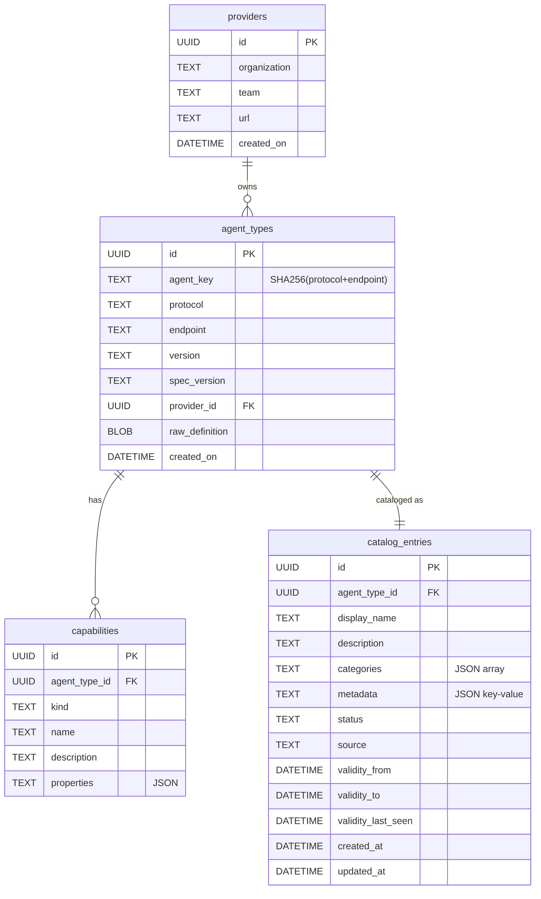

# Design: Partial Product Archetype Implementation

**Date:** 2026-04-03
**Status:** Approved

## Goal

Refactor the domain model to properly follow the Product Archetype pattern (ref: [Software-Archetypes/archetypes](https://github.com/Software-Archetypes/archetypes/tree/main/product/src)). The current `CatalogEntry` conflates "what an agent IS" (ProductType) with "how it is cataloged" (CatalogEntry). This refactor separates those concerns.

## Key Decisions

| Decision | Choice | Rationale |
|---|---|---|
| Archetype scope | Partial — AgentType + CatalogEntry, no ProductInstance/Batch | Service discovery doesn't need physical instance tracking |
| AgentType : CatalogEntry | 1:1 | In service discovery, endpoint is identity — one agent = one catalog entry |
| Database | Two tables (`agent_types` + `catalog_entries`) | Clean separation, no legacy data to migrate |
| Parser returns | `*AgentType` (not `*CatalogEntry`) | Parser knows what agent IS, handler knows how to catalog it |
| `source` in Parse | Removed | Source is a catalog concept (how discovered), not a product concept (what it is) |
| Capabilities storage | Single `capabilities` table with `kind` discriminator + `properties` JSON | Extensible — new protocol = new kind values, zero migrations |
| Provider storage | Dedicated `providers` table, reusable across agents | Providers repeat (same org has many agents), deduplication makes sense |
| RawCard renamed | `raw_definition` (`[]byte`, NOT NULL) | Protocol-agnostic name; A2A has "card", MCP has "manifest" |
| Versioning | `agent_key` = SHA256(protocol + endpoint) as partition key | Same agent can have multiple versions, history is traceable |
| Skills field | Removed from model | Skills were A2A-centric. All capabilities (A2A skills, MCP tools, resources, prompts) go through polymorphic `Capability` interface |

## Current State (Before)

```
CatalogEntry (one struct, one table — everything mixed)
  ├── DisplayName, Description      ← catalog concern
  ├── Categories, Validity, Metadata ← catalog concern
  ├── Status, Source                 ← catalog concern
  ├── Protocol, Endpoint, Version   ← product type concern
  ├── Skills[]                      ← A2A-centric capabilities
  ├── TypedMeta[]                   ← A2A-only extra metadata
  ├── Provider                      ← product type concern
  ├── RawCard                       ← A2A-centric name
  └── SpecVersion                   ← product type concern
```

## Target State (After)

### Domain Model

```
Provider                             — reusable organization entity
  ├── ID, Organization, Team, URL

AgentType (= ProductType)            — "what the agent IS"
  ├── ID (UUID)
  ├── AgentKey (SHA256 of protocol+endpoint) — partition key for versioning
  ├── Protocol
  ├── Endpoint
  ├── Version
  ├── SpecVersion
  ├── Provider (FK → providers)
  ├── Capabilities (FK ← capabilities) — polymorphic ProductFeatureTypes
  ├── RawDefinition ([]byte, NOT NULL)
  └── CreatedOn

CatalogEntry (= commercial wrapper)  — "how the agent is cataloged"
  ├── ID (UUID)
  ├── AgentType (FK → agent_types)
  ├── DisplayName
  ├── Description
  ├── Categories
  ├── Validity (from/to/last_seen)
  ├── Metadata (key-value)
  ├── Status
  ├── Source
  ├── CreatedAt, UpdatedAt

Capability (= ProductFeatureType)    — polymorphic, discriminated by kind
  ├── ID (UUID)
  ├── AgentType (FK → agent_types)
  ├── Kind ("a2a.skill", "mcp.tool", ...)
  ├── Name
  ├── Description
  └── Properties (JSON — protocol-specific fields)
```

### Database Schema

```sql
CREATE TABLE providers (
    id TEXT PRIMARY KEY,               -- UUID
    organization TEXT NOT NULL,
    team TEXT,
    url TEXT,
    created_on DATETIME NOT NULL,
    UNIQUE(organization, team)
);

CREATE TABLE agent_types (
    id TEXT PRIMARY KEY,               -- UUID
    agent_key TEXT NOT NULL,            -- SHA256(protocol + endpoint)
    protocol TEXT NOT NULL,
    endpoint TEXT NOT NULL,
    version TEXT NOT NULL,
    spec_version TEXT DEFAULT '',
    provider_id TEXT REFERENCES providers(id),
    raw_definition BLOB NOT NULL,
    created_on DATETIME NOT NULL,
    UNIQUE(agent_key, version)
);

CREATE TABLE capabilities (
    id TEXT PRIMARY KEY,               -- UUID
    agent_type_id TEXT NOT NULL REFERENCES agent_types(id) ON DELETE CASCADE,
    kind TEXT NOT NULL,                -- "a2a.skill", "mcp.tool", etc.
    name TEXT NOT NULL,
    description TEXT DEFAULT '',
    properties TEXT DEFAULT '{}',      -- JSON for protocol-specific fields
    UNIQUE(agent_type_id, kind, name)
);

CREATE TABLE catalog_entries (
    id TEXT PRIMARY KEY,               -- UUID
    agent_type_id TEXT NOT NULL REFERENCES agent_types(id),
    display_name TEXT NOT NULL,
    description TEXT DEFAULT '',
    categories TEXT DEFAULT '[]',      -- JSON array
    metadata TEXT DEFAULT '{}',        -- JSON key-value
    status TEXT NOT NULL DEFAULT 'unknown',
    source TEXT NOT NULL,
    validity_from DATETIME,
    validity_to DATETIME,
    validity_last_seen DATETIME NOT NULL,
    created_at DATETIME,
    updated_at DATETIME
);
```

### ER Diagram



## Capability Kinds

| Kind | Protocol | Common Fields | Properties (JSON) |
|---|---|---|---|
| `a2a.skill` | A2A | name, description | `tags`, `input_modes`, `output_modes` |
| `a2a.interface` | A2A | name (= url), description | `url`, `binding` |
| `a2a.security_scheme` | A2A | name (= type), description | `type`, `method` |
| `a2a.extension` | A2A | name (= uri), description | `uri`, `required` |
| `a2a.signature` | A2A | name (= algorithm), description | `algorithm`, `key_id` |
| `mcp.tool` | MCP | name, description | `input_schema` |
| `mcp.resource` | MCP | name, description | `uri` |
| `mcp.prompt` | MCP | name, description | `arguments` |

## Go Interface Changes

### Capability interface (replaces TypedMetadata)

```go
// Capability represents a ProductFeatureType — a polymorphic capability of an agent.
type Capability interface {
    Kind() string
    Validate() error
}
```

### AgentType struct

```go
type AgentType struct {
    ID            string
    AgentKey      string          // SHA256(protocol + endpoint)
    Protocol      Protocol
    Endpoint      string
    Version       string
    SpecVersion   string
    ProviderID    string
    Provider      *Provider
    Capabilities  []Capability
    RawDefinition []byte
    CreatedOn     time.Time
}
```

### ParserPlugin interface

```go
// Before:
Parse(raw []byte, source SourceType) (*CatalogEntry, error)
Validate(raw []byte) ValidationResult

// After:
Parse(raw []byte) (*AgentType, error)
Validate(raw []byte) ValidationResult
```

Parser returns `AgentType` with Provider and Capabilities populated. Handler wraps it in `CatalogEntry` adding source, status, validity, display_name, categories.

### Handler wiring (import/register)

```go
// 1. Parser produces AgentType
agentType, err := parser.Parse(raw)

// 2. Upsert provider (find or create by org+team)
provider := agentType.Provider
providerID := store.UpsertProvider(ctx, provider)

// 3. Create AgentType with capabilities
agentType.ProviderID = providerID
agentType.AgentKey = sha256(agentType.Protocol + agentType.Endpoint)
store.CreateAgentType(ctx, agentType) // cascades to capabilities

// 4. Wrap in CatalogEntry
entry := &CatalogEntry{
    AgentTypeID: agentType.ID,
    DisplayName: agentType.Capabilities.FirstSkillName() or agentType.Endpoint,
    Source:      model.SourcePush,
    Status:      model.StatusUnknown,
    Validity:    model.Validity{LastSeen: time.Now()},
}
store.CreateCatalogEntry(ctx, entry)
```

## API Backward Compatibility

REST endpoints return the same flat JSON structure as today. `CatalogEntry.MarshalJSON()` flattens AgentType + CatalogEntry into a single object. Frontend requires no changes.

Response shape (unchanged):
```json
{
  "id": "catalog-entry-uuid",
  "display_name": "My Agent",
  "protocol": "a2a",
  "endpoint": "https://...",
  "version": "1.0.0",
  "status": "unknown",
  "source": "push",
  "capabilities": [...],
  "provider": { "organization": "...", "team": "..." },
  "validity": { "from": null, "to": null, "last_seen": "..." },
  "categories": [],
  "metadata": {},
  "raw_definition": "base64...",
  "created_at": "..."
}
```

## Migration Strategy

No production deployments exist. Replace existing migration scripts with new schema. Drop old `catalog_entries` table, create 4 new tables.

## Files Changed

| File | Change |
|---|---|
| `internal/model/agent.go` | Replace `CatalogEntry` monolith with `AgentType`, `CatalogEntry`, `Provider` structs |
| `internal/model/capability.go` | New — `Capability` interface + registry (replaces `typed_metadata.go`) |
| `internal/model/a2a_capabilities.go` | New — `A2ASkill`, `A2AInterface`, `A2ASecurityScheme`, `A2AExtension`, `A2ASignature` |
| `internal/model/mcp_capabilities.go` | New — `MCPTool`, `MCPResource`, `MCPPrompt` |
| `internal/model/typed_metadata.go` | Remove (replaced by capability.go) |
| `internal/model/a2a_metadata.go` | Remove (replaced by a2a_capabilities.go) |
| `internal/model/skill.go` | Remove (replaced by capabilities) |
| `internal/db/migrations.go` | Rewrite — 4 new tables |
| `internal/store/sql_store.go` | Rewrite — AgentType + CatalogEntry CRUD with joins |
| `internal/store/provider_store.go` | New — Provider upsert/CRUD |
| `internal/store/capability_store.go` | New — Capability CRUD |
| `internal/kernel/plugin.go` | Update `ParserPlugin.Parse` signature |
| `plugins/parsers/a2a/a2a.go` | Return `*AgentType`, populate A2A capabilities |
| `plugins/parsers/a2a/validation.go` | Update if needed |
| `plugins/parsers/mcp/mcp.go` | Return `*AgentType`, populate MCP capabilities (tools, resources, prompts) |
| `internal/api/handlers.go` | Wrap AgentType in CatalogEntry |
| `internal/api/import_handler.go` | Update for new Parse signature |
| `internal/api/register_handler.go` | Update for new Parse signature |
| `internal/api/validate_handler.go` | May need minor updates |
| `internal/service/card_fetcher.go` | No changes expected |
| `web/src/types.ts` | Update TypeScript types (capabilities instead of skills + typed_meta) |
| `internal/model/archetype_test.go` | New — reflective architecture test enforcing the Product Archetype pattern |
| Tests | All test files updated for new model |

## Archetype Compliance Test

arch-go enforces layer boundaries (which package imports which) but cannot enforce the Product Archetype domain pattern (which types reference which, what fields a struct has). To prevent archetype violations at CI time, a reflective Go test verifies structural invariants:

**File:** `internal/model/archetype_test.go`

### Rules enforced

| Rule | What it checks |
|---|---|
| AgentType has no catalog fields | `AgentType` struct must NOT have fields: `DisplayName`, `Description`, `Categories`, `Status`, `Source`, `Metadata`, `Validity` |
| CatalogEntry has no product fields | `CatalogEntry` struct must NOT have fields: `Protocol`, `Endpoint`, `RawDefinition`, `Capabilities`, `Skills`, `TypedMeta`, `SpecVersion` |
| CatalogEntry references AgentType | `CatalogEntry` struct MUST have field `AgentTypeID` of type `string` |
| Capability interface is satisfied | All registered capability types (`A2ASkill`, `A2AInterface`, `A2ASecurityScheme`, `A2AExtension`, `A2ASignature`, `MCPTool`, `MCPResource`, `MCPPrompt`) must implement `Capability` interface |
| ParserPlugin.Parse returns AgentType | `ParserPlugin` interface method `Parse` must return `(*AgentType, error)`, not `(*CatalogEntry, error)` |
| AgentType has required fields | `AgentType` struct MUST have: `ID`, `AgentKey`, `Protocol`, `Endpoint`, `RawDefinition`, `CreatedOn` |

### Implementation approach

Uses `reflect.TypeOf` to inspect struct fields and interface methods at test time. No runtime overhead, runs in `make test`.

```go
func TestArchetype_AgentTypeHasNoCatalogFields(t *testing.T) {
    catalogOnlyFields := []string{"DisplayName", "Description", "Categories",
        "Status", "Source", "Metadata", "Validity"}
    agentTypeT := reflect.TypeOf(AgentType{})
    for _, name := range catalogOnlyFields {
        _, found := agentTypeT.FieldByName(name)
        assert.False(t, found, "AgentType must not have catalog field %q", name)
    }
}

func TestArchetype_CatalogEntryHasNoProductFields(t *testing.T) {
    productOnlyFields := []string{"Protocol", "Endpoint", "RawDefinition",
        "Capabilities", "Skills", "TypedMeta", "SpecVersion"}
    entryT := reflect.TypeOf(CatalogEntry{})
    for _, name := range productOnlyFields {
        _, found := entryT.FieldByName(name)
        assert.False(t, found, "CatalogEntry must not have product field %q", name)
    }
}

func TestArchetype_CatalogEntryReferencesAgentType(t *testing.T) {
    entryT := reflect.TypeOf(CatalogEntry{})
    field, found := entryT.FieldByName("AgentTypeID")
    assert.True(t, found, "CatalogEntry must have AgentTypeID field")
    assert.Equal(t, "string", field.Type.Kind().String())
}
```

## Out of Scope

- ProductInstance / Batch / SerialNumber (not applicable to service discovery)
- ProductCatalog aggregate with domain commands (CRUD store is sufficient for now)
- Frontend UI redesign (JSON shape stays backward compatible)
