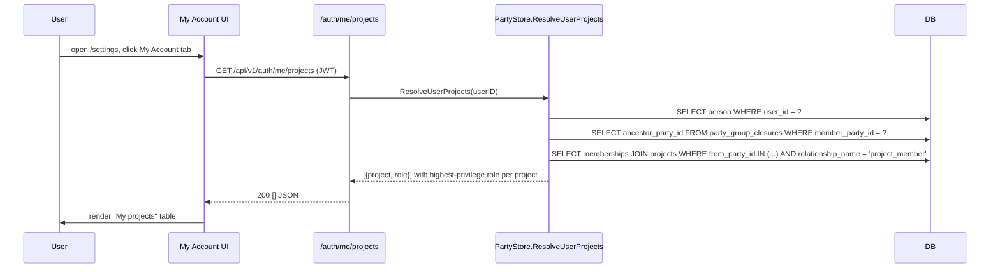

# Current-User Project Context — Design Spec

**Date:** 2026-04-15
**Status:** Draft
**Predecessor specs:** [2026-04-15-projects-ui-design.md](2026-04-15-projects-ui-design.md), [2026-04-15-groups-ui-design.md](2026-04-15-groups-ui-design.md), [2026-04-14-party-archetype-design.md](2026-04-14-party-archetype-design.md)
**Relevant ADRs:** [011-party-archetype-unified-actor-model.md](../../adr/011-party-archetype-unified-actor-model.md) (Person↔User invariant, closure-based RBAC), [012-materialized-group-closure-for-permission-resolution.md](../../adr/012-materialized-group-closure-for-permission-resolution.md) (closure table used by role resolution), [014-project-role-resolution-highest-privilege.md](../../adr/014-project-role-resolution-highest-privilege.md) (multi-path tie-break rule)

## Goal

Give every logged-in user a read-only "My projects" view of the projects they belong to (directly or via group membership), with their resolved role per project. Close the Person↔User invariant gap that blocks this feature from being reachable by non-admin users.

## Non-goals

- Project-role-aware UI permission gating. Still deferred — backend currently only checks global `catalog:write` for project mutations. A user who is `project:owner` on a project does not get mutation affordances just from that role; they need global `catalog:write`.
- Global "current project" header switcher. Not revisited here.
- Editing/leaving a project from the My Account view. V1 is read-only; group/admin workflows exist for removal.
- Provenance annotations ("via group X") on memberships reached transitively. Role value is resolved; the path is not shown.
- Multi-tenant partitioning or separate Person records per namespace.

## Background

ADR-011 declares Person↔User as an invariant ("Person parties must be kept in sync with User records — created together, never orphaned"). The party archetype rollout ([party-archetype-design.md](2026-04-14-party-archetype-design.md)) shipped the schema and the bootstrap admin's Person party via migration007, but deferred auto-creation on user-create. Specs 1 and 2 explicitly documented this gap as a known limitation that users work around.

Without that gap closed, the AddMember picker on Groups/Projects can only ever select the admin as a Person — every other user is invisible to the party graph. This spec closes the gap and adds the first user-facing feature that consumes it: "My projects" on the My Account tab.

Role resolution uses the existing `party_group_closures` table (materialized per ADR-012). A user's Person is treated as a party-graph member; the set of parties they "are" equals `{personID} ∪ all ancestor group IDs`. Project memberships of any of those parties count for the user.

## Decisions

| # | Decision | Rationale |
|---|----------|-----------|
| D1 | Auto-create a Person party when a User is created via `POST /api/v1/users`. Fail-open: log on failure, don't block user creation — migration008 sweeps stragglers. | ADR-011 invariant. Blocking user creation on a best-effort write is worse than eventual consistency — the invariant still holds at rest after migration008 runs on next boot. |
| D2 | Person `name` = `user.display_name || user.username`. Kept in sync on user `PUT`. | Nicest UX in the AddMember picker without making `display_name` required. Drift would confuse users ("who is 'old alice'?"). |
| D3 | One-time backfill migration `migration008_backfill_person_parties` for existing orphan users. Idempotent. | Makes the Person↔User invariant hold at rest for everyone. Alternatives (lazy-create on read, do-nothing) either surprise maintainers with writes in read endpoints or leave existing DBs half-migrated. |
| D4 | New endpoint `GET /api/v1/auth/me/projects` returning `[]UserProjectMembership`. Authenticated-only, no extra permission check (users always see their own memberships). | Smallest surface that returns exactly what the frontend needs. Placing it under `/auth/me/...` follows the existing `/auth/me` pattern; returning a bespoke shape avoids leaking relationship rows. |
| D5 | "My projects" panel on the My Account tab. Columns: Name + Role. Clickable rows navigate to `/settings/projects/:id`. | Minimal admin-style metadata — this is a personal context page, not an audit view. The navigate target is Spec 2's project detail page; whatever the user can/can't do there is already permission-gated. |
| D6 | Role resolution walks `party_group_closures` from the user's Person, includes the Person itself, and picks the highest-privilege role per project when reached via multiple paths. Rank: `owner` > `developer` > `viewer`. | ADR-011's promise ("per-project RBAC, hierarchical via closure") — direct-only would silently hide access alice actually has. Highest-privilege resolution matches standard RBAC semantics and is the only tie-break choice that never *downgrades* a user's effective access in the UI relative to reality. |

## Architecture

### Backend

**Model (no schema changes):**

```go
// internal/model/party_query.go (new file)

// UserProjectMembership is a denormalized read-only view: a user's
// resolved role on a project, collapsing direct and transitive paths.
type UserProjectMembership struct {
    Project Party  `json:"project"`
    Role    string `json:"role"`
}
```

**Store additions** (`internal/store/party_store.go` or a new `party_store_person_sync.go` if that file is at its public-function ceiling — see Spec 2 plan Task 1 for the same split strategy):

```go
// CreatePersonForUser upserts a Person party linked 1:1 to the user.
// Idempotent: no-op if a Person with matching user_id already exists.
// Name formula: user.display_name || user.username.
func (s *PartyStore) CreatePersonForUser(ctx context.Context, user *model.User) error

// UpdatePersonForUser resyncs the Person's name to match the user's
// current display_name || username. No-op if no Person exists.
func (s *PartyStore) UpdatePersonForUser(ctx context.Context, user *model.User) error

// ResolveUserProjects returns the user's project memberships, including
// those reached transitively through group membership. Picks the highest-
// privilege role when the user reaches a project via multiple paths.
// Returns an empty slice (never nil) when the user has no memberships
// or no Person party exists.
func (s *PartyStore) ResolveUserProjects(ctx context.Context, userID string) ([]model.UserProjectMembership, error)
```

**Handler** (`internal/api/auth_handlers.go`):

```go
// MyProjectsHandler returns the calling user's resolved project memberships.
// Authenticated-only; no explicit permission gate.
func MyProjectsHandler(partyStore *store.PartyStore) http.HandlerFunc
```

**Router** (`internal/api/router.go`, inside the existing authenticated `/auth` block):

```go
r.Get("/me/projects", MyProjectsHandler(deps.PartyStore))
```

**User handler integration** (`internal/api/user_handlers.go`):

- `CreateUserHandler` — after `userStore.CreateUser` returns, call `partyStore.CreatePersonForUser`. Log any error via `slog.Error`, do not fail the request.
- `UpdateUserHandler` — after `userStore.UpdateUser` returns, if either `display_name` or `username` changed, call `partyStore.UpdatePersonForUser`. Same fail-open policy.

**Migration** (`internal/db/migrations.go` — append to `AllMigrations()`):

```go
// migration008: backfill Person parties for existing users that don't have one.
// Idempotent — selects users with no matching party, inserts one each.
```

Runs on next boot. Safe to re-run (uses LEFT JOIN / NOT EXISTS pattern). Never deletes anything.

### Role resolution algorithm

`ResolveUserProjects(userID)`:

1. `person, err := GetPartyByUserID(userID)`. If `person == nil` (pre-migration straggler), return `[]`.
2. Build the set of party IDs the user "is":
   - `personID := person.ID`
   - Query `party_group_closures` WHERE `member_party_id = personID`, project `ancestor_party_id`. Call this `ancestors`.
   - `reachable := {personID} ∪ ancestors`.
3. Query `party_relationships` joined to `parties`:
   ```sql
   SELECT pr.to_party_id, pr.from_role, p.*
   FROM party_relationships pr
   JOIN parties p ON p.id = pr.to_party_id
   WHERE pr.from_party_id IN (<reachable>)
     AND pr.relationship_name = 'project_member'
     AND p.kind = 'project'
   ```
4. In Go, group by `to_party_id`. For each group, pick the highest-ranked `from_role` using rank map `{owner: 2, developer: 1, viewer: 0}`; unknown roles rank -1.
5. Return `[]UserProjectMembership` sorted by `project.name` ASC.

Two round-trips to the DB (reachable-set query, then memberships+projects join query). Wrap in a read-only GORM transaction for snapshot consistency.

### Frontend

**Types + API client** (`web/src/api.ts`):

```ts
export interface UserProjectMembership {
  project: Party
  role: string
}

export function getMyProjects(): Promise<UserProjectMembership[]> {
  return request<UserProjectMembership[]>('/auth/me/projects')
}
```

**New component** `web/src/routes/parties/MyProjectsTable.tsx`:
- Fetches via `api.getMyProjects()` on mount (use React Query with a short-lived cache; invalidate on logout).
- Renders a shadcn `Table` with two columns: Name, Role.
- Each row has `onClick` → `navigate(`/settings/projects/${membership.project.id}`)`.
- Empty state: "You don't belong to any projects yet."
- Error state: retry button.

**My Account tab** (`web/src/pages/SettingsPage.tsx` — `AccountTab` component): add a third `<Card>` titled "My projects" below "Change password" containing `<MyProjectsTable />`.

### Data flow



## API surface

### `GET /api/v1/auth/me/projects`

- **Auth:** JWT required. No extra permission check.
- **Response 200:** `[{ "project": Party, "role": string }]`, sorted by project name ASC. Empty array when the user has no memberships.
- **Response 401:** no/invalid token.

Documented in `docs/api.md` under the Auth section.

### User create/update side-effects

- `POST /api/v1/users` — same semantics as today, plus a best-effort `CreatePersonForUser`. User receives no extra response field. If Person creation fails, the user still exists; migration008 on next boot (or a subsequent successful update) closes the gap.
- `PUT /api/v1/users/{id}` — same semantics, plus a best-effort `UpdatePersonForUser` when name-affecting fields changed.

## Error handling

- **`ResolveUserProjects` DB error** → handler returns 500 with a generic message; frontend shows retry UI.
- **User has no Person party** (pre-migration) → handler returns 200 with empty array. Frontend shows empty state — indistinguishable from a user with no memberships, which is the correct UX.
- **Unknown `from_role` on a relationship** → resolution ranks it -1 (never wins). Logged at warn level for ops visibility. UI shows the raw role string.
- **Person-sync failure on user create/update** → logged, request succeeds. Invariant restoration is deferred to the next sync point.

## Testing

**Store (`internal/store/party_store_test.go`):**
- `TestCreatePersonForUser_CreatesWhenMissing`
- `TestCreatePersonForUser_IdempotentWhenExists` — second call is a no-op
- `TestCreatePersonForUser_UsesDisplayNameWhenSet`
- `TestCreatePersonForUser_FallsBackToUsername`
- `TestUpdatePersonForUser_UpdatesNameOnDisplayNameChange`
- `TestUpdatePersonForUser_NoOpWhenNoPersonExists`
- `TestResolveUserProjects_DirectMemberships`
- `TestResolveUserProjects_TransitiveViaGroup`
- `TestResolveUserProjects_HighestPrivilegeWinsOnMultiPath`
- `TestResolveUserProjects_EmptyForUserWithNoMemberships`
- `TestResolveUserProjects_EmptyForUserWithoutPerson`

**Migration (`internal/db/migrations_test.go` or equivalent):**
- `TestMigration008_BackfillCreatesPersonsForOrphanUsers`
- `TestMigration008_Idempotent`
- `TestMigration008_SkipsUsersAlreadyHavingPerson`

**Handlers (`internal/api/auth_handlers_test.go`, `internal/api/user_handlers_test.go`):**
- `TestMyProjectsHandler_ReturnsMemberships`
- `TestMyProjectsHandler_Unauthenticated401`
- `TestCreateUser_AlsoCreatesPersonParty`
- `TestCreateUser_SucceedsEvenIfPersonCreateFails` (inject store that errors)
- `TestUpdateUser_SyncsPersonName` (only when name fields change)

**Frontend (Vitest + RTL):**
- `web/src/api.test.ts` — `getMyProjects` GET test.
- `web/src/routes/parties/MyProjectsTable.test.tsx` — empty state; rows rendered from mock; row click navigates; error state with retry.
- `web/src/pages/SettingsPage.test.tsx` — My Account tab shows "My projects" card.

**E2E (`e2e/tests/my-account-projects.spec.ts`):**
- New user seeded via API → login UI → My Account → sees empty "My projects" card.
- Admin seeds project + adds user's Person as `project:developer` → user logs back in → sees row with role `project:developer`.
- Click a row → lands on project detail page (assert heading).

## Rollout

- Migration008 ships with this change. Idempotent; safe to run on existing DBs.
- No feature flag — the backend endpoint is low-cost and the UI is additive (new card on existing tab).
- No breaking change to existing endpoints.
- Existing admin already has a Person party from migration007; migration008 is a no-op for them.
- E2E helpers (`createUser` in `e2e/tests/helpers.ts`) continue to work; newly-created users now automatically get Person parties, which unlocks AddMember tests from Specs 1 and 2 that currently use only the admin person.

## Compliance notes

- **ADR-011:** Closes the "Person parties must be kept in sync with User records" invariant that was previously documented as a known gap. Adds `ResolveUserProjects` as a new consumer of the closure table — exactly the pattern ADR-011 was designed to support (single resolution algorithm, no new join tables).
- **ADR-012:** Role resolution uses `party_group_closures` read-only. No new writes to the closure table. No effect on the materialization cost.
- **ADR-007:** Frontend change is additive — React 18 + shadcn + embedded SPA unchanged.

## Open questions

None at draft time. The plan should confirm migration008's exact numbering by inspecting `internal/db/migrations.go` before committing the migration file.
